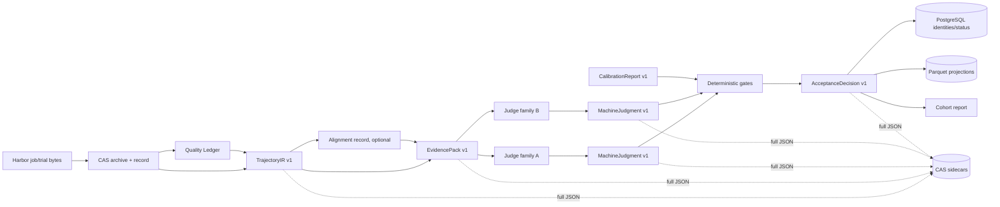
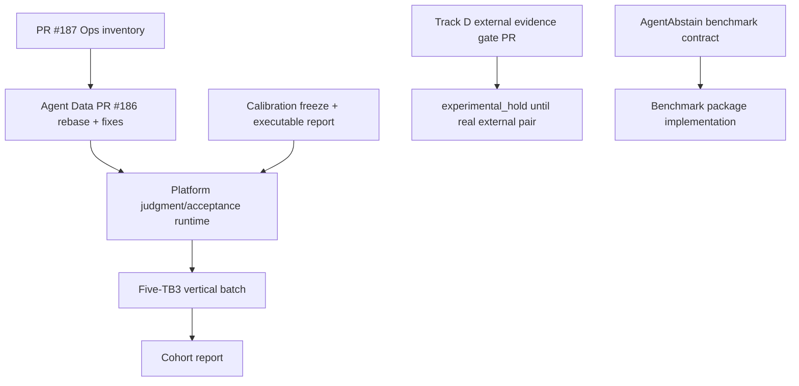

# Automated trajectory interpretation architecture v1

Normative integration contract for the machine-operated path from immutable Harbor evidence to calibrated accepted/abstained findings and cohort reports. Human review labels calibration sets and audits samples; it is not a prerequisite for each production trajectory.

Sources: the assigned program and overnight loop in `research-context/trajectory-analysis/`, Librarian handoffs at research-context commit `14997c2`, current Eval Lab main `61106a1`, Track B calibration freeze, and exact-head reviews recorded under `agents/handoffs/`.

## 1. Non-negotiable invariants

1. Harbor job/trial bytes and ATIF are execution truth. A live raw directory is authoritative only until its digest-matching CAS archive exists; campaign analysis uses CAS.
2. Agent Data is the sole producer of TrajectoryIR, CitationHandle, EvidencePack, alignment records, and their flattened query projections.
3. Platform is the sole executor of interpreting models and producer of MachineJudgment, AcceptanceDecision, runtime/storage plumbing, and operator surfaces.
4. Synthetic Research owns the ontology, known-answer calibration suite, human baseline protocol, thresholds, and CalibrationReport semantics. Platform serializes and enforces the report; it does not invent thresholds.
5. The model receives one bounded JSON EvidencePack. It never receives Parquet, PostgreSQL rows, a trial directory, or a generated summary as primary evidence.
6. PostgreSQL is an identity/status index. Parquet is rebuildable query projection. Neither is the authoritative full artifact.
7. Full IR/pack/judgment/decision/report bytes are immutable sidecars and are archived to CAS before campaign completion or cleanup.
8. Every accepted finding cites selected raw evidence that resolves by source digest and CAS locator. Generated summaries are advisory only.
9. Automatic acceptance is disabled by default and opens class by class only after deterministic gates, accepted-set risk control, and held-out human non-inferiority pass for the exact version tuple.
10. Missing, ambiguous, unlinked, quarantined, over-budget, uncalibrated, or contradictory evidence never becomes zero or a guessed label. It produces a reason-coded abstention/rejection.

## 2. Bytes-to-decisions flow

Quality fail/quarantine stops model execution. Platform may emit a deterministic `insufficient_evidence` MachineJudgment so the campaign has an accounted abstention, but it must not call a judge.

## 3. Artifact authority matrix

| Artifact | Sole producer | Authority | Working storage | Index/projection | Sole primary consumer |
|---|---|---|---|---|---|
| Raw Harbor trial | Harbor runner | Raw bytes, then matching CAS blob | `runs/<job>/<trial>/` | PostgreSQL job/trial rows; mechanical Parquet | Agent Data IR builder |
| Quality report/findings | Quality Ledger | Existing deterministic ledger rows | derived quality Parquet | DuckDB/worker gate | IR builder + worker admission |
| CampaignAnalysisManifest v1 | Ops/Platform manifest builder | Git-reviewed immutable JSON | `research/experiments/manifests/` | none | batch IR/analysis command |
| TrajectoryIR v1 | Agent Data | Digest-matching JSON sidecar archived to CAS | derived interpretation sidecar | PostgreSQL identity; Parquet events/coverage | EvidencePack builder |
| AlignmentRecord v1 | Agent Data | Digest-matching JSON sidecar archived to CAS | derived interpretation sidecar | Parquet alignment rows | EvidencePack builder |
| EvidencePack v1 | Agent Data | Digest-matching JSON sidecar archived to CAS | derived interpretation sidecar | PostgreSQL identity; Parquet pack/window summary | Platform analysis worker/model |
| Analysis invocation | Platform worker | append-only request/transitions ledger | worker journal | PostgreSQL invocation row | Platform worker |
| MachineJudgment v1 | Platform | validated JSON sidecar archived to CAS | derived analysis sidecar | PostgreSQL findings/citations; Parquet projection | acceptance gate |
| AcceptanceDecision v1 | Platform acceptance gate | immutable JSON sidecar archived to CAS | derived analysis sidecar | PostgreSQL decision/current view; Parquet projection | cohort/report/inspect |
| CalibrationReport v1 | Synthetic Research spec + Platform report writer | immutable machine-readable report for one frozen calibration version | research calibration record + CAS archive | PostgreSQL class gates | acceptance gate |
| Human calibration/audit review | qualified humans | immutable review/adjudication record | protected calibration store | PostgreSQL audit index | CalibrationReport producer |
| Cohort report | Platform report builder | reproducible report artifact | derived reports; reviewed copies may enter Git | optional summary row | Research/Analyst/Ops |

No artifact gets a second writer. CAS records locate full bytes; PostgreSQL and Parquet never become substitute authorities.

## 4. Shared subordinate contracts

### 4.1 CitationHandle v1

One canonical citation type, owned by Agent Data. Existing `CitationTarget`, `SourceCitation`, `ContextCitation`, and `AnalysisEvidenceCitation` become adapters or legacy/disposable views; new interpretation writers use CitationHandle only.

Required fields:

- `citation_id`: digest of source document digest + typed locator + content digest + redaction profile digest;
- `source_kind`: ATIF step, tool call, observation, verifier, state before/after, context management, user/system message, quality finding, task contract, or environment;
- `trial_id`, `source_document_id`, `source_sha256`, `raw_cas_uri`;
- `ir_event_id` when the source is represented by an IR event;
- typed locator: ATIF `step_id`, `tool_call_id`, `observation_index`, span ID, state ref, verifier check ID, or byte range;
- `content_sha256` of the hydrated redacted bytes shown to the model;
- `redaction_profile_digest`;
- `availability`: available, unavailable, redacted, or ambiguous; plus reason code.

The original raw source digest remains separate from the redacted content digest. Every locator resolves uniquely or the citation is invalid.

### 4.2 AlignmentRecord v1

Owned by Agent Data and immutable independently of either trial IR.

Required fields: both IR IDs/digests/CAS URIs; complete invariant configuration for each branch; exactly one declared allowed delta; algorithm/version/config digest; all aligned event IDs including multiple calls per ATIF step; unmatched ranges; local divergences; evidence-backed reconvergences; first non-reconvergent meaningful divergence when one exists; citations on both branches; validity `valid|confounded|unavailable`; reason codes; alignment digest.
`AlignmentRecord` is the full CAS artifact. `AlignmentRecordRef` is the only embedded form and contains only alignment ID/digest, CAS URI, validity, and reason codes. `TrajectoryIR.alignment_record_ref` and `EvidencePack.alignment_record_ref` use that compact reference; neither embeds or rewrites the full record.

V1 refuses cross-task matching. It refuses any undeclared difference in task, task digest, verifier, environment, prompt/toolset, scaffold, or registered factor configuration. A reconvergent mismatch is not automatically `k*` and never becomes a critical-error claim without benchmark evidence.

## 5. Six frozen top-level interfaces

Canonical serialization for every contract: UTF-8 JSON, sorted keys, explicit nulls/unknowns, deterministic list ordering, schema string shown below, and digest over the body excluding only non-identity publication time. Source/config/version drift mints a new digest; no in-place mutation.

### 5.1 TrajectoryIR v1 — `trajectory-ir/v1`

Sole producer: Agent Data.

Required groups:

- `ir_id`, `ir_digest`, producer name/version/commit/config digest;
- identity: experiment/campaign/spec/job/trial/document, ATIF session/trajectory IDs, optional pair ID;
- `sources[]`: artifact kind, trial-relative path, SHA-256, byte count, CAS URI, media type, availability/reason;
- configuration: task/version/digest, verifier digest, environment digest, scaffold/version, model, prompt digest, toolset digest, factor values;
- outcome: execution/verifier status, observed reward dimensions, exception type/message digest;
- exact Quality Ledger status/readiness/report digest/finding IDs;
- coverage and explicit unknowns;
- canonical CitationHandles;
- ordered normalized events preserving ATIF `step_id`, `tool_call_id`, and `source_call_id`;
- recorded graph edges only: next/contains/calls/returns-to/parent-span/state/check/continuation;
- deterministic phases/episodes with classifier name/version and `advisory_only=true` summaries;
- opportunity windows only when a benchmark/profile opportunity contract and source citations exist; otherwise unavailable;
- optional `alignment_record_ref`, never embedded mutable alignment;
- produced timestamp outside IR identity.

Event semantic fields (`action_family`, status-owning program, argument skeleton, exit semantics) carry the producing profile/parser version. Expected-negative exits require a pinned semantics-profile digest; absent profile means `unknown`. Adjacency after an error cannot be labeled recovery.

IR build modes:

- production/campaign: exact CampaignAnalysisManifest trial record + CAS store, mandatory;
- local developer: jailed raw path, explicitly non-production and never eligible for machine acceptance.

### 5.2 EvidencePack v1 — `evidence-pack/v1`

Sole producer: Agent Data. Sole primary model input.

Required groups:

- pack ID/digest; one or two IR IDs/digests/CAS URIs;
- optional `alignment_record_ref` to the same immutable full AlignmentRecord used for pair windows;
- builder version/commit/config digest and redaction profile digest;
- tokenizer ID, maximum/actual/mandatory token counts, and overflow disposition;
- cited task and verifier contracts with availability;
- deterministic outcome/quality summary and global outline;
- episode index with selected/omitted markers; summaries advisory only;
- selected whole raw windows with anchor reason, exact event/evidence IDs, citations, and token counts;
- redacted evidence items with content hashes;
- every omitted event assigned to a range with bounds, type counts, exclusion reason, ordered-content digest, and reopen citations;
- coverage, missing/unlinked counts, warnings, produced time.

Deterministic selector order:

1. validate/hash IR and quality;
2. build recorded graph/boundaries/alignment;
3. reserve mandatory header/contract/outcome/coverage/outline/index budget;
4. anchor exceptions, verifier/state checks, terminal claims and verification, context boundaries, loop/strategy boundaries, valid divergence/reconvergence, and requested benchmark opportunities;
5. expand linked neighbors/calls/observations/state evidence;
6. merge overlap;
7. rank optional windows by frozen priority and event ID;
8. add whole windows only;
9. record all omissions;
10. canonicalize/digest.

If mandatory material exceeds budget, return `tiered_pack_required` or `abstain_required`. Such a pack is not model-callable. Reopening omitted evidence creates a new immutable pack/digest. Generated summaries cannot satisfy an accepted finding.

### 5.3 MachineJudgment v1 — `machine-judgment/v1`

Sole producer: Platform worker. One record per judge invocation or deterministic pre-judge abstention.

Required fields:

- judgment ID/digest, producer kind `model|deterministic_abstention`, pack ID/digest;
- validity `supported|contradicted|insufficient_evidence`;
- nullable primary label `{namespace, ontology_version, class_id}`;
- finding summary, nullable earliest supported IR event ID;
- CitationHandle IDs only; no arbitrary paths;
- alternative explanations, coverage gaps, proposed discriminator/next check;
- raw confidence distinct from calibrated probability and calibration version;
- model provider/name/family/settings digest when producer is model;
- prompt, rubric, output-schema, and raw-response digests;
- produced time outside content identity.

A deterministic abstention has no model identity or label. Model free text outside the schema is retained only as raw-response evidence, not parsed into new classes.

### 5.4 AcceptanceDecision v1 — `acceptance-decision/v1`

Sole producer: Platform pure acceptance gate. It never edits a MachineJudgment.

Required fields:

- decision ID/digest and `accepted|rejected|abstained`;
- judgment IDs, pack digest, policy digest;
- all deterministic gate results with reason codes/citations;
- cross-judge record: model families, classes, exact/disagree/unavailable;
- one `calibration_class_gate` copied from the exact frozen report: class ID, calibration/report/threshold digests, report schema, `acceptance_enabling_allowed`, class `acceptance_enabled`, hold reasons, and reliability snapshot; the decision cannot override this row;
- reason codes and optional proposed next check;
- immutable supersedes-decision reference;
- produced time.

Decision order:

1. malformed source/digest drift/quarantine/deterministic contradiction -> rejected or deterministic abstention according to evidence integrity policy;
2. missing/partial evidence, unresolved citation, mandatory overflow, disagreement, disabled/uncalibrated class, insufficient class n, low calibrated score, failed non-inferiority -> abstained;
3. accepted only when every deterministic gate passes, exact citations resolve, class is enabled for this exact calibration version, required independent judge families exactly agree, and calibrated threshold passes.

No human-review row is required. Human audit may create a new superseding decision; it never rewrites the original.

### 5.5 CalibrationReport v1 — `calibration-report-v1`

Semantic owner: Synthetic Research. Serializer/operator owner: Platform. The exact v1 schema is the frozen `research-context/trajectory-analysis/calibration/calibration-report-schema-v1.json`; the combined contract schema embeds it verbatim rather than defining a second report.

Required fields:

- calibration version digest, thresholds digest, item/proposed-accept counts;
- `acceptance_enabling_allowed`, which is fixed `false` in v1;
- inter-rater block: paired count, Cohen kappa, Gwet AC1, observed agreement, frozen floors, and floor result;
- global raw/proposed-accept/selective-risk/calibration/abstention/citation/cross-judge metrics;
- per-class map: `acceptance_enabled=false`, delta, counts, accepted precision/recall, human baseline, margins and lower bounds, citation validity, false accepts, and non-empty HOLD reasons;
- HOLD summary.

This v1 report is a calibration/falsification bootstrap and **cannot enable automatic acceptance**. Genuine model-family runs, individual human labels, held-out non-inferiority, and accepted-risk evidence require a reviewed successor calibration contract/version; AcceptanceDecision must abstain while either report or class enablement is false.

### 5.6 CampaignAnalysisManifest v1 — `campaign-analysis-manifest/v1`

Sole producer: Ops/Platform manifest builder through a focused reviewed change. It is the immutable input to `analyze batch`, never a mutable results file.

Required fields:

- manifest ID/digest, campaign ID, source campaign manifest digest/commit, authorizing actor;
- every attempted item preserves its source role and separately records `cohort_included` plus `attempt_role=primary|retry|control|quarantined_attempt`, spec/job/trial/task identity, nullable task/verifier digests with unknown reasons, CAS URI, and full quality status/report digest;
- exact accounting: planned specs, executions, analysis cohort, controls, retries, quarantine, unresolved evidence;
- analysis config: IR/pack builder digests, token budget, redaction digest, judge configuration digests, calibration version, acceptance policy digest;
- produced time outside content identity.

Only `pass|warn` cohort entries can invoke IR/pack production. Retry/control/quarantine entries remain in accounting and cannot silently enter cohort denominators.

## 6. Failure, rejection, and abstention matrix

| Condition | Model called? | MachineJudgment | AcceptanceDecision / campaign disposition |
|---|---:|---|---|
| CAS/source/result/lock/task/verifier digest mismatch | no | deterministic insufficient/contradicted record or no-call integrity record | rejected `digest_mismatch`; hard stop |
| Quality fail/quarantine/not evaluated | no | deterministic insufficient record | abstained/rejected with quality reason; not a capability finding |
| Missing ATIF/reward/verifier/state required for class | no or judge optional | `insufficient_evidence` | abstained `source_missing|pack_incomplete` |
| Unpaired tool call/observation | judge may handle unrelated classes | coverage gap explicit | linkage-dependent class abstains |
| Invalid/out-of-pack citation | no acceptance | contradicted or insufficient | rejected `citation_unresolved|source_digest_mismatch`; omitted valid source reopens new pack |
| Deterministic verifier/state contradiction | model cannot override | contradicted | rejected `contradicts_verifier_or_state` |
| Mandatory evidence exceeds budget | no | deterministic insufficient | abstained `mandatory_window_overflow`; tier/reopen required |
| Missing semantics/opportunity profile | judge cannot infer profile | insufficient for profile-dependent class | abstained `profile_missing|opportunity_unknown` |
| Two judge families disagree | yes | both preserved | abstained `cross_judge_disagree`; no forced third vote |
| Class disabled/underpowered/non-inferiority fail | yes | preserved | abstained `class_not_enabled|calibration_underpowered` |
| Calibration drift or model/rubric/pack version change | no acceptance on old report | new judgment version if run | abstained until new report passes |
| Storage rebuild | no semantic change | sidecars restored by digest | rebuild PG/Parquet; mismatch/missing sidecar abstains and blocks campaign completion |

## 7. Real-corpus acceptance scenarios

### 7.1 Five Gemini TB3 campaign

Input authority: PR #185 campaign manifest plus the Track E machine-analysis inventory/CAS. Cohort IDs are the five current CAS-backed trials; the quarantined auth attempt and free control remain accounting only.

Acceptance:

1. restore/read all five exact CAS archives;
2. produce five deterministic IRs and bounded packs; identical rerun yields identical digests;
3. preserve four `warn` ledgers with `ATIF_UNPAIRED_TOOL_CALL` counts and one quality `pass` trial;
4. no linkage-dependent finding on a warning trial may auto-accept without resolved call/observation evidence;
5. quarantined retry never enters the cohort; retry/control accounting remains 1/1;
6. worker persists judgments/decisions or reason-coded deterministic abstentions;
7. aggregate report accounts for five cohort trials plus retry/control and links every accepted/abstained item to CAS.

Old `.worktrees/tbench3-screen` runs are not this campaign and cannot satisfy this scenario.

### 7.2 AgentAbstain

Readiness authority is the decision-grade contract at research-context commit `e090a05dc263fdb7c53f45334ef0d7647e1c1e86`, `benchmarks/handoffs/2026-08-26-agentabstain-operational-readiness.md`, over pinned HF revision `842228426c2a703347396501af61c7890972c7ee`.

Current disposition is fail-closed `none-ready-pending-audit`: 0 admitted operational pairs, 1 source-verified HOLD pair (`ambiguous_action_specification/preview_002`), 130 operational candidates pending audit, and 132 informational pairs excluded. `preview_002` has unwhitelisted system-prompt divergence, Gmail initial-state drift, and an identity mismatch; it cannot establish act/abstain capability.

Acceptance now: no AgentAbstain production pair enters a campaign. Pending candidates must first pass the automated `SingleDeltaAdmissionGate` against pinned external bytes and all nine oracle/mutant controls. The existing no-ATIF control remains deterministic insufficient; IR records unavailable evidence, the pack is non-model-callable or minimal, and the decision abstains `source_missing|pair_unavailable`.

Future operational-pair acceptance additionally requires an admitted matched pair materialized as two Harbor/CAS trials with explicit opportunity contract, critical-action argument/target/state effects, failed-attempt observability, active structured abstention, quality-ready ATIF, and pair invariant/delta proof.

### 7.3 DeepPlanning

No reopenable local Harbor/CAS DeepPlanning evidence was found during the architecture audit; the Analyst's “6/6” note is not a source identity.

Acceptance now: batch input refuses absent trial/CAS identities; no IR is fabricated; campaign item is unavailable/abstained. When evidence appears, it must enter through a reviewed manifest and CAS before the scenario is rerun.

### 7.4 LOCA

Current main has a lean task/materializer and pinned task-state evidence, but no durable Harbor trial/ATIF/quality/CAS record in the audited corpus. Task folders and realized-size rows are not trajectories.

Acceptance now: no IR from task definitions; item is unavailable/abstained. Future LOCA acceptance requires actual run evidence, context-management/copy markers when claimed, final-state/verifier evidence, and context-size treatment identity. Missing compaction events cannot be labeled context loss.

## 8. Merge and dependency order

1. Merge PR #187 after green CI and exact-head review.
2. Rebase PR #186; remove duplicate inventory files; fix all P0/P1 in `research/analysis/pr-186-architect-integration-review.md`; repeat exact-head review and real CAS smoke; then merge.
3. Platform may develop in parallel but merges only after corrected Data contracts. It imports Data classes; no duplicate IR/pack/citation definitions.
4. Calibration research continues in parallel. Platform runtime may merge with acceptance disabled; no class opens until executable CalibrationReport passes.
5. Track D gate is path-disjoint and may merge after exact-head review while remaining HOLD.
6. Benchmark Track C proceeds independently through source/readiness contract; registration and campaigns remain Peter-owned.

### Shared-file serialization

| File/surface | First writer | Later writer | Rule |
|---|---|---|---|
| `src/evallab/cli.py` | Agent Data corrected PR | Platform | Platform rebases after Data; additive `analyze` commands only |
| `sql/traj_views.sql` | Agent Data | Platform/none | Data owns IR/pack/alignment views; Platform uses separate judgment/decision SQL file when possible |
| `sql/schema.sql` | Platform | — | Platform sole owner of judgment/decision/calibration tables |
| `src/evallab/trajectory_hydration.py` | Agent Data | — | canonical citation adapter/migration; Platform imports |
| `src/evallab/analysis_worker.py` | Platform | — | new pack-only model path; legacy path clearly isolated |
| `tests/golden/cli_surface.json` | Agent Data then Platform | serialized | each later PR rebases and regenerates once |
| `docs/INDEX.md`, `docs/repo-map.md` | integration owner | serialized | regenerate after final source changes, never hand-resolve generated content |
| campaign inventory | Ops PR #187 | nobody | Data removes duplicate copy from its PR |

## 9. Migration and deletion decisions

- Keep existing raw ATIF/facts/event mart/quality/card/baseline paths.
- `CitationTarget` remains a low-level hydration adapter; CitationHandle is the only new persistent citation contract.
- `SourceCitation`, `ContextCitation`, and `AnalysisEvidenceCitation` remain legacy/read adapters; no new interpretation writer emits them.
- `TrajectoryContextPack` remains a separate legacy claims-context product and is not EvidencePack.
- `TrialAnalysisOutput`/`TrialAnalysisSidecar` remain legacy stage-5 artifacts; new automated commands emit MachineJudgment v1. No aliasing accepted machine decisions to human `AnalysisReview`.
- `facts._render_analysis_prompt` and analyzers that expose the trial directory are legacy-only; new automated worker passes EvidencePack JSON and no working-directory evidence access.
- Behavior labels, semantic facts, and model summaries are optional projections/inputs, never IR or acceptance authority.
- Hard-coded global expected-negative programs, inferred recovery episodes/opportunities, and cross-task pair bypasses are rejected from TrajectoryIR v1.

## 10. Exact-head integration review process

1. Capture PR number, exact head SHA, base SHA, changed-file set, and required CI checks.
2. Verify ownership: no path or type is written by two roles; shared files follow the serialization table.
3. Review implementation against this contract and real authority artifacts, not PR prose.
4. Run one independent exact-head review: Gemini default; Grok for evidence, verifier, acceptance, security, or adversarial boundaries. A changed head invalidates the review.
5. Require focused changed-contract tests and the named real-corpus smoke. No project-wide local suite.
6. Require all repository CI checks green. Pending/unstable is not green.
7. Block stale/ephemeral evidence claims, duplicate manifests, generated-doc hand edits, raw mutation, policy expansion, or acceptance enablement without calibration.
8. Merge only reviewed green PRs; record merge commit and update the overnight ledger.
9. Recompute downstream dependency heads after every merge; rebase and re-review affected PRs.
10. Page Main only at contract freeze, merged milestone, hard blocker, or exhaustion.

## 11. Current decision ledger

The live operational ledger is `research/analysis/automated-trajectory-overnight-ledger.md`. Normative decisions:

- Harbor/ATIF/CAS authority approved.
- Data owns IR/pack/alignment; Platform owns judgments/decisions/runtime.
- EvidencePack-only prompt boundary approved.
- Automatic acceptance disabled until per-class held-out gates pass.
- Generated summaries are advisory only.
- Human calibration/audit is sampled, not per production trajectory.
- Synthetic packages lacking actual external process evidence remain `experimental_hold`.
- PR #186 has cleared the original CAS/budget/citation/quality/profile blockers; merge remains blocked until symmetric branch-B unmatched ranges land, the branch rebases on current main, CI is green, and the new exact head passes review.
