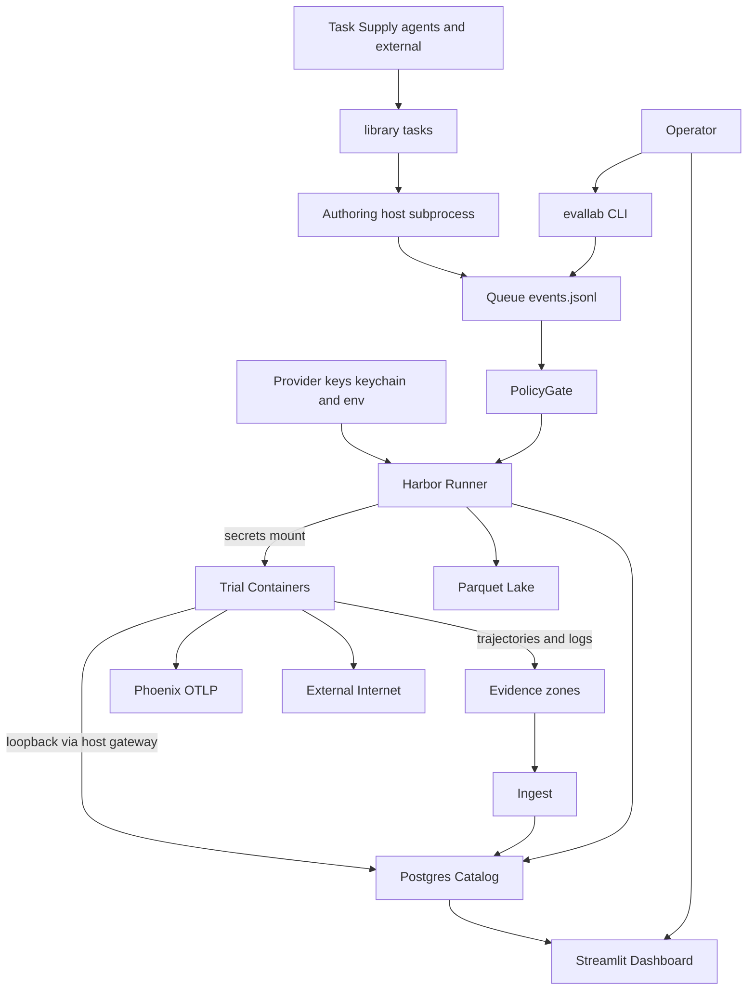

# eval-lab Threat Model

**Date:** 2026-08-29 · **Scope:** `~/Developer/eval-lab` · **Method:** repo-grounded STRIDE-style abuse-path analysis
**Validated context (Peter):** services are loopback-only; task content in `library/` is agent/externally sourced (treat as attacker-controlled); trial containers receive real provider keys and network access; active model environment includes Gemini Flash (OAuth) alongside DeepSeek and Z.AI.

## Executive summary

Eval Lab's most dangerous quality is also its purpose: it executes semi-trusted, agent-authored content while holding real provider credentials. The highest-risk paths are (1) host-side code execution via `authoring.py` subprocesses that run task-supplied verifier/solution scripts outside the Harbor sandbox, (2) credential exfiltration from trial containers, which hold provider keys at `/run/secrets/` and have unenforced network egress on macOS (`harbor_network.py` makes no-network a Linux-only guarantee), and (3) evidence-integrity attacks: a network-capable trial container can reach the loopback Postgres with the committed dev password and poison the Zone-2 catalog that every capability curve derives from. The authorization ledger (`queue/events.jsonl`) is a plain append-only file enforced only by process discipline — anything that gains host file-write can forge paid-run approvals.

## Scope and assumptions

**In scope:** runtime (`src/evallab/`, `dashboard/`, `queue/`, `runs/`, `containers/`, `compose.yaml` services), task supply (`library/`), secret handling (`scripts/`, `src/evallab/credentials.py`, `execution_contracts.py`), evidence pipeline (`sql/`, `derived/`, `research/evidence/`).

**Out of scope:** GitHub-hosted CI runners (`.github/workflows/ci.yml` — credential-free, read-only perms), dev tooling (`Makefile`, `scripts/premerge.sh`, `.githooks/`), the Harbor framework itself, provider-side security, physical/macos-local-malware threats beyond what trial agents can reach.

**Assumptions (unvalidated but load-bearing):**
- A1 — No remote/network attacker: all listeners bind `127.0.0.1` (`compose.yaml:11-12,34-36`); confirmed by operator.
- A2 — Task supply is hostile: `library/tasks/`, synthetic generators, and adapters may contain attacker-chosen content; confirmed by operator.
- A3 — Trial containers get real provider keys (Compose secret) and unrestricted network on macOS; confirmed by operator + `src/evallab/harbor_network.py` (no-network enforced only on Linux).
- A4 — Postgres DSN (with dev password) is reachable from containers via Docker Desktop's `host.docker.internal` → host loopback. *Open question: is `DATABASE_URL` passed into trial env (`runner.py:798`)?*

**Open questions that would change ranking:** (a) does the Claude or Gemini OAuth token ever enter trial containers or only host-side Harbor? (b) are non-DeepSeek lanes covered by any leak scan, or only `scripts/deepseek-v4-flash-lane`? (c) do trial containers get `--privileged` or host bind-mounts beyond task staging?

## System model

### Primary components

| Component | Role | Evidence |
|---|---|---|
| `evallab` CLI (~50 subcommands) | operator control plane: submit/tick/approve/run/ingest/verdict | `src/evallab/cli.py` (`build_parser` ~L2831) |
| Filesystem queue + PolicyGate | admission control; `events.jsonl` is the sole paid-run authorization ledger | `src/evallab/queue.py` (`PolicyGate` L367, approvals L877-911) |
| Harbor runner + Docker trials | executes task×agent pairs in containers; stages tasks, builds commands | `src/evallab/runner.py` (L667, L677) |
| Postgres catalog (Zone 2) | jobs/trials/rewards/verdicts metadata; loopback :54329, dev password | `compose.yaml:4-20`, `sql/schema.sql` |
| Parquet/DuckDB lake (Zones 3-4) | derived analytics; SQL built with string interpolation | `src/evallab/storage/attach.py` (L131-135) |
| Phoenix OTLP | trace observability, loopback :6006/:4317 | `compose.yaml:22-38`, `src/evallab/tracing.py` (L71-72, 219-229) |
| Streamlit dashboard | read-only operator views; renders trial-controlled strings | `dashboard/app.py`, `dashboard/explorer.py` (L92-306) |
| Evidence stores (Zone 1) | immutable runs/, CAS, promoted evidence | `docs/SYSTEM-TOUR.md` §3 |

### Data flows and trust boundaries

- **Operator → CLI → queue**: specs, approval events; channel: filesystem; guarantee: human types `evallab approve` — but the ledger is a world-writable-to-user file, no signature (`queue.py:877-911`).
- **Task supply → authoring → host subprocesses**: task READMEs, verifier/solution scripts; channel: subprocess execution *on host*; guarantee: none beyond admission gating (`authoring.py:1696, 2049, 2109-2119`; PolicyGate at L2648 gates submission, not execution safety).
- **Queue → Harbor → trial container**: task package + env + Compose secret; channel: Docker; guarantee: container isolation; secret delivered as file mount (`containers/deepseek-v4-flash-secret.compose.yaml`), env stripped by `SecretSafeDeepSeekMiniSweAgent` (`harbor_deepseek.py:41-60`).
- **Trial container → host services**: agent HTTP traffic; channel: bridge network → `host.docker.internal` → loopback Postgres/Phoenix; guarantee: **none on macOS** — network policy is a no-op (`harbor_network.py`), Postgres password is the committed dev default (`compose.yaml:10`).
- **Trial container → external internet**: model API calls, and anything else the agent chooses; guarantee: none on macOS (A3).
- **Trials → evidence → catalog/dashboard**: result.json, ATIF trajectories, logs; channel: filesystem → ingest → Postgres/Parquet → DuckDB views; validation: schema parsing + secret-marker redaction in explorer only (`dashboard/explorer.py:57-99`).
- **Runner → Phoenix**: OTLP spans incl. trajectory-derived strings; endpoint from env (`tracing.py:71-72`).

#### Diagram

## Assets and security objectives

| Asset | Why it matters | Objective |
|---|---|---|
| Provider credentials (DeepSeek key, Gemini/Claude OAuth tokens) | Personal subscription; theft = billing abuse + provider lockout | Confidentiality |
| `queue/events.jsonl` + `policy/standing-approvals.yaml` | Sole authorization record for paid execution; AGENTS.md: agents must never loosen policy | Integrity |
| Evidence zones (runs/, CAS, promoted evidence) | Immutable research record; all conclusions derive from it | Integrity |
| Postgres catalog (Zone 2) | Query spine for every curve/card/verdict | Integrity, Availability |
| Host laptop (keychain, files) | Upstream of everything: OAuth tokens, SSH, personal data | Confidentiality |
| Subscription quota windows | Provider rate-limit is the binding spend constraint (`policy/standing-approvals.yaml` comments) | Availability |
| Phoenix trace store | Input to machine judgment / acceptance decisions | Integrity |

## Attacker model

### Capabilities
- **Hostile task author** (validated A2): controls task instructions, verifier/solution scripts, fixture data, task names, and embedded text that flows into trajectories.
- **Evaluated LLM agent inside a trial** (validated A3): can read files in its container (incl. `/run/secrets/evallab_deepseek_api_key`), make arbitrary network calls (macOS egress unenforced), and shape every byte of its own trajectory/logs.
- **Local unprivileged process** (same host): can reach loopback Postgres/Phoenix/Streamlit and read user-writable files (queue ledger, `.env`).

### Non-capabilities
- No remote network attacker (A1, loopback binds).
- No kernel-level isolation assumed to be bypassable; Docker container escape itself is out of scope.
- No physical access, no compromised macOS host *a priori* (host compromise via TM-002 is an outcome, not a precondition).
- CI runners hold no secrets (`.github/workflows/ci.yml`), so CI is not a theft target.

## Entry points and attack surfaces

| Surface | How reached | Trust boundary | Notes | Evidence |
|---|---|---|---|---|
| `authoring.py` subprocesses | agent-authored task verification/reference runs | task supply → **host** | runs solution/verifier scripts with operator privileges | `src/evallab/authoring.py:1696,2109-2119` |
| Trial container filesystem | agent reads staged task + secrets | container ↔ secrets | secret readable at `/run/secrets/evallab_deepseek_api_key` | `containers/deepseek-v4-flash-secret.compose.yaml`, `harbor_deepseek.py:41-60` |
| Trial container network | agent egress | container → internet/host-loopback | **unenforced on macOS** | `src/evallab/harbor_network.py` |
| `queue/events.jsonl` | any host user-level writer | host processes → authorization ledger | append-only by convention, not by OS | `src/evallab/queue.py:877-911` |
| Postgres :54329 | containers via host-gateway; local processes | container → catalog | dev password committed in compose default | `compose.yaml:10-12` |
| Phoenix :6006/:4317 | containers + runner env endpoint | container/runner → traces | no auth on OTLP by default | `compose.yaml:34-36`, `tracing.py:71-72` |
| Trajectory text → dashboard | operator views results | evidence → operator browser | `st.markdown` rendering, redaction only for known markers | `dashboard/explorer.py:92-306` |
| Dataset/task fetch | external hub/HuggingFace intake | internet → library | sha256 pins, refuses @latest, path-escape guard | `src/evallab/fetch.py:146-165,661-664,872-988` |
| DuckDB view SQL | job/task/parquet names into SQL strings | evidence names → analytics | f-string quoting helpers | `src/evallab/storage/attach.py:131-135` |
| OTLP payload construction | trajectory strings into spans | evidence → trace store | redaction-survival checks present | `src/evallab/tracing.py:609+` |

## Top abuse paths

1. **Key exfiltration from trial** — malicious task → agent reads `/run/secrets/evallab_deepseek_api_key` → POSTs to attacker endpoint → billing abuse under Peter's subscription. (`harbor_network.py`: egress unenforced.)
2. **Host RCE via authoring** — malicious imported task → its verifier/solution script executed by `authoring.py` subprocess on host → read keychain (`harbor-auth-env.sh` pattern), forge approvals, exfiltrate everything.
3. **Evidence poisoning** — trial agent connects to `host.docker.internal:54329` with the committed dev password → `UPDATE trials/rewards` → every downstream curve/card/verdict silently corrupted.
4. **Approval forgery** — any host-level code execution (e.g., via #2) appends a `human_approved` event to `queue/events.jsonl` → PolicyGate admits unlimited billable runs.
5. **Dashboard-borne exfiltration** — crafted trajectory text rendered by `explorer.py` `st.markdown` → operator clicks a link or an image URL fetches `https://attacker/?leak=...` → research content leaves the machine.
6. **Secret into permanent record** — agent prints the key in partial/mangled form → passes lane leak scan → trajectory promoted to `research/evidence/runs/` or committed `backups/postgres/` → credential rots in git history.
7. **Quota-lockout sabotage** — queued malicious specs cause repeated billable runs until provider exhausts the rate-limit window → operator locked out during a critical eval (`policy/standing-approvals.yaml` `refuse_billable_at_used_percent: null` means no local ceiling).
8. **Trace poisoning** — spurious/malformed OTLP spans injected into Phoenix (container can reach :4317) → machine judgment (`trajectory_judgment.py`) accepts/rejects on corrupted evidence.

## Threat model table

| ID | Threat source | Prerequisites | Threat action | Impact | Impacted assets | Existing controls (evidence) | Gaps | Recommended mitigations | Detection ideas | Likelihood | Impact severity | Priority |
|---|---|---|---|---|---|---|---|---|---|---|---|---|
| TM-001 | Evaluated agent / hostile task | Trial with real key + network (A3) | Agent reads Compose secret file and exfiltrates key to attacker endpoint | Subscription theft, billing abuse, provider lockout | Provider credentials, quota | Env stripping `harbor_deepseek.py:41-60`; secret-as-file; post-run leak scan `scripts/deepseek-v4-flash-lane` | macOS egress unenforced `harbor_network.py`; scan is post-hoc and lane-specific | Egress proxy/allowlist for trials (even host-level); rotate key on any untrusted-task trial; extend leak scan to all lanes | Alert on trial-container connections to non-provider IPs; key-usage anomaly on provider dashboard | high | high | **high** |
| TM-002 | Hostile task author | Agent/externally sourced task passes admission (A2) | Verifier/solution/reference script executed via host subprocess executes attacker code with operator privileges | Host compromise: keychain, queue, policy, all assets | Host, credentials, queue ledger, policy | PolicyGate admission `authoring.py:2648`; AGENTS.md review norms | Admission gates *submission*, not *execution safety*; scripts run unsandboxed on host | Run authoring scripts in ephemeral container (same Harbor path as trials); or explicit per-script human approval; drop host subprocess for untrusted tasks | Audit-log every authoring subprocess with script hash; alert on authoring runs of non-reviewed tasks | medium | critical | **critical** |
| TM-003 | Compromised host process / escaped agent code | File-write access to `queue/` | Forge `human_approved` event; loosen `policy/standing-approvals.yaml` | Unlimited billable execution, silent policy change | Queue ledger, policy, spend | Human-approve design `queue.py:877-911`; ceilings in `standing-approvals.yaml` | Ledger is a plain user-writable file; no signature/sequence validation noted | MAC-style protection: validate event schema + monotonic counters at read time; keychain-backed HMAC on events; git-track policy with pre-tick diff check | `evallab tick` warns on ledger writes not preceded by a CLI process; canary event no real actor would write | low | high | medium |
| TM-004 | Evaluated agent / hostile task | Container egress to host loopback (A3/A4) | Authenticate to Postgres with dev password; `UPDATE`/`DELETE` trials, rewards, verdicts | Silent corruption of entire research record | Zone-2 catalog, derived analyses | Loopback bind `compose.yaml:11-12`; dev-credential framing `.env.example` | Password is committed default; no per-container DB identity; catalog trusts writes | Strong per-install password from env only; Postgres `pg_hba` restricted to host interface not docker bridge; read-only role for anything container-adjacent | Row-level: ingest-time hash reconciliation against Zone-1 result.json; alert on writes to `trials` from non-ingest clients | medium | high | **high** |
| TM-005 | Hostile task author | Task text reaches a viewed trajectory | Crafted markdown/links in `st.markdown` exfiltrate context or phish the operator | Research-content leak; social engineering | Evidence confidentiality, operator | Redaction of known secret markers `explorer.py:57-99` | Generic markdown/link rendering of trial-controlled strings | Render trajectories as code blocks by default; strip links/images from untrusted panes; allowlist schemes | Log/refuse external image fetch attempts in dashboard | medium | medium | medium |
| TM-006 | Evaluated agent | Agent prints secret in transformed/partial form | Secret lands in trajectory → promoted evidence or committed `backups/postgres/` | Long-lived credential exposure in git/backup history | Credentials, evidence confidentiality | Lane leak scan `deepseek-v4-flash-lane`; explorer redaction; tracing redaction checks `tracing.py:609+` | Scan coverage limited to DeepSeek lane; transform-mangling evades regex; backups committed to repo | Pre-promotion scan gate on all lanes (fail closed); gitleaks in premerge + CI over `runs/` promotions; purge + rotate if found | Scheduled repo/backup scan; provider-side key-age alerts | medium | high | **high** |
| TM-007 | Hostile task author | Spec queued and ticked | Repeated billable runs until provider rate-limit window exhausts | Operator locked out during critical evaluation window | Quota availability | Provider-side exhaustion refusal `standing-approvals.yaml` comments | Local `refuse_billable_at_used_percent` deliberately null | Set a Peter-owned ceiling below provider limit (documented knob); per-task billable-run budget | `queue/reasons/` spike alert; daily spend report vs 20 USD ceiling | low | medium | low |
| TM-008 | Evaluated agent / local process | Container reach to :4317 or env-controlled endpoint | Inject spurious OTLP spans / redirect `PHOENIX_COLLECTOR_ENDPOINT` | Machine judgment and acceptance decisions made on corrupted traces | Phoenix store, Zone-4 judgments | Redaction-survival checks `tracing.py:609+`; loopback bind | No span authenticity check; endpoint from env | Ingest-side provenance tag per runner PID; reject spans lacking runner token | Span-count/volume anomaly alert per trial | low | medium | low |
| TM-009 | Hostile task author | Task/parquet/job names reach SQL construction | SQL injection via insufficiently quoted identifiers/literals into DuckDB/Postgres views | Analytics-layer compromise, data exfil from catalog | Zone 2-4, dashboard | `_sql_string_literal` helper + f-string quoting `attach.py:131-135`; path-escape guard `fetch.py:661-664` | String-building remains the pattern; identifier quoting is brittle | Parameterize everywhere; allowlist identifier charset `[a-z0-9_-]` at registration boundary; property-test the quoting helper with hostile names | Fuzz quoting helper in CI (hypothesis already in repo) | medium | medium | medium |
| TM-010 | Future refactor (latent) | `seqgen.py` exec source becomes data-driven | `exec()` over non-constant source | Code execution | Host | Source is currently an in-repo constant `seqgen.py:244` | No guard preventing data-driven use | Replace with declarative interpreter or add constant-source assertion | Lint rule banning `exec(` outside allowlist | low | high | low |

## Criticality calibration

- **Critical** — attacker-controlled task content executing on the host, or bulk credential theft with a working exfil channel. *Examples: TM-002; a queue-ledger forgery primitive that requires no prior compromise.*
- **High** — single-credential exfiltration from trials; silent corruption of the evidence catalog; secrets reaching permanent git/backup records. *Examples: TM-001, TM-004, TM-006.*
- **Medium** — integrity/availability attacks with bounded blast radius (analytics SQLi, trace poisoning, dashboard-borne leaks, quota lockout). *Examples: TM-003, TM-005, TM-008, TM-009.*
- **Low** — latent sinks, noisy DoS, attacks needing unlikely preconditions. *Examples: TM-007, TM-010.*

Ranking is most sensitive to A2/A3: if task supply were fully hand-curated and trials air-gapped, TM-001/002/004 collapse to low; the confirmed "agent-sourced tasks + keyed/networked containers" combination is what drives the two top priorities.

## Focus paths for security review

| Path | Why it matters | Related threats |
|---|---|---|
| `src/evallab/authoring.py` | Host-side subprocess execution of task-supplied scripts — the single sharpest edge | TM-002, TM-003 |
| `src/evallab/harbor_network.py` | Network policy is a documented no-op on macOS; undermines every "agent can't phone home" assumption | TM-001, TM-004, TM-008 |
| `src/evallab/queue.py` | Authorization ledger integrity; approval event validation | TM-003 |
| `src/evallab/runner.py` | Env construction incl. DSN handling; what exactly reaches trial env | TM-004, TM-001 |
| `src/evallab/harbor_deepseek.py` | Secret delivery/stripping contract | TM-001, TM-006 |
| `scripts/deepseek-v4-flash-lane` | Leak-scan coverage model to generalize to all lanes | TM-006 |
| `src/evallab/storage/attach.py` | SQL string construction over evidence names | TM-009 |
| `dashboard/explorer.py` | Rendering trial-controlled strings to the operator | TM-005 |
| `src/evallab/fetch.py` | External content intake (hub/HuggingFace) | TM-002, TM-009 |
| `src/evallab/tracing.py` | OTLP endpoint from env; payload construction from trajectories | TM-008 |

## Quality check

- Entry points covered: CLI subcommands, queue/tick, dashboard, authoring, fetch, OTLP, Postgres — yes (table above).
- Every trust boundary appears in ≥1 threat: operator→ledger (TM-003), task-supply→host (TM-002), container→secrets (TM-001), container→loopback services (TM-004/TM-008), evidence→dashboard (TM-005), evidence→SQL layer (TM-009), container→internet (TM-001), external intake (TM-002/009).
- Runtime vs CI/dev separation: CI and dev tooling excluded as non-secret-bearing (`.github/workflows/ci.yml`, `Makefile`).
- User clarifications reflected: loopback-only exposure (kills remote-attacker threats), hostile task supply (raises TM-002 to critical), keyed+networked trials (raises TM-001/004), Gemini Flash/OAuth in active context.
- Residual open questions: Claude/Gemini token container exposure, non-DeepSeek lane scan coverage, bind-mount surface (see Scope).
