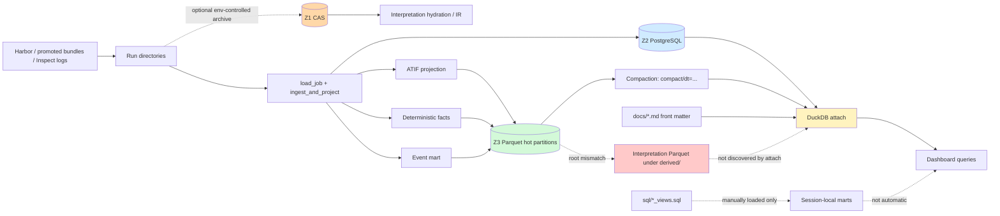
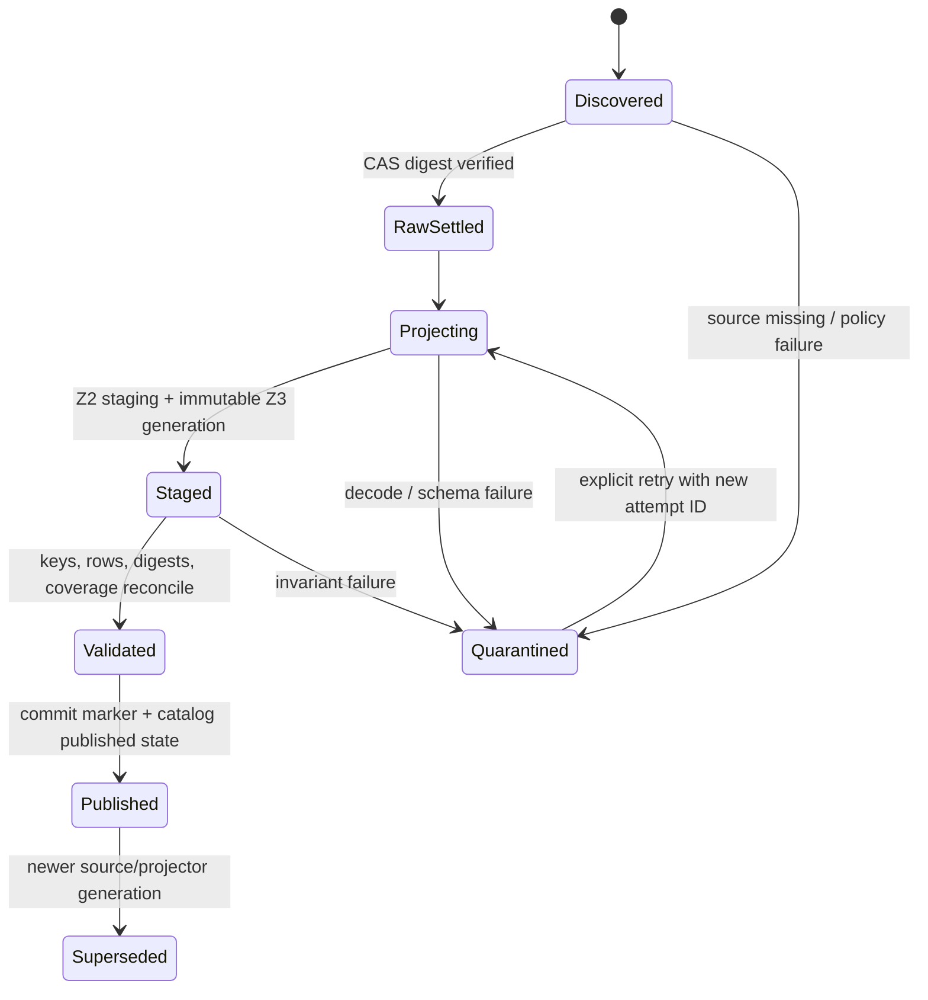

# Eval Lab Data Pipeline, Storage, Feature Engineering, and Analysis: Exact-State Audit

**Snapshot:** 2026-09-01 04:32 UTC  
**Repository:** `/Users/petermakhnatch/Developer/eval-lab`  
**Audit mode:** source inspection plus read-only execution against the current checkout, PostgreSQL catalog, Parquet lake, CAS, backup manifests, and DuckDB attach surface  
**Scope:** raw Harbor evidence, CAS, PostgreSQL, Parquet projections, curated/query surfaces, ATIF, deterministic facts, trajectory IR, feature engineering, evidence packs, judgment/acceptance, analysis, backups, and high-throughput design

## 1. Claim and evidence convention

This report separates four kinds of statements:

- **Observed** — directly read from the current filesystem, database, Parquet metadata, command output, or source.
- **Derived** — arithmetic or a deterministic call-graph conclusion from observed facts.
- **Inference** — a likely operational consequence that was not load-tested in this audit.
- **Proposed** — a target design or acceptance criterion, not current behavior.

The quantitative snapshot is local to this checkout and its configured PostgreSQL instance. It is not a production-wide inventory and it is not a throughput benchmark. No source files were modified during the audit.

A companion high-level map was also created and verified in the connected Excalidraw canvas (19 elements). The renderable Mermaid diagrams below are the durable representation in this report.

## 2. Executive verdict

The repository has strong low-level integrity mechanisms but does **not** currently form one closed, consistently queryable, rebuildable four-zone data system.

### What is strong

1. **CAS object construction is deterministic and defensive.** It rejects symlinks, uses content and archive digests, publishes records atomically, fsyncs durable boundaries, and re-hashes restored trees (`src/evallab/evidence_store.py:245-561`). All 212 current record-to-blob links exist and all 212 archive SHA-256 values match their manifests.
2. **PostgreSQL has useful normalized operational contracts.** The core catalog, deterministic fact index, immutable suite membership, verdict history, and interpretation artifact indexes have keys and constraints in `sql/schema.sql`.
3. **ATIF normalization and deterministic fact extraction are substantially implemented.** Validation, nested/subagent path jailing, stable document identities, core row schemas, state-journal facts, and mechanically calibrated event linkage exist (`src/evallab/evidence/atif.py`, `facts.py`, `event_mart.py`).
4. **Interpretation artifacts are evidence-oriented.** The active trajectory IR carries citations and coverage; packs account for selected and omitted ranges; mandatory budget overflow fails closed; judgment and acceptance schemas enforce deterministic gates (`src/evallab/interpretation/`).
5. **Backups that exist are internally verified.** All four published dump generations have matching size and SHA-256 manifests.

### What prevents a closed loop today

| Severity | Observed condition | Why it matters |
|---|---|---|
| **P0** | Projection invariant: 156 catalog jobs, 50 complete granular projections, 0 recorded exceptions, **106 missing**, and 10 extra projected job IDs | The catalog and Parquet lake do not describe the same cohort; the failure ledger does not account for the gap. |
| **P0** | Only 56 of 156 catalog job IDs are present in the two primary raw run roots. Of the remaining 100, 12 match a CAS record by catalog ID or job name; **88 have neither a discovered raw job nor a directly matching CAS record** | A complete rebuild from Zone 1 cannot be demonstrated from the inspected sources. This is scoped to the primary roots and direct CAS identity matches; it is not proof that bytes do not exist elsewhere. |
| **P0** | `traj_features` contains 419 rows but only 240 distinct `(job_id, trial_id)` keys; 170 keys are duplicated, producing 179 excess rows | Current trajectory summaries can double- or triple-count logical trials. |
| **P0** | The three interpretation Parquet files exist under `derived/{interpretation_artifacts,machine_judgments,acceptance_decisions}`, while `attach.py` looks under `derived/parquet` | DuckDB reports these Z3 tables missing even though the files exist; unified queries cannot see them. |
| **P0** | “Zone 4” means curated marts in `docs/SYSTEM-TOUR.md`, front-matter documents in `attach.py`, and provenance classes in `docs/data-architecture.md` | The boundary is not frozen; producers and consumers cannot share one zone contract. |
| **P0** | The latest backup was created 2026-08-29 19:07 UTC, about 57 hours before this snapshot; only four generations exist from 2026-08-14 through 2026-08-29; no `pg_restore` or restore-drill implementation was found | Dump integrity is checked, but recovery readiness and nightly cadence are not established. |
| **P1** | A full ingest call graph can parse/project the same trial trajectory about seven times before all catalog, fact, event, and phase products are emitted | [Inference] CPU, JSON decoding, hashing, and allocation scale with the number of consumers rather than source bytes. |
| **P1** | 2,543 Parquet files occupy 10,769,188 bytes, about **4.2 KB per file on average** | Metadata, globbing, opening, and schema-union work dominate payload I/O. |
| **P1** | CAS citation hydration restores and verifies the whole archive for each cited event in several loops | [Inference] interpretation cost can scale with selected citations times archive extraction cost. |
| **P1** | SQL mart recipes are not loaded by unified attach; one documented unified query fails because the view is absent, and `ingest_views.sql` fails to bind after attach | Curated analysis is an operator-assembled session, not a stable storage layer. |
| **P1** | All 39 current “machine judgments” are deterministic abstentions with insufficient evidence; automatic acceptance is disabled | The judgment plane is a gated contract/persistence scaffold, not an operating model-judgment system. |

The shortest accurate summary is: **the repository has many correct components, but their identities, roots, visibility rules, and completeness gates are not yet governed as one generation-based pipeline.**

## 3. Zone terminology must be frozen first

The repository currently uses the same zone numbers for different concepts.

| Source | Meaning of zones |
|---|---|
| `docs/data-architecture.md:10-24` | Provenance classes: `01-external`, `02-local-evidence`, `03-synthetic`, `04-curated`. These are lineage classes, not physical stores. |
| `docs/SYSTEM-TOUR.md:74-87` | Storage layers: Z1 raw durable evidence, Z2 catalog, Z3 Parquet lake, Z4 curated marts/eval artifacts. |
| `src/evallab/storage/attach.py:1-473` | Z2 PostgreSQL, Z3 Parquet, Z4 Markdown front matter under `docs/`; no Z1 attachment. |
| `docs/lineage.md:61-69` | Z4 knowledge and Z5 coordination. |

This audit uses the storage interpretation requested for this assignment:

1. **Z1 Raw Evidence:** CAS plus current run trees.
2. **Z2 Catalog:** PostgreSQL from `sql/schema.sql`.
3. **Z3 Derived Lake:** Parquet under `derived/parquet` plus misplaced derived projections explicitly noted.
4. **Z4 Curated Marts:** versioned analytical relations intended for dashboards and downstream decisions.

**Proposed governance cut:** retain `01-external` through `04-curated` as `provenance_class`, not `zone`; reserve `z1` through `z4` for the storage topology above; move document front matter to `knowledge` or `z5`. This removes the collision without discarding either useful model.

## 4. Current end-to-end topology



The dashed edges are the operational discontinuities: CAS archival is not universal, interpretation projections are placed outside the discovered Z3 root, and curated SQL views are not automatically installed into the unified connection.

## 5. Z1 — raw runs and content-addressed storage

### 5.1 Current inventory

**Observed raw discovery** using the repository’s canonical completed-job discriminator (`n_total_trials`, `stats`, and `finished_at`) across `runs/` and `research/evidence/runs/`:

- 78 completed job directories.
- 66 distinct Harbor job IDs.
- 12 duplicate directories by job ID.
- 68 distinct directory/job names and 10 duplicate name occurrences.
- 54 directories under `runs/`; 24 under `research/evidence/runs/`.
- PostgreSQL contains 156 job IDs; 56 occur in the current raw roots, 10 raw IDs are not in the catalog, and 100 catalog IDs are absent from those roots.

The catalog’s stored paths are also stale at material scale:

- 54 of 156 catalog job `evidence_path` values exist.
- 102 job paths are missing.
- 86 of 189 catalog trial paths exist.
- 103 trial paths are missing.

**Observed CAS inventory:**

| Record kind | Records |
|---|---:|
| `campaign-data-quality` | 53 |
| `interpretation` | 114 |
| `interpretation_campaign` | 29 |
| `job` | 16 |
| **Total** | **212** |

CAS integrity scan:

- 212 record manifests and 212 unique `cas://sha256/...` URIs.
- 212 `.tar.gz` blobs, 3,830,374 compressed bytes.
- Manifest aggregate: 950 files and 21,428,237 uncompressed bytes.
- 0 missing blobs, 0 archive-digest mismatches, 0 record-name mismatches, and 0 duplicate record references.

CAS identity is not currently uniform. The 16 `job` record IDs are human-readable job names; 15 match a catalog `job_name`, but none match a catalog UUID. Current runner source now calls `archive_evidence(..., record_id=str(job.id), kind="job")` (`src/evallab/runner.py:1347-1356`). Historical records and current writer identity therefore differ.

Across catalog IDs/names, 56 jobs have a current raw job, 12 additional jobs without a current raw job have a directly matching CAS record, and 88 have neither in the inspected primary sources. This is the precise basis for the rebuildability warning; it does not search arbitrary external volumes.

### 5.2 CAS guarantees

`archive_evidence` provides several load-bearing properties (`src/evallab/evidence_store.py:245-561`):

- source containment and symlink rejection;
- deterministic sorted inventory;
- a content digest over relative path plus bytes;
- deterministic tar and gzip production;
- archive SHA-256 addressing under `blobs/sha256/<prefix>/...`;
- JSON record manifests under `records/<kind>/<record_id>.json`;
- no-follow directory descriptors;
- atomic file publication with fsync;
- restore-time archive validation and canonical tree re-hashing.

These are stronger crash/integrity semantics than the Parquet writer currently provides.

### 5.3 Z1 gaps

1. **Archival is not a universal completion prerequisite.** `run_experiment` archives only when `EVALLAB_EVIDENCE_STORE_ROOT` is set and suppresses archive exceptions after writing `evidence-archive-error.txt` (`runner.py:1344-1359`). Campaign-ledger queue settlement does archive before catalog ingest and fails closed (`queue.py:1523-1568`), but ordinary direct/queue paths do not share that mandatory contract.
2. **CAS and catalog identities are not joined by a durable source-manifest relation.** Direct name matching is the only recoverability check available for the historical `job` records in this audit.
3. **The catalog is not a durable raw store.** Its JSONB copies preserve job/trial result documents but not the complete trajectory, logs, verifier files, and artifacts required to rebuild all Z3 and interpretation products.
4. **CAS construction rereads source bytes.** `_content_digest` reads files before the tar-writing pass reads them again. [Inference] For large trajectories/artifacts, a streaming spool that hashes while writing the canonical archive would reduce source I/O without weakening verification.

## 6. Z2 — PostgreSQL catalog and backups

### 6.1 Schema shape

`sql/schema.sql` defines 18 tables and 11 views. The tables cover:

- **Operational catalog:** `experiments`, `jobs`, `trials`, `rewards`, `artifacts`, `run_files`.
- **Deterministic indexes:** `trajectory_documents`, `deterministic_trial_facts`.
- **Analyst plane:** `analysis_invocations`, `analysis_findings`, `analysis_evidence_citations`, `analysis_reviews`.
- **Registry/governance:** `verdicts`, `suites`, `suite_members`.
- **Interpretation plane:** `interpretation_artifacts`, `machine_judgments`, `acceptance_decisions`.

The schema uses primary keys, foreign keys, checks, immutable-suite triggers, and history/current views. It intentionally stores identity/index rows for interpretation rather than raw artifact bodies (`sql/schema.sql:584-661`).

### 6.2 Current table counts

| Table | Rows |
|---|---:|
| `experiments` | 94 |
| `jobs` | 156 |
| `trials` | 189 |
| `rewards` | 446 |
| `artifacts` | 506 |
| `run_files` | 3,177 |
| `trajectory_documents` | 72 |
| `deterministic_trial_facts` | 189 |
| `analysis_invocations` | 0 |
| `analysis_findings` | 0 |
| `analysis_evidence_citations` | 0 |
| `analysis_reviews` | 0 |
| `verdicts` | 768 |
| `suites` | 117 |
| `suite_members` | 173 |
| `interpretation_artifacts` | 195 |
| `machine_judgments` | 39 |
| `acceptance_decisions` | 39 |

The four `analysis_*` tables are entirely empty. Interpretation is active as a separate persistence plane: 195 artifacts are exactly 39 each of `ir`, `pack`, `judgment`, `decision`, and `interpretation`.

### 6.3 Ingest transaction and scaling behavior

There is no current `src/evallab/ingest.py`; that requested path is stale. The active CLI path is:

```text
cli._ingest_command
  -> evidence.atif.ingest_and_project
       -> database.initialize
       -> database.ingest
       -> evidence.facts.ingest_catalog
       -> project_jobs
            -> export_trajectories
            -> export_facts
            -> export_event_mart
```

Sources: `src/evallab/cli.py:940-1000`, `src/evallab/evidence/atif.py:828-863`.

`database.ingest` holds one PostgreSQL connection/transaction across the supplied jobs and executes per-job and per-trial upserts, with `executemany` only for child collections (`database.py:66-267`). It does not use PostgreSQL `COPY` or a staging table. `facts.ingest_catalog` then opens a separate transaction, and Parquet projection begins only after catalog transactions finish.

Consequences:

- Base catalog, deterministic catalog, and Parquet are separate failure domains.
- There is no cross-store generation ID or commit marker.
- A failure after PostgreSQL commit can leave Z2 ahead of Z3; this is explicitly anticipated in `ingest_and_project`, but the current exception ledger does not account for the observed 106-job gap.
- [Inference] Per-row round trips and repeated `DELETE`/insert operations will become material at large batch size.

### 6.4 PostgreSQL backups

`create_postgres_backup` uses a process/thread lock, private `0600` temporary files, `pg_dump --format=custom`, size and SHA-256 validation, fsync, and an atomic generation-directory rename (`src/evallab/backups.py:1-171`). Existing generations:

| Generation | Bytes | Manifest SHA verified | Created UTC |
|---|---:|---:|---|
| `evallab-2026-08-14.dump` | 95,604 | yes | 2026-08-15 01:10 |
| `evallab-2026-08-15` | 116,205 | yes | 2026-08-15 05:31 |
| `evallab-2026-08-16` | 145,800 | yes | 2026-08-16 06:46 |
| `evallab-2026-08-29` | 417,264 | yes | 2026-08-29 19:07 |

Gaps:

- No restore command or automated `pg_restore` drill was found in `src/`, `tests/`, or `sql/`.
- The observed files do not demonstrate nightly cadence.
- `POSTGRES_BACKUP_TIMEOUT_SECONDS` is 600 seconds, while the nightly step declares 120 seconds (`backups.py:21`, `automation.py:416-423`). More importantly, `Nightly.run` invokes `step.fn(context)` directly and never consults `NightlyStep.timeout` (`automation.py:799-903`); the declared timeouts for all nightly steps are metadata, not enforcement.

## 7. Z3 — Parquet lake, projection completeness, and compaction

### 7.1 Physical inventory

`derived/parquet` contains 2,543 files totaling 10,769,188 bytes. Shared discovery classified every file without metadata errors:

| Layout | Files |
|---|---:|
| granular hot trial | 2,251 |
| job-level | 155 |
| cold day (`compact/dt=...`) | 130 |
| directory table | 5 |
| root table | 2 |
| **Total** | **2,543** |

There are 155 `job_id=*` directories. The average file size is about 4.2 KB; this is a small-file workload, not a scan-efficient columnar lake.

Physical row counts include overlap between retained hot partitions and cold compact files. “Attached rows” are DuckDB’s current logical result after the attach layer’s available key-based deduplication.

| Table | Files | Physical rows | Attached rows |
|---|---:|---:|---:|
| `action_effects` | 131 | 121 | 75 |
| `agent_actions` | 131 | 1,929 | 1,471 |
| `artifact_facts` | 183 | 718 | 527 |
| `behavior_labels` | 1 | 1 | 1 |
| `capability_opportunities` | 5 | 0 | 0 |
| `constraint_facts` | 5 | 0 | 0 |
| `context_operation_facts` | 5 | 0 | 0 |
| `craft` | 1 | 551 | not attached |
| `evidence_coverage` | 5 | 0 | 0 |
| `jobs` | 163 | 293 | 160 |
| `llm_calls` | 131 | 1,565 | 1,113 |
| `observations` | 186 | 2,406 | 1,468 |
| `paired_condition_facts` | 5 | 0 | 0 |
| `process_step_facts` | 5 | 0 | 0 |
| `qualification` | 1 | 5 | not attached |
| `reward_facts` | 183 | 573 | 456 |
| `session_dependency_facts` | 5 | 0 | 0 |
| `state_changes` | 131 | 121 | 75 |
| `state_events` | 76 | 455 | 260 |
| `steps` | 186 | 3,215 | 1,738 |
| `tool_calls` | 186 | 2,409 | 1,471 |
| `tool_usage` | 183 | 169 | 127 |
| `traj_features` | 1 | 419 | 419 |
| `traj_labels` | 1 | 1 | not attached |
| `trajectories` | 186 | 108 | 72 |
| `trajectory_events` | 131 | 6,490 | 4,674 |
| `trajectory_phases` | 131 | 263 | 210 |
| `trajectory_quality_findings` | 1 | 307 | 307 |
| `trajectory_quality_reports` | 1 | 40 | 40 |
| `trial_facts` | 183 | 263 | 193 |

The attached `jobs` row count (160) already differs from Z2’s 156, and the attached `trial_facts` count (193) differs from Z2’s 189. These are not merely display differences; they confirm extra or multiply retained identities in the lake.

### 7.2 Projection invariant and verifier disagreement

The canonical invariant in `evidence/atif.py:946-1006` requires `jobs.parquet` plus every file in `PROJECTED_TABLES` for a job to count as projected. Current result:

```text
catalog=156 projected=50 exceptions=0 missing=106 extra=10
ok=False
```

A second verifier, `src/evallab/ingest_verify.py`, reports a different scope because it deliberately removes catalog jobs/trials whose `evidence_path` is not retained in the checkout (`ingest_verify.py:301-322`) and scans only granular ATIF files. Its current output is:

```text
disk jobs=64, disk trials=242, unprojectable=5
catalog jobs=54, catalog trials=86       # filtered, not full Z2
parquet jobs=47, parquet trials=33
ATIF documents=58, exceptions=0, gaps=43
is_complete=False, invariant_ok=False
```

This verifier claims reconciliation across four durable stores but does not inspect CAS, omits missing-path catalog rows, and ignores cold-day ATIF files. The canonical attach surface sees 72 logical trajectories. Thus the repository has multiple completeness counters with incompatible cohorts and layout rules.

**Required correction:** one reconciler must consume the canonical raw-source manifest registry, full Z2 catalog, shared Parquet partition discovery, and explicit exceptions. It must not filter missing source evidence out of the denominator.

### 7.3 Atomic Parquet writing

`write_table_atomic` writes a fixed sibling `.parquet.tmp` and renames it (`evidence/parquet_io.py:1-45`). It provides atomic namespace replacement but does not:

- fsync file bytes or parent directories;
- use a unique temporary name for concurrent writers;
- write a row-count/digest manifest;
- publish all tables for a trial/job as one generation.

A standard projected trial creates 15 small table files plus job-level output, amplifying open/stat/glob work. Empty outputs are still materialized as schema-carrying files.

### 7.4 Compaction

The compactor merges hot job/trial partitions into `compact/dt=YYYY-MM-DD/<table>.parquet`, casts to canonical schemas, deduplicates/sorts by primary key, validates written row counts/schema, and prunes old job directories only after all tables for the day finish (`storage/parquet_compaction.py:499-755`). These are useful safeguards.

Current dry-run plan at the audit date:

- 155 uncompacted jobs across 12 closed days.
- 111 jobs across 7 days are beyond the seven-day retention boundary and are prunable.
- Retained hot and existing cold data overlap materially, which explains physical/logical row differences.

Gaps:

1. `PROJECTED_TABLE_NAMES` is narrower than the attach registry. Feature, behavior, quality, interpretation, and Inspect products are not all compacted.
2. A day is published table by table into its final directory. There is no day-level staging directory, manifest, or `_SUCCESS` marker. A mid-day failure can leave a partially updated cold partition visible, although hot rows remain and pruning waits.
3. `write_compact_table` validates schema/count but does not fsync the file/directory.
4. Pruning uses `shutil.rmtree` after table writes; no compact-generation manifest records which hot partitions were retired.
5. `resolve_job_date` can execute `runs_dir.rglob("result.json")` for each job when step timestamps do not resolve (`parquet_compaction.py:161-230`). [Inference] The fallback is O(jobs × run-result files).
6. Attach deduplicates only when a **cold-day** file is present. A table with hot plus `cold-table` layout is unioned without key deduplication (`attach.py:126-150`).
7. Many attached tables, including `traj_features`, have no registered primary key, so no hot/cold or duplicate-source deduplication is possible.

### 7.5 Alternative producers outside the main layout

- `storage/incremental_ingest.py` safely validates promoted bundles, records lineage/omissions, and swaps each bundle atomically. It writes to `derived_root/promoted_bundles/<bundle>`, including `promotion_lineage` and `promotion_omissions` (`incremental_ingest.py:329-433,499-676`). That layout and those tables are absent from `storage.paths`/`attach.TABLES`, so outputs would not join the unified query or compaction surface. No current `promoted_bundles` output exists.
- Inspect projection deliberately writes revision-preserving source tables under `job_id=<id>/revision_id=<revision>`, with row counts, table digests, source manifest, and mandatory CAS linkage (`storage/inspect_storage.py:64-250`). Attach understands the layout, but all five Inspect tables are currently absent.

## 8. Z4 — curated marts are not a storage layer yet

### 8.1 Filesystem and attach state

The storage tour names `derived/curated`, `derived/comparisons`, curves, and cards as Zone 4. None of those roots exists in the current `derived/` inventory.

`attach.py` instead creates `z4.front_matter` from `docs/**/*.md`:

- 99 current rows.
- Documents are parsed and inserted one row at a time on every attach.
- Per-document parse failures are silently skipped (`attach.py:374-411`).
- This is a knowledge-document index, not a curated metric layer.

### 8.2 SQL assets are recipes, not installed marts

The repository has many analytical SQL assets (`analyst.sql`, `behavior.sql`, `calibration.sql`, `craft_views.sql`, `evidence_queries.sql`, `ingest_views.sql`, `lessons.sql`, `traj_benchmark_views.sql`, `traj_views.sql`, and others). They are not automatically loaded by `storage.attach`.

Two direct probes establish the current contract failure:

1. `evallab db attach --query "SELECT count(*) FROM v_traj_loops"` exits 1 because `v_traj_loops` does not exist, despite `sql/traj_views.sql` documenting that exact unified-attach use.
2. Manually executing `traj_views.sql` after attach succeeds and yields `v_traj_summary.total_trials=419`, reflecting the duplicate physical feature rows rather than 240 logical trials.
3. Manually executing `ingest_views.sql` after attach fails with a DuckDB binder error because the existing main `jobs` view is Z3-shaped (`job_id`) while the SQL expects catalog-shaped `jobs.id`. The file’s “all four stores” comment is not implemented by the script.

**Conclusion:** current Z4 is a collection of source SQL recipes plus a docs index, not a versioned, automatically attached, tested mart plane.

## 9. ATIF normalization and deterministic projection

### 9.1 ATIF contract

`src/evallab/evidence/atif.py` supports ATIF versions 1.0 through 1.7. It uses Harbor’s Pydantic trajectory model when available and a fallback validator otherwise. The fallback enforces:

- non-empty sequential steps;
- agent messages and tool calls;
- tool call ID/name/argument validity;
- observation-to-call references;
- embedded trajectory identities;
- path jails for continued and subagent trajectories.

Nested trajectories are traversed breadth-first; document identity is derived deterministically from trial, source path, and embedded path. Core projections are `trajectories`, `steps`, `tool_calls`, and `observations` (`atif.py:240-805`). All 72 currently attached trajectory rows have `validation_status='valid'`; that statement applies only to the attached projected subset.

The core Z3 representation is intentionally reduced rather than lossless: message content is not persisted in the main tables, while tool arguments and observations carry hashes/byte sizes and selected mechanical fields. Exact content remains a Z1/hydration responsibility.

### 9.2 Repeated parsing in the full ingest call graph

A single `ingest_and_project` can reach approximately seven `project_trial`/trajectory-outline passes per trial:

1. `facts.ingest_catalog -> extract_job_facts -> extract_trial_fact -> project_trial`.
2. `facts.ingest_catalog` calls `project_trial` again for `trajectory_documents`.
3. `export_trajectories -> project_trial`.
4. `export_facts -> extract_job_facts -> project_trial`.
5. `export_event_mart -> extract_job_facts -> project_trial`.
6. `export_event_mart -> project_event_mart -> project_trial`.
7. `export_event_mart` builds the phase outline separately.

Sources: `atif.py:662-863`, `facts.py:412-558,801-879`, `event_mart.py:169-402`. `load_job` also inventories and hashes every file before these projections (`results.py:240-267`).

This is a call-graph count, not a timing measurement. It nevertheless identifies the main avoidable compute pattern: producers accept raw trial objects rather than one immutable decoded projection.

## 10. Deterministic facts and event mart

### 10.1 Fact coverage

`TrialFact` carries experiment/job/trial identity, task/verifier/environment/agent digests, benchmark coordinates and phases, reward facts, tokens/cost, trajectory status/counts, tool failure/repeat metrics, artifacts, and state-journal status/counts (`evidence/facts.py:201-340,412-800`).

Tool failures are joined by call ID to observation exit codes; repeated failures use identical argument hashes. State mutation facts and events are separate tables. This is appropriately mechanical.

Current attached `trial_facts.state_journal_status`:

| Status | Rows |
|---|---:|
| `absent` | 106 |
| `available` | 32 |
| `NULL` from legacy schema union | 55 |
| **Total** | **193** |

Only 32 logical rows have available state journals. The 55 nulls show schema evolution in retained files, while 106 explicit absences show source instrumentation coverage. `deterministic_trial_facts` stores the full raw fact JSON but does not expose state-journal columns as first-class Z2 fields.

### 10.2 Event mart calibration

The event mart emits `trajectory_events`, `agent_actions`, `llm_calls`, `trajectory_phases`, and `action_effects`. Its module contract explicitly refuses causal claims: action/effect linkage means the last action temporally preceding the first filesystem event, and the linkage method is recorded (`evidence/event_mart.py:1-7,169-402`). This distinction should remain immutable in downstream mart names and dashboards.

### 10.3 Semantic facts

Current semantic fact files are largely dormant:

- `capability_opportunities`, `constraint_facts`, `context_operation_facts`, `paired_condition_facts`, `process_step_facts`, `session_dependency_facts`, and `evidence_coverage` have files but zero rows.
- `semantic_action_facts` and `semantic_action_coverage` are absent.
- Consequently `v_semantic_vs_mechanical` is an intentionally empty typed fallback.

This is honest degradation, but it means the current analytical surface is overwhelmingly mechanical.

## 11. Trajectory IR: two overlapping implementations

Two public modules define `TrajectoryIR` and `build_trajectory_ir`:

1. `src/evallab/trajectory_ir.py` describes a lossless, full-fidelity step IR with sampling parameters, token IDs/logprobs, message/reasoning bodies, tool definitions, observation results, CAS references, and a loss report (`trajectory_ir.py:1-500`). It reads observations from `raw_step["observation_results"]` (`:379-400`).
2. `src/evallab/interpretation/trajectory_ir.py` is the active interpretation IR. It creates normalized events, episodes, opportunity windows, graph nodes/edges, evidence coverage, quality/linkage state, source digests, and unknowns. It handles standard `raw_step["observation"]["results"]` and alternative observation lists (`interpretation/trajectory_ir.py:587-698,832-1360`). CLI interpretation commands and evidence packs import this implementation (`cli.py:2958-3061`).

The standard ATIF observation path mismatch means the top-level full-fidelity IR can omit observations that the active IR sees. The top-level module is still used for helper extraction in `traj.py`, so it is not dead code.

**Proposed clean cutover:** designate the interpretation event IR as the canonical behavioral IR, move genuinely lossless raw-step/token helpers behind a clearly named `RawTrajectoryDocument` contract, migrate callers/tests, and remove the second `TrajectoryIR` public identity. Do not attempt to merge the two semantics under one ambiguous class.

## 12. Feature engineering

### 12.1 Current trajectory feature table is not at logical trial grain

`project_trajectory_features` scans immediate job/trial directories across multiple candidate roots and deduplicates only by resolved **path**, not by logical job/trial identity (`traj.py:1838-1969`). Current data:

- 419 rows.
- 240 distinct `(job_id, trial_id)` keys.
- 170 duplicated keys.
- 179 excess rows beyond one row per key.
- Maximum three rows for one key.
- 354 `featured`; 65 `accounted_unavailable`.
- All 419 have `state_journal_status='not_observed'` in this feature table.

`attach.PRIMARY_KEYS` has no key for `traj_features`, so DuckDB does not repair this. Manual `v_traj_summary` consequently reports 419 total trials and aggregates 71,198,443 prompt tokens across duplicate source copies.

**Required grain contract:** either one current row per `(job_id, trial_id, feature_version)` or an explicit revision table keyed by `(job_id, trial_id, source_digest, feature_version)` plus a deterministic `current` view. Physical path must never stand in for logical identity.

### 12.2 Registry governance

The active feature registry contains 240 features:

| Category | Features |
|---|---:|
| identity | 37 |
| mechanical fact | 48 |
| screening heuristic | 12 |
| benchmark L1 fact | 91 |
| benchmark L2 metric | 42 |
| benchmark ground truth | 10 |

Benchmark-family coverage is 74 `autonomous-research-v1`, 33 `action-memory-v1`, 19 `mcp-funcdag-v1`, 20 `mcp-recovery-v1`, and 94 family-independent features.

`verify_feature_registry()` reports zero structural errors. Separate governance audits find:

- 73 features missing an explicit denominator-applicability declaration.
- 131 features refused as candidate predictors: 72 missing temporal availability, 10 post-verdict, 27 not applicable, 19 reward-definition leakage, and 3 undeclared verdict coupling.

Many predictor refusals are intentional safeguards, not defects. The 73 missing denominator declarations are unresolved metadata debt because denominators determine whether aggregates compare like cohorts (`interpretation/feature_registry.py:206-330,1108-1140`).

## 13. Evidence packs, hydration, machine judgment, and acceptance

### 13.1 Evidence-pack strengths

`build_evidence_pack` uses a default 16,000-token estimate and produces:

- a global outline and episode summary;
- mandatory instruction, terminal, error/recovery, verifier, mutation, and context windows;
- exact reopening citations for selected and omitted ranges;
- raw/source/content digests;
- redaction policy configuration and digest;
- coverage metrics and boundedness state.

If mandatory windows exceed the budget, the pack is not silently truncated: it becomes non-callable and requires a tiered pack. Missing/quarantined source quality requires abstention (`interpretation/evidence_pack.py:35-42,327-524,587-889`). This is a sound evidence-admission contract.

### 13.2 Hydration bottleneck

`hydrate_citation` creates a temporary directory and calls `restore_evidence` for one citation (`trajectory_hydration.py:469-600`). Evidence-pack assembly and runtime quality gates call it inside event/citation loops (`evidence_pack.py:565-574,739-742`; `trajectory_runtime.py:924-935,1033-1040,1339-1356`). Each CAS restore verifies and extracts the whole archive.

[Inference] For a pack with many citations from one trial archive, this produces whole-archive decompression/extraction proportional to citation count.

**Proposed fix:** introduce an archive-scoped immutable hydration session keyed by `(cas_uri, archive_digest)`. Verify/decompress once, index members once, and resolve all citation locators against that in-memory or single-temp-tree session. Redaction remains per citation so the existing pack digest contract is preserved.

### 13.3 Machine judgment is currently deterministic abstention

Source makes the current operating mode explicit:

- `_coverage_gaps` always begins with `judge_execution_disabled`.
- `build_machine_judgment` always sets `producer_kind='deterministic_abstention'` and `validity='insufficient_evidence'` (`trajectory_runtime.py:591-639`).
- `AUTO_ACCEPTANCE_ENABLED=False`; constructing an accepted v1 decision is illegal (`trajectory_acceptance.py:18,156-169`; `trajectory_runtime.py:1563-1599`).

Current Z2 rows confirm the implementation:

| Relation | Distribution |
|---|---|
| `machine_judgments` | 39 `deterministic_abstention` / `insufficient_evidence` |
| `acceptance_decisions` | 27 `abstained`, 12 `rejected`, 0 accepted |
| `interpretation_artifacts` | 39 each of IR, pack, judgment, decision, interpretation |

Quality reports cover 40 trajectories: 7 pass/not-ready, 1 pass/ready, 1 quarantine/not-ready, and 31 warn/ready.

The backfill ledger under `derived/analyses/ledger.json` reports 21 discovered, 17 `ANALYSIS_READY`, and 4 `HOLD`, but readiness does not mean a model judgment occurred; the persisted producer remains deterministic abstention.

### 13.4 Interpretation projection root mismatch

`rebuild_interpretation_projections` writes:

- `derived/interpretation_artifacts/interpretation_artifacts.parquet`
- `derived/machine_judgments/machine_judgments.parquet`
- `derived/acceptance_decisions/acceptance_decisions.parquet`

(`trajectory_runtime.py:2770-2940`). `attach.py` discovers these names under `derived/parquet`, so all three Z3 views are typed as missing and return zero rows. The catalog still contains 195/39/39 rows, creating a visible Z2/Z3 split.

## 14. Analyst synthesis is a separate, disconnected plane

`src/evallab/analyst.py` implements a separate durable analysis flow:

- resolves trials from raw/CAS;
- assembles bounded deterministic context;
- admits stub or explicitly authorized model analyzers;
- validates evidence citations before allocating an ID;
- writes conclusion and analyst-trajectory JSON under `research/analysis/`;
- projects `analyses.parquet` and `analyst_trajectories.parquet` (`analyst.py:1346-1640`).

Current state:

- The PostgreSQL `analysis_*` relations all contain zero rows.
- `derived/parquet/analyses/` and `derived/parquet/analyst_trajectories/` do not exist.
- The current JSON files in `research/analysis/` are inventory/manifest/control/stub artifacts excluded by `project_analyses`, or are not `AnalysisRecord` objects.
- Attach has no `analyses` or `analyst_trajectories` table contract.

Thus “Analyst” and “interpretation machine judgment” are parallel systems with different schemas, storage paths, and query visibility. Neither feeds a canonical curated mart.

**Interface decision required:** keep them separate by purpose—`analyses` for reviewable explanatory findings, `machine_judgments` for bounded evidence-pack classification—but give both generation IDs, source digests, canonical catalog indexes, and attach registry entries. Do not conflate an `ANALYSIS_READY` interpretation pack with a completed Analyst invocation.

## 15. Unified DuckDB attach and dashboard

### 15.1 Current attach result

The observed command `evallab db attach --zones` succeeds with:

- Z2 attached to `localhost:54329/evallab`.
- Z3 attached to `derived/parquet`, **27 of 39** declared tables.
- Z4 attached to `docs/`.

Missing Z3 table contracts:

```text
behavior_episodes
retrieval_facts
semantic_action_facts
semantic_action_coverage
interpretation_artifacts
machine_judgments
acceptance_decisions
inspect_runs
inspect_attempts
inspect_scores
inspect_events
inspect_attachments
```

The first four and Inspect tables have no current files. The interpretation trio has current files at the wrong derived root.

### 15.2 Attach behavior and risks

`storage/attach.py`:

- runs `INSTALL postgres_scanner` and `LOAD postgres_scanner` for every Z2 attachment;
- recursively discovers every Parquet file, then exposes table views using multi-pattern `read_parquet(..., union_by_name=true)`;
- uses key-based `ROW_NUMBER` dedup only for registered primary keys when cold-day files exist;
- replaces absent or malformed tables with `SELECT * FROM (VALUES(NULL)) LIMIT 0`;
- attaches Markdown front matter separately.

Gaps:

1. Missing-table fallbacks have a single untyped/irrelevant column rather than the declared table schema. Downstream queries fail at bind time instead of receiving a typed empty relation.
2. Z3 reports “attached” when the root exists even with 12 of 39 tables missing.
3. `build_sql_preamble` assumes fallback globs and semantic tables exist, while runtime attach has more graceful fallbacks; the two attach modes do not share one behavior.
4. Every attach recursively walks 2,543 files. [Inference] Discovery and query planning grow with file count even when a query touches one logical table.
5. The surface does not attach Z1 despite comments describing a four-zone or all-store surface.
6. Relation existence checks in the dashboard use table name rather than catalog/schema-qualified identity, which permits namespace collisions.

### 15.3 Dashboard scope

`dashboard/queries.py` is primarily an operational Z2 dashboard:

- leaderboard, canary, spend, calibration, and experiment operations use PostgreSQL;
- ATIF activity uses simple aggregates over Z3 `trial_facts`;
- discoveries use Z4 document front matter;
- provider/harness/refusal and causal/calibration-only distinctions are handled carefully, including Wilson intervals.

It does not consume versioned curated marts, interpretation judgment/acceptance, semantic facts, projection completeness, or source rebuildability. As a result, a green dashboard can coexist with the 106-job projection gap and duplicated `traj_features`.

## 16. Bottleneck and gap register

| Priority | Gap | Direct evidence | Required outcome |
|---|---|---|---|
| P0 | Raw rebuild source missing/unjoined | 100 catalog IDs absent from primary raw roots; only 12 directly match CAS; 88 unmatched | Every catalog job has a verified `RawEvidenceRef` resolving to CAS or an explicit, expiring exception. |
| P0 | Z2/Z3 projection divergence | 156 catalog vs 50 complete, 106 missing, 10 extra, 0 exceptions | Reconciliation is zero-gap or every gap is reason-coded and policy-approved. |
| P0 | Verifier hides denominator | `ingest_verify` filters catalog to 54 retained-path jobs | Reconciler always reports the full catalog and includes CAS/cold layouts. |
| P0 | Feature duplicate identities | 419 rows vs 240 logical keys | Versioned primary key plus zero duplicate current rows. |
| P0 | Interpretation root mismatch | 39 judgment files exist outside attach root; attached count 0 | One derived root registry; Z2/Z3 counts and digests reconcile. |
| P0 | Zone contract collision | Three incompatible Z4 meanings | Freeze names and publish a machine-readable table/zone registry. |
| P0 | Backup recovery unproved | Four valid dumps, no restore tool/drill, latest ~57h old | Enforced schedule plus automated isolated restore and catalog sanity check. |
| P1 | Repeated ATIF parse/hash | ~7 projection/outline passes per trial in one ingest path | One immutable projection bundle consumed by all writers. |
| P1 | Small-file amplification | 2,543 files / 10.77 MB | Batch outputs and bounded active file count; compaction is generation-atomic. |
| P1 | Non-atomic cross-store visibility | Independent Z2 transactions and per-file Z3 writes | Explicit generation state machine and fail-closed published view. |
| P1 | Hydration repeats archive restore | `hydrate_citation` inside citation loops | One archive verification/extraction per archive per operation. |
| P1 | Curated marts are manual | attach query fails; ingest view binder error | Automatically installed, versioned, dependency-declared mart layer. |
| P1 | Compaction registry incomplete | projected table set narrower than attach table set | One table registry drives writers, keys, attach, compaction, and verification. |
| P1 | Nightly timeouts unenforced | `NightlyStep.timeout` never read by runner | Process-level timeouts/cancellation with recorded terminal state. |
| P2 | Duplicate IR public contract | Two `TrajectoryIR` classes with different observation paths | Clean canonical cutover and removal of ambiguous public type. |
| P2 | Semantic/Inspect lanes dormant | semantic rows zero; Inspect tables absent | Activate only with explicit evidence/quality gates; otherwise mark optional. |
| P2 | Feature metadata debt | 73 missing denominator declarations | Complete denominator, temporal, and coupling metadata before mart use. |

## 17. Proposed high-throughput closed-loop architecture

### 17.1 Dependency order and lane boundaries

```mermaid
flowchart LR
    subgraph Runner[Runner / source adapters]
      H[Harbor job]
      X[Inspect log]
      B[Promoted bundle]
    end

    subgraph Z1[Z1 immutable evidence]
      S[CAS settle]
      RM[RawEvidenceRef manifest]
      S --> RM
    end

    subgraph Quality[Quality + projection]
      DEC[Decode ATIF once]
      PB[TrialProjectionBundle]
      VAL[Schema / key / digest / coverage checks]
      DEC --> PB --> VAL
    end

    subgraph Stores[Staged stores]
      PS[(PostgreSQL staging)]
      FS[(Parquet generation directory)]
      GM[Generation manifest + commit marker]
    end

    subgraph Analysis[Analysis lanes]
      IR[Canonical interpretation IR]
      EP[Evidence pack]
      AJ[Analyst finding]
      MJ[Machine judgment]
      AC[Acceptance gate]
      IR --> EP
      EP --> AJ
      EP --> MJ --> AC
    end

    subgraph Curated[Z4 curated]
      MART[Versioned marts]
      DASH[Dashboard / synthesis / synthetic factory]
      MART --> DASH
    end

    H --> S
    X --> S
    B --> S
    RM --> DEC
    VAL --> PS
    VAL --> FS
    PS --> GM
    FS --> GM
    GM --> IR
    PB --> MART
    AJ --> MART
    MJ --> MART
    AC --> MART
```



The governing dependency order is:

```text
immutable raw evidence
  -> normalized trajectory/state IR
  -> deterministic mechanical facts
  -> versioned features
  -> evidence packs
  -> analyst findings and/or model judgments
  -> deterministic acceptance gates
  -> curated marts and dashboards
```

Mechanical facts must not depend on model interpretation. Judgments may consume facts and evidence packs; acceptance may consume judgments plus deterministic gates; dashboards may consume published marts only.

### 17.2 Frozen interface contracts

#### `RawEvidenceRef`

Required fields:

- `source_id`, `source_kind`, `job_id`, trial IDs;
- `cas_uri`, archive digest, canonical content digest;
- raw schema/version, producer version, provenance class;
- source path as optional cache location, never the durable identity;
- redaction/promotion manifest digest where applicable.

A run is not `raw_settled` until its CAS URI resolves and verifies. Missing raw material becomes an explicit terminal exception, not a filtered denominator.

#### `TrialProjectionBundle`

One immutable in-process/Arrow object per `(job_id, trial_id, source_digest, projector_version)` containing:

- validated ATIF documents and canonical event IR;
- state journal and trajectory outline;
- every deterministic Z2/Z3 row set;
- table schema versions, row counts, and content digests;
- quality findings and unavailable reasons.

All PostgreSQL, Parquet, feature, event, and phase writers consume this object. No writer reparses raw JSON.

#### `ProjectionGeneration`

Required fields:

- generation ID and source/projector digests;
- expected table set from one registry;
- Z2 staging keys and Z3 immutable file paths;
- row counts, schema fingerprints, file digests;
- state: `discovered`, `raw_settled`, `projecting`, `staged`, `validated`, `published`, or `quarantined`;
- explicit exception and retry lineage.

There is no true atomic transaction across PostgreSQL and files. The correct replacement is idempotent staged publication plus fail-closed visibility: queries admit only generation IDs that have both a verified Parquet commit marker and a PostgreSQL `published` record. A reconciler completes or quarantines crash-interrupted generations.

#### `MartContract`

Every mart declares:

- name and semantic version;
- input relation versions and generation selection rule;
- primary key/grain;
- numerator, denominator, null/unavailable policy;
- temporal availability and verdict coupling;
- mechanical, screening, correlational, or causal claim class;
- refresh digest and source generation IDs.

This contract should generate attach registration, documentation, and focused SQL tests from one registry.

### 17.3 Publication state machine



No completion event, dashboard row, analysis request, or synthetic-factory input should be emitted from `Staged`; they require `Published`.

## 18. Prioritized implementation plan with measurable acceptance

### P0 — restore truth and rebuildability

1. **Freeze zone/table registry.** One registry must drive table paths, schemas, primary keys, required/optional status, attach views, compaction, and reconciliation. Rename document front matter out of Z4.
2. **Make CAS settlement mandatory before queue completion.** Backfill a `RawEvidenceRef` for every catalog job. For unrecoverable rows, create explicit exceptions with reason, owner, and expiry.
3. **Repair and re-run projection reconciliation.** Rebuild from verified Z1 where possible; account for every remaining gap. Remove the path-existence filter from `ingest_verify` and make it use shared discovery including cold partitions.
4. **Fix derived-root drift.** Move/rebuild interpretation Parquet under the canonical Z3 root or teach the registry its deliberate path; do not maintain a special-case second root.
5. **Deduplicate feature identities.** Reproject `traj_features` at declared revision grain and expose a one-row-per-current-trial view.
6. **Enforce backups and prove restores.** Add process-level timeout/cancellation, daily schedule evidence, an isolated `pg_restore` drill, schema/version checks, and retention policy.

P0 acceptance:

```text
catalog jobs with verified RawEvidenceRef = catalog jobs
missing projection jobs = 0, or every missing ID has a valid exception
extra projection jobs = 0, or every extra ID has explicit catalog lineage
traj_features duplicate current keys = 0
attached interpretation counts/digests = persisted Z2 projection counts/digests
latest backup age within the declared schedule and latest restore drill passes
```

### P1 — remove avoidable throughput work

1. **Build one `TrialProjectionBundle`.** Decode/hash ATIF once; share Arrow-ready rows with catalog, Parquet, event, phase, quality, and feature consumers.
2. **Batch database and Parquet writes.** Use PostgreSQL staging plus `COPY`/set-based merge. Write workload-sized Parquet batches and row groups instead of one tiny file per trial/table. Derive file sizing from a measured representative benchmark rather than a hard-coded guess.
3. **Publish generation-atomically.** Stage a whole generation/day, validate it, write a manifest and commit marker, then expose it. Never make partially written day tables query-visible.
4. **Make compaction consume the full registry.** Cover every table with a declared retention class/key; index raw job dates once rather than rescanning results per job; retain a retirement manifest before pruning.
5. **Cache archive hydration per CAS URI.** Verify/decompress once per interpretation operation.
6. **Canonicalize trajectory IR.** Complete the clean cutover described in §11.
7. **Install marts automatically.** Attach a versioned mart schema after Z2/Z3 and fail with a typed dependency error when required inputs are unavailable.

P1 acceptance should be measured on a fixed representative corpus:

- raw trajectory decode/hash count equals one per source digest;
- active Parquet file count does not grow as `trials × projected tables`;
- attach discovery reads one current manifest/registry rather than recursively classifying the full lake;
- interrupted publication exposes neither partial generation nor false success;
- citation hydration restores each distinct CAS URI at most once per pack/judgment operation;
- full source-to-published latency and peak memory are recorded, with no ungrounded throughput target declared in advance.

### P2 — activate analysis without weakening gates

1. Keep automatic acceptance disabled until calibration class gates are evidence-backed.
2. Implement an explicitly authorized, citation-producing judgment producer or rename the current operator surface to “deterministic abstention gate” until it exists.
3. Register Analyst `analyses` and `analyst_trajectories` as separate, queryable relations with catalog indexes.
4. Complete denominator, temporal-availability, and verdict-coupling metadata before features enter predictive or comparative marts.
5. Activate semantic and Inspect marts only when their evidence coverage and source-revision contracts pass; otherwise declare them optional and visibly absent.
6. Move dashboard queries to curated mart contracts and show source/projection completeness alongside performance metrics.

## 19. Audit proof and reproducibility

Read-only proofs executed during this audit:

```text
.venv/bin/evallab db attach --zones
.venv/bin/evallab db attach --query "SELECT count(*) FROM v_traj_loops"
.venv/bin/python -m evallab.ingest_verify --root <repo> --json
```

Additional read-only Python/DuckDB probes used repository APIs to:

- call `check_projection_invariant`;
- enumerate completed jobs with `results.discover_job_dirs`;
- compare raw IDs, catalog IDs/paths, and CAS record IDs/names;
- validate every CAS manifest’s referenced blob and archive SHA-256;
- classify every Parquet file through `storage.paths.discover_parquet_partitions` and read metadata row counts;
- count all Z2 tables and attached Z3 views;
- audit logical duplicate keys and state-journal coverage;
- run feature registry structural, denominator, and predictor-eligibility checks;
- build the current compaction dry-run plan;
- verify all PostgreSQL backup manifests;
- explicitly load `traj_views.sql` and probe `ingest_views.sql` after unified attach.

Primary source anchors:

| Concern | Source |
|---|---|
| Normative provenance model | `docs/data-architecture.md:10-207` |
| Storage tour | `docs/SYSTEM-TOUR.md:74-112` |
| Raw result discovery/load | `src/evallab/results.py:1-325` |
| CAS | `src/evallab/evidence_store.py:245-561` |
| PostgreSQL schema | `sql/schema.sql:1-661` |
| PostgreSQL ingest | `src/evallab/database.py:29-267` |
| Active ingest orchestration | `src/evallab/evidence/atif.py:828-1006` |
| ATIF projection | `src/evallab/evidence/atif.py:240-805` |
| Deterministic facts | `src/evallab/evidence/facts.py:201-879` |
| Event mart | `src/evallab/evidence/event_mart.py:1-402` |
| Parquet atomic writer | `src/evallab/evidence/parquet_io.py:1-45` |
| Shared layout discovery | `src/evallab/storage/paths.py:180-335` |
| DuckDB attach | `src/evallab/storage/attach.py:1-481` |
| Compaction | `src/evallab/storage/parquet_compaction.py:149-755` |
| Promoted bundle ingest | `src/evallab/storage/incremental_ingest.py:1-676` |
| Inspect storage | `src/evallab/storage/inspect_storage.py:1-250` |
| Backups | `src/evallab/backups.py:1-171` |
| Nightly orchestration | `src/evallab/automation.py:386-467,799-903` |
| Trajectory features | `src/evallab/traj.py:232-412,1838-1969` |
| Feature registry | `src/evallab/interpretation/feature_registry.py:1-330,1108-1140` |
| Active trajectory IR | `src/evallab/interpretation/trajectory_ir.py:587-1360` |
| Evidence packs/hydration | `src/evallab/interpretation/evidence_pack.py:327-889`; `trajectory_hydration.py:469-600` |
| Judgment/acceptance runtime | `src/evallab/interpretation/trajectory_runtime.py:591-639,1563-1599,2770-2940` |
| Acceptance schema | `src/evallab/interpretation/trajectory_acceptance.py:18-169` |
| Analyst synthesis | `src/evallab/analyst.py:915-1640` |
| Dashboard | `src/evallab/dashboard/queries.py:1-854` |

## 20. Final assessment

The data system is not missing core ideas; it is missing a single visibility and identity contract that makes those ideas compose. The highest-value work is not another projector or view. It is to make **raw durability, logical identity, projection generation, table registry, reconciliation, and published visibility** one fail-closed protocol.

Until P0 is complete, catalog totals, feature aggregates, judgment counts, and dashboards must be presented with an explicit completeness warning. Once P0 truth is restored, the one-pass projection bundle, batch writes, manifest-driven attach, archive-scoped hydration, and versioned marts provide a direct path to high-throughput execution without weakening provenance or evidence gates.
