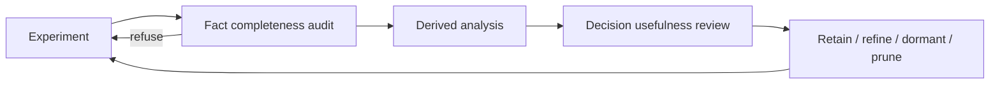

# Features and derived analysis: current meta and direction

This document integrates the Analyst's trajectory-intelligence review with the current repository audit. The core conclusion is direct:

> The 74-feature autonomous-research family is a coverage map, not 74 KPIs. Build the analysis and decision layer now; add or prune features only after repeated experiments show what changes a decision.

## 1. Five kinds of thing

Confusing these categories is how a valid verifier reward becomes an “error,” or an unavailable reward becomes `0`.

| Kind | Meaning | Example | Decision rule |
|---|---|---|---|
| **Raw fact** | Source-emitted observation, transcribed without interpretation | agent timeout, verifier completion, artifact digest, token count | Missing evidence is `null`, never `0` |
| **Derived feature** | Deterministic function of facts with explicit inputs and denominator | `valid_experiment_rate`, `budget_utilization_rate` | Zero opportunity makes a rate `null` |
| **Semantic hypothesis** | Human/model interpretation over a trajectory | diagnosis quality, hypothesis novelty | Descriptive until calibrated; never benchmark truth |
| **Benchmark outcome** | Value defined by the benchmark verifier | sealed reward, milestone score | Target/outcome, not a predictor of itself |
| **Decision feature** | Outcome plus enough authority and admissibility context to act | selected reward after regrade, bound transfer gap | Any unresolved binding causes refusal |

A universal “agent capability score” is not justified. Game2048 alone has raw visible scores and a normalized sealed reward that cannot be subtracted. If two axes inside one run are not arithmetically compatible, unrelated benchmark scores cannot be pooled without stronger bindings.

## 2. What “74 features” actually means

The inventory is now reconciled:

| Quantity | Count |
|---|---:|
| `AutonomousResearchFeatures` fields | 78 |
| Identity/provenance fields excluded from the feature count | 4 (`run_id`, `benchmark_family`, `source_digest`, `feature_digest`) |
| Governed autonomous-research features | **74** |
| Inventory entries | **74** |
| Autonomous-family denominator-policy debt | **0** |

`environment_setup_seconds` was the missing inventory entry and is now documented.

The larger registry currently has 240 feature definitions. The current governance audit reports:

| Registry condition | Count |
|---|---:|
| `verdict_coupling=correlates` | 71 |
| `defines` | 27 |
| `independent` | 40 |
| `not_applicable` | 27 |
| Coupling undeclared | 75 |
| Legacy denominator-policy debt | 73 |

The predictor audit is more actionable than the raw coupling distribution:

| Predictor-audit result | Count |
|---|---:|
| Eligible predictors | 109 |
| `MISSING_TEMPORAL_AVAILABILITY` | 72 |
| `NOT_APPLICABLE_FOR_PREDICTION` | 27 |
| `REWARD_DEFINITION_LEAKAGE` | 19 |
| `POST_VERDICT_TEMPORAL_VIOLATION` | 10 |
| `UNDECLARED_VERDICT_COUPLING` | 3 |

The autonomous family is substantially cleaner than the legacy registry. Its predictor refusals are explicit: four identity/not-applicable fields, three post-verdict fields, and one reward-defining field. Globally, the highest-leverage debt is temporal availability on 72 features, followed by 73 denominator-applicability declarations. Raw coupling is undeclared on 75 rows, but only three currently reach that refusal because earlier temporal gates already stop the others.

## 3. The 74-feature family by role

### 3.1 Core cross-benchmark primitives

Keep these regardless of benchmark because they define identity, opportunity and admissibility:

- source kind, version, record and immutable revision;
- task, verifier, metric-config and visible/hidden outcome-binding digests;
- score direction and validated scale binding;
- selected iteration and final artifact binding;
- iteration, measured-iteration, valid and invalid counts;
- elapsed budget, consumed budget, tokens and cost;
- explicit denominators for rates;
- artifact replay and reproducibility-evaluated counts.

### 3.2 Process dynamics

These become informative when a run has multiple comparable experiments:

- hypothesis turnover;
- regression, rollback and plateau streaks;
- first and best improvement iteration;
- late-improvement share;
- experiment throughput;
- changed bytes, tokens and cost per improvement;
- final-selection regret.

Do not over-read them at tiny opportunity counts. BBO has one selection decision, so regret `0` is largely structural, not evidence of excellent selection.

### 3.3 Dormant, benchmark-activated modules

A zero or null here usually identifies missing benchmark coverage, not a useless feature:

| Construct | Activated by |
|---|---|
| Milestone and rubric progression | PaperBench, AgentBoard-style subgoals, ToolSandbox milestones |
| Environment reconstruction and dependency repair | CORE-Bench and reproducibility tasks |
| Data integrity and contamination | MLE-bench and train/validation workflows |
| Memory/context continuity | LoCoMo and controlled-context-growth tasks |
| Fault-exposed recovery | ToolSandbox/ToolMaze-style controlled perturbations |

Dormant features should be retained with an activation map. Pruning them before running a benchmark that creates the opportunity would erase the programme's coverage plan.

### 3.4 Screening-only or currently weak features

Treat these as hypotheses until stability is measured:

- hypothesis novelty/turnover derived from text normalization;
- embedding-cluster identity;
- uncalibrated judge confidence;
- raw step count as capability;
- final-selection regret when fewer than two selection decisions exist;
- visible score without hidden-transfer or scale context.

## 4. What the pilots revealed

### 4.1 Status is a vector, not a scalar

Both RSI pilots hit the agent timeout while preserving useful artifacts.

| Axis | BBO | Game2048 |
|---|---|---|
| Agent | timed out | timed out |
| Original verifier | completed | reduced window expired |
| Preserved artifact | yes | yes |
| Authoritative outcome | reward `0.1814359803` | regrade reward `0.37800819` |

A single `error/success` column loses the evidence. The next analysis layer must resolve independent agent, verifier, artifact and authority axes.

### 4.2 A synthetic zero is not reward evidence

Game2048's original job summary exposed `0.0` after the verifier window expired. The verifier-only regrade later produced `0.37800819` with valid fraction `1.0`. The original zero must remain as superseded operational history and must never enter a reward mean.

### 4.3 Headline selection changes the conclusion

BBO contains baseline, anytime, selected and final visible scalars. The committed transfer gap binds to the selected artifact:

$$0.181436 - 0.204755 = -0.023319.$$

Using the final component instead would give approximately `-0.1308`, more than five times the magnitude. The analysis system must store which scalar is the headline rather than rely on a producer convention.

### 4.4 Selection is not reconstructible from logs alone

- BBO experiment-log coverage is `0.5`; the selected version is the unlogged version.
- Game2048 coverage is `0.8`; the submitted v5 was not written to the experiment log.

A selected artifact missing from the declared experiment history should be a validity refusal for method-improvement claims, not only a low coverage percentage.

### 4.5 Validation coverage is asymmetric

Game2048 v5 passed sealed replay but lacked a comparable full visible-suite score. Its visible final-selection regret correctly remains `null`. Analysis must separate:

- single-seed diagnostic;
- comparable visible-suite evaluation;
- selected-artifact replay;
- sealed evaluation;
- regrade evaluation.

## 5. Analysis-first roadmap

The answer to “should we focus on analysis now?” is **yes**.

The current measurements are sufficient to expose the important failures. What is missing is safe interpretation, authority resolution and operator visibility.

| Stage | Build | Acceptance behavior |
|---|---|---|
| **A. Governance cleanup** | Declare temporal availability on 72 features, denominator applicability on 73, and coupling on the three features that reach that refusal; namespace overlapping refusal enums | Predictor refusals fall to intentional not-applicable, leakage, and post-verdict exclusions |
| **B. Composite outcome resolver** | Agent, verifier, artifact and authority axes; first-class regrade lineage | Game2048 resolves to `0.37800819`, never synthetic `0.0` |
| **C. Headline binding** | Declare the selected scalar for every outcome axis | BBO names `selected`; alternatives remain visible |
| **D. Scale-binding gate** | Refuse arithmetic without exact task/verifier/metric/outcome digest parity | Game2048 transfer remains null with a reason |
| **E. Selection conformance** | Reconcile experiment log, versions and submitted artifact | Selected-unlogged artifacts refuse method claims |
| **F. Operator views** | Build the seven views below | No bespoke notebook is needed to interpret a run |
| **G. Thematic pilots** | Run one cheap benchmark slice per research theme | Dormant constructs acquire real opportunities |
| **H. Feature review** | Retain/refine/prune from repeated usefulness evidence | Every retained feature has a decision use or activation reason |

Do not add another large batch of features before stages B–F.

## 6. Operator analyses to build next

| View | Question answered | Refuses when |
|---|---|---|
| `v_composite_outcome_validity` | What happened on agent, verifier, artifact and authority axes? | Any axis unresolved |
| `v_reward_authority` | Which reward is authoritative and what did it supersede? | Zero or multiple live authorities |
| `v_headline_binding` | Which visible scalar defines the result? | No declared binding |
| `v_scale_binding_status` | May these axes be compared arithmetically? | Digest binding absent/mismatched |
| `v_selection_reconstructibility` | Does the experiment history contain the submitted artifact? | Selected version unlogged |
| `v_feature_activation_map` | Which constructs are populated, zero or dormant? | Null lacks denominator explanation |
| `v_predictor_eligibility` | Which features may be predictors? | Coupling or temporal availability undeclared |

Build `v_composite_outcome_validity` and `v_feature_activation_map` first. They answer the two immediate questions: “is this result usable?” and “are 74 features too many, or merely unexercised?”

## 7. Feature-governance loop

| Verdict | Required evidence |
|---|---|
| **Retain** | Changes a decision/gate or is a declared denominator |
| **Retain-dormant** | No benchmark has created the required opportunity yet |
| **Refine** | Populated but degenerate, unstable or poorly conditioned |
| **Prune** | Populated, non-degenerate and unused across at least three runs per benchmark |

At two RSI research runs, nothing qualifies for pruning. Absence of evidence of use is not evidence of uselessness.

## 8. Portfolio relationship

Features should follow three research themes rather than benchmark popularity:

1. autonomous research and improvement;
2. stateful tool use and recovery;
3. memory, context and continuity.

The benchmark plan is maintained in `research/analysis/thematic-benchmark-portfolio.md`. Each new benchmark must activate a missing construct or create a stronger controlled contrast. Otherwise it stays deferred or import-only.

## 9. Current risks

- Only two long-horizon research pilots exist, and both exhausted the agent budget.
- Clean-completion behavior is under-sampled.
- BBO and Game2048 evidence records have asymmetric findings depth.
- Hypothesis-key stability has not been perturbation-tested.
- Seventy-two registry features lack temporal-availability declarations, 73 lack denominator-applicability declarations, and three currently reach the undeclared-coupling refusal.
- Generic Harbor ingestion does not yet consume standalone verifier-regrade trial directories.

These are analysis and governance debts. They are a stronger reason to build the interpretation layer than to expand the raw feature count.
