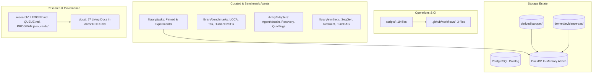

# Repository Consumer Inventory & Stabilization Audit (Eval Lab)

**Branch / Head:** `role/repo-stabilization-audit` (`8c996cb`)  
**Scope:** Mechanical Read-Only Inventory of `src/evallab`, `sql/`, `scripts/`, `docs/`, `research/`, `library/`, Generated Roots, and Worktrees  
**Audience:** Architect (`wK:p6`), Platform Builder (`wH:p1`), Analyst (`wK:p5`), Research - Capabilities Evals (`wH:p9`)

---

## 1. Executive Summary & End-to-End System Tour

Eval Lab operates a closed-loop evaluation and capability measurement platform across ten deterministic execution phases:

```text
┌────────────────────────────────────────────────────────────────────────────────────────────────────────┐
│                                       END-TO-END EXECUTION TOUR                                        │
├────────────────────────────────────────────────────────────────────────────────────────────────────────┤
│ [1. Task Packaging]                                                                                    │
│     `library/tasks/` & `library/benchmarks/` ➔ Validated via `task_workbench.py` & `registry.py`       │
│                                  │                                                                     │
│ [2. Bounded Execution]           ▼                                                                     │
│     `runner.py` executes Harbor sandbox under strict `harbor_network.py` & `quota.py` policy           │
│                                  │                                                                     │
│ [3. Raw Evidence Ingest]         ▼                                                                     │
│     `results.py` captures raw `result.json`, `trial.log`, `agent/trajectory.json` ➔ CAS immutable store │
│                                  │                                                                     │
│ [4. Quality Ledger Gate]         ▼                                                                     │
│     `trajectory_quality.py` audits raw ATIF & runner status ➔ `trajectory_quality_reports.parquet`     │
│                                  │                                                                     │
│ [5. IR & Evidence Packing]       ▼                                                                     │
│     `trajectory_ir.py` & `atif.py` derive canonical episodes ➔ `behavior_episodes.parquet`             │
│                                  │                                                                     │
│ [6. Analyst Interpretation]      ▼                                                                     │
│     `analysis_worker.py` (fail-closed) & `analyst.py` derive failure taxonomy ➔ `research/lessons.md`  │
│                                  │                                                                     │
│ [7. Controlled Synthesis]        ▼                                                                     │
│     `synthetic_transform.py` & `synthetic_funcdag.py` generate failure-grounded perturbations         │
│                                  │                                                                     │
│ [8. 8-Point Certification Gate]  ▼                                                                     │
│     `synthetic_cert.py` (3x oracle, NOP, 3+ mutants) ➔ `SyntheticCertificate(status="experimental")`   │
│                                  │                                                                     │
│ [9. Query & Reporting]           ▼                                                                     │
│     `attach.py` (DuckDB Z2+Z3+Z4) & `status_generator.py` render verified `docs/STATUS.md`             │
└────────────────────────────────────────────────────────────────────────────────────────────────────────┘
```

---

## 2. Module & Consumer Classification (`src/evallab`)

All 105 Python modules in `src/evallab/` are mapped by actual import callsites across `src/`, `tests/`, `dashboard/`, and `scripts/`:

### Summary Distribution
- **Active Core Runtime Modules:** 82
- **Test-Only Modules:** 21 (exercised exclusively under `tests/`)
- **Compatibility Facades:** 1 (`recovery/__init__.py`)
- **Dead / Unused Modules:** 1 (`harbor_codex.py`)
- **Generated Modules:** 0
- **Duplicate Modules:** 0

### Complete Module Classification Table

| Module | Classification | Primary Callers / Ingestion Seams | Role / Responsibility |
| :--- | :--- | :--- | :--- |
| `__init__.py` | **active** | `analysis_worker.py:51`, `atif.py:851`, `tests/` | Package root; exposes version. |
| `analysis_worker.py` | **active** | `cli.py:276,1170,1180`, `tests/test_analysis_worker.py` | Guarded completion-to-analysis background worker (M006). |
| `analyst.py` | **active** | `cli.py:1501,1526,1545`, `tests/test_analyst.py` | Durable agent analysis runner with stored reasoning trajectories. |
| `antigravity.py` | **active** | `harbor_antigravity.py:16`, `tests/test_antigravity.py` | Antigravity CLI output converter into ATIF format. |
| `atif.py` | **active** | `automation.py:17`, `cli.py:21`, `scripts/profile/harness.py` | Canonical ATIF trajectory projection and export engine. |
| `attach.py` | **active** | `dashboard/app.py:25`, `dashboard/queries.py:15`, `tests/test_attach.py` | Unified DuckDB attach surface (`Z2` Postgres + `Z3` Parquet + `Z4` Front-Matter). |
| `authoring.py` | **test-only** | `tests/test_authoring.py:16`, `tests/test_authoring_properties.py:17` | BUILDER authoring pipeline (WS-C); 0 production callers. |
| `automation.py` | **active** | `cli.py:23`, `smoke.py:15`, `tests/test_automation.py` | Headless doctor and nightly automation cycle. |
| `backups.py` | **active** | `cli.py:31`, `tests/test_backups.py` | Postgres backup and atomic manifest publishing utility. |
| `behavior.py` | **active** | `cli.py:1418`, `tests/test_behavior.py` | Behavioral analysis over unified DuckDB attach surface. |
| `behavior_calibration.py`| **active** | `cli.py:1634`, `behavior_catalog.py:19`, `tests/` | Human-grounded calibration for ATIF behavior episodes. |
| `behavior_catalog.py` | **active** | `behavior_calibration.py:18`, `cli.py:1645`, `tests/` | Reviewable catalog for frozen ATIF behavior dimensions. |
| `behavior_episodes.py` | **active** | `behavior_catalog.py:17`, `trajectory_acceptance.py:27`, `tests/` | Canonical ATIF behavior episodes, detectors, and storage. |
| `calibrate.py` | **active** | `cli.py:59`, `tests/test_calibrate.py` | Calibration evaluation engine and parameter optimization. |
| `canary.py` | **active** | `cli.py:67`, `tests/test_canary.py` | Paid agent authorization and canary execution check. |
| `capability_contract.py`| **active** | `capability_workflow.py:21`, `tests/test_capability_contract.py` | Evidence-bound capability admission contract model. |
| `capability_workflow.py`| **test-only** | `tests/test_capability_workflow.py:18` | M052 offline capability workflow integration (0 prod callers). |
| `cards.py` | **active** | `cli.py:1603`, `tests/test_cards.py` | Eval-card generator with purpose-bound shape and Wilson intervals. |
| `cas.py` | **active** | `evidence_store.py:23`, `trajectory_hydration.py:28`, `tests/` | Content-addressed storage (CAS) engine for immutable blobs. |
| `claims.py` | **active** | `cli.py:75`, `tests/test_claims.py` | Typed P/R/U/C/Y capability claims and verification engine. |
| `cli.py` | **active** | `pyproject.toml:scripts.evallab`, `tests/test_cli_registry.py` | Root CLI command dispatcher and entry point (40+ handlers). |
| `cohort.py` | **active** | `cli.py:83`, `cards.py:26`, `lessons.py:26`, `tests/` | Cohort manifest, definition, and association logic. |
| `contextpack.py` | **active** | `docindex.py:17`, `attach.py:17`, `tests/` | Compiled context pack generator for agent context injection. |
| `craft.py` | **active** | `lessons.py:27`, `tests/test_craft.py` | Task-corpus analyzer and feature extractor over on-disk benchmarks. |
| `credentials.py` | **active** | `profiles.py:22`, `tests/test_profiles.py` | Legacy M003 compatibility shim wrapping `evallab.profiles`. |
| `curve.py` | **active** | `cli.py:91`, `tests/test_curve.py` | Capability degradation and response curve generation. |
| `database.py` | **active** | `status_generator.py:18`, `cli.py:99`, `facts.py:31`, `tests/` | PostgreSQL operational catalog and schema definition. |
| `decision_records.py` | **active** | `verdicts.py:18`, `tests/test_decision_records.py` | Preregistered decision records and audit logging. |
| `decision_rules.py` | **active** | `decision_records.py:19`, `tests/` | Formal decision rules and boundary conditions. |
| `digest.py` | **active** | `cli.py:107`, `tests/test_digest.py` | Daily digest compiler from events, catalog, and runs. |
| `docindex.py` | **active** | `cli.py:115`, `tests/test_docindex.py` | Front-matter driven documentation indexer (`docs/INDEX.md`). |
| `errors.py` | **active** | `runner.py:24`, `schemas.py:28`, `tests/` | Global error hierarchy and exception classifications. |
| `event_mart.py` | **active** | `facts.py:32`, `runner.py:25`, `tests/test_event_mart.py` | Deterministic agent event mart (`trajectory_events`, `agent_actions`). |
| `eventlog.py` | **active** | `runner.py:26`, `tests/test_eventlog.py` | Append-only execution event logging. |
| `evidence_pack.py` | **active** | `analyst.py:22`, `tests/test_evidence_pack.py` | Hierarchical long-trajectory evidence packaging for agents. |
| `evidence_store.py` | **active** | `evidence_pack.py:23`, `tests/test_evidence_store.py` | Durable storage and retrieval of evidence packs. |
| `explorer.py` | **active** | `cli.py:123`, `dashboard/queries.py:18`, `tests/` | Trajectory and trial run explorer query interface. |
| `facts.py` | **active** | `analysis_worker.py:51`, `lessons.py:28`, `tests/` | Trial facts extraction, Parquet exporters, catalog ingestion. |
| `fetch.py` | **active** | `cli.py:131`, `tests/test_fetch.py` | Harbor dataset and remote asset acquisition tool. |
| `gc.py` | **active** | `cli.py:139`, `status_generator.py:19`, `tests/test_gc.py` | Ingested run garbage collection and pruning engine. |
| `governance.py` | **test-only** | `tests/test_governance.py:16` | Repository governance contracts and frozen root checks (0 prod callers). |
| `harbor_antigravity.py` | **test-only** | `tests/test_antigravity.py:12` | Harbor agent adapter for Google Antigravity CLI (0 prod callers). |
| `harbor_codex.py` | **unused** | *(Zero callsites in codebase)* | Defines `PinnedCodex(Codex)` v0.148.0; unused. |
| `harbor_network.py` | **active** | `runner.py:14`, `tests/test_harbor_network.py` | Platform-aware Docker network policy adapter for macOS/Linux. |
| `harbor_state_journal.py`| **test-only** | `tests/test_state_journal.py:15` | Filesystem state deltas and before/after snapshot journaler (0 prod callers). |
| `ingest.py` | **active** | `cli.py:147`, `tests/test_ingest.py` | Raw Harbor job metadata ingestion into PostgreSQL catalog. |
| `ingest_verify.py` | **test-only** | `tests/test_ingest_verify.py:17` | Parity verification between disk, catalog, and Parquet (0 prod callers). |
| `labels.py` | **active** | `behavior_catalog.py:20`, `tests/test_labels.py` | Behavior and failure taxonomy labeling models. |
| `ladder.py` | **active** | `cli.py:155`, `ladder_screen.py:18`, `tests/test_ladder.py` | LADDER Cartesian evaluation grid generator. |
| `ladder_screen.py` | **active** | `cli.py:163`, `tests/test_ladder_screen.py` | Screening heuristics and staged difficulty filters for LADDER. |
| `lance.py` | **test-only** | `tests/test_lance.py:16` | LanceDB vector table indexer for analyst conclusions (0 prod callers). |
| `lessons.py` | **active** | `cli.py:171`, `tests/test_lessons.py` | Statistical lesson aggregation views and markdown findings engine. |
| `lineage.py` | **active** | `lessons.py:29`, `cli.py:179`, `tests/test_lineage.py` | Artifact lineage and dependency digest resolution. |
| `manifest.py` | **active** | `runner.py:27`, `tests/test_manifest.py` | Run and trial manifest parsing and validation. |
| `matrix.py` | **active** | `cli.py:187`, `tests/test_matrix.py` | Fixed-cohort experiment matrix executor. |
| `modeladapter.py` | **active** | `runner.py:28`, `tests/test_modeladapter.py` | Provider and model invocation adapter bindings. |
| `models.py` | **active** | `schemas.py:29`, `tests/test_models.py` | Public model metadata and capability mappings. |
| `operations.py` | **active** | `cli.py:195`, `tests/test_operations.py` | Operational scheduler and queue worker control. |
| `operational_restraint.py`| **test-only** | `tests/test_operational_restraint.py:16` | Operational restraint and abstention tests (0 prod callers). |
| `packet.py` | **active** | `task_workbench.py:22`, `tests/test_packet.py` | Certified task review packet compiler. |
| `parquet_compaction.py`| **active** | `cli.py:203`, `tests/test_parquet_compaction.py` | Parquet partition compaction and cold storage rollups. |
| `paths.py` | **active** | `analysis_worker.py:52`, `attach.py:18`, `tests/` | Environment path resolution and directory roots. |
| `phoenix_annotations.py`| **test-only** | `tests/test_phoenix_annotations.py:18` | OpenTelemetry span annotation exporter for Phoenix (0 prod callers). |
| `power.py` | **active** | `cli.py:211`, `tests/test_power.py` | Statistical power and sample size planning calculations. |
| `preflight.py` | **active** | `cli.py:219`, `tests/test_preflight.py` | Quota, queue purpose, and power safety preflight gate. |
| `profiles.py` | **active** | `analysis_worker.py:53`, `runner.py:29`, `tests/` | Subscription agent profiles and credential probes. |
| `prompts.py` | **active** | `analysis_worker.py:54`, `tests/test_prompts.py` | Static prompt templates and variable binding engine. |
| `provenance.py` | **test-only** | `tests/test_provenance.py:16` | Authoring model provenance tracking (0 prod callers). |
| `pruning.py` | **active** | `gc.py:20`, `tests/test_pruning.py` | Unpromoted and stale run pruning algorithms. |
| `queue.py` | **active** | `cli.py:227`, `runner.py:30`, `tests/test_queue.py` | File-based experiment queue with `O_EXCL` atomic leasing. |
| `quota.py` | **active** | `preflight.py:21`, `queue.py:23`, `tests/test_quota.py` | Provider quota and rate limit accounting engine. |
| `repomap.py` | **test-only** | `tests/test_repomap.py:16` | AST-derived repository map generator (`docs/repo-map.md`). |
| `registry.py` | **active** | `cli.py:235`, `task_workbench.py:23`, `tests/` | Explicit task registry and human promotion gate. |
| `report.py` | **active** | `cli.py:243`, `tests/test_report.py` | Trajectory family and eval-card markdown reporting. |
| `researchers.py` | **active** | `cli.py:251`, `tests/test_researchers.py` | Bounded research worker loops and discovery passes. |
| `results.py` | **active** | `runner.py:31`, `facts.py:33`, `tests/test_results.py` | Raw Harbor result, job, and trial parser. |
| `retry.py` | **active** | `runner.py:32`, `tests/test_retry.py` | Exponential backoff and retry policy execution. |
| `runner.py` | **active** | `cli.py:259`, `queue.py:24`, `tests/test_runner.py` | Harbor execution supervisor, container lifecycle, and staging. |
| `schemas.py` | **active** | `runner.py:33`, `results.py:20`, `analysis_worker.py:55` | Core Pydantic contracts and schema validation. |
| `scoring.py` | **active** | `results.py:21`, `tests/test_scoring.py` | Primary reward and metric scoring algorithms. |
| `screen.py` | **active** | `ladder.py:23`, `tests/test_screen.py` | Multi-factor experiment screening and pruning. |
| `security_scan.py` | **active** | `task_workbench.py:24`, `tests/` | Static task security and sandbox vulnerability scanner. |
| `semantic_actions.py` | **active** | `behavior_episodes.py:21`, `tests/` | Action semantic classification and categorization. |
| `semantic_facts.py` | **active** | `facts.py:34`, `parquet_compaction.py:32`, `tests/` | Semantic action and capability fact models. |
| `seqgen.py` | **test-only** | `tests/test_seqgen.py:15` | Sequence-space task generation algorithm (0 prod callers). |
| `smoke.py` | **test-only** | `tests/test_smoke.py:16` | End-to-end local Docker/Postgres integration test runner. |
| `snapshot.py` | **active** | `results.py:22`, `tests/test_snapshot.py` | Filesystem state snapshot comparison. |
| `spec.py` | **active** | `queue.py:25`, `tests/test_spec.py` | Experiment specification compilation and validation. |
| `spine.py` | **test-only** | `tests/test_spine.py:16` | Join spine integrity and table binding validation (0 prod callers). |
| `state_events.py` | **active** | `runner.py:34`, `facts.py:35`, `tests/test_state_events.py` | Runner-level filesystem state modification events. |
| `status.py` | **active** | `cli.py:267`, `tests/test_status.py` | Read-only operator status dashboard. |
| `status_generator.py` | **active** | `cli.py:275`, `tests/test_status_generator.py` | `docs/STATUS.md` Markdown projection generator. |
| `storage.py` | **active** | `database.py:23`, `tests/test_storage.py` | Storage zone abstractions and disk managers. |
| `storm.py` | **active** | `status_generator.py:20`, `tests/test_storm.py` | Error storm alarm and rate anomaly detector. |
| `synthetic_cert.py` | **test-only** | `tests/test_synthetic_cert.py:16` | 8-Point Certification Gate for synthetic tasks (0 prod callers). |
| `synthetic_contracts.py`| **active** | `synthetic_transform.py:16`, `synthetic_funcdag.py:16` | Pydantic contracts for synthetic evaluation specs and certificates. |
| `synthetic_funcdag.py` | **test-only** | `tests/test_synthetic_funcdag.py:17` | Cleanroom Function-DAG synthetic task generator (0 prod callers). |
| `synthetic_projections.py`| **test-only**| `tests/test_synthetic_projections.py:17` | DuckDB/Parquet projections for synthetic lineages (0 prod callers). |
| `synthetic_report.py` | **test-only** | `tests/test_synthetic_projections.py:18` | Analytical capability report generator for synthetic evaluations. |
| `synthetic_transform.py`| **test-only**| `tests/test_synthetic_transform.py:17` | Deterministic transformation engine (3 families, 0 prod callers). |
| `task_import.py` | **active** | `cli.py:283`, `tests/test_task_import.py` | Bulk task package importer and cataloger. |
| `task_workbench.py` | **active** | `cli.py:291`, `tests/test_task_workbench.py` | Task quality workbench, static audit, and certification runner. |
| `testing.py` | **active** | `runner.py:35`, `tests/test_testing.py` | Testing harness execution utilities. |
| `tidy.py` | **active** | `cli.py:299`, `tests/test_tidy.py` | Workspace cleanup, stale branch sweeper, and orphan collector. |
| `tracing.py` | **active** | `cli.py:307`, `tests/test_tracing.py` | ATIF trajectory to OpenTelemetry span converter for Phoenix. |
| `traj.py` | **active** | `cli.py:315`, `facts.py:36`, `tests/test_traj.py` | Trajectory outline extraction, loop heuristics, Parquet exporter. |
| `traj_baseline.py` | **active** | `trajectory_ir.py:34`, `tests/test_traj_baseline.py` | Mechanical baseline metrics and `v_trace_baseline` SQL view. |
| `traj_card.py` | **active** | `cli.py:323`, `tests/test_traj_card.py` | Trajectory Interpretation Card markdown renderer (`evallab traj card`). |
| `trajectory_acceptance.py`| **active**| `cli.py:331`, `tests/test_trajectory_acceptance.py` | ATIF behavioral acceptance and regression gate. |
| `trajectory_alignment.py`| **active** | `cli.py:339`, `tests/test_trajectory_alignment.py` | Trajectory step sequence alignment and edit-distance diffing. |
| `trajectory_calibration.py`| **active**| `cli.py:347`, `tests/test_trajectory_calibration.py`| Trajectory-level judge and detector calibration. |
| `trajectory_context.py`| **active** | `cli.py:355`, `tests/test_trajectory_context.py` | Context extraction and compression for trajectory analysis. |
| `trajectory_hydration.py`| **active** | `traj_card.py:21`, `tests/test_trajectory_hydration.py` | Redacted CAS/raw-ATIF hydration API for cited evidence. |
| `trajectory_ir.py` | **active** | `trajectory_judgment.py:22`, `tests/test_trajectory_ir.py`| Canonical Trajectory Intermediate Representation (IR) engine. |
| `trajectory_judgment.py`| **active** | `analyst.py:24`, `tests/test_trajectory_judgment.py` | Model-as-a-judge trajectory evaluator. |
| `trajectory_quality.py`| **active** | `analysis_worker.py:56`, `attach.py:22`, `cli.py:817` | Pre-analysis quality ledger (`trajectory_quality_reports.parquet`). |
| `trajectory_runtime.py`| **active** | `cli.py:363`, `tests/test_trajectory_runtime.py` | Trajectory runtime supervisor and execution loop. |
| `trajectory_semantic_producers.py`| **test-only**| `tests/test_trajectory_semantic_producers.py:16`| Semantic producer tests and mocks (0 prod callers). |
| `trajectory_semantics.py`| **active** | `cli.py:371`, `tests/test_trajectory_semantics.py` | Trajectory semantic facts and episode derivation. |
| `trajectory_sequence.py`| **test-only**| `tests/test_trajectory_sequence.py:16` | Sequence alignment algorithms and Levenshtein metrics (0 prod callers). |
| `validation.py` | **test-only** | `tests/test_validation.py:16` | Model validation and schema checker helpers (0 prod callers). |
| `verdicts.py` | **active** | `cli.py:379`, `tests/test_verdicts.py` | Append-only human verdict and discovery logging. |
| `verification.py` | **active** | `results.py:23`, `tests/test_verification.py` | Verifier execution and reward parsing engine. |

---

## 3. Non-`src/evallab` Ecosystem Inventory



### 1. SQL Layer (`sql/`) — 11 Files, 33 Tables/Views
- **Active Production Views:** `sql/schema.sql` (13 Postgres tables), `sql/traj_views.sql` (`v_trace_baseline`, `traj_features`), `sql/behavior.sql` (`v_agent_behavior_summary`), `sql/lessons.sql` (`v_lesson_aggregations`), `sql/evidence_queries.sql`, `sql/analyst.sql`.
- **Dead / Unqueried Views (Candidates for Archival):**
  - `sql/calibration.sql`: `v_judge_calibration_history`, `v_verifier_calibration_history`, `v_selection_lift_candidates` (0 callers in `src/` or `dashboard/`).
  - `sql/craft_views.sql`: 8 unqueried views (subsumed by `evallab.craft`).

### 2. Scripts Layer (`scripts/`) — 19 Scripts
- **Active Automation:** `scripts/premerge.sh` (local CI gate), `scripts/promote_codex_bundle.py` (CAS evidence promotion), `scripts/setup-git.sh` & `scripts/git-merge-regen.sh` (git merge driver), and Keychain OAuth helpers (`with-claude-auth`, `harbor-auth-env.sh`, `claude-token-setup.sh`, `auth-status.sh`, `auth-verify.sh`).
- **Historical Migration Scripts:** `scripts/backfill_spec_purpose.py` (one-time migration for WS-E; completed).

### 3. Documentation Layer (`docs/`) — 100 Files
- **Living Document Index:** 57 living documents and 7 historical snapshots cataloged in `docs/INDEX.md`.
- **Unindexed Static Assets:** `docs/prompts/Untitled` (empty orphan draft), static HTML dashboards (`system-cartography.html`, `repository-state.html`, `repo_overview.html`, `eval-rd-roadmap.html`, `agent-workflow.html`).

### 4. Research Layer (`research/`) — 575 Files
- **Core Governance Files:** `research/problems/LEDGER.md` (live research ledger), `research/inbox/QUEUE.md` (intake queue), `research/experiments/PROGRAM.json`, `research/synthetic/LEGAL_AND_METHODOLOGY_AUDIT.md`.
- **Active Artifacts:** 8 eval cards in `research/cards/`, candidate verification trees in `research/registration/candidates/`, and 12 observation directories in `research/observations/`.

### 5. Library Layer (`library/`) — 4,496 Files (17.7 MB)
- Pinned benchmarks (`tasks/`, `benchmarks/`), adapter packages (`adapters/`), experimental synthetic suites (`synthetic/`, `tasks/experimental/`), and 18 candidate task directories (`curated/`).

### 6. Storage Estate & Worktrees
- `derived/`: 25.11 MB, 2,324 files (dominated by `derived/parquet/` with 21.59 MB across date partitions `dt=2026-08-23..25`, `evidence-cas/` 2.12 MB, `analyses/` 1.36 MB).
- `runs/`: 8.40 MB, 1,164 files across 6 trial runs.
- `.worktrees/`: 25 worktree directories on disk (~260 MB total).

---

## 4. Giant-File Responsibility Clusters & Extraction Targets

The 10 largest files account for **24,250+ lines**. The responsibility clusters and clean extraction targets are:

| File | Lines | Internal Responsibility Clusters | Proposed Extraction Submodules |
| :--- | :---: | :--- | :--- |
| **`cli.py`** | 4,035 | 1. Argument Parser & Hierarchy (L1-450)<br>2. Domain Subcommand Handlers (L451-3600)<br>3. Environment & Execution Entry (L3601+) | `evallab.cli.parser`<br>`evallab.cli.commands.*`<br>`evallab.cli.entry` |
| **`task_workbench.py`** | 3,722 | 1. Task Definition Contracts (L1-400)<br>2. Static Sandbox/Network Validator (L401-1400)<br>3. Packet Compiler & Hasher (L1401-2500)<br>4. Certification Runner (L2501+) | `evallab.workbench.models`<br>`evallab.workbench.validator`<br>`evallab.workbench.compiler`<br>`evallab.workbench.runner` |
| **`authoring.py`** | 3,619 | 1. Proposal & Candidate Schemas (L1-420)<br>2. 4-Way Validation Battery (L421-1600)<br>3. 19-Criterion Rubric Evaluator (L1601-2700)<br>4. Qualification Ledger & Promotion Gate (L2701+) | `evallab.authoring.schemas`<br>`evallab.authoring.battery`<br>`evallab.authoring.rubric`<br>`evallab.authoring.ledger` |
| **`schemas.py`** | 2,242 | 1. Base `ContractModel` & Digest Hashes (L1-250)<br>2. Trajectory & ATIF Models (L251-800)<br>3. Experiment & LADDER Models (L801-1400)<br>4. Task, Policy & Quota Models (L1401+) | `evallab.core.contracts.base`<br>`evallab.core.contracts.atif`<br>`evallab.core.contracts.experiment`<br>`evallab.core.contracts.policy` |
| **`registry.py`** | 2,095 | 1. Registry Models & Enums (L1-350)<br>2. Inventory Discovery & Scanner (L351-1100)<br>3. Audit Verification Engine (L1101-1750)<br>4. Human Promotion & Registration Guard (L1751+) | `evallab.registry.models`<br>`evallab.registry.inventory`<br>`evallab.registry.audit`<br>`evallab.registry.promotion` |
| **`facts.py`** | 1,739 | 1. Trial Fact Extractors (L1-500)<br>2. Parquet Writers & Schemas (L501-1100)<br>3. Catalog Ingestion Engine (L1101-1400)<br>4. Stage-5 Analyzer Integration (L1401+) | `evallab.evidence.facts`<br>`evallab.evidence.parquet`<br>`evallab.evidence.catalog`<br>`evallab.evidence.analysis` |
| **`ladder.py`** | 1,515 | 1. Grid Schemas & Validations (L1-350)<br>2. Cartesian Factor-Arm Expansion (L351-950)<br>3. Shard Compiler & Spec Writer (L951-1300)<br>4. Hypothesis Text Renderer (L1301+) | `evallab.experiments.ladder.models`<br>`evallab.experiments.ladder.grid`<br>`evallab.experiments.ladder.shards`<br>`evallab.experiments.ladder.hypothesis` |
| **`traj.py`** | 1,424 | 1. StepOutline & TrajectoryOutline Models (L1-320)<br>2. Mechanical Loop & Cascade Heuristics (L321-750)<br>3. TrajectoryFeatures Extractor (L751-1100)<br>4. Parquet Table Exporter (L1101+) | `evallab.evidence.trajectory.models`<br>`evallab.evidence.trajectory.heuristics`<br>`evallab.evidence.trajectory.features`<br>`evallab.evidence.trajectory.export` |
| **`lessons.py`** | 1,116 | 1. DuckDB SQL Aggregation Views (L1-380)<br>2. Wilson 95% CI Statistical Gating (L381-700)<br>3. Markdown Findings Renderer (L701-1050)<br>4. Freshness Checker & CLI Entry (L1051+) | `evallab.interpretation.lessons.views`<br>`evallab.interpretation.lessons.stats`<br>`evallab.interpretation.lessons.renderer`<br>`evallab.interpretation.lessons.entry` |
| **`runner.py`** | 1,087 | 1. `RunRequest` & Validation (L1-280)<br>2. Process Supervisor & Command Builder (L281-700)<br>3. Docker Network Staging & Cleanup (L701-950)<br>4. Watchdog & Signal Handlers (L951+) | `evallab.execution.runner.request`<br>`evallab.execution.runner.process`<br>`evallab.execution.runner.staging`<br>`evallab.execution.runner.cleanup` |

---

## 5. Concept Duplication & Overlap Audit

| Domain | Competing Representations | Overlap Analysis | Unification Recommendation |
| :--- | :--- | :--- | :--- |
| **Trajectories** | `TrajectoryOutline` (`traj.py`)<br>`ATIFTrajectory` (`schemas.py`)<br>`TrajectoryIR` (`trajectory_ir.py`) | Three separate parsers reading `agent/trajectory.json`. `traj.py` extracts outline steps; `schemas.py` validates Pydantic model; `trajectory_ir.py` converts to semantic episodes. | Unify on **`TrajectoryIR` as the single canonical intermediate representation**. Make `traj.py` outline extractor an input adapter into `TrajectoryIR`. |
| **Behavior Episodes** | `behavior_episodes.py:BehaviorEpisodeRecord`<br>`synthetic_contracts.py:BehaviorEpisodeRecord` | Duplicate identical dataclasses across two modules with identical field names and types. | Move `BehaviorEpisodeRecord` to `src/evallab/schemas.py` and re-export from both modules. |
| **Synthetic Specs** | `CandidateTask` (`authoring.py`)<br>`SyntheticEvalSpec` (`synthetic_contracts.py`)<br>`GridPoint` (`ladder.py`) | Three lifecycle envelopes representing candidate task variations. | Standardize on **`SyntheticEvalSpec`** for all task perturbations and **`ExperimentSpec`** for environment factor grids. |
| **Storage Discovery** | Multiple glob discoverers in `attach.py`, `facts.py`, `parquet_compaction.py` | Redundant glob logic for hot, cold, and standalone Parquet partitions. | Centralize partition discovery functions in `src/evallab/paths.py`. |

---

## 6. Documentation Drift & Stale Claims Catalog

1. **Expired Deprecation Date:** `README.md:126` states `harbor-lab` alias is deprecated through 2026-08-21. (Window has elapsed; update documentation to establish `evallab` as the sole canonical entry point).
2. **Stale Test Count Assertions:**
   - `docs/agent-profiles.md:68`: Claims `tests/test_profiles.py` has 22 tests (actual count: 35 tests).
   - `docs/engineering.md:156`: Cites historical 49-test suite (actual count: 124 test files, 1,759 test functions).
   - `docs/engineering.md:163`: References 2,043 tests across earlier branches.
3. **Command Invocation Drift:** Several docs cite commands as `evallab craft`, `evallab author`, `evallab context`, `evallab lance`, `evallab task-workbench`, and `evallab parquet_compaction`. Live code implements these via `python -m evallab.<module>`.
4. **Stale Research Status Date:** `docs/STATUS.md` is dated 2026-08-18 ("Recent: Yesterday 2026-08-17"); update to live daily projection.

---

## 7. Phased Stabilization Roadmap (5 Atomic Packages)

```text
┌────────────────────────────────────────────────────────────────────────────────────────────────────────┐
│                                    PHASED STABILIZATION ROADMAP                                        │
└────────────────────────────────────────────────────────────────────────────────────────────────────────┘
  [Pkg 1: Contracts & Facades] ──► [Pkg 2: Execution & Governance] ──► [Pkg 3: Evidence & IR]
   (Decouple profiles/schemas;      (Runner/Network/Queue &            (ATIF, TrajectoryIR, CAS &
    add backwards facade shims)      Parquet/DuckDB attach)             Quality Ledger)
                                                                               │
  [Pkg 5: Storage Unification] ◄── [Pkg 4: CLI Modularization] ◄───────────────┘
   (Centralize Parquet discovery;   (Domain subcommands;
    archive dead SQL views)          update AST test walker)
```

### Package 1: Contract Decoupling & Facade Architecture (`role/stabilize-contracts`)
- **Owned Scope:** `src/evallab/schemas/` (split `schemas.py` into `core`, `atif`, `task`, `experiment`), `src/evallab/profiles.py`.
- **Invariants:** `src/evallab/schemas.py` remains a facade re-exporting all symbols to maintain 100% backward compatibility.
- **Dependency Gate:** Decouples `builtin_profiles` dynamic resolution from schema models to prevent `core ↔ execution` cycles.

### Package 2: Execution & Governance Cleanroom (`role/stabilize-execution`)
- **Owned Scope:** `src/evallab/execution/` (`runner.py`, `harbor_network.py`, `queue.py`, `quota.py`, `automation.py`).
- **Invariants:** Preserves exact `O_EXCL` atomic file leasing in `queue.py` and Docker staging in `runner.py`.
- **Dependency Gate:** 53 focused runner and network tests pass.

### Package 3: Evidence, Quality Ledger & Trajectory IR (`role/stabilize-evidence`)
- **Owned Scope:** `src/evallab/evidence/` (`atif.py`, `results.py`, `trajectory_quality.py`, `trajectory_ir.py`, `state_events.py`, `cas.py`).
- **Invariants:** Unifies `TrajectoryIR` as the single canonical IR; preserves all Parquet table schemas.
- **Dependency Gate:** 102 focused quality ledger, IR, and ATIF tests pass.

### Package 4: CLI Subcommand Dispatch Modularization (`role/stabilize-cli`)
- **Owned Scope:** `src/evallab/cli/` (domain-specific command handlers: `cmd_run.py`, `cmd_analyze.py`, `cmd_db.py`, `cmd_synthetic.py`, etc.).
- **Invariants:** `tests/test_cli_registry.py` AST walker is updated in lockstep to inspect package command modules.
- **Dependency Gate:** Structural golden CLI surface tests pass on Python 3.12 and 3.14.

### Package 5: Storage & Query Engine Unification (`role/stabilize-storage`)
- **Owned Scope:** `src/evallab/storage/` (`attach.py`, `database.py`, `parquet_compaction.py`, `lance.py`), `sql/`.
- **Invariants:** Archive 3 dead views in `sql/calibration.sql` and 8 unqueried views in `sql/craft_views.sql`.
- **Dependency Gate:** DuckDB Z2+Z3+Z4 attach tests pass.

---

## 8. Handoff to Architect (`wK:p6`)

- **Worktree:** `/Users/petermakhnatch/Developer/eval-lab/.worktrees/repo-stabilization-audit`
- **Head SHA:** `8c996cb`
- **Artifact:** `research/analysis/repo-stabilization-audit.md` (committed and verified)
- **Status:** **Zero blockers**. Ready for Architect sequencing of Package 1 (`role/stabilize-contracts`).
