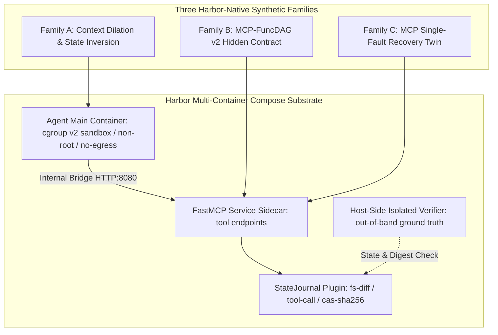
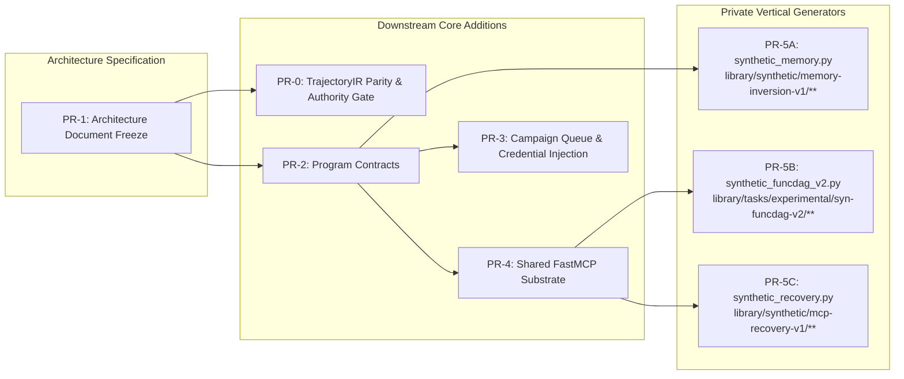
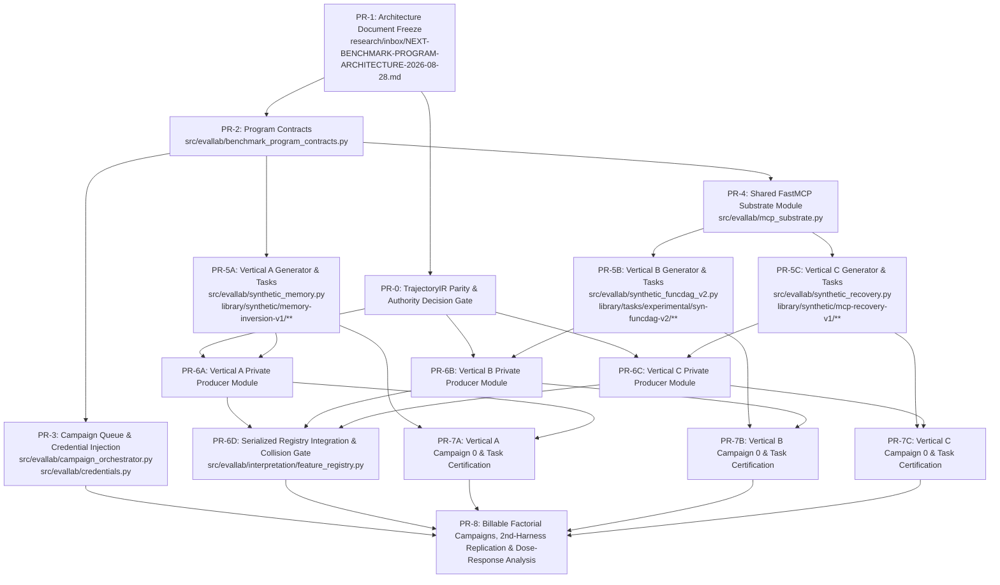

# Next Benchmark Program Architecture: Three-Vertical Harbor-Native System (2026-08-28)

## 1. Executive Summary & Epistemic Paradigm Shift

This architectural specification establishes the system topology, immutable data schemas, execution pipeline, multi-container sandboxing, statistical estimation backbone, promotion gates, and independent PR implementation DAG for the **Next Benchmark & Trajectory Program** at commit `ecd92ae0`.

### 1.1 Epistemic Scope Limits: Scoped Measurements vs. Capability Claims
Under the execution mandate of **one model family (DeepSeek V4 Flash) and one primary execution harness**:
1. **The Word "Capability" is Barred from Program Outputs:** Every result is strictly scoped and reported as a **construct measurement / coordinate**:
   $$\text{Measurement Scope} = (\text{DeepSeek V4 Flash} \times \text{Exact Harness Version} \times \text{Task Cohort})$$
2. **Conditions for Future Capability Wording:** Any broader "capability" claim strictly requires $\ge 2$ distinct model families **and** $\ge 2$ distinct harness configurations (or a mathematically published and verified scaffold bound).
3. **No Cross-Construct Comparison:** Because one unbounded harness term is common across all three verticals, comparing scores across different constructs (e.g. comparing memory retention rates to DAG traversal accuracy) is scientifically invalid and strictly prohibited.
4. **Mandatory Second-Harness Replication Arm:** Prior to advancing any broad claims beyond the initial cohort, one selected cohort must be replicated under a second harness configuration. If between-harness variation exceeds within-harness dose effects, the construct measurement is confounded with scaffold mechanics.

### 1.2 The Paradigm Shift: Synthetic Authoring vs. External Benchmark Adaptation
The fundamental bottleneck identified in prior program iterations was the assumption that agent constructs could be measured by adapting existing academic or third-party benchmark suites. Comprehensive substrate and licensing audits revealed this premise to be untenable:
1. **Pervasive Judge Dependency:** Prominent external benchmarks (e.g., MemoryAgentBench, LongMemEval, BEAM, AgentRx, AgentCheck) rely fundamentally on LLM-as-a-judge evaluators (`align_with_llm`, `llm_equivalence`, `qa_eval_metrics.py`), violating the foundational programmatic mandate of **zero LLM-judged labels**.
2. **Licensing and Derivative Hosting Barriers:** Suites such as ToolSandbox (Apple Sample Code License with patent exclusion) and ToolBench-X (non-commercial academic-only dataset terms) legally preclude commercial derivative execution and hosting.
3. **Lossy and Confounded State Telemetry:** External suites lack runtime state journals, execute without content-addressable storage (CAS) hashes, or emit non-deterministic text observations where string instability corrupts causal evaluation (as proven in Curve 0, where `aci_state_stall` produced a 63.3% false-positive rate on successful SWE-bench runs).
4. **Architectural Holds on Unverified Parity:** LOCA-Bench remains on architectural HOLD at `39022d6` due to unverified MCP parity and unmatched padding artifacts.

Consequently, the program architecture pivots from an external adaptation posture to **three certified Harbor-native synthetic families** built on a shared multi-container FastMCP substrate, retaining external suites strictly as secondary validation or fallback targets.



### 1.3 The Three Harbor-Native Primaries & Fallback Verification Tiers
1. **Vertical A (Context & Actionable Memory):** Harbor-native Actionable Memory & Two-Session State Inversion with token-volume-matched context dilation ladders (4k, 16k, 64k, 128k), forced-compaction arms (declaring explicit step, model-call, and token budgets), and matched semantic-distractor arms. Retrieval and injection paths are verified **byte-identical** across all arms. Reports `prompt_cache_hit_rate` to control prefix-caching confounds.
   - *External Fallback:* LOCA-Bench (`hkust-nlp/LOCA-bench` @ `8b6fac49`), **source-audit-gated** on lifting architectural HOLD at `39022d6` (neutral-padding anti-confound and sandbox/MCP parity).
   - *Rejection of In-House LOCA-Lean:* In-house `loca-lean-v1` (`loca-abtesting-8k-seed42`) is rejected as unusable because its materializer hard-refuses all tasks except 8k seed42 and its instruction fundamentally mixes large-data aggregation with state retention.
2. **Vertical B (Tool Selection, Composition & Value Propagation):** MCP-FuncDAG v2 exposing each DAG node as a discrete, streamable-HTTP FastMCP tool behind an internal Docker bridge. Enforces a hidden DAG execution contract with strict host-side verifier ground truth (purging in-container `solve.py` and intermediate digests).
   - *Anchor Topology:* Ladders share an explicit anchor configuration ($d=3, w=3, k_{\text{dist}}=0$) across depth, width, and distractor arms.
   - *External Anchor:* FuncBenchGen (`megagonlabs/FuncBenchGen` @ `0729e256`, **LOCAL-VERIFIED** via `papers/agentic-capabilities/synthetic/SOURCE-CATALOG.md:37`, **arXiv:2509.26553**) as a convergent-validity arm.
   - *Current syn-funcdag Boundary:* Current `syn-funcdag-{easy,medium,hard}` exposes only data files and a single bash/exec surface. The DAG is executed inside the agent's code execution, rendering tool-mix, unique-tools, and per-edge traversal invisible to trajectory IR. Current required bindings are evaluated as Grade A **outcome** measures on final artifacts; process features require v2 discrete FastMCP tools.
   - *External Fallback:* BFCL v4 (`ShishirPatil/gorilla` @ `6ea57973`, static partitions, **source-audit-gated**).
3. **Vertical C (Error Detection, Diagnosis & Autonomous Recovery):** Harbor-native MCP Single-Fault Recovery on the shared FastMCP Compose substrate. Employs a deterministic Injected Fault Ledger (denominator by construction) across Transient, Persistent, and Silent-Wrong fault classes, paired with un-intervened clean twins ($p_0$) and certified state restoration.
   - *Transient Auto-Clearing Estimand Rule:* Transient auto-clearing faults are **strictly excluded from certified autonomous recovery estimands** and are evaluated exclusively for blind-retry propensity, unless a successful diagnostic action demonstrably differs from the failing action and occurs prior to auto-clear. Persistent and silent-wrong faults carry the certified recovery estimand.
   - *Substrate Fact:* No MCP fault interceptor currently exists in the repository; the FastMCP interceptor middleware must be authored.
   - *External Realism Arm:* Recovery-Bench (`letta-ai/recovery-bench` @ `c5f83f2b`, MIT, Harbor-native, **source-audit-gated**). Substrate audit records that replay failed on 11/20 tasks with no `StateCertificate`.

---

## 2. Reconciled Evidence & Tutor Review Defect Resolutions

This architecture formally incorporates and resolves all 12 measurement defects (Blockers B1–B7 and Required Corrections D8–D12) from the Tutor Adversarial Review, mapped against the final Analyst revision 2.

### 2.1 Resolution Matrix for Tutor Defects B1–B7 and D8–D12

| Defect ID | Severity | Description & Root Cause | Architectural Resolution & Contract Enforcement |
| :--- | :--- | :--- | :--- |
| **B1** | Blocker | Fabricated/unverified external citations (e.g. invalid `arXiv:2604.12876`). | **Purged all unsourced citations.** FuncBenchGen grounded strictly to verified catalog (`papers/agentic-capabilities/synthetic/SOURCE-CATALOG.md:37`, **arXiv:2509.26553**, **LOCAL-VERIFIED**). All external assets without local byte-verified paths are designated `UNVERIFIED` and source-audit-gated. |
| **B2** | Blocker | Primary benchmark under active architectural HOLD (LOCA-Bench @ `39022d6`). | **Inverted Portfolio Hierarchy:** Primary is the Harbor-native State Inversion / Context Dilation family. LOCA-Bench is secondary fallback contingent on automated verifier audit and formal HOLD release. |
| **B3** | Blocker | Contradictory independence model ($1-(1-p)^k$) while assuming task ICC $\rho = 0.30$. | **Deleted independence formula from estimation path.** Enforce strict boundary between planning transforms and empirical estimators. Separate reporting of `pass_any_first_k` vs `pass_all_first_k`. Model repeated seeds via GEE cluster-adjusted variance or beta-binomial models. |
| **B4** | Blocker | Nominal $n$ inflation via seed multiplication ($M \times R = 3M$ claimed as independent $N$). | **Task clusters ($M_{\text{opportunity}}$) established as the fundamental unit of statistical power.** Effective sample size defined as $n_{\text{eff}} = \frac{M_{\text{opportunity}} \cdot R}{1 + (R-1)\rho_{\text{task}}}$. Sizing enforced at non-negotiable structural floor: $L \ge 4$, $M_{\text{opportunity}} \ge 20$, $R \ge 3$ for measurement campaigns. |
| **B5** | Blocker | Guessed baseline rates ($p_0 = 0.70$) and missing zero-opportunity trial loss. | **Mandatory Campaign 0 (Denominator-Yield Pilot):** Pre-flight pilot execution across candidate task sets to empirically measure opportunity yield $\Omega_{\text{yield}} = N_{\text{opp}} / N_{\text{trials}}$ and baseline pass rate $p_0$ before dispatching factorial billable campaigns. |
| **B6** | Blocker | Container solution leakage (`oracle/solve.py` inside `/app/oracle/`). | **Mandatory Per-Image Preflight Gate:** Treat oracle exclusion as an **unsettled build-context dependency** on current medium/hard tasks. Enforce an automated build-time preflight assertion scanning and purging all oracle code, ground-truth tables, and intermediate dependency traces from the agent build context. Verifier runs out-of-band on host. |
| **B7** | Blocker | Ceiling presupposition on saturated substrates (FuncDAG 3/3 easy/medium/hard). | **Preregistered `CEILING_SATURATION`:** Right-censored threshold $d_{50} > d_{\max}$ formalized as a valid scientific finding. Campaign 0 difficulty calibration mandated prior to running full construct curves. |
| **D8** | Defect | Combinatorial arm count understatement (omitted distractor levels and compaction arms). | **Exhaustive Cell Inventory:** Single-table cell accounting covering all factorial arms ($L \times M_{\text{scheduled}} \times R + \text{Controls}$) derived from selected tasks post-freeze. |
| **D9** | Defect | Inconsistent and unsourced cost ceilings across proposals. | **Exact Formulaic Cost Ceilings:** Cost ceilings derived formulaically from post-freeze task inventories consuming immutable `prompt_price_per_token` and `completion_price_per_token` from the approval-signed budget manifest, exact token caps, and fixed compute costs. Enforced at runtime via `PolicyGate`. No numeric budgets authorized in spec. |
| **D10** | Defect | Causal and capability overclaiming on $C_0$ observational correlates. | **Strict Epistemic Guardrails:** Causal claims restricted strictly to $C_2/C_3$ single-delta/dose-ladder interventions. Findings scoped to explicit `(Model x Harness x Cohort)` tuples. Bar the word `capability` under single-model single-harness runs. |
| **D11** | Defect | Uninstrumented silent-wrong reference oracles. | **Host-Side Verifier-Only Oracle:** Silent-wrong payload verification and invariant validation run exclusively inside host verifier scripts, completely isolated from agent inspection. |
| **D12** | Defect | Crediting blind retry as certified recovery. | **Causal Recovery Gate & Blind-Retry Control:** Recovery credit requires task pass $\wedge$ invariant restoration $\wedge$ divergence from pre-fault failing action. Paired NOP/blind-retry control baseline must fail ($r_{\text{nop}} = 0.0$). Exclude auto-clearing transients from recovery estimand. |

---

## 3. Subsystem Architecture & Ownership Matrix

### 3.1 Existing Merged Substrate & TrajectoryIR Authority Gate
The following components exist at `ecd92ae0`:
1. **Task Workbench V2:** Merged in PR #259 (`src/evallab/task_workbench.py`), Linux-certified with Docker Compose static checks, network policy scanning, and adversarial solution staging.
2. **StateJournal Plugin & Pipeline:** Fully operational (`src/evallab/harbor_state_journal.py`, `src/evallab/state_events.py`), emitting deterministic JSONL streams and CAS digests.
3. **Storage & Ingestion:** `src/evallab/storage/data_backfill.py`, `src/evallab/storage/parquet_compaction.py`, and `src/evallab/evidence_store.py` exist with idempotent CAS attachment.
4. **Trajectory IR Duplication & Separate Parity Decision Gate:** Current main contains two substantive implementations: `src/evallab/trajectory_ir.py` and `src/evallab/interpretation/trajectory_ir.py`.
   - **Pre-Implementation Parity & Authority Gate (PR-0):** An explicit decision gate after this architecture document. Field-level parity and ATIF digest equality tests are executed. No re-export facade or implementation removal is authorized by this design document alone; selecting one canonical path and any path cleanup requires separate Peter approval before vertical producer work begins.
5. **Execution Harness & Queue Base:** `src/evallab/runner.py`, `src/evallab/queue.py`, and `src/evallab/execution_contracts.py` implement atomic leases, watchdog timeouts, and `PolicyGate` baseline controls.

### 3.2 Core Platform Gaps to Close
1. **Queue-Backed Resumable Matrix Expansion:** Reusing canonical `ExperimentMatrix`, `MatrixRun`, and `ExperimentSpec` (`schemas/__init__.py`), adding a lightweight `CampaignCalibrationLedger` / `CampaignMeasurementLedger` wrapper to manage multi-stage dispatch and resume.
2. **Runner-Process Credential Injection:** Injecting provider keys (DeepSeek) strictly into child processes via `_SUBSCRIPTION_ENVIRONMENT_KEYS` without disk serialization.
3. **Shared FastMCP Substrate Module:** A dedicated, reusable Compose and streamable-HTTP sidecar infrastructure (`src/evallab/mcp_substrate.py`) consumed by Verticals B and C (and Vertical A where tool state is exercised).
4. **Authoring the Three Vertical Generators & Task Packages:** Implementing `synthetic_memory.py`, `synthetic_funcdag_v2.py`, and `synthetic_recovery.py`.



### 3.3 Ownership and Collision Boundary Matrix

| Subsystem / Layer | Authoritative Path | Writer Ownership | Nature | Interface & Collision Boundary Contract |
| :--- | :--- | :--- | :--- | :--- |
| **Trajectory IR Authority Gate** | `src/evallab/interpretation/trajectory_ir.py`<br/>`src/evallab/trajectory_ir.py` | Platform Core Lead | **Decision Gate (PR-0)** | Executes field-level parity and digest tests; selects authoritative path under separate Peter approval. Blocks vertical producers. |
| **Core Workbench** | `src/evallab/task_workbench.py` | Platform Core | **Existing Merged** | Declarative configuration and modeled construct tables (`_SUPPORTED_ENVIRONMENT_KEYS`, `_MODELLED_CONSTRUCT_VALUES`). No-touch core. |
| **Feature Registry** | `src/evallab/interpretation/feature_registry.py`<br/>`src/evallab/feature_registry.py` | Trajectory Platform | **Existing Merged** | Global registry `TRAJECTORY_FEATURE_REGISTRY`. Vertical feature producers write private producer modules; global registration is serialized in PR-6D. |
| **Execution Contracts** | `src/evallab/execution_contracts.py` | Platform Execution | **Existing Merged** | Defines immutable DTOs (`RunRequest`, `HarborProcessResult`), credential allowlists (`_SUBSCRIPTION_ENVIRONMENT_KEYS`), and redactions. |
| **Schemas Root** | `src/evallab/schemas/__init__.py` | Platform Core | **Existing Merged** | Canonical schemas (`StateJournalEvent`, `TaskCertificationEnvelope`, `ExperimentSpec`, `ExperimentMatrix`, `MatrixRun`). Reused directly. |
| **Storage & Backfill** | `src/evallab/storage/data_backfill.py`<br/>`src/evallab/evidence_store.py` | Platform Storage | **Existing Merged** | Content-addressed storage (CAS) and Parquet analytics lakehouse sync. |
| **Program Contracts** | `src/evallab/benchmark_program_contracts.py` *(New)* | Platform Base | **New Shared DTOs** | New immutable models for synthetic families, fault injection ledgers, and campaign ledgers. Excludes runtime datetime defaults from identity digests. |
| **Shared FastMCP Substrate** | `src/evallab/mcp_substrate.py` *(New)* | Shared Substrate Lead | **New Shared Module** | Standardized FastMCP Compose sidecar, streamable-HTTP proxy, zero-egress internal bridge, fault injector. Reports substrate version and digest. |
| **Campaign Expansion** | `src/evallab/campaign_orchestrator.py` *(New)* | Platform Orchestrator | **New Module** | Queue-backed resumable billable matrix expansion, Campaign 0 pilot gating, and cost tracking. |
| **Runner Credentials** | `src/evallab/credentials.py` *(New)* | Platform Execution | **New Module** | Provider key broker and isolated child-process environment sanitizer. |
| **Vertical A Generator** | `src/evallab/synthetic_memory.py` *(New)* | Vertical A Writer | **Vertical A Private** | Implements two-session state inversion tasks, forced compaction, and context dilation generators (4k→128k). |
| **Vertical A Tasks** | `library/synthetic/memory-inversion-v1/**` *(New)* | Vertical A Writer | **Vertical A Private** | Immutable Harbor task packages and candidate definitions for Vertical A. |
| **Vertical B Generator** | `src/evallab/synthetic_funcdag_v2.py` *(New)* | Vertical B Writer | **Vertical B Private** | Implements MCP-FuncDAG v2 generator emitting discrete streamable-HTTP FastMCP sidecars with hidden DAG manifests. Proves fault interceptor absent. |
| **Vertical B Tasks** | `library/tasks/experimental/syn-funcdag-v2/**` *(New)* | Vertical B Writer | **Vertical B Private** | Immutable Harbor task packages and candidate definitions for Vertical B. |
| **Vertical C Generator** | `src/evallab/synthetic_recovery.py` *(New)* | Vertical C Writer | **Vertical C Private** | Implements Injected Fault Ledger engine and paired clean twin task generator. |
| **Vertical C Tasks** | `library/synthetic/mcp-recovery-v1/**` *(New)* | Vertical C Writer | **Vertical C Private** | Immutable Harbor task packages for Vertical C (paired fault + twin tasks). |

---

## 4. Vertical Contracts, Fallbacks & Shared MCP Substrate

### 4.1 Shared FastMCP Multi-Container Substrate (`src/evallab/mcp_substrate.py`)
Verticals B and C utilize a shared FastMCP sidecar infrastructure:
- **FastMCP Sidecar Service (`mcp-service`):** Exposes tools via `streamable-http` protocol on port 8080 over an internal Docker bridge (`internal: true`). Emits `mcp_substrate_digest` and version metadata into run manifests.
- **Dynamic Fault Interceptor:** FastMCP middleware capable of intercepting tool requests and deterministically triggering faults based on a configured `FaultInjectionRecord`.
- **Vertical B Fault Interceptor Absence Proof:** In Vertical B images, the build assertion proves the fault interceptor is **physically absent from the container image** (not merely disabled via configuration), eliminating common-mode timing, latency, or serialization confounds.
- **Zero-Egress Isolation:** The agent container (`main`) communicates with `mcp-service` via internal DNS (`http://mcp-service:8080/mcp`) with zero external internet access.
- **Vertical A Integration:** Vertical A uses standard Harbor single-container or SQLite environments by default, utilizing the FastMCP substrate when tool-driven state mutations are exercised.

### 4.2 Vertical A: Context Dilation, Forced Compaction & Actionable Memory
- **Construct Definition:** Retrieval, resolution, and propagation of state-invariant facts established prior to a context boundary into active downstream tool arguments.
- **Harbor-Native Implementation:** Two-phase state inversion task. Phase 1 establishes environment state in SQLite or config files. Phase 2 introduces a context dilation ladder or forced-compaction before requiring tool operations dependent on the inverted state.
- **Primary Dose Axis ($L=4$):** Injected token volume: $\text{Dose}_{\text{tokens}} \in \{4\text{k}, 16\text{k}, 64\text{k}, 128\text{k}\}$.
- **Forced-Compaction Arm:** Injects compaction pressure with explicitly declared step budgets AND model-call/token budgets.
- **Byte-Identical Retrieval Path:** Retrieval and injection paths are verified **byte-identical** across all Vertical A arms to prevent prompt layout artifacts from confounding context scaling.
- **Paired Anti-Confound Control:** Matched semantic-distractor padding vs. neutral padding at identical byte and token lengths.
- **Prefix-Cache Manipulation Check:** Measure and log `prompt_cache_hit_rate` and cache boundary offsets.
- **External Fallback:** LOCA-Bench (`hkust-nlp/LOCA-bench` @ `8b6fac49`), **source-audit-gated** on lifting architectural HOLD at `39022d6` and verifying zero-judge deterministic verifier operation.

### 4.3 Vertical B: MCP-FuncDAG v2 (Discrete Streamable-HTTP Tools)
- **Construct Definition:** Topology discovery, dependency edge traversal, and intermediate value binding across discrete functional tools.
- **Harbor-Native Implementation:** Multi-container Compose topology using `mcp_substrate.py`. Each DAG node is hosted as an isolated streamable-HTTP FastMCP endpoint. The true execution graph is withheld in host verifier memory.
- **Explicit Anchor Configuration:** All ladders share an explicit fixed anchor point:
  $$\text{Anchor: } d=3, w=3, k_{\text{dist}}=0$$
- **Orthogonal Single-Axis Dose Ladders:**
  - Depth Ladder: Critical path depth $d \in \{2, 4, 6, 8\}$ ($w=3, k_{\text{dist}}=0$ held constant).
  - Width Ladder: Parallel node width $w \in \{2, 4, 6, 8\}$ ($d=3, k_{\text{dist}}=0$ held constant).
  - Distractor-Surface Ladder: Distractor tool count $k_{\text{dist}} \in \{0, 2, 4, 8\}$ ($d=3, w=3$ held constant).
- **Process vs Outcome Boundary:**
  - *Current `syn-funcdag`:* Measures required bindings as Grade A **outcome** metrics on final `/app/output/result.json` artifacts. Per-edge trajectory processes are unobservable.
  - *v2 FastMCP:* Exposes each node as a discrete tool, making per-edge tool invocation, ordering, selection entropy, and schema conformance observable in Trajectory IR.
- **Mandatory Preflight Oracle Exclusion Gate:** Docker build context verified to exclude `/app/oracle/solve.py` and intermediate dependency traces before any run authorization.
- **Convergent-Validity Anchor:** FuncBenchGen (`megagonlabs/FuncBenchGen` @ `0729e256`, **LOCAL-VERIFIED**, **arXiv:2509.26553**).
- **External Fallback:** BFCL v4 (`ShishirPatil/gorilla` @ `6ea57973`, **source-audit-gated**).

### 4.4 Vertical C: MCP Single-Fault Recovery
- **Construct Definition:** Autonomous detection of unexpected environment failures, non-blind diagnosis, and restoration of required state invariants.
- **Harbor-Native Implementation:** FastMCP Interceptor Fault Injector operating on `mcp_substrate.py` with a deterministic Injected Fault Ledger. Every fault task is paired with an identical un-intervened clean twin task establishing $p_0$.
- **Fault Class Taxonomy & Estimand Rules:**
  1. `transient_http_5xx` / `transient_network_timeout`: Auto-clears after $k$ steps; strictly excluded from certified autonomous recovery estimands (used for blind-retry propensity) unless a differing successful diagnostic action precedes auto-clear.
  2. `persistent_schema_mismatch` / `persistent_signature_error`: Requires parameter adaptation or tool switching (carries certified recovery estimand).
  3. `silent_wrong_payload`: Returns HTTP 200 with corrupted payload; evaluated exclusively by host-side verifier (carries certified recovery estimand).
- **Persistence Dose Ladder ($L=4$, Ratio Scale):** Fault injection count $n_{\text{fault}} \in \{1, 2, 4, 8\}$.
- **External Realism Fallback:** Recovery-Bench (`letta-ai/recovery-bench` @ `c5f83f2b`, MIT, Harbor-native, **source-audit-gated**). Note: Replay failed on 11/20 tasks without `StateCertificate`.

---

## 5. Immutable Data Contracts & Schemas

The following immutable Pydantic v2 schemas define the new contracts for synthetic benchmark families, fault ledgers, and campaign ledger records in `src/evallab/benchmark_program_contracts.py`. Note: Runtime datetime defaults are excluded from digest-bound identity models; timestamps are supplied parameters.

```python
# src/evallab/benchmark_program_contracts.py

from enum import StrEnum
from typing import Any, Literal
from pydantic import BaseModel, ConfigDict, Field

SHA256_HEX = r"^[a-f0-9]{64}$"
ULID_STR = r"^[0-9A-HJKMNP-TV-Z]{26}$"

class ProgramContractModel(BaseModel):
    model_config = ConfigDict(frozen=True, extra="forbid")

class SyntheticFamilyType(StrEnum):
    FAMILY_A_STATE_INVERSION = "family_a_state_inversion"
    FAMILY_B_FUNCDAG_V2 = "family_b_funcdag_v2"
    FAMILY_C_FAULT_RECOVERY = "family_c_fault_recovery"

class FaultClass(StrEnum):
    TRANSIENT_HTTP_5XX = "transient_http_5xx"
    TRANSIENT_NETWORK_TIMEOUT = "transient_network_timeout"
    PERSISTENT_SCHEMA_MISMATCH = "persistent_schema_mismatch"
    PERSISTENT_SIGNATURE_ERROR = "persistent_signature_error"
    SILENT_WRONG_PAYLOAD = "silent_wrong_payload"

class FaultInjectionRecord(ProgramContractModel):
    """Deterministic fault injection ledger entry establishing opportunity denominator."""
    fault_id: str = Field(pattern=SHA256_HEX)
    task_id: str
    twin_task_id: str
    target_service: str = "mcp-service"
    target_tool: str
    fault_class: FaultClass
    target_canonical_event_ordinal: int = Field(
        ge=1, description="1-indexed sequence ordinal in StateJournalEvent stream"
    )
    target_atif_step: int | None = Field(
        default=None, ge=0, description="Optional ATIF step coordinate; verified matching canonical event"
    )
    injection_payload: dict[str, Any]
    recovery_contract: str
    verifier_oracle_digest: str = Field(pattern=SHA256_HEX)

class SyntheticFamilySpec(ProgramContractModel):
    """Specification metadata for synthetic benchmark tasks."""
    family: SyntheticFamilyType
    variant_id: str
    dilation_tokens: int = Field(default=0, ge=0)
    forced_compaction: bool = False
    critical_path_depth: int = Field(default=0, ge=0)
    parallel_width: int = Field(default=0, ge=0)
    distractor_count: int = Field(default=0, ge=0)
    fault_record: FaultInjectionRecord | None = None
    hidden_contract_hash: str = Field(pattern=SHA256_HEX)
    twin_task_ref: str | None = None

class CampaignCalibrationLedger(ProgramContractModel):
    """Discriminated ledger wrapper for Campaign 0; mechanically bars reportable rates."""
    ledger_id: str = Field(pattern=ULID_STR)
    matrix_ref: str = Field(pattern=ULID_STR, description="Reference to canonical ExperimentMatrix")
    campaign_phase: Literal["campaign_0_pilot"] = "campaign_0_pilot"
    reportable_rates: Literal[False] = False
    family: SyntheticFamilyType
    status: Literal["pending", "active", "gated_passed", "gated_refused"]
    dispatched_trials: int = Field(default=0, ge=0)
    completed_trials: int = Field(default=0, ge=0)

class CampaignMeasurementLedger(ProgramContractModel):
    """Discriminated ledger wrapper for billable measurement and replication campaigns."""
    ledger_id: str = Field(pattern=ULID_STR)
    matrix_ref: str = Field(pattern=ULID_STR, description="Reference to canonical ExperimentMatrix")
    campaign_phase: Literal["billable_cohort", "replication_arm"]
    reportable_rates: Literal[True] = True
    family: SyntheticFamilyType
    status: Literal["pending", "active", "completed", "failed"]
    dispatched_trials: int = Field(default=0, ge=0)
    completed_trials: int = Field(default=0, ge=0)
```

---

## 6. Evidence Pipeline: L1 Ground Facts & L2 Derived Metrics

To maintain rigorous epistemic boundaries, the evidence pipeline separates raw ground facts (L1) from derived rates, ratios, and sequence metrics (L2).

### 6.1 Mechanical Registration Rules (`TRAJECTORY_FEATURE_REGISTRY`)
1. **Order-0 Facts Registration Rule:** Order-0 facts **MUST NOT** declare a `denominator_sibling`, and `null_on_zero_denominator` is **not applicable** (omitted / false). `TRAJECTORY_FEATURE_REGISTRY` mechanically **rejects** any Order-0 registration that supplies a denominator sibling.
2. **Order $\ge 1$ Rates/Ratios Registration Rule:** All Order $\ge 1$ features that represent rates or ratios requiring an opportunity count **MUST** declare a valid registered `denominator_sibling` and set `null_on_zero_denominator=True`. Zero-opportunity trials evaluate strictly to `NULL`.
3. **Sequence Attributes Registration Rule:** Features that represent sequence properties (e.g. latencies, occupancy at failure, linear slope) evaluate over an explicit eligible sub-population or precondition, not a fake rate denominator.

### 6.2 L1 Ground Facts (Observed Direct Evidence)
L1 facts represent raw counts, events, and ground-truth observations. They have no denominator siblings; they define source fields and availability conditions:

| Construct | Fact Name | Grade | Causal | Source / Availability Field | Description |
| :--- | :--- | :--- | :--- | :--- | :--- |
| **Common** | `task_success` | A | $C_1$ | `result.json:reward == 1.0` | Canonical binary task outcome. |
| **Common** | `total_tool_calls` | A | $C_0$ | `trajectory.json:events[tool_call]` | Total tool invocations in trial. |
| **Common** | `prompt_tokens_per_step` | A | $C_0$ | `state_events.jsonl:prompt_tokens` | Prompt token count at each step ordinal. |
| **Common** | `total_prompt_tokens` | A | $C_0$ | `runner.log:prompt_tokens` | Total prompt tokens consumed in trial. |
| **Common** | `cached_prompt_tokens` | A | $C_0$ | `state_events.jsonl:cached_tokens` | Tokens served from prompt prefix cache. |
| **Common** | `model_call_count` | A | $C_0$ | `runner.log:llm_calls` | Total model API invocations in trial. |
| **Vertical A** | `raw_binding_opportunities` | A | $C_1$ | `task_contract:required_bindings` | Count of pre-boundary facts required downstream. |
| **Vertical A** | `raw_conflicting_opportunities`| A | $C_1$ | `task_contract:conflicting_facts` | Count of superseded facts presented in task. |
| **Vertical B** | `required_dag_edges` | A | $C_1$ | `task_contract:dag_edges` | Declared dependency edges in DAG. |
| **Vertical B** | `required_value_bindings` | A | $C_1$ | `task_contract:dependency_trace` | Declared exact intermediate node value bindings. |
| **Vertical C** | `injected_fault_record` | A | $C_3$ | `injection_ledger.jsonl` | Injected fault record (class, step, payload). |

### 6.3 L2 Derived Metrics (Rates, Ratios & Sequence Derivatives)
L2 metrics represent derived ratios and sequence properties. Every rate and ratio enforces an explicit denominator sibling and strictly evaluates to `NULL` on zero opportunity:

| Construct | Metric Name | Order | Grade | Causal | Denominator Sibling ($\Omega$) | Null-on-Zero | Eligibility Precondition / Population | Description |
| :--- | :--- | :--- | :--- | :--- | :--- | :--- | :--- | :--- |
| **Common** | `prompt_cache_hit_rate` | 1 | A | $C_0$ | `total_prompt_tokens` | True | Manipulation check ($\Omega \ge 1$) | Fraction of prompt tokens served from prefix cache. |
| **Common** | `schema_conformance_rate` | 1 | B | $C_0$ | `total_tool_calls` | True | $\ge 1$ tool call | Fraction of tool calls conforming to schema (v2). |
| **Vertical A** | `binding_survival_rate` | 1 | A | $C_1$ | `raw_binding_opportunities` | True | $\Omega \ge 1$ | Fraction of pre-boundary facts correctly bound downstream. |
| **Vertical A** | `stale_value_override_rate` | 1 | A | $C_1$ | `raw_conflicting_opportunities`| True | $\Omega \ge 1$ | Fraction of tool calls using superseded state values. |
| **Vertical A** | `context_burn_velocity` | 2 | A | $C_0$ | None (Precondition only) | True | Step count $\ge \text{cbv\_min\_points} \ge 5$ | OLS slope of prompt tokens across step ordinals. |
| **Vertical A** | `occupancy_first_failure` | 2 | A | $C_0$ | None (Sequence attribute) | True | Trials with $\ge 1$ binding failure | Context occupancy ratio at first binding failure. |
| **Vertical B** | `value_propagation_accuracy`| 1 | A | $C_1$ | `required_value_bindings` | True | $\Omega \ge 1$ | Fraction of exact intermediate node values matched (artifact). |
| **Vertical B** | `dag_edge_conformance_rate`| 1 | A | $C_1$ | `required_dag_edges` | True | $\Omega \ge 1$ | Fraction of required DAG edges successfully traversed (v2). |
| **Vertical B** | `redundant_call_ratio` | 1 | A | $C_0$ | `total_tool_calls` | True | `total_tool_calls` $\ge 1$ | Fraction of calls producing no state change or binding (v2). |
| **Vertical B** | `first_edge_latency` | 2 | A | $C_0$ | `satisfied_edge_opportunities`| True | Trials satisfying $\ge 1$ required edge | Steps to satisfy edge among eligible satisfied trials. |
| **Vertical C** | `autonomous_recovery_rate`| 1 | A | $C_3$ | `injected_fault_count` | True | $\Omega \ge 1$ (Persistent/Silent-Wrong) | Invariant restored $\wedge$ passed (excludes auto-clearing). |
| **Vertical C** | `fault_detection_rate` | 1 | A | $C_2$ | `injected_fault_count` | True | $\Omega \ge 1$ (All fault classes) | Fault acknowledged by diagnostic action. |
| **Vertical C** | `blind_retry_rate` | 1 | A | $C_0$ | `post_fault_retries` | True | `post_fault_retries` $\ge 1$ | Fraction of retries repeating identical failing arguments. |
| **Vertical C** | `fault_recovery_latency` | 2 | A | $C_0$ | `certified_recovered_faults` | True | Trials with certified recovery | Steps from fault injection to certified invariant restoration. |

### 6.4 Explicit Rationale for Detection ($C_2$) vs Recovery ($C_3$) Causal Grades
- **Detection Rate ($C_2$):** Achieves $C_2$ grade because the injected fault represents a single-delta matched experimental intervention directly establishing opportunity.
- **Autonomous Recovery Rate ($C_3$):** Upgraded to $C_3$ because recovery requires *both* the single-delta injected intervention AND an unambiguous cryptographic `StateCertificate` verifying invariant restoration with a paired failing NOP baseline.
- **Context Burn Velocity ($\text{CBV}$) Eligibility Precondition:** While ordinary least squares regression mathematically requires $\ge 2$ points, estimating slope standard errors requires $\ge 3$ points ($n-2 \ge 1$ degree of freedom). To ensure statistical stability across long-horizon trajectories, this program adopts the conservative standard $\text{cbv\_min\_points} \ge 5$. For any trial realizing fewer than 5 step points, CBV evaluates strictly to `NULL`.

---

## 7. Campaign 0: Denominator Yield & Cell-Derived Budgeting

### 7.1 Distinction Between $M_{\text{scheduled}}$ and $M_{\text{opportunity}}$
To prevent sample size inflation and misestimation:
1. **$M_{\text{scheduled}}$ (Dispatched Task Clusters):** The total count of task clusters scheduled, provisioned, and billed in the run matrix. Used strictly for dispatching, concurrency control, and computing budget ceilings.
2. **$M_{\text{opportunity}}$ (Realized Opportunity-Bearing Clusters):** The subset of task clusters in which at least one valid opportunity was realized ($\Omega_i \ge 1$). Realized opportunity clusters are counted directly from trial data (not derived via product formulas like $M_{\text{scheduled}} \cdot \Omega_{\text{yield}}$). Used strictly for statistical power planning, effective sample size ($n_{\text{eff}}$), and construct estimation.

### 7.2 Campaign 0 Operational Outputs per Vertical
Campaign 0 does **not** evaluate model capabilities, does **not** authorize billable campaign budgets, does **not** obey measurement structural floors ($L \ge 4, M_{\text{opportunity}} \ge 20, R \ge 3$), and does **not** emit causal/comparative claims. Its discriminated schema (`CampaignCalibrationLedger`) mechanically sets `reportable_rates=False`. Campaign 0 executes **per-vertical immediately after that vertical's task generator and controls are certified**, outputting per candidate cell:
1. **Realized Opportunity Yield:** $\Omega_{\text{yield}} = N_{\text{opp}} / N_{\text{trials}}$.
2. **Realized Baseline Pass Rate:** $p_0$ under un-intervened twin task conditions.
3. **Realized Seed-ICC:** $\rho_{\text{task}}$ from replicate seed variations.
4. **Cross-Arm Difficulty Carry-Over:** $\rho_{\text{arm}}$ (measurable in Vertical A; unpaired in B/C).
5. **Non-Saturated Difficulty Feasibility:** Empirical verification that performance straddles non-ceiling and non-floor transitions, refusing tasks on symmetric floor or ceiling saturation.
6. **Manipulation Checks:** Verified `prompt_cache_hit_rate` and model call volumes per arm.

### 7.3 Post-Freeze Cell Inventory and Exact Budget Formulation
Full billable measurement campaigns are authored and scheduled only **after source freeze** and task selection. Measurement campaign readiness uses measured Campaign 0 yield, $p_0$, ICC, and $\rho_{\text{arm}}$ to size a future cell inventory whose opportunity-bearing task clusters meet structural floors:
- **Structural Floor Refusal Gate:** $L \ge 4$ arms, $M_{\text{opportunity}} \ge 20$ task clusters, $R \ge 3$ seeds. Any measurement campaign submitted below these floors is refused with `REFUSAL_UNDERPOWERED_STRUCTURAL_FLOOR`.
- **Effective Sample Size:**
  $$n_{\text{eff}} = \frac{M_{\text{opportunity}} \cdot R}{1 + (R - 1)\rho_{\text{task}}}$$
- **Exact Formulaic Budget Authorization:**
  $$\text{Budget Ceiling (USD)} = N_{\text{cells}} \cdot M_{\text{scheduled}} \cdot R \cdot \left( T_{\text{prompt}} \cdot P_{\text{prompt}} + T_{\text{comp}} \cdot P_{\text{comp}} + C_{\text{runtime}} \right)$$
  where:
  - $T_{\text{prompt}}$ = Declared prompt token cap per trial (integer).
  - $P_{\text{prompt}}$ = `prompt_price_per_token` (immutable value declared in Peter-approved budget manifest, digest-bound at approval).
  - $T_{\text{comp}}$ = Declared completion token cap per trial (integer).
  - $P_{\text{comp}}$ = `completion_price_per_token` (immutable value declared in Peter-approved budget manifest, digest-bound at approval).
  - $C_{\text{runtime}}$ = Container hosting and fixed compute cost per trial.
  
  Zero hardcoded dollar figures, guessed trial counts, or arbitrary margin multipliers are pre-authorized in the architecture.

---

## 8. Independent PR DAG Implementation Plan

The PR DAG starts from the architecture document as root, serializing shared decision gates and registry integration while enabling unblocked parallel generator and producer execution across isolated worktrees.



### 8.1 Workstream Boundaries and Single-Writer Ownership

| Stage / PR ID | Name & Target Paths | Writer Ownership | Prerequisites | Acceptance Contract |
| :--- | :--- | :--- | :--- | :--- |
| **PR-1** | Architecture Specification Freeze<br/>`research/inbox/NEXT-BENCHMARK-PROGRAM-ARCHITECTURE-2026-08-28.md` | Architect Lead | None | Root document; incorporates Analyst rev 2; resolves B1–B7 and D8–D12. |
| **PR-0** | TrajectoryIR Parity & Authority Decision Gate | Platform Core Lead | PR-1 | Decision gate: field-level and digest parity tests executed. Canonical path selected under separate Peter approval. |
| **PR-2** | Program Contracts<br/>`src/evallab/benchmark_program_contracts.py` | Platform Base | PR-1 | Pydantic v2 immutable contracts for synthetic families, fault records, and campaign ledgers (`CampaignCalibrationLedger`, `CampaignMeasurementLedger`). |
| **PR-3** | Campaign Queue & Credential Injection<br/>`src/evallab/campaign_orchestrator.py`<br/>`src/evallab/credentials.py` | Platform Execution | PR-2 | Queue-backed matrix expansion with `PolicyGate` integration; child process secret isolation. Consumed by billable stages. |
| **PR-4** | Shared FastMCP Substrate Module<br/>`src/evallab/mcp_substrate.py` | Shared Substrate Lead | PR-2 | FastMCP Compose sidecar, streamable-HTTP proxy, zero-egress internal bridge, fault injector. Reports substrate digest. |
| **PR-5A** | Vertical A Generator & Task Packages<br/>`src/evallab/synthetic_memory.py`<br/>`library/synthetic/memory-inversion-v1/**` | Vertical A Writer | PR-2 | Generates state inversion tasks, forced compaction, and context dilation packages (4k→128k). Consumes MCP substrate only if tool state is exercised. |
| **PR-5B** | Vertical B Generator & Task Packages<br/>`src/evallab/synthetic_funcdag_v2.py`<br/>`library/tasks/experimental/syn-funcdag-v2/**` | Vertical B Writer | PR-4 | Generates MCP-FuncDAG v2 Compose packages; build-time preflight oracle exclusion; proves fault interceptor absent. |
| **PR-5C** | Vertical C Generator & Task Packages<br/>`src/evallab/synthetic_recovery.py`<br/>`library/synthetic/mcp-recovery-v1/**` | Vertical C Writer | PR-4 | Generates Injected Fault Ledgers and paired clean twin tasks across fault taxonomy. |
| **PR-6A/B/C** | Per-Vertical Feature Producer Modules | Respective Vertical Writers | PR-0 + PR-5A/B/C | Implements private vertical feature producer modules without modifying global registry. |
| **PR-7A/B/C** | Per-Vertical Campaign 0 & Certification | Respective Vertical Writers | PR-5A/B/C + PR-6A/B/C | Task Workbench V2 5-tier certification; Campaign 0 empirical yield and $p_0$ measurement per vertical. |
| **PR-6D** | Serialized Registry Integration | Trajectory Platform Lead | PR-6A/B/C | Integrates feature producers into `TRAJECTORY_FEATURE_REGISTRY` with collision detection. |
| **PR-8** | Factorial Campaigns, Replication & Analysis | Campaign Lead | PR-3 + PR-6D + PR-7A/B/C | Sized factorial campaigns, mandatory 2nd-harness replication arm, and construct-specific dose-response/coordinate estimation. |

---

## 9. Epistemic Guardrails & Reporting Standards

1. **No Cross-Benchmark Pooling & No Cross-Construct Comparison:** Prohibit creating composite averages across different verticals or constructs. Each construct is reported exclusively on its own dedicated curve and metric scale.
2. **Strict Causal Bounds ($C_0 \to C_3$):**
   - $C_0$ metrics are descriptive process observations.
   - $C_1$ metrics measure compliance with declared task contracts.
   - Causal claims ($C_2/C_3$) are permitted strictly on single-delta matched pairs or factorial dose ladders where all orthogonal factors are held constant.
3. **Model x Harness x Cohort Specificity:** All findings must be explicitly attributed to the exact `(Model, Harness Version, Task Cohort, Prompt Cache State)` tuple. Bar the word `capability` under single-model single-harness runs.
4. **Symmetric Feature Falsification:** If a proposed L2 feature exhibits zero variation across the arms of its own dose ladder, it is considered **empirically refuted** for that construct and must be reported as a negative finding rather than silently discarded.
