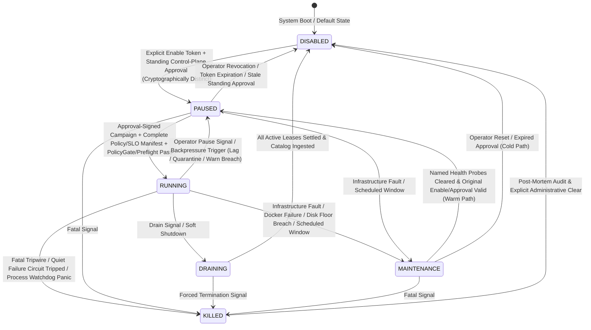
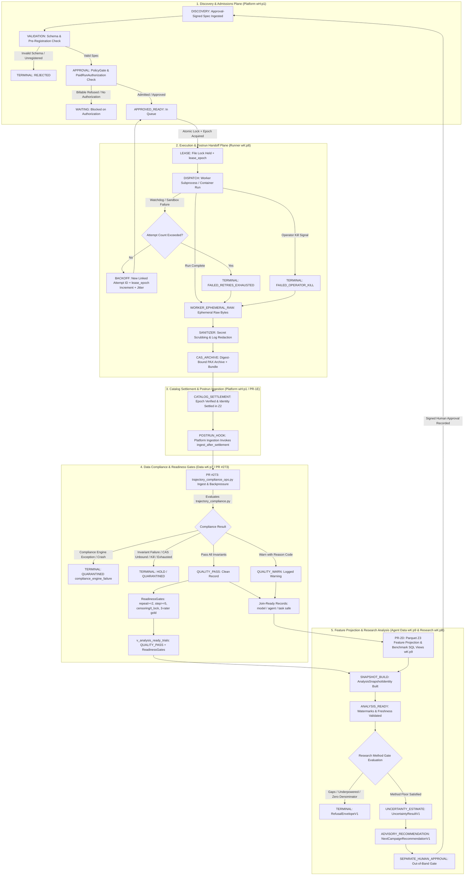
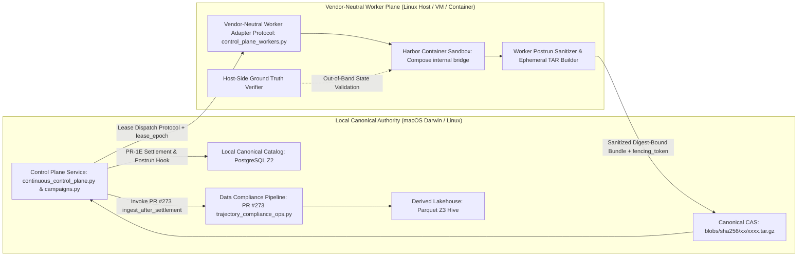
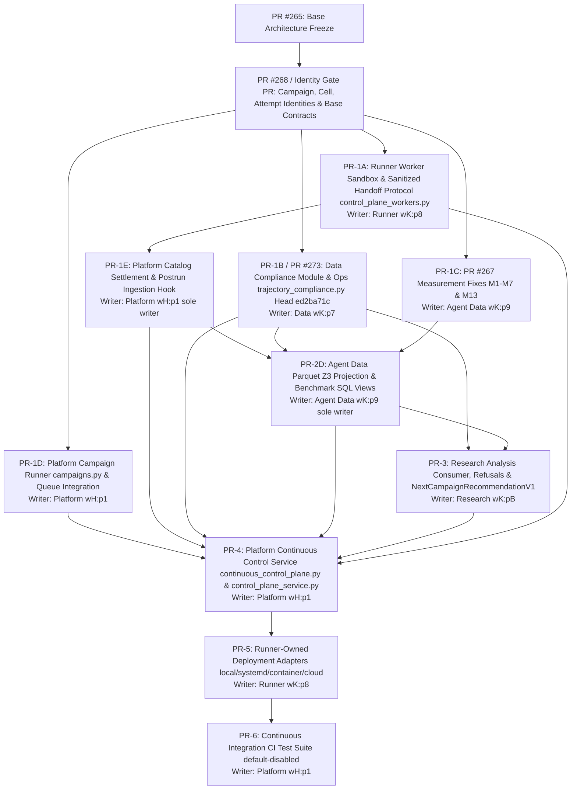

# Architecture Addendum: Continuous Operator-Governed Closed-Loop Control System (2026-08-28)

## 1. Executive Summary & Authorization Boundary

This document forms the normative architectural addendum to PR #265 (`NEXT-BENCHMARK-PROGRAM-ARCHITECTURE-2026-08-28.md`) and incorporates Research-consumer review, Platform peer interface alignment (`campaigns.py`, `continuous_control_plane.py`, `control_plane_workers.py`, `control_plane_service.py`), opened Data PR #273 full implementation consolidation (`ed2ba71c`), and the latest PR #267 measurement contract. It establishes the formal control plane, state machines, identity invariants, quality gates, backpressure triggers, deployment safety layers, and cross-team PR execution DAG for the 24/7 continuous operator-governed evaluation loop.

**Operational Authorization Status:**
> **No services or runs authorized.** This document defines specifications, invariants, schema fields, and acyclic dependency graphs only. Continuous execution is entirely inert by default. Activating continuous daemon execution or dispatching billable evaluation runs requires an explicit operator token, standing approval validation, signed policy manifest, and passing preflight safety gates.

---

## 2. Comprehensive State Machine Architecture

The continuous closed-loop architecture operates across two distinct hierarchical state planes:
1. **Control Plane Lifecycle:** Governs the long-running operator-governed daemon supervisor, operational modes, deficit round-robin scheduling across synthetic families, circuit breaker states, and administrative overrides.
2. **Attempt Execution & Cohort Projection Lifecycle:** Governs individual attempt evaluation units through sandbox execution, postrun scrubbing, CAS archiving, compliance validation, deterministic projection, cohort aggregation, and advisory analysis.

### 2.1 Control Plane State Machine & Circuit Topology
The control plane daemon initializes in `DISABLED` and strictly enforces distinct cryptographic separation between control plane enablement and campaign approval authority.



#### Circuit Breaker State Machine (`circuit_state`):
The continuous control plane incorporates a dedicated multi-mode circuit breaker governing provider health and infrastructure reliability:
- **`CLOSED`**: Normal operational state. Attempts dispatch according to concurrency and rate limits.
- **`OPEN_PROVIDER`**: Provider rate limit (HTTP 429) or transient provider outage (HTTP 5xx). Dispatch for the affected provider is suspended until `provider_next_eligible_at` evaluated from provider headers/headroom.
- **`OPEN_QUIET_FAILURE`**: Consecutive quiet failures (defined as settled attempts yielding zero terminal progression due to classified infrastructure, harness, or transport failures, distinct from valid task reward failures) reach `max_consecutive_quiet_failures`. Dispatches halt immediately.
- **`HALF_OPEN`**: Probe dispatch trial permitted after backoff window to verify provider/harness recovery.
- **`MANUAL_HOLD`**: Administrative hold triggered by operator or critical safety alarm requiring manual unlock.

#### Control Plane Transition & Scheduling Contracts:
- **Cryptographic Authority Separation:** The credential granting daemon control-plane enablement (`control_enable_credential`) and the authority signing campaign execution (`approval_signature_ref` / `approval_digest`) must be distinct. `PolicyGate` rejects submissions where both credentials derive from the same identity key.
- **Maintenance Transitions:** `MAINTENANCE $\to$ PAUSED` executes automatically only when named health probes (Docker socket, catalog database, disk headroom) clear and the original enable token and standing approval remain within validity windows. If approvals expired, the system transitions to `DISABLED` (cold path).
- **Deficit Round-Robin Scheduling:** Dispatch selects candidate cells using deficit round-robin across the three synthetic families (Family A Context Dilation, Family B MCP-FuncDAG v2, Family C MCP Recovery Twin) and strict FIFO within each family's dose ladder.
- **Append-Only Audit Log:** All state changes, circuit transitions, and admission verdicts are written to `queue/events.jsonl`.

---

### 2.2 Attempt Execution, Quality, and Analysis State Machine



#### Graph Topologies: Identity Space vs. Operational Retries:
- **Acyclic Identity Graph:** In identity space, the attempt graph is strictly acyclic ($DAG$). Every retry or re-execution instantiates a brand-new `AttemptIdentity` carrying an incremented `lease_epoch` and an explicit `previous_attempt_id` pointer.
- **Operational Cycle Boundary:** Operational loops (retries, campaign progressions) cycle only through explicit state transitions. Campaign-generation loops intentionally cycle **only** through separate human approvals minting new `CampaignIdentity` records.
- **Snapshot Formation:** Individual attempts **never** enter research analysis in isolation; research consumes immutable `AnalysisSnapshotIdentity` datasets formed from settled and projected partitions.

---

## 3. End-to-End Campaign Lifecycle Flow

The continuous closed loop moves strictly forward through decoupled, unprivileged operational boundaries. Unsanitized payloads are strictly ephemeral and are **never** persisted to durable storage or recorded in canonical catalogs:

```
[Approved Campaign Spec]
       │
       ▼
[PolicyGate Admission & Quota Schedule]
       │
       ▼
[Runner: Isolated Subprocess Execution (PR-1A / wK:p8)]
       │
       ▼
[Worker Ephemeral Raw Outputs] (Host-local memory / tmpfs)
       │
       ▼
[Sanitizer: Secret Scrubbing & Log Redaction]
       │
       ▼
[Digest-Bound CAS Archive + Worker Bundle] (blobs/sha256/xx/xxxx.tar.gz)
       │
       ▼
[Platform Catalog Settlement & Postrun Ingestion (PR-1E / wH:p1)] (PostgreSQL Z2)
       │
       ▼
[Data Compliance Engine (PR #273 Head ed2ba71c / wK:p7)]
       │ (src/evallab/interpretation/trajectory_compliance_ops.py: ingest_after_settlement)
       ├───► [QUARANTINED(compliance_engine_failure)] (Exception Fallback, Fail-Closed)
       │
       ├───► [HOLD / QUARANTINED] (Fail-Closed, Sealed, Reason-Coded, Never Projects)
       │
       ├───► [QUALITY_WARN] (Logged with Explicit Reason Codes) ──┐
       │                                                         │
       ▼ (Passed All Invariants)                                 │
[QUALITY_PASS] ──────────────────────────────────────────────────┴──► [Join-Ready Records (PR #273)]
       │                                                                        │
       ├───► [ReadinessGates & v_analysis_ready_trials (PR #273)]                ├───► [Agent Data Parquet & Views (PR-2D / wK:p9)]
       │     (repeat>=2, step>=5, censoring/t_lock, 3-rater gold)               │     (Post PR #267 M1-M7 & M13 Fixes)
       │                                                                        ▼
       └─────────────────────────────────────────────────────────────► [AnalysisSnapshotIdentity Construction]
                                                                                │ (Watermarks: projection >= source)
                                                                                ▼
                                                                     [Research Analysis-Ready Gate (PR-3 / wK:pB)]
                                                                                │ (Evaluates research_slo_digest)
                                                                                ├───► [RefusalEnvelopeV1] (Closed Enum)
                                                                                │
                                                                                ▼ (Method Gates Satisfied)
                                                                     [UncertaintyResultV1 & NextCampaignRecommendationV1]
                                                                                │ (Separate Research Result Schemas)
                                                                                ▼
                                                                     [Separate Out-of-Band Human Approval Gate]
                                                                                │ (Signed Approval Digest)
                                                                                ▼
                                                                     [New Campaign Spec $\to$ Discovery]
```

### Stage Boundary & Failure Routing Contracts:
1. **Mandatory Postrun Ingestion for All Terminations:** Every termination path—including `FAILED_RETRIES_EXHAUSTED` and `FAILED_OPERATOR_KILL`—must route through ephemeral raw output, secret scrubbing, CAS archiving, Platform catalog settlement (PR-1E), and Data compliance auditing (PR #273).
2. **Platform Catalog Settlement & Postrun Hook Invocation (PR-1E):**
   - Platform (`wH:p1` / PR-1E) settles CAS/catalog records immutably into PostgreSQL Z2 and directly invokes PR #273's `ingest_after_settlement`.
   - Data (`wK:p7`) acts as the compliance evaluator and never writes directly to Z2 tables.
3. **Data Compliance Exception Semantics:**
   - If `trajectory_compliance.py` raises an unhandled exception or fails to emit a valid record, the CAS/catalog settlement remains permanently recorded and is marked `QUARANTINED(compliance_engine_failure)`.
   - Compliance crashes count toward failure and quarantine windows, are excluded from downstream readiness/projection/analysis views, and are never rolled back from CAS. Retrying compliance occurs strictly as a new compliance processing attempt under idempotent identity.
4. **Data PR #273 Implementation Scope:**
   - Contains `src/evallab/interpretation/trajectory_compliance.py` and `trajectory_compliance_ops.py` (tested via 26 focused tests).
   - Provides `PlatformSettlement` consumer, `ingest_after_settlement` with lag backpressure, `ReadinessGates` ($\text{repeat} \ge 2, \text{step} \ge 5$ CBV eligibility floor, dose/alphabet validation, $t_{\text{lock}}$ censoring indicators, 3-rater gold), provenance catalogs (`provenance_catalog`, `agent_readable_catalog`), tracked-output repo-bloat gates, `v_analysis_ready_trials` helper, and `report_sanitized_trial` over existing fixture.
   - Never writes to PostgreSQL Z2, `cli.py`, `storage/data_backfill.py`, `feature_registry.py`, semantic producers, SQL files, `queue.py`, or policy files.
5. **Quality vs. Projection vs. Analysis Ready Dispositions:**
   - **Agent Data Projection (PR-2D)**: Consumes join-ready `QUALITY_PASS` and `QUALITY_WARN` records per Agent Data projection policy.
   - **Research Analysis (PR-3)**: Consumes `v_analysis_ready_trials` (strictly `QUALITY_PASS` + passing `ReadinessGates`) plus Agent Data benchmark views. `QUALITY_WARN` and `HOLD` records never enter `v_analysis_ready_trials`.
   - **Readiness Never Implies Reportability**: Data readiness confirms eligibility for snapshot formation, but does not guarantee statistical power sufficiency. Downstream analysis remains strictly governed by method-specific `research_slo_digest` gates and may still emit `RefusalEnvelopeV1(code=UNDERPOWERED)`.

---

## 4. Canonical Identity Model, Fencing Tokens & Analysis Snapshots

The current branch of PR #268 defines family, cell-factor, fault, and calibration ledgers, but **does not yet define** campaign, cell, attempt, model, agent, or harness identity schemas. PR #268 (or a single dedicated dependent identity-contract PR) is the gating authority that must define these canonical schemas prior to platform execution.

### Authoritative Identity Authorities:
1. **Gated Contract PR (PR #268 or Dependent Identity PR)** must establish:
   - `CampaignIdentity`: `campaign_id` (ULID string), `campaign_version` (string), `approval_signature_ref` (string), `approval_digest` (SHA-256 hex string).
   - `CellIdentity`: `cell_id` (SHA-256 hex string), `dose_factors` (dictionary), `configured_limits` (dictionary).
   - `AttemptIdentity`: `attempt_id` (ULID string), `cell_id` (SHA-256 hex string), `task_id` (string), `model_name` (string), `agent_name` (string), `harness_version` (string), `alphabet_version` (string), `seed` (unsigned 64-bit integer), `repeat_idx` (integer), `lease_epoch` (monotonically increasing integer), `fencing_token` (string), `previous_attempt_id` (nullable ULID string).
2. **Execution & Storage Authority (Runner & Catalog)**:
   - Existing runner and catalog remain the sole authority for `job_id`, `trial_id`, and `run_dir`.
3. **Content Storage Authority (EvidenceStore CAS)**:
   - Content-addressable storage remains the sole authority for `cas_uri` (`cas://sha256:{hex64}`).

### Research Analysis Snapshot Identity Contract & Digest Definition:
Data cutoff timestamps alone **never bind rows**. Analysis reproducibility requires an immutable `AnalysisSnapshotIdentity` binding input partitions and state digests explicitly:
```yaml
AnalysisSnapshotIdentity:
  analysis_schema_version: string
  method_version: string
  registry_digest: string                      # sha256 hex of feature registry schema and invariants
  provenance_catalog_digest: string            # sha256 hex of PostgreSQL Z2 catalog state snapshot
  analysis_request_digest: string              # sha256 hex of client analysis request parameters
  research_slo_digest: string                  # sha256 hex of research method SLO contract
  ordered_input_partition_digests: list[string]# Cryptographically sorted CAS / Parquet partition URIs
  source_watermark: datetime                   # Highest catalog settled_at timestamp included
  projection_watermark: datetime               # Parquet Z3 compaction timestamp (MUST be >= source_watermark)
  model_name: string
  agent_name: string
  harness_version: string
  cohort_key: string
  data_cutoff: datetime                        # Boundary filter timestamp
```

#### Snapshot Digest Definition:
$$\text{snapshot\_digest} = \text{sha256}(\text{canonical\_json}(\text{AnalysisSnapshotIdentity} \setminus \{\text{evaluated\_at}\}))$$
- **Watermark Invariant:** Ingestion requires $\text{projection\_watermark} \ge \text{source\_watermark}$.
- **Evaluation Freshness:** `evaluated_at` is recorded separately upon analysis execution and validated against the freshness criteria inside `research_slo_digest`.

### Fencing Token & Epoch Settlement Invariant (P0-2):
- **Worker Bundle Binding:** When a lease is acquired, Platform generates a monotonically incremented `lease_epoch` and `fencing_token` in `AttemptIdentity`. The worker execution bundle carries this exact `(attempt_id, lease_epoch, fencing_token)`.
- **Atomic Catalog Settlement:** The catalog settlement transaction verifies that `lease_epoch == catalog_current_epoch`.
- **Stale Worker Rejection:** If a worker completes after lease expiration or fencing timeout, the catalog rejects the settlement, discards uncommitted mutations, and flags the delivery as a stale duplicate attempt.
- **Re-Dispatch Increment:** Lease recovery never re-dispatches under the same epoch; a retry allocates a new `AttemptIdentity` with `lease_epoch = predecessor_epoch + 1`.

---

## 5. Parameterized Freshness & Operational Quality SLO Policy Manifest

All continuous loop operations are governed by an immutable, signed policy manifest (`policy/continuous-loop-policy.yaml`). The manifest governs operational, freshness, and backpressure fields only. Missing required fields keep the control plane in `DISABLED`.

### Policy Manifest Field Specifications (No Numeric Defaults):
```yaml
continuous_loop_policy:
  policy_schema_version: string
  approval_signature_ref: string               # Reference to valid PaidRunAuthorization or policy authority
  approval_digest: string                      # Cryptographic digest of the approved policy specification
  
  slo_freshness:
    max_queue_admission_lag_seconds: float     # Evaluated against spec_created_at
    max_dispatch_latency_seconds: float        # Evaluated against approved_at / lease_acquired_at
    max_oldest_postrun_lag_seconds: float      # Evaluated against runner finished_at
    max_oldest_catalog_settle_lag_seconds: float# Evaluated against runner finished_at / settled_at
    max_oldest_quality_lag_seconds: float      # Evaluated against catalog settled_at
    max_oldest_projection_lag_seconds: float   # Evaluated against catalog settled_at
    max_oldest_analysis_lag_seconds: float     # Evaluated against catalog settled_at (analysis queue backlog)
    status_snapshot_max_age_seconds: float     # Max age of control plane status cache
    
  operational_limits:
    scheduler_heartbeat_interval_seconds: float# Control plane daemon loop heartbeat interval
    scheduler_stale_after_seconds: float       # Maximum age of daemon heartbeat before alert
    worker_heartbeat_interval_seconds: float   # Frequency of worker lease mtime updates
    lease_ttl_seconds: float                   # Duration a worker lease remains valid without heartbeat
    fencing_grace_seconds: float               # Grace period before declaring stale lease zombie
    max_concurrent_workers: integer            # Maximum parallel worker subprocesses
    postrun_hook_timeout_seconds: float        # Maximum duration for postrun scrubbing & archiving
    maintenance_drain_timeout_seconds: float   # Maximum soft shutdown drain duration before force kill
    maintenance_disk_threshold_bytes: integer  # Free disk floor triggering MAINTENANCE state
    
  quality_and_quarantine:
    quarantine_rolling_window_size: integer    # Rolling window size (attempt count) for quarantine calculation
    min_window_attempts_for_calculation: integer# Minimum completed attempts before evaluating ratios
    max_quarantine_fraction: float             # Max allowable ratio of quarantined attempts in rolling window
    max_warn_fraction: float                   # Max allowable ratio of QUALITY_WARN attempts in rolling window
    catalog_ingestion_warn_after_seconds: float# Threshold for warning on slow catalog ingestion
    catalog_ingestion_pause_after_seconds: float# Threshold for backpressure pause on slow catalog ingestion
    max_consecutive_quiet_failures: integer    # Consecutive classified infra/harness failures triggering circuit open
    auto_acceptance_enabled: boolean           # Auto-acceptance strictly disabled
```

### Research Snapshot Freshness vs. Operational Lag:
- **Operational Analysis Lag (`max_oldest_analysis_lag_seconds`)**: Measures queue backlog age of unaudited/unprocessed cohorts.
- **Method Snapshot Freshness (`max_snapshot_freshness_lag_seconds`)**: Defined inside Research method contracts (`research_slo_digest`). Evaluates whether `evaluated_at - snapshot.source_watermark > max_snapshot_freshness_lag_seconds`. If breached, analysis returns `RefusalEnvelopeV1(code=STALE_SNAPSHOT)`.

---

## 6. Default-Off & No-Billable Safety Gate Stack

The execution engine enforces an unbypassable safety gate stack preventing accidental spending, credential exposure, or unmonitored runs:

```mermaid
flowchart TD
    subgraph Gate_Stack ["Unbypassable Gate Hierarchy"]
        G1[Gate 1: Master Daemon Switch -> DISABLED default]
        G2[Gate 2: Cryptographic Authority Separation Check]
        G3[Gate 3: Preflight Doctor -> Local Infra Docker / DB / Disk Check]
        G4[Gate 4: PolicyGate Auto-Run Allowlist -> oracle, nop only]
        G5[Gate 5: PaidRunAuthorization -> Stamped ULID & approval_signature_ref]
        G6[Gate 6: Spend Ceiling & Provider Headroom Check -> provider_next_eligible_at]
        G7[Gate 7: Process Credential Sanitization -> Allowlist & Redaction]
        G8[Gate 8: Execution Sandbox Isolation -> cgroup v2 / no-egress]
        G9[Gate 9: Circuit Breaker -> OPEN_QUIET_FAILURE / OPEN_PROVIDER]
    end
    
    G1 --> G2 --> G3 --> G4 --> G5 --> G6 --> G7 --> G8 --> G9
```



- **Billable Refusal Default:** `auto_run` is hardcoded to non-billable test harnesses (`oracle`, `nop`). All commercial model runs (`codex`, `claude-code`, `mini-swe-agent`, `deepseek`) are refused at admission unless accompanied by an explicit `PaidRunAuthorization` record verified against `approval_signature_ref`.
- **Dynamic Provider Headroom Reset:** Provider reset boundaries strictly use `provider_next_eligible_at` evaluated dynamically from provider rate-limit response headers and headroom probes, never hardcoded clock assumptions.
- **Secret Redaction:** Subprocess environments receive strictly allowlisted credential keys (`_SUBSCRIPTION_ENVIRONMENT_KEYS`). All stdout/stderr streams pass through runtime secret redactors (`REDACTED_SECRET_VALUE`) before writing to disk or CAS.

---

## 7. Local Control vs. Vendor-Neutral Worker Deployment Boundaries



### Execution Platform Constraints & Authority Rules:
- **Canonical Storage Authority:** Policy explicitly designates one canonical catalog (PostgreSQL Z2) and one canonical CAS root. Remote and local workers **never** write to the catalog or feature registries directly.
- **Worker Protocol Contract:** Workers execute as unprivileged adapters (`control_plane_workers.py`). They receive input specifications, execute container sandboxes, build sanitized PAX tar archives locally in ephemeral storage, and return a single sanitized, digest-bound bundle (`cas_uri` + manifest + `lease_epoch` + `fencing_token`) to the local authority.
- **Authoritative Platform (Linux):** Official certification, promotion benchmarks, and published construct measurements must execute in a Linux environment with full `cgroup v2` resource isolation and container network sandboxing (`internal: true`).
- **Degraded Platform (Darwin / macOS):** Local development runs on macOS Darwin are supported for testing and verification, but are classified as **degraded executions** and are strictly barred from benchmark certification, cross-run promotion, and official analysis aggregation.

---

## 8. Cross-Team Disjoint Ownership Matrix & Seam Boundaries

To prevent collisions, race conditions, and architectural coupling, code and operational ownership are partitioned into disjoint domains with strict boundary rules:

| Domain / Subsystem | Pane ID | Designated Owner | Core Responsibilities & Boundary Invariants |
| :--- | :--- | :--- | :--- |
| **Platform Control & Service** | `wH:p1` | Platform Lead | Owns `campaigns.py` (PR-1D), `continuous_control_plane.py` (PR-4), `control_plane_service.py` (PR-4), deficit round-robin scheduler, PostgreSQL Z2 catalog settlement (PR-1E), and serialized CLI+queue integration. Consumes PR #268 schemas without duplication. |
| **Execution & Runner** | `wK:p8` | Runner Lead | Owns `control_plane_workers.py` (PR-1A), runner sandbox management, credential isolation, process watchdog, postrun sanitization bundle handoff, deployment adapters (PR-5). **Does not own queue admission policy.** |
| **Data Compliance & Readiness** | `wK:p7` | Data Lead | Owns `trajectory_compliance.py` and `trajectory_compliance_ops.py` (PR-1B / PR #273). Emits join-ready records, readiness gates, and `v_analysis_ready_trials`. **Does not write catalog tables; does not edit `cli.py`, `data_backfill.py`, `feature_registry.py`, or SQL view files.** |
| **Agent Data & Feature Projection**| `wK:p9` | Agent Data Lead | Owns feature registry, semantic producers, derived Parquet Z3 projections, benchmark feature & projection views (PR-2D), post-PR #267 measurement fixes M1–M7 and M13. **Does not own readiness gates or compliance records.** Consumes join-ready records. |
| **Research Analysis & Proposals** | `wK:pB` | Research Lead | Read-only consumer of Data `v_analysis_ready_trials` (PR #273) and Agent Data benchmark views (PR-2D). Emits method-specific statistical gates (`research_slo_digest`), uncertainty estimation, refusal envelopes, `NextCampaignRecommendationV1` (PR-3). **May aggregate feature values into separate research result schemas; never writes feature registry/producer tables, readiness views, or benchmark projection views.** |

---

## 9. Shared-File Freeze, Gating Seams, and Exact PR #267 M1–M7 & M13 Fixes

### Shared Core Freeze (Serialized Single-Writer Modifications):
The following files are designated as frozen shared infrastructure. Modifications must be strictly serialized and coordinated through PR dependencies:
- `src/evallab/cli.py` *(Serialized Platform/Data integration surface; Data does not touch while Platform active)*
- `src/evallab/storage/data_backfill.py` *(Serialized Platform/Data integration surface; Data does not touch while Platform active)*
- `src/evallab/queue.py`
- `src/evallab/runner.py`
- `src/evallab/execution_contracts.py`
- `src/evallab/schemas/__init__.py`
- `src/evallab/interpretation/feature_registry.py` *(Agent Data exclusive writer in PR-2D)*
- `sql/traj_views.sql` *(Agent Data exclusive writer in PR-2D)*

### Decoupled Seams & Exact PR #267 Measurement Gates:
Downstream analysis views and `ANALYSIS_READY` cohorts strictly require PR #267 measurement blocker corrections:
1. **M1 (C3 Adaptive-Divergence, Transient Exclusion & Baseline Failure)**:
   - Implement C3 adaptive divergence and closed human verification checks.
   - An environment `recovered` event must **not** set divergence.
   - Exclude transient auto-clearing transport errors.
   - Require paired NOP baseline failure before C3 classification or downgrade measurement grade.
2. **M2 (No Outcome-Derived Process Backfill)**:
   - Prohibit backfilling FuncDAG edge/binding events from high-level task success or outcome verdicts.
   - Emit `NULL` when discrete MCP node tool telemetry is absent.
3. **M3 (No Task-Success-Imputed Memory)**:
   - Prohibit imputing memory opportunity or key-value binding from overall task success.
4. **M4 (Contract-Declared Denominators Only)**:
   - All rate metrics must use contract-declared edge/binding denominators; heuristic event counts are barred.
5. **M5 (No Manufactured Model-Call Denominators)**:
   - Ban synthetic denominators for LLM calls that do not correspond to observed execution steps.
6. **M6 (Occupancy NULL on Zero Dose)**:
   - Family A context dilation metrics must emit `NULL` (never `0.0`) when injected dose is zero.
7. **M7 (Clean Zero-Fault Twins Emit NULL)**:
   - Family C recovery twin metrics must emit `NULL` on unperturbed zero-fault runs.
8. **M13 (Model/Agent/Version SQL Foreign Key Identity)**:
   - Trajectory and benchmark SQL analytical views must explicitly record `model_name`, `agent_name`, `harness_version`, and `alphabet_version` foreign keys prior to executing a second model family.

---

## 10. Research Analysis Schemas & Advisory Recommendation Contract

Research consumers (`wK:pB`) operate under an immutable, read-only analytical contract. Research may aggregate read-only feature values into distinct research output schemas, but **never** writes to the feature registry, production tables, `v_analysis_ready_*` views, or benchmark projection views.

### 10.1 Closed Versioned Refusal Envelope Schema (`RefusalEnvelopeV1`):
When a method-specific statistical floor, coverage requirement, or invariant fails, analysis deterministically returns a closed refusal envelope.

#### Closed Refusal Code Enum (`RefusalCode`):
- `STALE_SNAPSHOT`
- `DIGEST_MISMATCH`
- `MISSING_LINEAGE_DECLARATION`
- `OUTCOME_LINEAGE_VIOLATION`
- `UNDERPOWERED`
- `SINGLE_OUTCOME_CLASS`
- `ZERO_VARIANCE`
- `ZERO_OPPORTUNITY`
- `MISSING_RECOVERY_OUTCOME`
- `REPEAT_INELIGIBLE`
- `SHORT_TRAJECTORY`
- `T_LOCK_UNAVAILABLE`
- `CENSORING_UNAVAILABLE`
- `MISSING_DENOMINATOR_APPLICABILITY_DECLARATION`
- `MISSING_DENOMINATOR_DECLARATION`
- `MISSING_NULL_ON_ZERO_DECLARATION`
- `INVALID_DENOMINATOR_DECLARATION`

#### Closed Refusal Basis Enum (`RefusalBasis`):
- `REGISTRY_CONFIRMED` *(Required for missing lineage and denominator declaration refusals)*
- `EMPIRICAL_DIAGNOSTIC`
- `NONE`

```yaml
RefusalEnvelopeV1:
  refusal_schema_version: string
  code: RefusalCode                            # Strict closed enum membership
  basis: RefusalBasis                          # Strict closed enum membership
  evidence_unit: string                        # Unit of measurement (e.g. trial_attempt, repeat_group)
  denominator: string                          # Denominator feature name or definition
  observed_n: integer                          # Raw observed count
  effective_n: float                           # Cluster-adjusted effective sample size
  gaps: list[string]                           # Explicit list of identified gaps
  source_analysis_snapshot_digest: string      # Bound snapshot_digest
```

---

### 10.2 Statistical Uncertainty Result Schema (`UncertaintyResultV1`):
Valid analytical measurements are reported with explicit point and interval estimations using deterministic percentile bootstrap with 4000 resamples:
```yaml
UncertaintyResultV1:
  uncertainty_schema_version: string
  source_analysis_snapshot_digest: string      # Bound snapshot_digest
  method_version: string
  metric_name: string
  evidence_unit: string
  n_total: integer
  n_effective: float
  estimate: float
  interval_lower: float
  interval_upper: float
  confidence_level: float
  method: "percentile_bootstrap"               # Standard deterministic percentile bootstrap
  resamples: integer                           # Fixed standard of 4000 resamples
  seed_digest: string                          # sha256 hex of deterministic RNG seed
  cluster_key: string                          # T1.2: coalesce(repeat_group_id, trial_id); or method contract
  status: "VALID"                              # VALID or RefusalCode
```

---

### 10.3 Advisory Recommendation Schema (`NextCampaignRecommendationV1`):
Advisory next-campaign proposals carry strict non-dispatchable metadata, bind exact analysis result artifacts, and cannot be used as a `CampaignIdentity` or approval token:
```yaml
NextCampaignRecommendationV1:
  recommendation_schema_version: string
  recommendation_id: string                    # ULID string
  advisory_only: true                          # Fixed constant true
  dispatchable: false                          # Fixed constant false
  source_analysis_snapshot_digest: string      # Bound snapshot_digest
  analysis_artifact_digests: list[string]      # Cryptographically ordered immutable analysis result digests
  cohort_key: string                           # Target evaluated cohort key
  registry_digest: string
  provenance_catalog_digest: string
  input_partition_digests: list[string]
  expires_at: datetime
  addressed_gaps_and_refusals: list[RefusalCode]
  intended_consumers: list[string]
  named_feature_consumers: list[string]        # Feature names consumed by the analysis
  minimum_additional_evidence: string          # Required statistical or dose increments
  proposed_parameters:
    target_families: list[string]
    proposed_dose_factors: list[float]
    proposed_repeats: integer
    recommended_instrumentation: string
    rationale: string
```

---

## 11. Acyclic One-Writer PR Dependency DAG

Implementation of the continuous closed-loop control system proceeds in an acyclic sequence across isolated working trees, ensuring single-writer discipline per PR:



### PR Dependency Edges & Ownership:
1. **`PR #268 / Identity Gate PR`** (Platform Lead): Establishes canonical `CampaignIdentity`, `CellIdentity`, `AttemptIdentity` (with `lease_epoch`), and base ledger DTOs.
2. **`PR-1A` (Runner `wK:p8`)**: Sandbox execution, secret scrubbing, and `control_plane_workers.py` handoff protocol.
3. **`PR-1B / PR #273` (Data `wK:p7`)**: Isolated `trajectory_compliance.py` and `trajectory_compliance_ops.py` (current implementation evidence at open/UNSTABLE head `ed2ba71c` post-blocker fix `411f1e1a`, 26 focused tests passing). Provides `PlatformSettlement` consumer, `ingest_after_settlement` with lag backpressure, `ReadinessGates`, provenance catalogs, bloat gates, `v_analysis_ready_trials`, and fixture report.
4. **`PR-1C` (Agent Data `wK:p9`)**: PR #267 measurement fixes M1–M7, M13, and updated semantic producers.
5. **`PR-1D` (Platform `wH:p1`)**: `campaigns.py` discovery and serialized queue execution runner.
6. **`PR-1E` (Platform `wH:p1` sole writer)**: Implements catalog settlement into PostgreSQL Z2, ingests sanitized bundles via Runner protocol (PR-1A), and invokes postrun hook `ingest_after_settlement` from PR #273.
7. **`PR-2D` (Agent Data `wK:p9` sole writer)**: Parquet Z3 feature projections and benchmark SQL analytical views consuming join-ready `QUALITY_PASS`/`WARN` records post-PR #267 fixes (PR-1C) and PR #273 compliance.
8. **`PR-3` (Research `wK:pB`)**: Read-only consumer of Data `v_analysis_ready_trials` (PR #273) and Agent Data benchmark views (PR-2D); implements `RefusalEnvelopeV1`, `UncertaintyResultV1`, and `NextCampaignRecommendationV1`.
9. **`PR-4` (Platform `wH:p1`)**: `continuous_control_plane.py` and `control_plane_service.py` daemon, deficit round-robin scheduler, and backpressure monitors. Depends on PR-1D, PR-1E, PR-1B (PR #273), PR-2D, PR-3, and PR-1A.
10. **`PR-5` (Runner `wK:p8`)**: Deployment adapters for local processes, systemd, Docker, and cloud VMs.
11. **`PR-6` (Platform `wH:p1`)**: End-to-end integration test suite, remaining default-disabled.

---

## 12. Required Test Matrix for Future Implementation

Future implementation PRs must deliver verified unit and integration test suites covering the following failure modes and safety invariants prior to merge:

1. **Default-Disabled Invariant Test:** Verifies that daemon initialization without explicit parameters remains in `DISABLED` state and schedules zero runs.
2. **Cryptographic Authority Separation Test:** Asserts that `PolicyGate` rejects submissions where control plane enablement and campaign approval derive from identical credential keys.
3. **Zero-Billable Admission Test:** Verifies that billable agent specs submitted without signed `PaidRunAuthorization` are immediately rejected or held in `waiting`.
4. **Duplicate Delivery & Late Worker Test:** Simulates a late worker delivering after lease expiration, verifying that catalog settlement rejects stale `lease_epoch` and preserves single-settlement integrity.
5. **Stale Lease & Fencing Recovery Test:** Simulates worker crash, verifies lease timeout detection, process cleanup, and fail-closed state transition with epoch increment on retry.
6. **Daemon Restart Resume Test:** Verifies that killing and restarting the daemon cleanly recovers existing queue leases without losing trial state.
7. **Provider Dynamic Reset & Backoff Test:** Simulates HTTP 429 / 5xx errors, verifying `provider_next_eligible_at` evaluated from provider headers and `OPEN_PROVIDER` circuit transitions.
8. **Quiet Failure Circuit Test:** Injects consecutive unclassified infrastructure failures, verifying `OPEN_QUIET_FAILURE` circuit tripwire and lab lockout.
9. **Quarantine & Warn Backpressure Trigger Test:** Injects corrupt CAS archives and warning anomalies, verifying `PAUSED(backpressure:quarantine_fraction_exceeded)` and `PAUSED(backpressure:warn_fraction_exceeded)`.
10. **Compliance Engine Failure & Quarantine Fallback Test:** Simulates `trajectory_compliance.py` crash or unhandled exception during postrun hook, verifying that CAS/catalog settlement is preserved, marked `QUARANTINED(compliance_engine_failure)`, counted in failure windows, and excluded from projections without rolling back CAS.
11. **Graceful Drain vs. Emergency Kill Test:** Tests soft drain completion of in-flight attempts versus instantaneous container termination on kill signal with `FAILED_OPERATOR_KILL` disposition.
12. **Darwin vs. Linux Platform Flag Test:** Asserts that runs executed on macOS Darwin are tagged with `degraded_platform_execution: true` and excluded from certification datasets.

---

## 13. Specification Evidence & Verification Contract

The following table summarizes the key structural contracts established by this specification and the requirements for downstream implementation verification:

| Architectural Requirement | Governing Section | Target Contract / Module | Verification Gate |
| :--- | :--- | :--- | :--- |
| **Operational Authorization** | Section 1 | Operational Scope | Explicit statement: `No services or runs authorized.` |
| **Control Plane Lifecycle** | Section 2.1 | `continuous_control_plane.py` | State transitions (`DISABLED`, `PAUSED`, `RUNNING`, `DRAINING`, `MAINTENANCE`, `KILLED`) |
| **Circuit Breaker Topology** | Section 2.1 | `continuous_control_plane.py` | Multi-mode circuit states (`CLOSED`, `OPEN_PROVIDER`, `OPEN_QUIET_FAILURE`, `HALF_OPEN`, `MANUAL_HOLD`) |
| **Postrun Settlement Pipeline** | Section 2.2 & 3 | `control_plane_workers.py` $\to$ CAS $\to$ PR-1E Settlement $\to$ PR #273 Compliance | Ephemeral raw $\to$ Sanitizer $\to$ Digest-bound CAS $\to$ Platform Settlement $\to$ Compliance |
| **Identity & Epoch Settlement** | Section 4 | PR #268 / Identity Gate PR | `CampaignIdentity`, `CellIdentity`, `AttemptIdentity` (`lease_epoch`, `fencing_token`) |
| **Analysis Snapshot Identity** | Section 4 | `AnalysisSnapshotIdentity` | Explicit schema binding watermarks ($\text{projection} \ge \text{source}$), registry digest, and snapshot digest formula |
| **Operational SLO Manifest** | Section 5 | `policy/continuous-loop-policy.yaml` | Age-based lag fields grounded in catalog `finished_at`/`settled_at`, rolling quarantine/warn fractions |
| **Safety Gate Stack** | Section 6 | `PolicyGate` / `preflight.py` | Default-off, distinct enable/approval credentials, dynamic `provider_next_eligible_at` |
| **Worker Adapter Protocol** | Section 7 | `control_plane_workers.py` | Vendor-neutral protocol, single canonical CAS/catalog, Darwin degraded execution |
| **Disjoint Ownership & Seams** | Section 8 | Pane Ownership Matrix | `wH:p1` (Control & PR-1E Settlement), `wK:p8` (Runner), `wK:p7` (Data PR #273), `wK:p9` (Agent Data PR-2D), `wK:pB` (Research PR-3) |
| **Measurement Blockers M1–M7 & M13** | Section 9 | `feature_registry.py` / Producers | Exact PR #267 measurement fixes M1–M7 and M13 gating `ANALYSIS_READY` |
| **Research Schemas & Advisory** | Section 10 | `RefusalEnvelopeV1`, `UncertaintyResultV1`, `NextCampaignRecommendationV1` | Closed refusal enum (17 codes), closed basis enum, percentile bootstrap (4000 resamples), advisory non-dispatchable proposal |
| **Acyclic One-Writer PR DAG** | Section 11 | PR Execution Strategy | 11-node sequential PR sequence from PR #268 to PR-6 integration CI |
| **Test Matrix** | Section 12 | Future Implementation Test Suites | 12 unit/integration test specifications |
