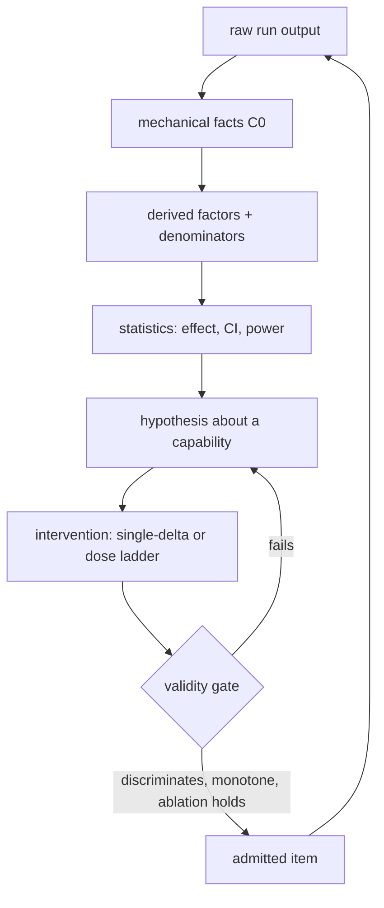

# Trajectory Analysis: Foundations Compendium

**What this is.** One readable document covering how we turn agent execution
telemetry into defensible capability measurements and, eventually, synthetic
evals. Written because the load-bearing concepts existed only in scattered code,
adversarial review threads, and unpersisted conversation.

**How to read it.** §1–§6 are the conceptual core. §7 is where we actually stand.
§8–§10 are the failure modes and one case study that cost us a whole track.
§11 turns the lens on our own builder fleet. §12–§14 are references, code index,
and the idea backlog.

**Provenance tiers.** Because generosity is the enemy here:
- **[V]** verified this session by reading source, code, or on-disk data
- **[M]** sourced from the Librarian literature map (131 primary papers); map read, papers not individually opened
- **[W]** from web research this session, link included
- **[A]** my own analysis or inference — argue with it

---

## Table of contents

1. The pipeline, corrected
2. The measurement formula
3. The order-book analogy, and where it breaks
4. Evidence grades: two vocabularies reconciled
5. The no-LLM-labels boundary
6. Foundational feature taxonomy (A–J)
7. Where we actually stand (audit, 2026-08-27)
8. Failure modes and biases catalogue
9. Difficulty is not diagnosticity
10. Case study: the A2 claim classifier
11. Turning the lens inward: builder-fleet analysis
12. Reading list
13. Internal doctrine index
14. Open questions and idea backlog

---

## 1. The pipeline, corrected

Peter's original chain was essentially right **[A]**:

> ATIF/observed data → basic facts → purpose-directed feature engineering →
> statistical/semantic analysis → synthetic task generation

Two things were missing. First, the chain is not one-way — it is a loop with a
**validity gate**, because a generated task must be shown to measure the thing it
claims before it is admitted. Second, **causal claims require intervention**; no
amount of observational trajectory analysis proves that context length *caused* a
failure **[M]**.

The edge that was absent from the original model is `V`. Without it you generate
tasks that are hard rather than tasks that are informative.

---

## 2. The measurement formula

The discipline is not "feature engineering." It is measurement theory **[A]**,
and it has a fixed sequence:

$$\textbf{construct} \rightarrow \textbf{operationalization} \rightarrow \textbf{reliability} \rightarrow \textbf{validity} \rightarrow \textbf{discrimination} \rightarrow \textbf{admission}$$

| Stage | Question it answers | Failure if skipped |
|---|---|---|
| Construct | which capability, and which decision does measuring it inform? | features nobody can justify |
| Operationalization | which observable, at which grade, with which denominator? | uninterpretable numbers |
| Reliability | does it reproduce across seeds and raters? | noise mistaken for signal |
| Validity | convergent: agrees with an independent measure. discriminant: does *not* move with irrelevant factors | measuring the wrong thing confidently |
| Discrimination | does it separate models? is the CI tight enough to rank? | leaderboards from nothing |
| Admission | only now may it enter a scorecard or seed a task | taxonomy sprawl |

Discriminant validity is the stage everyone skips. It is established by
**ablation**: remove the supposedly critical factor; if performance does not
move, the task was never measuring it **[W]**
([AblationBench](https://ablation-bench.github.io/), arXiv:2507.08038).

---

## 3. The order-book analogy, and where it breaks

Peter's framing, reconstructed here because it existed **nowhere on disk** — the
scout searched research-context, `.claude`, and `.codex` session logs and found
only his earlier PAMM order-book work, never the pedagogical metaphor **[V]**.
Persisting it is half the point of this document.

**The analogy.** A limit order book exposes maybe ten raw columns — bid/ask
levels, sizes, timestamps. Practitioners derive a hundred features from it: side
imbalance, depth-weighted mid, order arrival rate, cancel ratio, notional per
side, queue position. This is legitimate because two things hold:

1. **Theory licenses the features.** Market-microstructure theory (inventory
   risk, adverse selection) says order-flow imbalance should predict short-horizon
   returns. The features are not fished; they are predicted.
2. **A criterion validates them.** Realized forward return is a crisp,
   abundant, out-of-sample label.

The trajectory analogue: the "theory" is the agentic capability taxonomy
(planning, sequencing, recovery, context, restraint), and the "criterion" is
**opportunity-conditioned outcome**. Where no criterion exists, a feature is
decoration **[A]**.

**Where the analogy breaks — and this should change behavior [A]:**

| | Order book | Agent trajectories |
|---|---|---|
| Observations | $10^6$–$10^9$ | $10^2$–$10^3$ |
| Criterion | forward return, crisp, abundant | task verdict, noisy, sparse |
| Subject stability | quasi-stationary | **nonstationary** — models change monthly |
| Feature cost | cheap, reversible | expensive, and each one is a maintenance liability |

Consequence: we cannot afford a hundred speculative features. Per-feature
statistical power is minuscule by comparison, and the subject drifts out from
under any long study. **We must buy inference through experimental design —
paired arms, single-delta, dose-response — rather than through sample size.**
That single sentence is the most practical thing in this document.

---

## 4. Evidence grades: two vocabularies reconciled

Both exist in the repo. They are compatible; use the second for new work **[V]**.

**Internal Grades A–D** (`research-context/trajectory-analysis/TAXONOMY.md:43-73`):

| Grade | Basis |
|---|---|
| A | deterministic state diff / test outcome |
| B | sandbox execution + structural filter |
| C | calibrated judge with a published confusion matrix |
| D | uncalibrated LLM heuristic |

Hard rule at `TAXONOMY.md:82`: **combining Grade-C/D judges never yields Grade-A
ground truth.** Stacking weak judges does not manufacture certainty.

**Map vocabulary $C_0$–$C_3$** (literature map §0) **[M]**:

| Grade | Basis | Licenses |
|---|---|---|
| $C_0$ | deterministic from raw ATIF, exit codes, digests, state journal | description, screening |
| $C_1$ | deterministic *given a task contract* (target whitelist, declared invariant, declared DAG, act/abstain polarity) | conformance claims |
| $C_2$/$C_3$ | controlled intervention: single-delta arms, fault injection, certified replay | **causal claims — only here** |

Rough mapping **[A]**: $C_0 \approx$ A; $C_1 \approx$ A-with-annotation; $C_2/C_3$
is an orthogonal axis about *design*, not about extraction fidelity. C and D
grades are excluded from the current program entirely (§5).

**The denominator rule**, stated in the map and worth repeating everywhere: every
rate needs an explicit opportunity set $\Omega$, and when $\lvert\Omega\rvert = 0$
the metric is **`null`** — never $0.0$, never $1.0$ **[M]**.

---

## 5. The no-LLM-labels boundary

The operative rule for the current program **[A]**:

> **Mechanical token extraction plus environment existence checking is $C_0$.
> Semantic interpretation of what the agent meant is barred.**

Worked examples:

| Question | Verdict | Why |
|---|---|---|
| Does the path this message names exist in the container? | **allowed**, $C_0$ | regex extraction + filesystem existence check |
| Is the cited `file:line` within the file's length? | **allowed**, $C_0$ | arithmetic |
| Was this tool name in the registry? | **allowed**, $C_0$ | set membership |
| Did the agent *claim* success? | **barred** | prose classification — see §10 |
| Is the terminal summary *entailed* by the observations? | **barred** | NLI = model judgment |
| Was the clarification question *well-targeted*? | **barred** | semantic quality |
| Did verification run and return non-zero, with no subsequent mutation? | **allowed**, $C_0$ | pure event-order conjunction — captures "ignored the evidence" without reading a word |

That last row is the pattern worth internalizing: most things we want from prose
have a structural surrogate that is strictly stronger evidence.

---

## 6. Foundational feature taxonomy (A–J)

The order-book primitives for trajectories. Task-agnostic: needed regardless of
which benchmark runs or which synthetic direction we eventually take **[A]**.

| Block | Contents |
|---|---|
| **A. Shape / volume** | steps; steps by role; tool calls; unique tools; tool mix; turns; duration; per-step latency; terminal reason |
| **B. Budget / economics** | prompt / completion / cached / reasoning tokens; cost; tokens per step; context growth slope; cache hit rate; budget utilization vs limit; peak occupancy vs window |
| **C. Error structure** | exit-code distribution; error rate *excluding expected-negative exits*; error class taxonomy; first-error index and time; max cascade; recovery latency; unrecovered at terminal |
| **D. Flow / dynamics** | action arrival rate; identical-action repeats; normalized-argument thrash; period-$N$ cycles; novelty decay; edit churn; read:write ratio; inspect-before-edit grounding |
| **E. State interaction** | files created / modified / deleted; bytes changed; mutations per action; unprovenanced changes; commands executed; processes spawned; idempotency |
| **F. Verification** | agent's own test invocations; verification after last mutation; verdict; reward; exception class |
| **G. Provenance** | intervention count and positions; autonomous vs assisted; subagent steps; delegation overhead |
| **H. Termination** | terminal message presence and length; self-terminated vs harness kill |
| **I. Reference validity** | nonexistent paths; unregistered tools; schema-rejected calls; invalid `file:line` |
| **J. Open-model only** | reasoning-block presence; thinking tokens per step; thinking:answer ratio; logprobs and entropy; sampling params and seed; repeat-sample identity for pass@k |

Block **I** is the honest, deterministic stand-in for "hallucination." Block **J**
is the entire reason open models are worth more to us than closed ones.

---

## 7. Where we actually stand (audit, 2026-08-27)

Four read-only agents, exact citations. All figures **[V]**.

**Coverage ≈ 36% of the A–J foundation.**

| Block | Items | Present | Partial | Absent |
|---|---|---|---|---|
| A Shape | 12 | 8 | 2 | 2 |
| B Budget | 10 | 5 | 1 | 4 |
| C Error | 9 | 3 | 1 | **5** |
| D Flow | 8 | 1 | 2 | **5** |
| E State | 7 | 4 | 1 | 2 |
| F Verification | 5 | 2 | 2 | 1 |
| G Provenance | 5 | 0 | 3 | 2 |
| H Termination | 2 | 0 | 0 | **2** |
| I Reference validity | 5 | 0 | 1 | **4** |
| J Open-model | 6 | 0 | 1 | **5** |

**Shape of the gap: a barbell.** Trivial counting features exist. Exotic features
exist (CBV regression slope, `linear_innocence_screening`, divergence $k^*$, LOCA
context curves). The boring load-bearing middle — error *classification*, state-diff
volume, edit churn, latency distribution, budget utilization, reference validity —
is largely missing. We built the cheap things and the clever things and skipped
the ones every downstream analysis needs.

**Scale.** `derived/parquet/traj_features/traj_features.parquet` is **99 rows × 39
columns**. Nine declared fact schemas sit on disk with **0 rows** — implied
coverage that does not exist.

### The five findings that matter

1. **We discard open-model data Harbor already hands us.** ATIF v1.8 `Step`
   carries `reasoning_content`; `Metrics` carries `prompt_token_ids`,
   `completion_token_ids`, `logprobs`. Our parser reads only prompt/completion/
   cached/cost at `src/evallab/evidence/atif.py:570-575`. Thinking blocks are
   truncated to 120 chars in memory (`traj.py:1106-1108`, `StepOutline.thought_snippet`)
   and never persisted. The format is ahead of the parser.
2. **tau-bench is lossy upstream, before we touch it.**
   `tau_bench/agents/tool_calling_agent.py:33-41` keeps only
   `res.choices[0].message`; `res.usage`, `logprobs`, and `finish_reason` never
   reach `traj`. Native tau runs yield null tokens regardless of our parser.
   Neither tau nor tau² emits per-step state snapshots — only a terminal
   `gt_data_hash`. Harbor's inotify state journal is strictly better evidence.
   **Ruling taken: Harbor-host tau.**
3. **Error metrics are currently corrupted, not merely thin.**
   `tool_error_rate_screening` computes `error_count / tool_call_count` **without
   excluding expected-negative exits** — `grep`, `diff`, `pytest` exiting 1 count
   as failures. The IR knows better (`trajectory_ir.py` `_classify_exit_semantics`);
   the feature layer ignores it. No error-class taxonomy exists at all.
4. **No reference-validity layer**, though all four of its checks are $C_0$
   computable from state journal + tool registry + event log.
5. **Two-thirds of the gap is SQL, not re-instrumentation.** Already computable
   from data on disk: turns, per-step latency, tool step count, tokens/step, cache
   hit rate, exit-code distribution, first-error index, recovery latency,
   unrecovered-at-terminal, read:write ratio, files touched, bytes changed,
   subagent overhead. Only block J, error taxonomy, reference validity, and budget
   limits need new extraction.

### Rulings taken (Peter, 2026-08-27)

- Harbor-host tau-family benchmarks.
- Keep `capability_opportunities` and `evidence_coverage`; mark the other zero-row
  schemas unimplemented until real producers exist.
- Delete/demote: arbitrary loop-suspicion score, regex-based edit detection
  (replace with state-journal truth), arbitrary `phase_type` segmentation.

---

## 8. Failure modes and biases catalogue

The seven falsification controls already implemented in code **[V]**, plus five
I added from analysis **[A]**.

**Implemented:**

| Control | Location |
|---|---|
| structured-tool vs bash equivalence | `interpretation/trajectory_semantics.py:60-170` |
| grep/diff expected-negative exits | `interpretation/trajectory_ir.py:194-210` |
| user-assisted vs autonomous recovery | `trajectory_semantics.py:46-51,120-160` |
| background state-noise isolation | `harbor_state_journal.py`, `state_events.py` |
| valid backoff vs stagnant retry | `behavior_episodes.py:497-550` |
| partial opportunity coverage | `semantic_facts.py:173-195` |
| fast-crash denominator bias | `cohort.py:706-735` |

**Added by analysis:**

1. **Prose-derived features are not facts.** Reliability hierarchy: state diff $\succ$
   tool structure + exit codes $\succ$ cross-run structural comparison $\succ$
   calibrated judge $\succ$ raw LLM read. Attempting to manufacture a Grade-A
   feature from Grade-D material is how tracks die (§10).
2. **The denominator problem.** "Recovery rate" without "fault opportunities" is
   meaningless. Enforced in code for exactly two benchmarks; everywhere else,
   features computed today are silently unconditioned.
3. **Mining-from-your-own-generation overfitting loop.** Seed tasks from observed
   2026-model failures and the suite measures *the 2026 failure fingerprint*, not
   capability. Mitigations: hold one model family out of the mining set; require
   an item to discriminate across $\geq 3$ families before admission; retire items
   as they saturate. **Nothing in the repo does this.**
4. **Survivorship in mining.** "Interesting" failures come preferentially from
   trajectories that survived long enough to fail interestingly. Fast-crash bias is
   handled at the cohort layer; the mining-side version is not.
5. **Artifact pollution.** `.pytest_cache`, `*.pyc`, `.git/index.lock` dominate
   mutation counts unless filtered **[M]**.

Also worth carrying, from the map **[M]**: semantic-distractor confound (dilating
context with keyword-colliding text fuses horizon with interference); static
needle retrieval $\neq$ actionable memory (printing a string $\neq$ binding it as
a tool argument); mock-tool disconnection (hardcoded returns break value
propagation); vain verification (runs `pytest`, ignores 3 failures, declares
success); harness kill vs self-termination (exit 124 is not surrender); constant-policy
degeneracy (refuse everything → 100% on $T^-$, 0% paired).

---

## 9. Difficulty is not diagnosticity

The single most consequential correction from this session **[A]**, and it has
external backing **[W]**.

The instinct "build a task that demonstrates the failure to an absurd degree" —
e.g. 50 near-duplicate social APIs — produces a task every model fails. That is a
**floor effect**, carrying $\approx 0$ bits. It is a *demonstration*, not a
*measurement*.

Item response theory formalizes it: item information peaks where difficulty
$\beta \approx$ ability $\theta$, scaled by discrimination $\alpha$. An
everyone-fails item has $\alpha \approx 0$
([Fluid Benchmarking, AI2](https://allenai.org/blog/fluid-benchmarking);
[Stanford CRFM](https://crfm.stanford.edu/2025/06/04/reliable-and-efficient-evaluation.html)).
IRT-based item selection recovers full rankings from 3–5% of items.

**What to build instead: a dose-response ladder.** APIs $\in \{5, 10, 20, 50\}$
yields a *threshold* — "degrades at ~12 concurrent schemas" — a capability
coordinate trackable across model generations. It also supplies the falsification
control for free: if failure does not rise monotonically with dose, the
hypothesized mechanism is wrong.

**And that task is confounded four ways.** API *count* vs total *token volume* vs
schema *similarity* (interference) vs *name collisions*. Varied together, the
result is uninterpretable — you will conclude "bad at social APIs" when the truth
is "bad at disambiguating near-duplicate schemas." Vary one factor at a time.
`SingleDeltaAdmissionGate` already encodes exactly this discipline for
act/abstain pairs; it simply has not been generalized to factorial families.

---

## 10. Case study: the A2 claim classifier

Kept because it is the most instructive failure in the lab's short history **[V]**.

**Goal.** Classify what a terminal agent message *claims* — success, failure,
partial, refusal — from prose.

**Course.** Six adversarial exact-head review rounds; ~29 executable findings,
every one real; 469 lines written; **0 merged**; terminal HOLD.

| Round | Character of findings |
|---|---|
| 1–2 | marker/cleaning split-brain; contraction stripping ate hedges; non-held-out fixtures |
| 3 | future intent; meta subjects; comma-any-`-ed`; `remains` over-downgrade |
| 4 | blob-wide veto scope; adverb whitelist; unreachable token |
| 5 | sentence-machinery edges (`e.g.` as artifact; cross-sentence anchors; newline-severed chains) |
| 6 | each guard's own tail: greedy negation span; question-paren deletion |

**The lesson.** Every lexical guard is itself a lexical surface. Precision fixes
traded against recall holes indefinitely — a quantified whack-a-mole asymptote. A
universal prose classifier over unbounded agent registers does not converge.

**Second lesson, about process.** Adversarial code review is a *local* oracle. I
asked "find bugs at this head" six times and never once asked "is this problem
solvable in this representation?" The reviewer answered correctly, six times, and
could not tell me to stop.

**What survived.** Quote/code-fence cleaning as evidence hygiene; held-out fixture
discipline (verbatim bytes, task-disjoint, provenance verified on disk); the
110-case labeled corpus; and the reliability hierarchy that now governs §5.

**Redesign, if ever resumed** (`research-context/trajectory-analysis/2026-08-27-a2-claim-classifier-hold-redesign-brief.md`,
commit `0c2552c`): versioned per-register `ClaimSemanticsProfile`; high-precision
generic core that abstains `unknown`; frozen independent labeled corpus with
digest-pinned labels set *before* rule authoring; explicit profile selection with
no universal default.

---

## 11. Turning the lens inward: builder-fleet analysis

Peter's question — why is the fleet building slowly — is answerable with the same
machinery, and the A2 track is a fully instrumented sample **[V]**.

**Measured on A2:** six serialized review rounds at 9m36s, 8m04s, 13m10s, 10m40s,
11m41s, 12m00s $\approx$ **65 minutes of pure blocking wait** in a ~2-hour track,
for 0 merged lines.

**Three mechanisms [A]:**

1. **Gate latency dominates and is serial.** One reviewer, one head, no work
   possible until the verdict returns.
2. **A moving `main` invalidates exact-head review.** Observed repeatedly: PRs
   merging underneath a lane force rebase → "changed head invalidates review" →
   re-review. With many lanes on a fast main this compounds. ADR-031..035
   (per-fix worktrees abolished, one durable lane worktree, one PR per milestone)
   attacks exactly this term.
3. **Review is local; it cannot say stop.** See §10.

**Metric translation for builder trajectories [A]:**

| Eval-subject metric | Builder-fleet analogue |
|---|---|
| loop index | rework loops — same file amended $N$ times |
| tool efficiency ratio | surviving-edit ratio — edits that reach merge |
| context bloat velocity | context growth per merged line |
| non-zero exit cascade | CI failure chains |
| — | **gate latency**: head pushed → verdict received |
| — | **rework ratio**: lines written ÷ lines merged (A2: $\infty$) |
| — | **serialization factor**: fraction of lane wall-clock with exactly one agent working |
| — | **abandonment cost**: work discarded after $N$ rounds |

**Category-error warning.** These are *our* agents under *our* scaffold. They
inform engineering throughput; they are never evidence about model capability.

**First pass needs no new infrastructure:** session transcripts + git reflog + PR
timelines suffice for a wall-clock decomposition of the last ~10 merged PRs.

---

## 12. Reading list

### Tier 1 — most directly applicable [W]

| Work | Why | Link |
|---|---|---|
| **Agentic Benchmark Checklist (ABC)** | reports ~30%+ performance overestimation from invalid reward/task design; a checklist we should simply adopt | [arXiv:2507.02825](https://arxiv.org/abs/2507.02825) |
| **TaskCraft** | atomic task → depth/width expansion with verification; literally "synthetic from proven tasks" | [arXiv:2506.10055](https://arxiv.org/html/2506.10055v2) |
| **Fluid Benchmarking** (AI2) | IRT item selection, floor effects, adaptive item choice | [allenai.org](https://allenai.org/blog/fluid-benchmarking) |
| **Reliable and Efficient Evaluation** (Stanford CRFM) | rankings recovered from a small item fraction | [crfm.stanford.edu](https://crfm.stanford.edu/2025/06/04/reliable-and-efficient-evaluation.html) |
| **AblationBench** | ablation as a *validity instrument*, not a nicety | [ablation-bench.github.io](https://ablation-bench.github.io/), [arXiv:2507.08038](https://arxiv.org/abs/2507.08038) |

### Tier 2 — construct-specific, from the literature map [M]

Map: `research/inbox/DERIVATIVE-TRAJECTORY-FEATURE-LITERATURE-MAP-2026-08-27.md`
(131 primary sources; arXiv IDs below are as recorded there, not individually opened by me)

| Construct | Sources |
|---|---|
| Context & memory | LOCA-Bench (2509.18844); MemoryAgentBench (2511.08325); BEAM (2510.27246); ContextBench; MemGym |
| Tool graph & composition | FuncBenchGen (2604.12876); ToolBench-X (2606.25819); tau/tau²-bench (2406.12045); Graphectory; ToolPRMBench |
| Error recovery | AgentCheck (2512.08312); Recovery-Bench (2602.14922); AgentRx (2509.08765); TrajDebug |
| Verification & grounding | GroundEval (2605.12345); ALCE (2305.14614); MiniCheck (2404.10774); VPR |
| Restraint & abstention | AgentAbstain (2607.10059); Trust-or-Escalate; ToolMisuseBench |
| Termination | ATIF v1.7 spec; SWE-pruner (2504.09876); AgentProcessBench |
| State & edit dynamics | SWE-bench (2310.06770); StateJournalPlugin; Daydream |
| Delegation | ATIF v1.7 `subagent_trajectories`; CooperBench; TraceJudgeBench; MetaAgent-X |

### Tier 3 — process-supervision context [W]

- **AgentProcessBench** — step-level ternary labels, 8,509 human-annotated steps. The labeling protocol to copy if `process_step_facts` is ever filled.
- **Who&When** — multi-agent failure attribution (which agent, which step).
- **$\tau$/$\tau^2$-bench** — `pass^k` reliability estimation; state-dependent cascades.

### Caveat [V]
$\tau^3$-bench has no public standalone repository as of this audit; the map marks
it UNVERIFIED. Treat any $\tau^3$ claim as unconfirmed.

---

## 13. Internal doctrine index

The dashboard for the Ferrari. All **[V]**.

| Concern | Location |
|---|---|
| Feature provenance registry (`is_screening`, `category`, `formula_or_rule`, `null_condition`) | `src/evallab/interpretation/traj_baseline.py:25-350` |
| Verification Grades A–D + no-inflation rule | `research-context/trajectory-analysis/TAXONOMY.md:43-73,82` |
| Opportunity conditioning / `analysis_ready` | `src/evallab/semantic_facts.py:173-195` |
| Refusal of universal aggregates | `src/evallab/semantic_facts.py:381-447` (`query_scorecard`) |
| Statistics: Chen pass@k, Yao pass^k, bootstrap CI, power, 13-field comparability, refuse-to-rank | `src/evallab/cohort.py:389-704` |
| Confound-fingerprinted capability curves | `src/evallab/curve.py:126-255` |
| Judge calibration floor (0.9 agreement) | `src/evallab/calibrate.py:36,424` |
| 8-point synthetic certification gate (oracle 3×, NOP fail, ≥3 mutants fail) | `src/evallab/synthetic_cert.py:1-150` |
| Perturbation operators (fault injection, abstain pairing, context pressure) | `src/evallab/synthetic_transform.py:280-780` |
| Function-DAG generator + difficulty profiles | `src/evallab/synthetic_funcdag.py` |
| Exit semantics / expected negatives | `src/evallab/interpretation/trajectory_ir.py:194-210` |
| Behavior detectors (tool_error, unchanged_retry, recovered_progress, verification_gap) | `src/evallab/behavior_episodes.py:450-550` |
| State journal (inotify) | `src/evallab/harbor_state_journal.py`, `src/evallab/state_events.py` |
| Literature map | `research/inbox/DERIVATIVE-TRAJECTORY-FEATURE-LITERATURE-MAP-2026-08-27.md` |
| Research program (matrix + ranked studies) | `research/inbox/DERIVATIVE-TRAJECTORY-FEATURE-RESEARCH-PROGRAM-2026-08-27.md` |
| A2 HOLD redesign brief | `research-context/trajectory-analysis/2026-08-27-a2-claim-classifier-hold-redesign-brief.md` |

---

## 14. Open questions and idea backlog

Ranked by expected value **[A]**. None are started; all respect no-LLM-labels.

### High value

1. **Reasoning-token elasticity.** Does more thinking buy anything, and where does
   it saturate? Only answerable on open models. Needs P1 only. Ranked study #1.
2. **Post-compaction re-read rate** as the definitive compaction-loss measure —
   re-reads of *provably unchanged* paths across a compaction boundary. Novel,
   cheap, no prose. Ranked study #2.
3. **Silent-wrong-result fault class.** Exit code 0, so only *detection* can
   catch it. Isolates whether detection or repair is the binding constraint.
   Ranked study #3.
4. **A ninth certification gate: discrimination.** An item must separate $\geq 3$
   model families with a monotone dose-response, else it is a demonstration, not a
   measurement. Directly implements §9.
5. **The loss manifest.** Ingest emits a per-field disposition table —
   preserved / digested / dropped(reason). Converts "did we lose anything?" from a
   recurring audit into an enforced invariant. Cheapest possible source of the
   certainty Peter asked for.
6. **Feature registry + CI enforcement.** Every Parquet column registered; every
   registry entry has a live producer. Certainty comes from enforcement, not from
   repeating audits.

### Medium value

7. **Anti-saturation policy**: hold a model family out of mining; date-stamp and
   retire items as they saturate.
8. **Causal action→effect linkage.** Current linking is temporal
   (`last_action_before_first_filesystem_event_v1`). A pause-and-snapshot harness
   mode would make it causal and upgrade a whole block of state features.
9. **Marginal step value curve** $P(\text{success} \mid \text{reached step } k)$ —
   where does progress stop accruing? Informs step budgets directly.
10. **Builder-fleet wall-clock decomposition** (§11). Read-only, no new infra.

### Speculative

11. **IRT over our own item bank** once $\geq 3$ model families × enough items
    exist — gives $\beta$/$\alpha$ per task and lets us prune the bank honestly.
12. **Cross-scaffold invariance testing.** Same model, two scaffolds: which
    features are model properties and which are scaffold artifacts? Most published
    agent numbers silently conflate the two.
13. **Reasoning-trace structural features** (open models): does thinking-block
    *structure* — length distribution, self-correction markers detected
    mechanically, not semantically — predict outcome? Careful: this drifts toward
    prose interpretation and must stay structural.

### Known-hard, deliberately parked

- Claim semantics (§10). Closed HOLD.
- Plan/decomposition quality — no non-LLM operationalization exists today.
- Delegation causality — $C_0$ evidence too thin (§11 caveat).

---

*Status: uncommitted working-tree file in eval-lab. No code, no branch, no PR —
Analyst remains paused behind the completed-trial data-layer milestone.*
