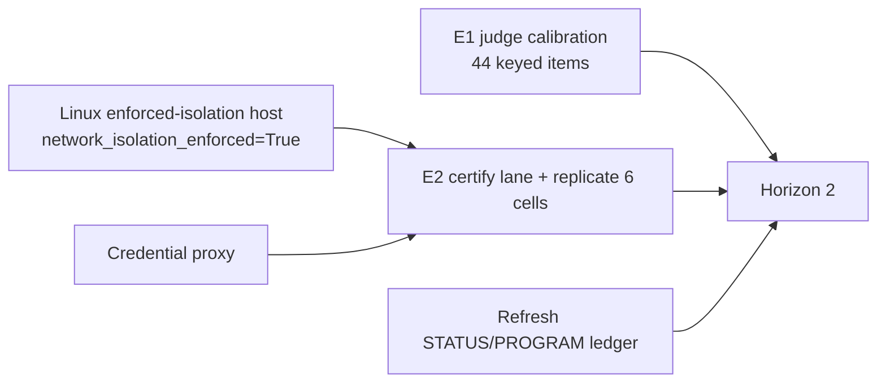

# Eval Lab — Future Research and Experiment Roadmap

- **Author:** Analyst
- **Evidence pin:** `origin/main` @ `24763988` — wave-2 evidence merged via PR #309, C2 gate via #310, and the C1 features this memo cites merged via PR #303. The two state
  reports this memo builds on are pinned to `3fc3c33f`; where a count has moved
  since, this memo recomputes it at `24763988` and says so.
- **Method:** direct re-derivation of every numeric claim from primary artifacts.
  No billable model call, no broad suite, no writes outside `research/roadmap/`.
- **Convention:** `[OBSERVED]` is read from a cited path or recomputed here.
  `[INFERENCE]` is reasoning over observations. `[FORECAST]` is a prediction that
  the current evidence base cannot settle.

---

## 0. What this memo is for

The instrument is built and the measurements are not. Section 1 fixes exactly
what the Z.ai pilot did and did not establish; sections 2–5 rank what to run
next by decision value and state honestly which analyses will refuse; sections
6–9 cover the infrastructure that gates admissibility, what not to build, and
five claims this program could actually settle.

Two structural points precede all of it.

**Model access and model capability are separate axes** (§1.5). A lane that
returns HTTP 429 produced no trial and must never appear as a zero.

**Wave 2 relocated the interesting failure** (§1.6). Across 27 scored trials,
failure concentrates in Action Memory at 64k, where **outcomes differed by seed and
not by arm within the two observed 64k seeds**, and the Action Memory failure classes **differ by dose and by lane** — a duplicate read at 16k with intact coverage, an omitted handle plus a near-typo at 64k seed 1337, reordered batches for Full at seed 42. My earlier single-mechanism framing is retracted (§1.6). That revises three of the six claims in
§9 and changes what E3 should sample. Both design changes it implies need generator
work before any trial can run (§3.1).

The single most consequential number in this document is **`clearance_n = 20`**
(`src/evallab/analysis_capability.py:387`) against **18 pilot trials**. T1.1
refuses the entire pilot as `UNDERPOWERED` by two trials. Everything in section 2
is ordered by that fact.

---

## 1. Current evidence state after the Z.ai promotion

### 1.1 Audited facts — recomputed here, not transcribed

Every figure below was re-derived from the promoted bundles at `24763988` by
reading `verifier_result.rewards.reward` and `agent_result` per trial, and by
walking `agent/trajectory.json`.

| Cell (bundle under `research/evidence/runs/`) | n | reward 1.0 | mean | prompt | completion | cached |
|---|---:|---:|---:|---:|---:|---:|
| `zai-flash-funcdag-easy-r3-20260829` | 3 | 2 | 0.667 | 94,859 | 922 | 62,592 |
| `zai-flash-action-clean4k-r3-amd64-egress` | 3 | 3 | 1.000 | 96,167 | 948 | 67,584 |
| `zai-flash-action-neutral16k-r3-amd64-egress` | 3 | 3 | 1.000 | 201,390 | 7,053 | 164,352 |
| `zai-flash-action-semantic16k-r3-amd64-egress` | 3 | 2 | 0.667 | 275,590 | 7,144 | 216,064 |
| `zai-flash-recovery-transient5xx-p1-r3-amd64-verifier` | 3 | 2 | 0.667 | 142,365 | 1,464 | 115,200 |
| `zai-flash-recovery-clean-twin-r3-amd64-verifier` | 3 | 3 | 1.000 | 70,377 | 521 | 52,288 |
| **Total** | **18** | **15** | **0.833** | **880,748** | **18,052** | **678,080** |

`[OBSERVED]` All six cell rows, the three token totals, the 18/15 counts, the
104 projected ATIF steps and the 466 projected tool calls reproduce the pilot
report (`research/evidence/zai-opencode-mcp-pilot-2026-08-29.md:24-30,96-102`)
**exactly**. 18/18 documents declare `ATIF-v1.7`.

`[OBSERVED]` `agent_result.cost_usd` is `null` on **18/18** trials. The report's
refusal to make a cost claim is therefore a property of the data, not editorial
caution. Total observed billable spend in the repository remains **$0.01188**,
all of it from `canary-syn-funcdag-suite-analysis-manifest.json`; the Z.ai lane
is subscription-metered and moved it by zero.

`[OBSERVED]` The FuncDAG failure mode is independently corroborated rather than
taken on report. Parsing every `result.json` under the bundles, exactly one file
fails: the agent's own output artifact in the FuncDAG bundle raises
`Extra data: line 2 column 1 (char 2)` — byte-for-byte the verifier error quoted
at `zai-opencode-mcp-pilot-2026-08-29.md:76`.

### 1.2 Two corrections to the pinned state reports

| Claim | Source | Recomputed at `24763988` |
|---|---|---|
| `RefusalCode` is a "closed 17-value enum" | tutor reply `:112` | **19 values.** Enumerated at `src/evallab/analysis_capability.py:72`. The two the report omits matter for this roadmap: `MISSING_NULL_ON_ZERO_DECLARATION` and `INVALID_DENOMINATOR_DECLARATION` are both declaration-contract refusals that a new campaign must satisfy before any rate is emitted. |
| 38 files in `research/calibration/trajectory-labels/`, 9 attributed / 29 legacy | tutor reply `:189-196` | **85 files: 56 attributed / 29 legacy** after the wave-2 promotion. The attributed class grew 9 → 27 → **56**; the newest bind to the wave-2 trials. All 56 are `draft_pending_research_review`, and **39/56 carry `primary_category: "unknown"`** — with 2 now explicitly `harness_failure`, which is the non-scored class surfacing in the labels as well as the summary. |

`[INFERENCE]` The second correction is the more important one and it cuts against
optimism: the pilot produced 18 new *attributed, digest-bound* labels, which is
real progress on the binding standard PR #280 established — but they are
unreviewed and mostly uncategorised, so **reviewed ground-truth labels remain
zero**. The gold-set HOLD is untouched by the pilot.

### 1.3 What the pilot established

`[OBSERVED]` Three things, and they are infrastructural rather than scientific:

1. The Z.ai → OpenCode → Harbor 0.21 → ATIF v1.7 path executes end to end across
   all three certified MCP verticals, with zero Harbor trial exceptions after
   host adaptation.
2. All 18 trajectories are valid ATIF v1.7 and project through the trajectory
   reader — the first real input the T1 engines have ever had.
3. Promotion, redaction (R1 text digests, R2 OpenCode raw-state omission with
   explicit symlink handling) and `--verify` work on real bundles.

### 1.4 What the pilot did not establish, and why

`[OBSERVED]` Isolation is unenforced. `host_harbor_network_policy` falls back to
`public` with `network_isolation_enforced=False` and reason
`darwin-docker-cannot-enforce-no-network` (`src/evallab/harbor_network.py:70`).
The pilot ran with `network_mode` adapted to `public`, `linux/amd64` emulation,
and the auth secret readable inside the trusted task container
(`zai-opencode-mcp-pilot-2026-08-29.md:111-121`).

`[INFERENCE]` This is not a small caveat for a tool-use benchmark. Every one of
the three verticals measures behaviour that a network path can counterfeit:
FuncDAG measures whether the agent composed the DAG rather than looked anything
up; Action Memory measures retrieval from the provided context specifically;
Recovery measures autonomous fault handling. With egress open, the *verifiers*
still bind outcomes to sealed artifacts and event journals — which is why the
outcomes remain meaningful as observations — but no claim of the form "the agent
solved this from the provided context alone" is admissible from this lane.

`[INFERENCE]` The correct reading of 15/18 is therefore: **the harness works**.
It is not evidence about GLM-5.3-Flash, and treating it as a baseline would be
the first serious error available to this program.

### 1.5 Model access is a separate axis from model capability

`[OBSERVED]` Now promoted:
`research/evidence/zai-opencode-mcp-wave2-summary.json` records the Highspeed
access failure under `non_scored_attempts` with
`classification: "provider_access"` and `include_in_reward_denominator: false`, and
both accessible lanes appear in the 27 scored `rows`.

| Lane | Access | Model outcome |
|---|---|---|
| `zai-coding-plan/glm-5.3` (full) | accessible | passed the depth-5 seed-42 FuncDAG canary |
| `zai-coding-plan/glm-5.3-flash` | accessible | passed the same depth-5 seed-42 FuncDAG canary |
| `zai-coding-plan/glm-5.3-highspeed` | **not in the subscription — HTTP 429** | **none. No trial ran.** |

**The Highspeed 429 is an access-control fact and carries no capability
information.** It must never enter a results table, a denominator, or a refusal
rate. `[INFERENCE]` The failure mode to guard against is exactly the one the
repository already guards for verifiers: a missing outcome silently becoming a
zero. A 429 means the trial did not happen, so the correct record is an excluded
lane with a stated reason, not a scored trial. This mirrors how the pilot handled
its own pre-scoring setup failures — those earlier jobs were excluded from model
outcome counts because they failed before a valid scored trial
(`research/evidence/zai-opencode-mcp-pilot-2026-08-29.md:159-163`).

`[OBSERVED]` The repository already has the right vocabulary for this: the
DeepSeek screen sits at `blocked_pending_linux_certification_and_fresh_credential`
with **n = 0**, not at a rate of 0.0. Highspeed should be recorded the same way.

**Two consequences for the plan.** First, the paired contrast no longer needs a
second *provider*: full-vs-Flash within `zai-coding-plan` holds provider,
harness, adapter and credential path constant and varies only the model tier,
which is a materially stronger design than DeepSeek-vs-Z.ai. E5 is rewritten
accordingly. Second, both tiers clearing the **depth-5** canary — the deepest
FuncDAG depth available — is the first direct evidence for claim C5: if the
hardest configured depth is at ceiling for both tiers, FuncDAG depth cannot rank
them, and §3.2's expansion must lean on distractor count rather than depth.

### 1.6 Wave-2 outcomes — now promoted, and re-derived from the artifacts

`[OBSERVED]` Wave 2 is **merged** at `origin/main` `24763988` (PR #309), so
everything below is read from committed files on `main` rather than reported. Sources:
`research/evidence/zai-opencode-mcp-wave2-2026-08-29.md`,
`research/evidence/zai-opencode-mcp-wave2-summary.json`,
`research/evidence/zai-wave2-action64-handle-audit.json`, and thirteen
`research/evidence/runs/zai-*` bundles.

**Totals: 27 scored trials, 18 passes.** `[OBSERVED]` The summary's `aggregate`
block and its 27 `rows` reconcile exactly — row count, pass count and summed
`prompt_tokens` all agree (18,724,686 prompt, 110,022 completion, 18,095,360
cached, 752 steps, 2,915 tool calls). This supersedes the 25/17 figure I carried
from the interim reports; the two additional scored trials are the
`timeout-multiplier=3` scaffold pair, one of which passed.

**Non-scored attempts are excluded in the data itself**, not merely in prose:

| Job | Classification | Count | In reward denominator |
|---|---|---:|---|
| `zai-wave2-action64k-s1337-sequential-scaffold` | `harness_budget` (AgentTimeoutError) | 2 | **false** |
| `zai-wave2-highspeed-paired-mini` | `provider_access` (HTTP 429, subscription lacks `glm-5.3-highspeed`) | 1 | **false** |

`[INFERENCE]` The promotion carries `include_in_reward_denominator: false` as a
field. That is the C6 discipline (§9) implemented as a schema rather than a
convention, which is the right place for it.

#### Per-cell outcomes

| Family | Cell | Arm | Seed | Lane | n | pass |
|---|---|---|---|---|---:|---:|
| funcdag | depth_5 | — | 42 | Flash | 1 | 1 |
| funcdag | depth_5 | — | 42 | **Full** | 1 | 1 |
| funcdag | depth_5 | — | 101 | Flash | 1 | 1 |
| funcdag | depth_5 | — | 2024 | Flash | 1 | 1 |
| funcdag | name_similarity_high | — | 42 | Flash | 1 | 1 |
| funcdag | name_similarity_high | — | 101 | Flash | 1 | 1 |
| funcdag | name_similarity_high | — | 2024 | Flash | 1 | **0** |
| action | 64k | neutral | 42 | Flash | 1 | 1 |
| action | 64k | semantic | 42 | Flash | 1 | 1 |
| action | 64k | semantic | 42 | **Full** | 1 | **0** |
| action | 64k | neutral | 1337 | Flash | 3 | **0** |
| action | 64k | semantic | 1337 | Flash | 3 | **0** |
| action | 64k | neutral | 1337 | Flash, **scaffold** | 1 | 1 |
| action | 64k | semantic | 1337 | Flash, **scaffold** | 1 | **0** |
| recovery | persistent-signature-error | clean/fault | 42, 1337 | Flash + Full | 5 | 5 |
| recovery | silent-wrong-payload | clean/fault | 42, 1337 | Flash | 4 | 4 |

`[OBSERVED]` FuncDAG depth 5 is **4/4**; name-similarity-high is **2/3**, failing at
seed 2024. Recovery is **9/9** across both classes and both arms — one more than the
8/8 I previously recorded, because Full also ran a persistent fault at seed 42.

**No ranking claim.** `[OBSERVED]` The two lanes overlap on three cells at n=1 each.
Full failed the 64k semantic seed-42 cell Flash passed, and passed depth-5 and a
persistent-fault recovery cell. §4.2 shows MDE is undefined below n=40 at these
baselines.

#### RETRACTED: my "complete-but-reordered, coverage intact" mechanism

**I claimed the six 64k seed-1337 failures were complete 257-read retrievals,
reordered, with intact coverage and one repeat-stable signature. Every part of that
is wrong.** The error was reading the verifier's `observed_reads == expected_reads`
as *set* equality. A count can match while the set is wrong.

`[OBSERVED]` The promoted audit (`zai-wave2-action64-handle-audit.json`) settles it:

| Field | Value |
|---|---|
| trials | 6 |
| `missing_handle` — **the same one in all six** | `ctx_2110473c018845ab0cc32bf4` |
| `all_missing_same_expected_handle` | `true` |
| substituted near-typo | `…c32bf6` ×5, `…c32bf3` ×1 — differing in the **final character** |
| `content_read_counts` | **256, 256, 256, 256, 256, 257** — not 257 |
| `unique_content_handle_counts` | 256 in all six |
| `issued_counts` | 257 ×5, **259** ×1 |
| `first_mismatch_indexes` | **2, 2, 10, 83, 83, 83** |
| `not_found_counts` | 1 ×5, 2 ×1 |
| `all_atif_match_event_order` | **`true`** |

`[OBSERVED]` So coverage is **incomplete** — 256 unique content handles against 257
expected — and the six failures are **not one signature**: the substituted handle,
the first-mismatch index and the read count all vary. Two of my own interim figures
were also wrong and are corrected here: the mismatch indexes are **2/2/10/83/83/83**,
not 1/3/10/19, and the read counts are **256**, not a complete 257.

**The capture-order control holds.** `[OBSERVED]`
`all_atif_match_event_order: true` — ATIF issuance order equals benchmark-event
order in all six. The reordering is agent-side, not server- or capture-side. That is
worth more than the pattern it protects.

#### The comparator cells make the contrast sharp

`[OBSERVED]` Same audit, `comparators`:

| Trial | Lane | reads | issued | missing | extra | first order mismatch | prefix mismatches |
|---|---|---:|---:|---|---|---|---:|
| `…5Udx2Ac` neutral s42 | Flash | 257 | 257 | none | none | none | 0 |
| `…CrxsJ57` semantic s42 | Flash | 257 | 257 | none | none | none | 0 |
| `…ZppWXWx` semantic s42 | **Full** | 258 | 258 | **none** | `ctx_07885d…` (dup ×2) | **index 1** | **39** |

`[INFERENCE]` Three distinguishable behaviours at one dose. Flash at seed 42 is
exact on both arms. Flash at seed 1337 **omits one handle and substitutes a
near-typo**. Full at seed 42 achieves **complete coverage but reorders heavily** — 39
order mismatches in the shared prefix, first at index 1, plus one duplicate. Coverage
failure and ordering failure are separable, and they occur in different places.

#### Supported mechanism, at its actual strength

`[INFERENCE]` A **three-part agent-side hypothesis**, not an established mechanism:

1. **Opaque-handle transcription.** All six seed-1337 failures omit the *same*
   handle and substitute one differing in a single trailing character. Long opaque
   identifiers are being copied, and copied wrongly, at a reproducible location.
2. **Batching / sequence maintenance.** Full's seed-42 failure retrieved everything
   but reordered 39 positions, which is a chunking-strategy artifact rather than a
   lapse.
3. **Position dependence, weakly.** First-mismatch indexes cluster at 2 and 83 rather
   than spreading uniformly, which hints at structure but on six trials is not a
   finding.

`[INFERENCE]` **No capacity claim is supported.** Flash carried the identical
257-read load at the identical dose with exact coverage and exact order at seed 42,
so "64k is too much context" is contradicted within the same cell.

#### The 16k comparison — a different failure class

`[OBSERVED]` I ran the same reconstruction on the three promoted wave-1 semantic 16k
trials. The failing one (`…Ris4ZwC`): 65 issued, 66 calls, 65 unique, **zero
omitted, zero never-issued**, one duplicate (`…f81aa9`), prefix order matching. Both
passing trials exact.

`[INFERENCE]` So 16k failed by **redundancy with complete coverage**, while 64k
seed-1337 fails by **omission plus substitution**. These are different classes, and
my earlier single-mechanism framing collapsed them. `[OBSERVED]` Note also that
`observed_reads` appears in the verifier result **only on failure**, so it cannot
serve as a general retrieval signal even where it is sufficient — which it is not.

#### Sequential-retrieval scaffold: a promoted, decisive NEGATIVE result

`[OBSERVED]` The `timeout-multiplier=3` rerun is promoted as
`research/evidence/runs/zai-wave2-action64k-s1337-sequential-scaffold-t3` and appears
as **2 scored rows** in the wave-2 summary. The earlier default-timeout attempts are
recorded separately under `non_scored_attempts` as `harness_budget`, excluded from
the denominator.

| Arm | reward | coverage (verifier) | prompt tokens | steps | tool calls |
|---|---|---|---:|---:|---:|
| neutral | **1.0** | `read_events: 257`, complete retrieval | 6,683,558 | 261 | 259 |
| semantic | **0.0** | `observed_reads: 232` of `expected_reads: 257` — **incomplete** | 7,454,261 | 236 | 234 |
| total | 1 pass / 1 fail | | **14,137,819** | | |

**Cost, against the promoted unscaffolded 64k mean of 412,753 over 9 rows:**

| Comparison | Result |
|---|---|
| per-trial multiplier | **16.19×** neutral, **18.06×** semantic |
| one trial vs the whole 36-trial phase A ceiling (7,000,000) | **95%** / **106%** |
| both vs the entire provider token budget (9,500,000) | **1.49×** |
| both vs the full phase A projection (6,291,672) | **2.25×** |
| scaffold trials affordable under the phase A ceiling | **zero** |

`[INFERENCE]` **Falsified as a general fix, and the verdict does not rest on cost.**
One pass and one *incomplete* failure — the semantic arm stopped 25 reads short at
232/257, a **third distinct failure class**: not omission-plus-substitution, not
redundancy, but truncated coverage under a 3× budget. An intervention producing one
pass and one novel failure mode has not fixed the mechanism.

`[INFERENCE]` The cost then removes it from consideration: a single scaffolded trial
consumes roughly the entire budget of the 36-trial phase A campaign, so scaffolded
arms cannot be budgeted at any ceiling in this memo. Any future scaffold arm needs
its own authorization.

`[INFERENCE]` It also redirects the next intervention. If one-handle-per-turn does
not fix retrieval and costs 16–18×, turn granularity is not the lever. The audit
points at **opaque-handle transcription**, so the intervention that addresses it
changes **how handles are represented** — indices, ranges, batched references —
rather than how many turns they span. That should *reduce* tokens rather than
multiply them (E0b).

#### The seed-1337 arm contrast, bounded

`[OBSERVED]` At 64k unscaffolded, seed 1337 is **0/3 neutral and 0/3 semantic** —
arm difference exactly zero on n=6 — while seed 42 is 2/2 for Flash. `[OBSERVED]`
The audit shows the *same* missing handle across both arms, which is why the arm
makes no difference there: the fault is bound to the identifier set, and both arms
share it at a given seed.

`[INFERENCE]` This still does not refute an all-dose semantic effect. `[OBSERVED]`
Wave 1 at 16k was neutral 3/3 versus semantic 2/3, pointing the other way on a
one-trial difference. And **seed changes generated content, identifier assignment and
required order together**, so no seed contrast can isolate which of the three matters
— which is exactly what E0b is designed to do.

### 1.7 Forecast, stated as such

`[FORECAST]` A future full-vs-Flash contrast is likely to refuse ranking unless
E3/E4 first identify cells with outcomes away from ceiling. The currently
overlapping full/Flash evidence is only three cells at n=1 per lane and cannot
estimate a paired model effect. E5 therefore samples only cells that discriminate
in E3/E4 and treats an MDE refusal as a result about the cell inventory, not as
evidence that the models are equivalent.

---

## 2. Ranked next experiments by decision value

Ranked by information gained per unit of unblocking, not by novelty. Each entry
carries exact cells, lanes, seeds, repetitions, controls, estimand, refusal
criteria, and a stop/go rule.

### Rank 1 — E0a: offline issued-handle vs requested/event audit

**Rank 1. Why ahead of everything.** `[OBSERVED]` It needs no trials, no host, no
generator change and no credential — `benchmark-events.jsonl` is already promoted —
and it is the only thing that separates coverage faults from ordering faults from
transcription faults. My retracted mechanism claim in §1.6 exists precisely because
this had not been done.

- **Input:** every promoted bundle carrying
  `artifacts/app/output/benchmark-events.jsonl`, plus the wave-2 64k trials once
  promoted.
- **Method, updated by PR #303 (§7.0):** read the landed fidelity columns —
  `handle_set_match`, `unknown_handle_count`, `duplicate_handle_count`,
  `handle_order_match`, `handle_coverage_rate` — from `v_action_memory_baseline`.
  Then **independently reconstruct from raw events on the six known failures to
  validate the producer**, comparing issued set, requested sequence and
  `event_ordinal`. **Never use `observed_reads`.** The validation step is not
  ceremony: I reached a wrong conclusion by trusting a derived count, and a
  producer bug would launder that same error into every downstream query.
- **Report per trial:** omitted handles, never-issued (typo) handles with their edit
  distance to the nearest issued handle, duplicates, first mismatch position, and
  whether requested order matches issued order.
- **Already partially executed** in §1.6 against the three wave-1 semantic 16k
  trials — which is what established that 16k and 64k are different classes.
- **Producer acceptance, stated in the producer's own definitions** (not the
  audit's), from the promoted wave-2 bundles:
  - all six seed-1337 failures: `handle_set_match = false`,
    `handle_coverage_rate = 256/257`, `unknown_handle_count >= 1`
  - Full's seed-42 semantic trial: `handle_order_match = false` with
    `handle_set_match` reflecting **complete** coverage and
    `duplicate_handle_count >= 1`
  - Flash seed-42 both arms: `handle_set_match = true`,
    `handle_coverage_rate = 1.0`, `unknown_handle_count = 0`
- **One definitional gap to resolve first, not paper over.** `[OBSERVED]`
  `unknown_handle_count` counts **occurrences** (`:269-270`), while the promoted
  audit's `not_found_counts` records 1 for five trials and 2 for the 259-read one.
  For that trial the audit lists extras `…c32bf6`, `…c32bf6`, `…1b587b` — three
  occurrences. So the producer should report **3** where the audit reports 2, because
  they count different things. `[INFERENCE]` I predicted "2" in an earlier draft by
  borrowing the audit's field, which is the same class of error as trusting
  `observed_reads`: **reusing a number without checking its definition.** Reconciling
  the two definitions is the first output of E0a, not an afterthought.
- **Stop/go:** if the fidelity columns reproduce the audit, transcription leads and
  E0b is designed around it, with `unknown_handle_count` as the primary outcome. If
  they disagree with the raw reconstruction, resolve that before any design work.

### Rank 2 — E1: judge calibration on the 44 keyed items

**Rank 2.** It requires **no agentic benchmark run**, no isolation host, no rater
recruitment and no $K_{\text{eff}}$ clearance, because its ground truth is
*constructed*. That is narrower than "zero unblocking", which an earlier draft
claimed and which was too broad.

`[OBSERVED]` What it does require: **132 grader model calls per arm** (44 keyed items
× 3 repetitions at temperature 0), and therefore an **authorized and available grader
lane**. `allow_billable` defaults `False`
(`src/evallab/execution_contracts.py:209`) and billable work needs a
`PaidRunAuthorization` with a daily ceiling, so E1 is gated on that authorization
even though it touches no benchmark task. `[INFERENCE]` The deterministic lexical
control arm needs no model calls at all, so it can run first and for free — and it is
the arm that decides whether the corpus measures diagnosis or surface form.

`[OBSERVED]` Corpus verified at `research/calibration/`: two families, each with
22 graded variants plus a `corpus` index file and 22/22 answer keys.

| Class | `checkout-pool-exhaustion` | `retry-storm-backlog` |
|---|---:|---:|
| `correct-*` | 5 | 5 |
| `subtly-wrong-cause-*` | 5 | 5 |
| `right-cause-useless-actions-*` | 4 | 4 |
| `fabricated-evidence-*` | 3 | 3 |
| `style-only-fluent-*` | 3 | 3 |
| `copied-evidence-logs` | 1 | 1 |
| `empty` | 1 | 1 |
| **Total** | **22** | **22** |

- **Cells:** 44 items = 2 families × 22 variants.
- **Lane:** one grader model, plus a **deterministic control** that scores by
  keyword overlap only. The control exists to falsify the whole exercise: if the
  lexical control matches the model's per-class discrimination, the corpus is
  measuring surface form and not diagnosis.
- **Seeds/reps:** grading is a single forward pass per item; 3 repetitions per
  item at temperature 0 to measure self-consistency, 132 grader calls per arm.
- **Primary estimand:** per-class accuracy against the constructed key, reported
  as a 7×7 confusion matrix. **Never a single accuracy number** — the classes are
  deliberately unequal and pooling them hides the only interesting failure.
- **The discrimination that matters:** `correct-*` vs `subtly-wrong-cause-*` (is
  the grader reading the causal claim?) and `correct-*` vs
  `right-cause-useless-actions-*` (is it reading the actions?).
- **Refusal criteria:** if self-consistency across the 3 repetitions is below
  100% on the `empty` and `copied-evidence-logs` items, report the instability and
  refuse the per-class matrix — those two classes are unambiguous by construction,
  so disagreement on them indicates a grading-harness defect, not model nuance.
- **Stop/go:** GO to E2 regardless of outcome; E1 does not gate anything. But if
  the grader cannot separate `correct` from `style-only-fluent`, **stop treating
  any model-graded trajectory judgment as evidence** until the grader is fixed.
  That is a real possible outcome and it would change the interpretation plane's
  entire roadmap.

### Rank 3 — E2: Linux enforced-isolation and credential-proxy lane certification

**Rank 3.** It converts the pilot lane from infrastructure evidence into an
admissible one. It re-runs the same cells, seeds and repetitions — but it is
**lane certification plus replication, not a one-variable replication**, and that
distinction changes what its outcome can mean.

`[OBSERVED]` Four consequential factors move together between the two lanes:

| Factor | Pilot lane | Certified lane |
|---|---|---|
| host / platform | Apple Silicon Darwin | Linux |
| network mode | `public`, `network_isolation_enforced=False` | enforced no-network |
| image architecture | `linux/amd64` under emulation | native, or a different platform path |
| credential handling | read-only secret mount inside the task container | credential proxy outside it |

`[INFERENCE]` So a divergence **cannot be attributed to egress specifically**. Any of
platform, emulation, isolation or credential path could produce it, and the design
has no way to separate them. Divergence therefore **triggers investigation** — most
cheaply by re-running one cell while varying one factor — rather than licensing a
conclusion.

`[INFERENCE]` Equally, divergence does **not automatically retire every pilot
statement.** The pilot's per-cell outcomes remain what they were: observed results on
a described lane. What divergence would retire is the assumption that those outcomes
*transfer* to the certified lane, which is a narrower claim and the only one E2 was
ever able to test.

- **Cells:** the identical six from §1.1, seed 42, `--n-attempts 3`.
- **Lane:** `zai-coding-plan/glm-5.3-flash`, OpenCode pinned `1.18.25`, Harbor
  `0.21`, ATIF v1.7.
- **Admission gate:** `network_isolation_enforced` must read `True`. This is the
  **admission gate for the lane, not a sole experimental variable** — the four
  factors tabulated above change together with it. They are **recorded, not held**,
  so a divergence is **not attributable** to any one of them.
- **Primary estimand:** per-cell agreement with §1.1, plus the pooled
  18-trial rate. **Not** a capability estimate.
- **Refusal criteria:** if `network_isolation_enforced` is `False`, abort and
  report the host as uncertified. Do not run cells on a host that cannot enforce.
- **Stop/go:** if the certified-lane rates agree with §1.1, §1.1 becomes a valid
  pre-registration of the enforced lane and the pilot's cells carry forward. If they
  differ, **open a factor-isolation investigation** rather than drawing a
  conclusion: the four factors above moved together, so the divergence localises to
  the *lane*, not to egress. `[INFERENCE]` The cheapest next step would be a single
  cell varying one factor at a time, and the pilot's per-cell observations stay valid
  as statements about the lane they were measured on.

### Rank 4 — E0b: handle-representation pilot on the certified lane

**Why this manipulation, and why it replaced the order-permutation design.**
`[OBSERVED]` The sequential scaffold falsified turn granularity as the lever:
one pass, one novel incomplete failure, at 16–18× tokens (§1.6). `[INFERENCE]` The
suspected fault is opaque-handle transcription, so the intervention should change
**handle representation** while holding content and required order fixed. Unlike the
scaffold, this should *lower* token cost, because compact references replace long
opaque identifiers.

- **Manipulation:** hold generated content **and** required read order fixed; vary
  only how handles are addressed:
  1. **opaque** — current 24-hex `ctx_…` handles (control)
  2. **indexed** — positional indices into the issued list
  3. **range** — a single request covering a contiguous span
  4. **batched** — one call carrying many handles
- **Cells:** 64k, the known-passing seed 42 and known-failing seed 1337, × 4
  representations. **8 cells, 2 reps, 16 trials.**
- **Primary estimand:** success and coverage-completeness as a function of handle
  representation, at fixed content and order.
- **Why it is the sharpest available test:** `[INFERENCE]` if indexed or range
  addressing eliminates the seed-1337 failure, transcription of long opaque
  identifiers is the binding constraint — a concrete, fixable finding about the
  benchmark's interface rather than about model capacity. If it does not, the
  transcription hypothesis is wrong and the near-typos are a symptom of something
  else.
- **Cost expectation, stated as a prediction to be checked:** `[FORECAST]` range and
  batch arms should come in **below** the 412,753 unscaffolded baseline, since they
  reduce both turns and identifier bytes. If they do not, that itself is
  informative.
- **Blocking prerequisites:** `[OBSERVED]` the generator exposes neither handle
  representation nor read order as factors — identity chunks derive from
  `f"{DOSE_AXIS_VERSION}:{seed}:{dose_bytes}"`
  (`library/benchmarks/action-memory-v1/dose_ladder.py:84-89`), and arm plus dose are
  the only declared deltas. So this needs a **generator capability plus
  re-certification**, and matched/twin key definitions are **C1-lane owned
  (PR #303)**. A coordinated build item, not a runnable cell.
- **Demoted variant:** pure order permutation at fixed content and IDs remains
  worth running *after* this, to separate sequence from representation. It is no
  longer first because representation is the axis the evidence now points at.

### Rank 5 — E3: Action Memory, cost-bounded and two-phase

**What the budget admits, and under what condition.** `[OBSERVED]` Independent review found the
earlier version of this entry advertising a 72-trial provider ceiling against a
100-trial design, with the JSON spec stating 24 cells and 72 trials while the prose
alternated 108 and 100. Reconciled here to **one** set of numbers, asserted
mechanically by `verify_roadmap_claims.py`:

| Phase | Shape | Trials | Projected input tokens | Ceiling | Budget-shape admitted after E2 |
|---|---|---:|---:|---:|---|
| A — measured doses | 4k/16k/64k × 2 arms × 3 seeds × 2 reps | 36 | **6,291,672** | 7,000,000 | **conditional** — not currently admissible |
| B — 128k cost canary | 128k × neutral × seed 42 × 2 reps | 2 | unmeasured, ≤1,250,000/trial | 2,500,000 | **conditional** — not currently admissible |
| Broad ladder | 4 doses × 2 arms × 3 seeds × 3 reps | 72 | **cannot be projected** | — | **not admissible at any ceiling** |

`[OBSERVED]` **Neither phase is runnable today.** Both depend on E2: the isolation
precondition is unmet (`network_isolation_enforced=False`, `harbor_network.py:53-70`)
and no credential proxy exists. The spec records this as
`admissibility: "conditionally_runnable"` with the unmet preconditions named. The
column above states the budget *shape* E2 would admit, not a present authorization.

`[OBSERVED]` **Per-trial input-token cost, and why the old cap was wrong.**
The 4k/16k figures are recomputed from promoted wave-1 bundles; the 64k mean is recomputed from the nine promoted unscaffolded wave-2 rows:

| Dose | Input tokens / trial |
|---|---:|
| 4k | 32,056 |
| 16k neutral | 67,130 |
| 16k semantic | 91,863 |
| 64k | 412,753 `[OBSERVED]`, n=9 |
| 128k | **never run — unmeasured** |

The previous 5,000,000 ceiling came from the wave-1 all-cell mean of ~48,931
tokens/trial, dominated by cheap low-dose cells. At the measured 64k cost it admits
**5,000,000 / 412,753 = 12.1 trials at that dose**, not the 64 high-dose trials the
design assumed — off by roughly 5×. The three *measured* doses at 3 reps alone
project to **9,437,496**, already 1.9× that cap.

- **Provider ceiling:** `max_trials = 38`, `max_prompt_tokens_budget = 9,500,000`
  (7.0M + 2.5M). `cost_usd` is null on this lane, so trials and tokens are the only
  bounds that bind.
- **Admission is fail-closed:** refuse the campaign if projected tokens exceed the
  phase ceiling, and **a dose with an unmeasured per-trial cost cannot be admitted at
  all** — it goes through a cost canary first. That is why 128k is quarantined into
  phase B rather than budgeted by extrapolation.
- **Seeds:** `[OBSERVED]` `DOSE_LADDER_SEEDS = (42, 1337, 2026)`
  (`dose_ladder.py:22`) — only three exist. The earlier 8-seed recommendation is
  outside the certified envelope and is a generator + re-certification item.
- **Reps at 2:** a cost-driven recommendation, not an established optimum. The
  seed-1337 repeats did *not* turn out to be information-free — they revealed the
  variation that falsified my single-signature reading (§1.6) — so this tradeoff is
  genuinely open.
- **Scaffolded arms are unbudgetable here.** `[OBSERVED]` §1.6: one scaffolded
  64k trial cost 6,683,558–7,454,261 prompt tokens, i.e. **95–106% of this entire
  36-trial phase A ceiling**, and the two scaffold trials together are **1.49× the
  whole provider budget**. Zero scaffolded trials fit. Any future scaffold arm needs
  its own authorization and ceiling, not a slot in this campaign.
- **Ranked after E0a, E1, E2 and E0b:** `[INFERENCE]` a broader ladder inherits the
  content/ID/order confound at every cell. Spend on isolation first.

### Rank 6 — E4: Recovery fault classes × persistence, with clean twins

**Rank 6.** `[OBSERVED]` Recovery is the only vertical with a certified
causal requirement — `causal_mutation` must be true, blind retries fail — and it
is the only one that populates T1.2's `fault_opportunity_id` unit.

- **Cells:** 5 fault classes × persistence ∈ {1, 2} × arm ∈ {fault, clean twin}
  = **20 cells**, seed 42.
- **Reps:** 3 per cell = **60 trials**.
- **Control:** the matched clean twin per fault cell. This is the strongest
  control in the repository: it holds the task and differs only in fault
  injection.
- **Primary estimand:** conditional recovery rate per fault opportunity, via
  `analyze_conditional_recovery` with its deterministic percentile cluster
  bootstrap clustered on `coalesce(repeat_group_id, trial_id)`.
- **Refusal criteria:** `ZERO_OPPORTUNITY` if fault injection did not fire;
  `MISSING_RECOVERY_OUTCOME` if the verifier did not record a recovery verdict.
  Both are informative — they indicate substrate problems, not model behaviour.
- **Stop/go:** `[OBSERVED]` The pilot's one informative failure is that both
  passing fault-arm trials used `refresh_auth` before the successful sequence
  while the failing one retried without the designated recovery mutation
  (`zai-opencode-mcp-pilot-2026-08-29.md:92`). If that pattern holds across fault
  classes, the vertical is measuring *one* learned repair move rather than
  general recovery, and the fault set needs to vary the required mutation.

### Rank 7 — E5: paired full-vs-Flash mini-lane

**Why this pairing.** `[OBSERVED]` §1.5: `zai-coding-plan/glm-5.3` and
`glm-5.3-flash` are both accessible on the current subscription. A within-provider
tier contrast holds **provider, adapter, credential path, OpenCode pin and Harbor
version constant** and varies only the model tier. `[INFERENCE]` That is a
materially cleaner contrast than Z.ai-vs-DeepSeek, where a difference could come
from the adapter, the auth path or the harness rather than the model — and the
repository already tracks `harness_version`, `scaffold_version` and
`toolset_digest` precisely because those confounds are real.

**Rank 7. Why last of the run entries.** A contrast is only worth running once the
per-arm designs are known to discriminate. Running it earlier risks the O4 trap
the tutor report names: `[OBSERVED]` the TB3 5-task screen produced all five
rewards at 0.0 on `gemini-3.7-flash-low`, so a second arm there would compare two
floors.

- **Cells:** `[OBSERVED]` wave 2 already identifies the discriminating ones.
  **Include:** FuncDAG **high name-similarity** (ran **2/3**) and Action Memory
  **64k**, seed-blocked. `[OBSERVED]` The exact 64k boundary from the merged summary:
  **3/11 including the two scaffold trials, 2/9 unscaffolded**. Quote whichever
  matches the comparison being made, and never the pooled figure for an
  unscaffolded contrast. **Exclude:** FuncDAG **depth 5** (4/4 across both lanes)
  and Recovery `persistent-signature` / `silent-wrong-payload` (9/9) — cells both
  arms pass cannot separate them.
- **Lanes:** `zai-coding-plan/glm-5.3` (full) and `zai-coding-plan/glm-5.3-flash`.
  `glm-5.3-highspeed` is **excluded as an access-gated lane with n = 0**, recorded
  the way the DeepSeek screen is recorded — never as a rate.
- **Reps/seeds:** 3 per cell, seeds carried from the parent E3/E4 design so the
  pairing key `(task_block_id, dose_bytes or fault_class, seed)` resolves exactly.
- **Primary estimand:** paired per-cell difference, full minus Flash, with
  `task_block_id` exact pairing and `refuse_to_rank_reasons` surfaced rather than
  suppressed.
- **Secondary estimand, and arguably the more useful one:** token and step cost at
  equal outcome. `[OBSERVED]` The pilot recorded ~48.9k prompt tokens per trial
  (880,748 / 18) with `cost_usd` null throughout, so a tier comparison that finds
  *equal success at unequal token volume* is a real and reportable finding about
  the lane even when success rates tie.
- **Refusal criteria:** refuse to rank unless controlled fingerprints are
  identical. §4.2 bounds what this design can support: at a 0.833 baseline nothing
  below a 0.167 effect is admissible and MDE is undefined below n=40. A tie is the
  expected result and must be reported as a tie, not as equivalence.
- **Stop/go:** if full and Flash are indistinguishable on every cell that survived
  E3/E4 selection, **stop adding arms** and route the finding to claim C5: the
  cell inventory, not the model set, is the limiting factor.

### Ranking rationale

**The section order above is the rank order.** An earlier draft listed E1 and E2
before E0a while asserting in prose that E0a outranked them, which is a
contradiction a reader should not have to resolve.

| Rank | Entry | Blocked on | Admissible output? |
|---:|---|---|---|
| 1 | **E0a** offline handle audit | nothing | yes — measurement over merged artifacts |
| 2 | **E1** keyed judge calibration | nothing | yes — constructed keys |
| 3 | **E2** Linux + proxy lane certification | host, credential proxy | not itself evidence; it is the gate |
| 4 | **E0b** handle-representation pilot | E2, generator capability, C1 coordination | yes **once E2 passes** |
| 5 | **E3** Action Memory phase A + B | E2 | calibration ledger only |
| 6 | **E4** Recovery matrix | E2 | calibration ledger only |
| 7 | **E5** full-vs-Flash mini-lane | E2 + E3/E4 discrimination | only if MDE permits (§4.2) |

`[INFERENCE]` Ranks 1 and 2 need nothing and come first for that reason alone. E0a
precedes E1 because my retracted §1.6 mechanism claim is direct evidence of what
happens without it. Rank 3 is a gate rather than a result: everything below it
produces inadmissible data until it passes.

**E0b before E2 — possible, but only as an inadmissible pilot.** `[INFERENCE]` E0b's
manipulation does not require enforced isolation to be *interesting*: it varies
handle representation, and a large effect would be informative even on an
uncertified host. But its output could not support any claim of the form "the agent
solved this from the provided context alone", because open egress is an alternative
explanation for improved retrieval. If it is run early it must be labelled a
**pilot on an uncertified lane**, recorded under the calibration ledger, and
re-run after E2 before any finding is quoted. That is a deliberate choice available
to Peter, not a default.

---

## 3. Concrete expansion plan per vertical

### 3.1 Action Memory — dose and semantic arms

`[OBSERVED]` Dose structure available: 4k/16k/64k/128k bytes × seeds 42/1337/2026,
certified in #262 and #275.

`[OBSERVED]` The pilot ran exactly one dose pair (16k neutral vs semantic) at one
seed. Observed 3/3 vs 2/3 — **a difference of one trial**.

**Design change forced by wave 2, and the repeats sharpen it.**
`[OBSERVED]` §1.6: at 64k, outcomes differed by seed and not by arm within the
two observed seeds — seed 1337 is 0/6 across both arms, seed 42 is 2/2.

`[INFERENCE]` The six failures share an outcome but **not a signature**: the
substituted handle, mismatch position and read count all vary. So repetition at a
failing high-dose seed is *not* information-free — it revealed the variation that
falsified my original single-signature reading. The breadth-versus-depth tradeoff is
therefore genuinely open, and offered only as a **recommendation**:

| Level | Cost-bounded E3 design | Deferred expansion |
|---|---|---|
| 4k, 16k, 64k | 3 seeds × 2 arms × 2 reps = 36 trials | More seeds or a third rep require a new ceiling |
| 128k | Neutral, seed 42 × 2 reps = 2 cost-canary trials | No arm contrast until measured cost supports a separately authorized expansion |

E3 is therefore **38 trials**: the 36-trial measured-dose phase A plus the
two-trial 128k cost canary in phase B. The broader 72-trial ladder remains
explicitly not runnable because 128k cost is unmeasured. An earlier eight-seed,
100-trial recommendation is outside the certified generator envelope and the
provider ceiling; it is not E3.

`[INFERENCE]` If high-dose outcomes really are largely seed-determined, the more
informative quantity is **the fraction of seeds that fail** rather than a success
rate pooled over trials. The current three-seed envelope can only screen that
hypothesis. Phase A keeps `neutral_padding` and `semantic_distractor` matched on
dose and seed with arm as the declared single delta, so its contrast can isolate
semantic interference from context length at the three measured doses. Phase B
measures cost only and supports no semantic-arm claim.

Additional instrumentation, no new schema required: the semantic failure was a
*duplicate retrieval* (66 reads where 65 were expected, one chunk ID twice,
`reason: incomplete_or_reordered_context_retrieval`). `[OBSERVED]` The existing
feature set already carries `tool_call_count`, `unique_tools_count` and
`repeated_command_count`, so retrieval-duplication is measurable from features
already registered.

### 3.2 Function DAG — difficulty and generalization

`[OBSERVED]` Available: depth 3–5, width 2–4, distractors 2–6 × seeds 42/101/2024,
certified #263/#289. The pilot ran `syn-funcdag-easy` only.

Expansion: depth ∈ {3,4,5} × distractors ∈ {2,4,6} at width 3, seeds {42,101,2024},
3 reps = **81 trials**. Width held at 3 to keep the grid affordable; width is the
axis with the weakest prior reason to matter.

`[OBSERVED]` **Depth 5 produced no failures in four observed trials across
both lanes; high name-similarity produced one failure in three.** That does not
establish that depth is exhausted or saturated — four trials at one depth cannot
show a ceiling. It does make **name-similarity the current candidate difficulty
axis**, since it is the only FuncDAG factor to have produced a failure so far, and
it is already a certified generator parameter (`name_similarity`, a registered dose
field). `[INFERENCE]` On that basis, weight name-similarity × distractor count at
depth 5 and treat depths 3–4 as lower priority — not as established-easy.

`[OBSERVED]` The pilot's only FuncDAG failure was **not** a reasoning failure: the
agent computed the target correctly and then wrote a diagnostic scalar before the
JSON document, so the verifier rejected the artifact. `[INFERENCE]` This is an
output-format failure masquerading as a capability failure, and it is exactly the
confound `evaluate_process_outcome_gate` exists to detect — process evidence said
success, outcome said failure. **Any FuncDAG expansion must report
format-rejection separately from wrong-value rejection**, or the difficulty curve
will be contaminated by artifact hygiene.

### 3.3 Recovery — fault classes, persistence, clean twins

`[OBSERVED]` Available: 5 fault classes × persistence 1–2, matched clean twins,
AES-256-GCM sealed envelope, causal recovery required (#261). The pilot ran one
class (`transient-http-5xx`) at persistence 1.

Expansion (= E4): the full 5×2 grid with twins, 60 trials. Persistence 2 is the
axis most likely to separate genuine recovery from a single retry, because a
one-shot retry cannot clear a fault that persists.

`[OBSERVED]` Wave 2 already ran two of the five classes —
`persistent-signature` and `silent-wrong-payload` — clean and fault, 9/9.
`[INFERENCE]` Two consequences. First, the single-repair-move hypothesis (C2) is
**weakened but not settled** — two distinct class-appropriate repair moves were
observed, and three of five classes remain unrun (§1.6, §9). Second, the remaining
value in E4 is concentrated in those **three unrun classes** and in **per-trial
`causal_mutation` verification for `silent-wrong-payload`**, where a blind retry is
most likely to be scored as recovery. Covering the unrun classes is worth more than
re-running the two that passed.

### 3.4 The 44-item keyed judge calibration

Covered as E1. The one design decision worth stating: **report the 7×7 confusion
matrix, not accuracy.** `[INFERENCE]` A grader that scores 40/44 by getting every
`correct-*` and every `empty` right while confusing `subtly-wrong-cause` with
`correct` is *worse than useless* for trajectory judgment, and a single accuracy
number would present it as strong.

### 3.5 The paired second-model contrast

Covered as E5, and the pairing changed on new evidence.

`[OBSERVED]` §1.5: `glm-5.3` (full) and `glm-5.3-flash` are both accessible;
`glm-5.3-highspeed` is not in the subscription and returned HTTP 429 with **no
model outcome**.

`[INFERENCE]` **Prefer full-vs-Flash within `zai-coding-plan`** over any
cross-provider pairing. It holds provider, adapter, credential path, OpenCode pin
and Harbor version constant, so the only declared delta is the model tier. A
Z.ai-vs-DeepSeek difference, by contrast, is confounded by adapter and auth path —
and those confounds are tracked as consequential fields (`harness_version`,
`scaffold_version`, `toolset_digest`) precisely because they are known to matter.

DeepSeek and the TB3 `luna` arm remain available but drop below full-vs-Flash:
`[OBSERVED]` DeepSeek is `blocked_pending_linux_certification_and_fresh_credential`,
and the TB3 screen's five all-zero rewards mean adding an arm there measures a
floor.

**Access gating is recorded separately from capability.** Highspeed enters the
plan as an excluded lane with n = 0 and a stated reason, never as a scored trial
or a refusal rate.

---

## 4. Minimum evidence and sample-size logic

This section uses the repository's own estimators. Every number below was
computed by calling `evallab.cohort.minimum_detectable_effect` and
`required_tasks_for_effect` at `24763988`. Nothing is asserted from a formula
written here.

### 4.1 The hard gate: `clearance_n = 20` against 18 trials

`[OBSERVED]` `evaluate_process_outcome_gate(..., clearance_n: int = 20)`
(`src/evallab/analysis_capability.py:387`), and the gate is
`if len(populated) < clearance_n: refusal_code = RefusalCode.UNDERPOWERED`
(`:366-367`).

The pilot has **18** scored trials. **T1.1 refuses the entire pilot cohort as
`UNDERPOWERED`, short by two trials.** This is not a judgement call; it is the
default parameter meeting the data.

### 4.2 What the pilot's own baseline permits

At the pilot's observed pooled rate of 0.833, the repository's estimator returns:

| n_tasks | MDE at baseline 0.833, ρ=0 |
|---:|---|
| 18 | **undefined** |
| 20 | **undefined** |
| 30 | **undefined** |
| 40 | 0.1659 |
| 50 | 0.1543 |
| 60 | 0.1450 |
| 80 | 0.1307 |
| 100 | 0.1201 |

`[OBSERVED]` MDE is **first defined at n = 40**. Below that the estimator returns
`None`, meaning no effect in the admissible range is detectable at 80% power.

`[OBSERVED]` The admissible range itself is bounded: at baseline 0.833 an attempt
effect must be below `1 − 0.833 = 0.167`, and `required_tasks_for_effect` raises
`ValueError` for anything larger. Required n inside that range:

| attempt effect | ρ=0.0 | ρ=0.3 | ρ=0.5 |
|---:|---:|---:|---:|
| 0.050 | 762 | 536 | 385 |
| 0.080 | 269 | 191 | 140 |
| 0.100 | 159 | 115 | 86 |
| 0.120 | 101 | 75 | 58 |
| 0.150 | 55 | 45 | 38 |
| 0.166 | 40 | 38 | 37 |

`[INFERENCE]` Read together, these two tables say something uncomfortable and
important: **a ceiling-adjacent baseline is a bad place to run a comparison.**
At 0.833 the only detectable effects are large ones, and detecting even a 10-point
drop needs 159 paired tasks. The pilot's cells are too easy to compare models on.
E3/E4's value is partly that harder dose/fault levels should move the baseline
away from ceiling, where the same n buys a much smaller MDE.

### 4.3 The design-effect gap, stated precisely

`[OBSERVED]` `src/evallab/power.py` is **60 lines** and contains **zero**
occurrences of `icc`, `design_effect`, `deff`, `rho` or `cluster`. Its only
correlation parameter is `pair_correlation`, consumed by:

```python
def _paired_variance(p0, p1, correlation):
    covariance = correlation * math.sqrt(p0 * (1 - p0) * p1 * (1 - p1))
    return max(p0 * (1 - p0) + p1 * (1 - p1) - 2 * covariance, 0.0)
```

`[OBSERVED]` The covariance term is **subtracted**. Positive correlation therefore
*reduces* variance and *reduces* required n — visible in §4.2, where ρ=0.5 cuts
the n for a 0.10 effect from 159 to 86.

`[INFERENCE]` This is the sharp form of the gap the tutor report names as "no ICC
term". A clustered design effect *multiplies* variance upward by
$1 + (m-1)\rho$. The existing module can only ever make a study look *smaller*
than independence, never larger. So `pair_correlation` cannot be repurposed as an
ICC proxy: doing so would systematically **undersize** any clustered campaign,
including the gold-set campaign that needs $K = \max(30, 96\rho)$. A design-effect
term is a genuine prerequisite for Horizon 3 sizing, and it is the one piece of
new machinery this memo does recommend building (§7).

### 4.4 Pilot-only versus reportable

| Design | n | Status |
|---|---:|---|
| Pilot six cells (§1.1) | 18 | **Pilot only.** Below `clearance_n`; unenforced isolation; single seed. |
| E1 judge calibration | 44 items × 3 reps | **Reportable** on its own terms — constructed keys, per-class matrix. Not a model-capability claim. |
| E2 isolation replication | 18 | **Pilot only** by n, but *decisive* as a validity check. A replication does not need power to falsify a contamination hypothesis. |
| E3 Action Memory phase A + cost canary | 38 | Clears global `clearance_n`; calibration-ledger arm/dose contrasts only. T1.1 still refuses unless both outcome strata satisfy its display gate. |
| E4 Recovery matrix | 60 | Crosses `clearance_n`. Conditional recovery rate reportable only if T1.2's declaration contracts are satisfied (§5). |
| E5 second-model contrast | ≥40 paired | Reportable **only** for effects ≥ the §4.2 MDE at the observed baseline. At ceiling baselines, refuse to rank. |

`[OBSERVED]` The mechanical guard already exists and should not be bypassed:
`CampaignCalibrationLedger.reportable_rates: Literal[False]` versus
`CampaignMeasurementLedger.reportable_rates: Literal[True]`
(`src/evallab/benchmark_program_contracts.py:216,229`). E2–E4 run under the
calibration ledger by construction.

---

## 5. Analysis plan, including what will refuse

### 5.1 T1.1 process–outcome discrimination

`[OBSERVED]` Refusal logic at `src/evallab/analysis_capability.py:349-378`:
`UNDERPOWERED` when `len(populated) < clearance_n`; `SINGLE_OUTCOME_CLASS` when a
stratum is empty; and AUC plus disagreement rate are emitted **only** when
`display_ready = all(stratum.n >= 2)`.

Applied to the pilot, per cell, from the recomputed rewards:

| Cell | rewards | T1.1 disposition |
|---|---|---|
| Action clean 4k | 1,1,1 | `SINGLE_OUTCOME_CLASS` |
| Action neutral 16k | 1,1,1 | `SINGLE_OUTCOME_CLASS` |
| Recovery clean twin | 1,1,1 | `SINGLE_OUTCOME_CLASS` |
| FuncDAG easy | 0,1,1 | both classes; minority stratum n=1 → **AUC suppressed** |
| Action semantic 16k | 0,1,1 | both classes; minority stratum n=1 → **AUC suppressed** |
| Recovery fault arm | 0,1,1 | both classes; minority stratum n=1 → **AUC suppressed** |
| Pooled 18 | 15 × 1, 3 × 0 | `UNDERPOWERED` (18 < 20) |

`[OBSERVED]` So T1.1 refuses **every** framing of the current data: four cells on
outcome class, three on stratum size, and the pooled cohort on `clearance_n`.

`[INFERENCE]` Pooling the six cells to reach both classes would also be wrong on
its own terms — the cells differ in vertical, dose and fault condition, so a
pooled AUC would be measuring cell difficulty, not process–outcome
discrimination. The refusals are correct behaviour, not obstacles.

**At E3 scale (38 trials)** T1.1 clears the global `clearance_n`. `[FORECAST]`
It emits an AUC only if the campaign also produces both outcome classes with at
least two members in each stratum; otherwise its refusal remains the correct result.

### 5.2 T1.2 conditional recovery bootstrap

`[OBSERVED]` `analyze_conditional_recovery` (`:521`) estimates conditional
recovery rate per `fault_opportunity_id`, clustered on
`coalesce(repeat_group_id, trial_id)`, via deterministic percentile cluster
bootstrap.

`[FORECAST]` On the pilot's single fault cell (3 trials, one fault class, one
persistence level) this will refuse — most likely `ZERO_OPPORTUNITY` or
`REPEAT_INELIGIBLE`, and `UNDERPOWERED` if it reaches the power gate. One fault
class cannot populate a per-opportunity denominator.

`[OBSERVED]` Four of the 19 `RefusalCode` values are *declaration* contracts:
`MISSING_DENOMINATOR_DECLARATION`, `MISSING_DENOMINATOR_APPLICABILITY_DECLARATION`,
`MISSING_NULL_ON_ZERO_DECLARATION`, `INVALID_DENOMINATOR_DECLARATION`.
`[INFERENCE]` These will refuse E4 too unless the campaign manifest declares its
denominator up front. That is a manifest-authoring requirement, not an analysis
bug, and §8's spec set includes the fields.

### 5.3 T1.3 cascade distance

`[OBSERVED]` `analyze_cascade_distance` (`:701`) measures step distance
$T_{err} \to T_{lock}$ under right-censoring.

`[FORECAST]` Refuses on the pilot with `T_ERR_UNAVAILABLE` or `SHORT_TRAJECTORY`
for most trials. `[OBSERVED]` Median trajectory length is ~17 steps (104 steps /
6 cells / ... see §1.1: 104 total across 18 trials ≈ 5.8 steps per trial), and the
Recovery clean twin cell averages 4 steps per trial (12 steps / 3 trials). A
4-step trajectory cannot exhibit a cascade.

`[INFERENCE]` T1.3 is the analysis furthest from having usable input. It needs
long trajectories with mid-run errors, which is E4 persistence-2 territory.

### 5.4 Cascade distance and $k^*$ divergence

`[OBSERVED]` `src/evallab/interpretation/trajectory_alignment.py:56` computes
$k^*$, the first divergence step against a counterfactual twin.

`[INFERENCE]` This is the analysis best matched to what the pilot actually
produced: the Recovery fault/clean-twin pair is a matched counterfactual by
construction, so $k^*$ is computable on 3 pairs today. It will not be
*reportable* — 3 pairs — but it is the one T1-adjacent analysis that can be
exercised on real data now, and exercising it de-risks E4.

### 5.5 Refusal surfaces

`[OBSERVED]` Refused rows route to `v_benchmark_refusal_diagnostics`
(`sql/traj_benchmark_views.sql`), one of six views alongside
`v_action_memory_baseline`, `v_mcp_funcdag_baseline`, `v_mcp_recovery_baseline`,
`v_benchmark_contrasts`, `v_benchmark_summary`.

**Standing rule for every experiment above:** report the refusal diagnostics
table beside every result table. `[INFERENCE]` A campaign that reports only
admitted rows silently changes its denominator, which is the single easiest way
to manufacture a false rate.

---

## 6. Infrastructure validity plan

Ordered by what it unblocks, not by effort.

### 6.1 Linux enforced-isolation host — gates everything in §2 except E1

`[OBSERVED]` `harbor_network.py:53-70` enforces `no-network` on Linux and falls
back to `public` on Darwin with `network_isolation_enforced=False`.

**Acceptance:** a canary trial on the host records
`network_isolation_enforced=True`, and the same six pilot cells run without the
three Darwin adaptations (no `network_mode: public`, no forced `linux/amd64`, no
extra public network on the agent service).

**Falsification control:** run one cell with a deliberately unreachable provider
endpoint. It must fail. `[INFERENCE]` If it succeeds, egress is open by another
path and the isolation flag is not measuring what it claims.

### 6.2 Credential proxy — closes the pilot's one real security gap

`[OBSERVED]` The pilot's auth secret was readable inside the trusted task
container because the adapter used a read-only secret mount rather than a
credential-isolating proxy (`zai-opencode-mcp-pilot-2026-08-29.md:121`). The
artifact scans found no disclosure — eight needle encodings across all six job
trees, zero matches — but absence of disclosure in one run is not a boundary.

**Acceptance:** the container holds no credential material; the proxy holds it
and the container reaches the provider through the proxy only. The existing scan
(raw, hex, base64, URL-safe base64) becomes a regression test rather than a
one-off.

`[INFERENCE]` Until this lands, the lane must stay limited to reviewed/trusted
tasks, exactly as the pilot report itself concludes. This is not optional
hardening — a benchmark that runs untrusted task code with a live credential in
the container is one malicious task away from credential loss.

### 6.3 OpenCode version pin

`[OBSERVED]` `1.18.25` is recorded in every primary ATIF document. Keep it pinned
and recorded per trial. `[INFERENCE]` Agent-harness version is a consequential
field for contrast validity — `harness_version` and `scaffold_version` are already
tracked features, so an unpinned upgrade mid-campaign would silently break
`task_block_id` pairing.

### 6.4 Provider and account limits

`[OBSERVED]` `ProviderLimit(max_specs, max_trials, max_cost_usd)` exists
(`src/evallab/schemas/__init__.py:128-133`), `allow_billable` defaults `False`
(`src/evallab/execution_contracts.py:209`), and billable work requires
`PaidRunAuthorization` with a daily ceiling.

`[OBSERVED]` The Z.ai lane records `cost_usd: null` on all 18 trials because it is
subscription-metered. `[INFERENCE]` This is a real accounting hole for a
subscription lane: `max_cost_usd` cannot bound a plan that reports no per-run
cost. E3+E4 together are 98 trials — 5.4× the 18-trial pilot — so the bound
that matters is **trial count and token volume**, not dollars.
`max_trials` should be set explicitly per campaign, and the pilot's measured
~48.9k prompt tokens per trial (880,748 / 18) is the basis for a token budget.

### 6.5 Promotion and ingest flow

`[OBSERVED]` Working today on real bundles: `PROMOTION.json` schema v2 with
`entry_type` on every omission, symlink recorded by link-target digest and never
dereferenced, `--verify` rejecting any symlink in a promoted bundle, v1 closed to
the three pinned 2026-08-15 canaries.

`[INFERENCE]` No change needed. This is the one plane the pilot stress-tested
against adversarial structure (credential symlinks) and it held.

---

## 7. Weak-area backlog, ranked by evidence impact

### 7.0 What the C1 lane landed — PR #303, **merged** at `24763988`

`[OBSERVED]` Verified read-only on `main` after the merge. Two of this memo's requests are
satisfied, and the second is implemented more precisely than I asked for.

**Denominator contracts — W3, satisfied.** Both token metrics carry the full
contract in the registry (`src/evallab/interpretation/feature_registry.py:989-1028`):

| Feature | Formula | Denominator sibling | Policy | Null condition | Declared inputs |
|---|---|---|---|---|---|
| `prompt_tokens_per_step` | `prompt_tokens / step_count` | `step_count` | `required` | NULL when `step_count == 0` | `(prompt_tokens, step_count)` |
| `prompt_cache_hit_rate` | `cached_tokens / prompt_tokens` | `prompt_tokens` | `required` | NULL when `prompt_tokens == 0` or NULL | `(cached_tokens, prompt_tokens)` |

`[INFERENCE]` `denominator_policy="required"` plus `null_on_zero_denominator=True`
is exactly what §5.2 flagged: four of the nineteen `RefusalCode` values are
declaration contracts, and an undeclared denominator refuses T1.2 regardless of n.
These two features can no longer trip that.

**Handle fidelity — the §1.6 instrumentation request, satisfied and better.**
`[OBSERVED]` Seven features at `:1135-1264`, backed by
`src/evallab/interpretation/producers/action_memory.py` and surfaced in
`sql/traj_benchmark_views.sql`:

**Read the producer, not only the registry.** `[OBSERVED]` The registry strings stayed
constant across #303's reviewed heads while the **producer semantics
tightened**, and at the final head two of the four contracts were **extracted into
shared helpers applied across all three benchmark producers**:

| Contract | Where it lives on `main` |
|---|---|
| application-error rejection | `is_application_error(payload)` — `src/evallab/interpretation/benchmark_events.py:81`, applied to the calls path **and** the events path (`action_memory.py:243,255`) |
| token-weighted cache rate | `compute_prompt_cache_hit_rate(step_tokens, cached_step_tokens)` — `feature_registry.py`, fails closed on `None`/empty, misaligned lengths, negative elements, non-positive totals, or cached exceeding prompt |

`[INFERENCE]` The extraction is an improvement, not a drift: the events path did not
previously reject application errors, and one shared cache-rate implementation cannot
diverge between the three producers. An earlier draft of this section quoted the
registry formulas and was misleading about what the features compute; this one names
the implementation site. Actual behaviour:

| Feature | Implemented rule on `main` | Failure class it isolates |
|---|---|---|
| `expected_handle_count` | `len(expected_set)` | — (denominator) |
| `valid_handle_count` | `len(set(successful_valid_handles))` — **successful and expected only**; rejected on `call.is_error` or `is_application_error(payload)`, now on **both** the calls and events paths (`:243,255`) | — |
| `unknown_handle_count` | `len([h for h in observed_handles if h not in expected_set])` — counts **occurrences**, not distinct | **the `…c32bf6` near-typo substitution** |
| `duplicate_handle_count` | `len(observed_handles) − len(set(observed_handles))` (`:271`) — **isolated from validity** | **the 16k redundancy failure** |
| `handle_set_match` | `set(successful_valid_handles) == expected_set and len(unknown_handles) == 0` (`:274-276`) — **exact set equality**, not a subset test | **the omitted `…c32bf4`** |
| `handle_order_match` | `successful_valid_handles == expected_chunk_ids and len(unknown_handles) == 0` (`:286-288`) | **Full's 39 prefix reorderings** |
| `handle_coverage_rate` | `min(valid_handle_count, expected_handle_count) / expected_handle_count` (`:296-298`) — clamped, so it cannot exceed 1 | incomplete coverage, including the scaffold's 232/257 |
| `prompt_cache_hit_rate` | `compute_prompt_cache_hit_rate(...)` — strict `sum(cached)/sum(prompt)`, **token-weighted** not a call ratio, and fail-closed to NULL on misaligned lengths, negative elements or cached > prompt | context-reuse manipulation check |

`[INFERENCE]` The four tightenings each matter for this roadmap:

1. **Duplicate isolation.** `duplicate_handle_count` is now computed over *observed*
   handles independent of validity, so duplication and substitution are genuinely
   orthogonal signals. My four-class separation is cleaner than I described it.
2. **Exact set equality.** A subset test would have passed the seed-1337 failures if
   the omitted handle had been compensated by extra reads; exact equality plus
   zero-unknowns cannot. This is the stricter and correct choice.
3. **Application-error rejection.** A handle requested but returning
   `not_found`/`error` no longer counts as valid. That is directly relevant: the
   `…c32bf6` typo requests presumably *fail* at the server, and counting them as
   valid would have masked the omission.
4. **Token-weighted cache rate.** A call-count ratio would misreport reuse when step
   sizes differ by orders of magnitude — which is exactly the 4k-to-128k dose ladder.
   The final head also makes it **fail closed** rather than approximate: NULL on
   misaligned sequences, negative elements, or cached exceeding prompt. `[INFERENCE]`
   That last guard matters for this roadmap specifically — the pilot's cached-token
   totals run close to prompt totals (678,080 of 880,748 in wave 1), so a silent
   overflow would have been plausible rather than obviously wrong.

`[INFERENCE]` **This is the single most useful thing that could have happened to this
roadmap.** §1.6 argued that counts cannot detect omission-plus-substitution and that
set reconstruction was required. These features encode exactly that distinction —
`unknown_handle_count` is described in the registry as capturing
"hallucination/corruption", which is the near-typo case named precisely. All four
failure classes I had to separate by hand are now **separable in the schema**, at
`causal_grade` C1 for the fidelity ones and C0 for duplication.

**Consequence for E0a.** `[INFERENCE]` The offline audit stops being a bespoke script
and becomes a **query over `v_action_memory_baseline` and `v_benchmark_contrasts`**.
That lowers its cost further and makes its output reproducible by anyone rather than
by a script I wrote. E0a keeps its rank — first, no runs — but its method changes
from "reconstruct sets from raw events" to "read the fidelity columns, and reconstruct
from raw events only to *validate the producer* on the six known failures".

`[INFERENCE]` That validation step is worth keeping precisely because I got this
wrong by trusting a derived count. The producer should reproduce, on the promoted
wave-2 bundles: `handle_set_match = false`, `unknown_handle_count = 1` (2 for the
259-read trial), `handle_coverage_rate = 256/257`, and `handle_order_match = false`
with 39 mismatches for Full's seed-42 semantic trial. If it does not reproduce those,
the producer is wrong and the features would launder the same error I made.

### Ownership boundary

`[OBSERVED]` This memo is **report-only** — its entire diff is three files under
`research/roadmap/`. It touches no source, contract, task, verifier, registry,
producer, view or workflow. Several recommendations below nevertheless land in lanes
owned elsewhere, so they are tagged rather than actioned here:

| Territory | Owner | Status of the items below |
|---|---|---|
| Matched/twin keys, denominator contracts, `prompt_tokens_per_step` / `prompt_cache_hit_rate` registry/producer/view enforcement | **C1 Agent Data lane** — PR #303 **merged** at `origin/main` `24763988` | **Both requests SATISFIED — see §7.0.** W3 denominator declarations and the read-sequence instrumentation from §1.6 landed in #303 |
| C2 promotion | **wH:p9, solely** | none — this memo makes no promotion change |
| Intervention recipes, C0 / quality infrastructure | not this lane | none — the sequential-retrieval scaffold is discussed as evidence only (§1.6), never modified |

`[OBSERVED]` **Both requests landed in #303 before this memo was finished**, so they
move out of the backlog entirely (§7.0). Nothing in §7 asks the C1 lane for anything
further.

### Build these

| Rank | Item | Why it changes evidence |
|---|---|---|
| W1 | **Design-effect / ICC term in sizing** | §4.3: the current module can only shrink required n. Every clustered campaign, including gold-set, is undersized without it. This is the only new machinery this memo endorses. |
| W2 | **Format-rejection vs value-rejection split in FuncDAG reporting** | §3.2: the pilot's only FuncDAG failure was artifact hygiene, not reasoning. Without the split, the difficulty curve measures output formatting. |
| ~~W3~~ | **Denominator declarations — LANDED in #303** (§7.0) | Removed from the backlog. `denominator_policy="required"` with `null_on_zero_denominator` on both token metrics. |
| W4 | **Credential proxy** (§6.2) | Converts a scanned-clean run into an actual boundary; gates untrusted-task expansion. |
| W5 | **Refresh `STATUS.md` / `PROGRAM.json`** | `[OBSERVED]` tutor reply `:219`: the program ledger is ~10 days behind campaign state. The ledger is the entry point; a stale entry point mis-routes every subsequent decision. |

### Explicitly reject

`[INFERENCE]` These are all things this program could plausibly build next and
should not:

- **More contracts, schemas, planes or gates.** `[OBSERVED]` 151 modules under
  `src/evallab`, 89 pinned CLI leaves, 113 registered features, 19 refusal codes,
  8 semantic fact models, 6 benchmark views — against 18 pilot trials plus 21
  previously indexed. Five of nine planes are production-capable and idle. The
  marginal contract has near-zero evidence value until data flows through the
  existing ones.
- **Semantic embeddings for `lance.py`.** `[OBSERVED]` It is a 256-dim lexical
  `HashingEmbedder` (`src/evallab/lance.py:43`). Retrieval is explicitly
  candidate-discovery only, and nothing downstream consumes it as evidence.
  Upgrading it improves a surface no claim depends on.
- **A second model arm on the TB3 5-task screen.** `[OBSERVED]` All five
  `gemini-3.7-flash-low` rewards are 0.0, bootstrap CI suppressed as degenerate.
  Adding an arm compares two floors. Re-select task difficulty first, or drop the
  screen.
- **Decomposing `task_workbench.py` / `cli.py` / `authoring.py`.** `[OBSERVED]`
  4,575 / 4,176 / 3,620 lines, under explicit module-stability freeze
  (`agents/missions/ACTIVE.md:17-20`). Zero evidence impact.
- **Retiring the interlocking HOLDs.** They are correct. `[INFERENCE]` The chain
  terminates at one action — execute trajectories on a host that can enforce
  isolation — and the right move is to satisfy it, not to lower it.
- **Any capability, ranking or reliability claim from the pilot.** §1.4.

---

## 8. Dependency-ordered horizons and a first runnable manifest

No effort or duration estimates, per brief.

### Horizon 1 — measure what needs no runs, and certify the host



1. **E1** — judge calibration on the 44 keyed items with the lexical control. No
   agentic benchmark run, no host and no rater recruitment; the lexical arm is free,
   the model arm needs **132 grader calls per arm** and a `PaidRunAuthorization`.
2. **Linux host** — certify `network_isolation_enforced=True`; run the
   unreachable-endpoint falsification control (§6.1).
3. **Credential proxy** — container holds no secret; convert the eight-needle
   scan into a regression test.
4. **E2** — lane certification and replication of the six pilot cells under enforced
   isolation; divergence opens a factor-isolation investigation, it does not retire
   the pilot's per-cell observations.
5. **W5** — refresh `STATUS.md` / `PROGRAM.json` to actual campaign state.

**Gate to Horizon 2:** E2 agrees with §1.1, or §1.1 is retired.

### Horizon 2 — first analyses that clear the power gate

6. **W1** — add the design-effect term to sizing (§4.3). Required before any
   clustered n is quoted.
7. **W3** — denominator declarations in the E3/E4 manifests.
8. **E3** — Action Memory phase A plus 128k cost canary, 38 trials, calibration ledger.
9. **E4** — Recovery 5×2 with twins, 60 trials, calibration ledger.
10. **T1.1 / T1.2 / T1.3 + $k^*$** against E3/E4 output. Expect refusals; report
    them beside results.
11. **W2** — split format-rejection from value-rejection in FuncDAG reporting.

**Gate to Horizon 3:** at least one vertical shows within-model spread away from
ceiling, so a contrast has a detectable MDE (§4.2).

### Horizon 3 — contrast and the gold-set loop

12. **E5** — paired second-model contrast on whichever cells discriminated.
13. **ICC pilot** on the 183-item gold cut: ≥2 raters per item to estimate
    $\hat\rho$, sized with W1's design-effect term.
14. **Trajectory campaign** for $K_{\text{eff}}$: `[OBSERVED]` the merged package
    needs ~35–50 new distinct logical digests at ≤5% per-cluster concentration
    (`research/goldset/`, `K_eff=13.33 < 20.0`, concentration `16.94% > 5%`).
15. **Rater registry** with per-item expected submission counts; publish the
    ledger anchor head to an external append-only channel (a VCS commit suffices).

### 8.1 First runnable campaign spec

The manifest for E3 is committed beside this memo as
`research/roadmap/specs/campaign-0-action-memory-dose-ladder.json`. It declares
18 measured-dose cells (36 trials), a two-trial 128k cost canary, the calibration
ledger, the denominator contract T1.2 requires, and the explicit non-goals. It is
a spec, not an authorization: `allow_billable` remains `false` and no
`PaidRunAuthorization` is attached.

---

## 9. Six falsifiable claims, with exact evidence boundaries

Each is stated so that a specific observation would refute it. The brief asked for
five; C6 is added because the access-gating evidence in §1.5 raised a distinct
falsifiable failure mode that none of the other five covers.

### C1 — Semantic distractors degrade Action Memory beyond context length alone

- **Refuted by:** neutral and semantic arms statistically indistinguishable across
  all three measured dose levels in E3 phase A.
- **Established by:** a monotone semantic-minus-neutral gap that widens across
  those doses, at matched dose and seed.
- **Boundary:** E3 phase A only (36 trials, one lane, enforced isolation). The
  128k phase-B canary measures cost and supports no arm claim. Says nothing about
  other lanes or other memory tasks. **Not** established by the pilot's single
  16k pair — that is a one-trial difference.
- **Status: unsettled, and the two doses disagree.** Not refuted.
  `[OBSERVED]` At 64k the arm difference is **0 within two seeds** — seed 42
  2/2, seed 1337 0/6 unscaffolded, with **varying** substituted handles, mismatch
  positions and read counts rather than one signature (§1.6).
  `[OBSERVED]` At 16k, wave 1 was neutral 3/3 versus semantic 2/3, a one-trial
  difference pointing the other way. `[INFERENCE]` An arm effect absent at 64k
  within two seeds does not refute an all-dose semantic effect; it bounds where one
  has been looked for. Neither dose has enough seeds to separate arm from seed.
- **What would settle it:** matched seeds diverging *by arm* at some dose. The
  interesting gap lies **between 16k and 64k**, since 16k hints at an arm effect and
  64k shows none.
  `[OBSERVED]` **A 32k cell does not exist and is not the next runnable thing.**
  `DOSE_LADDER_BYTES = (4096, 16384, 65536, 131072)`
  (`library/benchmarks/action-memory-v1/dose_ladder.py:21`) and
  `generate_matched_dose_arm` raises `ValueError: unsupported dose-ladder dose` for
  anything else (`:79`); `dose_ladder_contract.json` pins the same four. Adding 32k
  requires a **generator change plus re-certification in its own PR**. Worth doing
  for the reason above, but it is a build item, not a campaign cell.
- **Companion hypothesis (C1′), stated as a hypothesis:** *at high dose, retrieval
  failures track the seed rather than the arm.* Consistent with 6/6 at seed 1337 and
  2/2 at seed 42; **not** identified as an ordering effect, because seed changes
  content, IDs and order together (§1.6).

### C2 — The Recovery vertical measures one learned repair move, not general recovery

- **Refuted by:** successful recoveries using materially different mutations
  across the five fault classes in E4.
- **Established by:** `refresh_auth`-shaped repair dominating successes across
  classes where it is not the designated mutation.
- **Boundary:** `[OBSERVED]` the wave-1 evidence was suggestive and thin — both
  passing fault trials used `refresh_auth`, the failing one omitted the designated
  mutation (`zai-opencode-mcp-pilot-2026-08-29.md:92`). n=3.
- **Status: weakened by wave 2, not settled.** `[OBSERVED]` §1.6: two of the
  five classes ran clean and fault arms 9/9, and **two distinct repair moves were
  observed** — `refresh_auth` on persistent faults in both seeds, `fallback_query`
  on `silent-wrong-payload` in both seeds (one also firing `refresh_auth`).
  `[INFERENCE]` A single-reflex lane would not have produced the class-appropriate
  `fallback_query`, so the single-repair-move hypothesis is weakened. **Three of
  five classes remain unrun and n = 2 per cell**, so C2 is not settled. E4 should
  verify `causal_mutation` per trial for `silent-wrong-payload` specifically, where
  a blind retry is most likely to be scored as recovery.

### C3 — A model grader cannot distinguish right-cause/useless-actions from correct diagnosis

- **Refuted by:** per-class E1 accuracy on `right-cause-useless-actions-*`
  comparable to `correct-*`.
- **Established by:** systematic confusion of those two classes while `empty` and
  `copied-evidence-logs` are handled correctly.
- **Boundary:** 8 items per family in the two implicated classes across 2 families
  — small, and per-class cells of 4 and 5 cannot support a tight interval. E1
  reports the confusion matrix and a per-class exact interval, not a point claim.
  `[INFERENCE]` If established, `AUTO_ACCEPTANCE_ENABLED = False` is vindicated on
  measured grounds rather than precautionary ones.

### C4 — The Darwin adaptations did not change the pilot's outcomes

- **Refuted by:** any material per-cell divergence in E2 under enforced isolation.
- **Established by:** per-cell agreement with §1.1.
- **Boundary:** a replication at n=18 can falsify contamination but cannot
  quantify a small effect (§4.2: MDE undefined below n=40). A clean replication
  licenses treating §1.1 as a pre-registration; it does not license capability
  claims.

### C5 — Eval Lab's benchmark cells are too easy to rank models on

- **Refuted by:** a cell set where two model families differ by more than the §4.2
  MDE at the observed baseline.
- **Established by:** both families at ceiling on the same cells, plus the
  existing `gemini-low` floor result at the other extreme.
- **Boundary:** `[OBSERVED]` the two repository data points available today point
  opposite ways and both are uninformative — 15/18 at ceiling on the MCP cells,
  0/5 at floor on TB3. `[OBSERVED]` A third point now favours the claim:
  **both `glm-5.3` and `glm-5.3-flash` cleared the depth-5 seed-42 FuncDAG canary**,
  and depth 5 is the deepest configured level. Two tiers at ceiling on the hardest
  available depth is direct evidence that this vertical's difficulty envelope is
  too low to rank with. `[INFERENCE]` This is the claim with the highest
  programme-level consequence: if the cell inventory has no mid-range difficulty,
  no amount of additional n produces a model comparison, and the correct response
  is task re-selection or generator extension rather than more runs.
- **Status: narrowed by wave 2, not confirmed.** `[OBSERVED]` The inventory is
  **not** uniformly at ceiling: high name-similarity produced **one failure in
  three** and the Action **64k** slice ran **2/9 unscaffolded** (3/11 including the
  scaffold pair). Depth 5 produced **no failures in
  four observed trials**, which is not enough to call that axis saturated.
  `[INFERENCE]` The usable form is narrower: **some cells have produced failures and
  some have not yet**, so E5 should prefer the former (high name-similarity, 64k)
  without asserting the latter are at ceiling.

### C6 — Access gating has been mistaken for capability somewhere in the record

- **Refuted by:** every non-executing lane in the repository carrying n = 0 with a
  stated blocking reason, and none carrying a 0.0 rate.
- **Established by:** any results table, denominator or refusal rate that contains
  a lane which never produced a scored trial.
- **Boundary:** `[OBSERVED]` there are now **three** instances of the class,
  which is why it is a claim and not a note:

  | Instance | Kind | Correct record |
  |---|---|---|
  | `glm-5.3-highspeed` HTTP 429 | access gating | excluded lane, n = 0, stated reason |
  | Sequential-scaffold `AgentTimeoutError` ×2 | harness budget | harness outcome, n = 0 scored |
  | Pilot pre-scoring setup failures | environment | excluded from outcome counts (`zai-opencode-mcp-pilot-2026-08-29.md:159-163`) |

  `[INFERENCE]` All three share one property: **the model never produced a scored
  attempt**, so any rate computed over them is undefined rather than low. The
  timeout case is the most seductive of the three, because the agent *was* working
  and produced a trajectory — it simply never reached a verdict.
- **Why it is worth stating as a falsifiable claim rather than a note:**
  `[OBSERVED]` the repository already made and corrected this class of error once —
  the pilot's pre-scoring setup failures were *excluded* from model outcome counts
  because they failed before a valid scored trial
  (`research/evidence/zai-opencode-mcp-pilot-2026-08-29.md:159-163`). The
  discipline exists; the claim is that it must hold for access failures too, where
  the temptation to score a zero is stronger because the request reached the
  provider.

---

## 10. Verification appendix

Every numeric claim in this memo, and how it was checked at `origin/main`
`24763988`.

| Claim | Verification |
|---|---|
| 18 trials, 15 at reward 1.0, mean 0.833 | Recomputed from `verifier_result.rewards.reward` in all 18 promoted `result.json` files; matches `zai-opencode-mcp-pilot-2026-08-29.md:24-30` |
| Per-cell 2/3/3/2/2/3 split | Same extraction, grouped by bundle |
| 880,748 / 18,052 / 678,080 tokens | Summed `agent_result.n_input_tokens` / `n_output_tokens` / `n_cache_tokens`; all three match the report exactly |
| `cost_usd` null ×18 | Same extraction; corroborates the report's no-cost-claim |
| 104 ATIF steps, 466 tool calls | Walked `agent/trajectory.json` in all 18 bundles, summing `steps` and per-step `tool_calls`; both match |
| 18/18 ATIF-v1.7 | `schema_version` field of the same 18 documents |
| FuncDAG malformed-artifact error | The only unparseable JSON under the bundles is the FuncDAG output artifact, raising `Extra data: line 2 column 1 (char 2)` — identical to the verifier error at `:76` |
| `RefusalCode` = **19** values, not 17 | Enumerated the enum body at `src/evallab/analysis_capability.py:72` |
| `clearance_n = 20` | `src/evallab/analysis_capability.py:387`; gate at `:366-367` |
| T1.1 per-cell dispositions | Applied the `:349-378` logic to the recomputed per-cell reward vectors |
| MDE undefined below n=40; 0.1659 at 40; 0.1543 at 50 | Called `evallab.cohort.minimum_detectable_effect(baseline=0.833, k=1, alpha=0.05, target_power=0.8)` across n |
| Effect ceiling 0.167 at baseline 0.833 | `required_tasks_for_effect` raises `ValueError` for `baseline + effect > 1` |
| Required n table (762/269/159/101/55/40 at ρ=0) | Called `required_tasks_for_effect` at each effect and ρ |
| `power.py` has no ICC term; 60 lines | Full read; zero occurrences of `icc`/`design_effect`/`deff`/`rho`/`cluster` |
| `_paired_variance` subtracts covariance | Read at `src/evallab/cohort.py`; confirmed ρ=0.5 lowers required n from 159 to 86 |
| 44 keyed calibration items with the 5/5/4/3/3/1/1 class split | Directory enumeration of both families plus `answer-keys/`; each family = 22 variants + 1 `corpus` index, 22 keys |
| `trajectory-labels` = **85** files, 56 attributed / 29 legacy | Per-file JSON key inspection at the rebased head; supersedes 38 = 9 + 29 at `3fc3c33f` and 56 = 27 + 29 pre-wave-2 |
| all 56 attributed labels `draft_pending_research_review`; 39/56 `primary_category: unknown`; 2 `harness_failure` | Same inspection, reading `review_status` and `primary_category` |
| Gold-set unchanged and byte-identical | `labeling_package.json` SHA-256 `af040dd0471da40f5442e1b1bc3ee0c2efda5ddcad5dab429c90e8556f797d59`; `NOT_READY`; five blockers; `K_eff` 13.33; concentration 0.1694; 183 items; `intake_mode: no_ratings_dir` |
| `AUTO_ACCEPTANCE_ENABLED = False` | `src/evallab/interpretation/trajectory_acceptance.py:18` |
| Darwin cannot enforce no-network | `src/evallab/harbor_network.py:70` |
| `reportable_rates` False/True pair | `src/evallab/benchmark_program_contracts.py:216,229` |
| `allow_billable: bool = False` | `src/evallab/execution_contracts.py:209` |
| $0.01188 total spend, only `canary-syn-funcdag-suite` | Summed `accounting.observed_billable_spend_usd` across the manifests in `research/experiments/manifests/` |
| Six benchmark views incl. `v_benchmark_refusal_diagnostics` | `CREATE VIEW` scan of `sql/traj_benchmark_views.sql` |
| T1.1/T1.2/T1.3 entrypoints at `:382/:521/:701` | Definition-line scan of `src/evallab/analysis_capability.py` |

### New evidence arriving after the memo was drafted

| Item | Status | Handling |
|---|---|---|
| `glm-5.3-highspeed` not in subscription; HTTP 429; **no model outcome** | `[OBSERVED]` in `research/evidence/zai-opencode-mcp-wave2-summary.json` | Recorded as an access-gated lane at **n = 0** with a stated reason. Never a scored trial, a denominator entry or a refusal rate (§1.5, C6) |
| `glm-5.3` (full) and `glm-5.3-flash` both accessible; both cleared the depth-5 seed-42 FuncDAG canary | `[OBSERVED]` | E5 rewritten as a within-provider full-vs-Flash mini-lane; that canary cell explicitly excluded from the contrast set (§1.5, §3.5, E5, C5) |
| Wave 2: **27 valid scored trials, 18 at reward 1.0**; Flash 24/16, Full 3/2 | `[OBSERVED]` | The 27 promoted rows reconcile exactly with the aggregate count, pass count, and prompt-token total. Recorded in §1.6 with **no ranking claim** — the lanes overlap on three cells at n=1 each |
| **RETRACTION.** I claimed the 64k failures were complete-but-reordered with intact coverage and one repeat-stable signature | `[OBSERVED]` raw parser | **Withdrawn.** The error was reading `observed_reads == expected_reads` as set equality; a count matches while the set is wrong. Raw audit shows three sub-patterns at 64k: Flash seed 42 exact 257/257; Flash seed 1337 **omits** the handle ending `32bf4` every time and substitutes a near-typo (`32bf6` ×5, `32bf3` ×1) at mismatch indexes 2/2/10/83/83/83, with issued counts 257 ×5 and 259 ×1; Full seed 42 covers all 257 content handles but **reorders batches** and duplicates one handle (§1.6) |
| Capture-order control: ATIF issuance order **equals** benchmark-event order in all six seed-1337 failures | `[OBSERVED]` | Rules out server-side or capture-side reordering — the reordering is agent-side. Recorded as a control that is worth more than the pattern it protects |
| Supported mechanism: agent **batching / opaque-handle transcription / sequence maintenance**; **no capacity claim** | `[INFERENCE]` | Seed 42 carried the identical 257-read load at the identical dose with exact coverage and order, which contradicts "64k is too much context" |
| Issued-vs-requested audit on the promoted wave-1 16k bundles | `[OBSERVED]`, run in this memo | Failing trial `…Ris4ZwC`: 65 issued, 66 calls, 65 unique, **0 omitted, 0 never-issued**, 1 duplicate, prefix order matches. Both passing trials exact. So the 16k failure is a *redundancy* fault and a **different class** from the 64k transcription/coverage failures. Also: `observed_reads` is present only on failure |
| Wave 2: seed 42 passed both arms at 64k, seed 1337 failed both | `[OBSERVED]` | Outcomes differed by seed and not by arm within the two observed 64k seeds. This is evidence against an arm effect at 64k, while the one-trial 16k difference points the other way; C1 therefore remains unsettled. All phase-A contrasts stay blocked within seed (§3.1, E3) |
| Wave 2: Recovery `persistent-signature` + `silent-wrong-payload` 9/9 clean+fault | `[OBSERVED]` | Weakly refutes C2. Redirects E4 to the three unrun classes plus per-trial `causal_mutation` verification for `silent-wrong-payload` (§3.3, C2) |

`[OBSERVED]` The promoted wave-2 summary is the repository source for the
Highspeed access failure, the full/Flash lane outcomes, and the denominator
exclusions. `verify_roadmap_claims.py` re-derives those totals and audit facts
from the promoted summary and handle-audit artifacts.

**Not done, deliberately:** no billable model call, no broad test suite, no Harbor
execution, no writes outside `research/roadmap/`. Two figures in the pinned state
reports are corrected here (§1.2); all other counts in those reports were left
at their own pin rather than silently restated.
