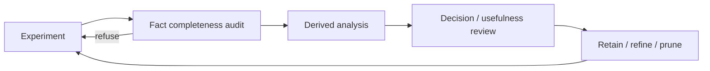

# Feature and derived-feature strategy — Analyst reply

**From:** Analyst (Trajectory Intelligence) · **Brief:** `research/inbox/feature-analysis-meta-brief.md`
**Read at:** `origin/main` `58c9b592` · **Date:** 2026-08-31
**Convention:** `[OBSERVED]` = read from the named artifacts · `[DERIVED]` = computed here from them · `[INFERENCE]` = my judgement · `[FORECAST]` = about future runs

> **Reading note.** The local checkout is 24 commits behind `origin/main`, and none of the six required artifacts exist in it. Everything below was read from `origin/main` via `git show`. I nearly reported `verdict_coupling` as absent because the *installed* module is stale — worth knowing before anyone else audits from a local import. No production code edited, no test suites run.

---

## TL;DR

| | |
|---|---|
| **Position** | The 74 features are a **coverage map**, not 74 KPIs. Four of seven constructs are currently unexercised by the benchmark portfolio. |
| **Count** | `[DERIVED]` The "74" does not reconcile. `AutonomousResearchFeatures` has **78** annotated fields; the inventory documents **73**; the construct sum is **73**. `environment_setup_seconds` is the undocumented 74th. |
| **Pilots' main lesson** | `[OBSERVED]` **Scalar status is not an outcome.** Both runs are `agent_status=timed_out` + `harbor_trial_marked_error=true` + `verifier_reward_valid=true`. In Game2048 a **synthetic 0.0** stood where the authoritative reward is **0.37800819**. |
| **Sharpest single number** | `[DERIVED]` BBO exposes **four** visible scalars. The transfer gap is $-0.0233$ against `selected`; against `final` it is $-0.1308$ — **5.6× larger** for the same run. |
| **Recommendation** | **Analysis infrastructure first**, then prune on observed experiments. The pilots already show the features are fine and the *interpretation layer* is what is missing. |
| **Do not** | Build a universal capability score. Nothing in these artifacts supports one, and §3.4 shows two of the axes are not even arithmetically comparable. |

---

## §0. Reconciliation before interpretation

The brief requires explicit denominators and no silent counts. The headline count fails that test, so it goes first.

`[DERIVED]` via AST on `src/evallab/autonomous_research.py`:

| Quantity | Value |
|---|---:|
| `AutonomousResearchFeatures` annotated fields | **78** |
| `feature_inventory` entries | **73** |
| `feature_count` declared in the inventory | **74** |
| Sum over the 7 constructs ($29{+}9{+}17{+}6{+}5{+}4{+}3$) | **73** |

`[OBSERVED]` The five class fields absent from the inventory:

| Field | Kind | Verdict |
|---|---|---|
| `run_id`, `benchmark_family`, `source_digest`, `feature_digest` | identity / provenance | Correctly excluded from a *feature* inventory |
| **`environment_setup_seconds`** | **measurement** | **Undocumented.** Belongs in *Environment Reconstruction & Dependency Repair* (currently 4 entries) |

`[INFERENCE]` So `74 = 73 + environment_setup_seconds` and `78 = 74 + 4` identity columns. The declared number is defensible; the inventory is one row short of it. **Fix by adding `environment_setup_seconds` to the inventory and stating `78 = 74 features + 4 identity columns` explicitly** — not by changing 74 to 73. A family that measures setup latency for CORE-Bench (whose top priority is literally *"setup latency"*) must not have that feature undocumented.

`[OBSERVED]` Note also that there are now **two** refusal enums: `analysis_capability.RefusalCode` (19 values) and `multi_eval.RefusalCode` (27 values). They are not obviously disjoint in intent. Reconciling or explicitly namespacing them belongs in Stage A below.

---

## §1. Q1 — Five kinds of thing, and why the distinction is load-bearing

| Kind | Producer | Provenance | May predict outcome? | Null semantics | Worked example from these artifacts |
|---|---|---|---|---|---|
| **Raw fact** | Harness / verifier emission, transcribed not computed | `mechanical` or `benchmark_verifier` | Only if `verdict_coupling ≠ defines` | Absent evidence → **null**, never 0 | `iteration_count=4`, `total_tokens=2006962`, `verifier_status="completed"` |
| **Derived feature** | Deterministic function of raw facts, with a declared denominator | `derived` | Inherits the strictest coupling of its inputs | Zero denominator → **null** | `valid_experiment_rate = 0.25` (1 valid / 4 iterations) |
| **Semantic hypothesis** | Model or human judgement over a trajectory | `model` / `human` | Never, until calibrated | Uncalibrated → **null**, not a low score | `hypothesis novelty`, `diagnosis quality` — tier 3, and correctly *not* in the deterministic tier |
| **Benchmark outcome** | The verifier's own contract. **This is the target, not a feature of it** | `benchmark_verifier` | **No — it is the thing being predicted** | Verifier invalid → **null**, never 0 | `hidden_score` and `primary_reward`, both `verdict_coupling="defines"` |
| **Decision feature** | An outcome plus its admissibility context, sufficient to act on | composite | n/a — it *is* the decision | Any input null → decision **refuses** | `visible_hidden_transfer_gap`: present ($-0.0233$) for BBO, **null with a recorded reason** for Game2048 |

`[INFERENCE]` The distinction that actually bites is **benchmark outcome vs derived feature**, and the registry now encodes it. `[OBSERVED]` I executed `audit_registry_predictor_eligibility()` and `audit_registry_denominator_policies()` at `58c9b592` in a throwaway worktree. **The registry holds 240 features** — a first pass counting literal call sites by AST gave 226 and undercounted by 14, so every number below is the audits' own:

| `verdict_coupling` | Count |
|---|---:|
| `defines` — is the verdict; can never be a predictor | **27** |
| `correlates` | 71 |
| `independent` | 40 |
| `not_applicable` | 27 |
| **unlabelled (`None`)** | **75** |

`[OBSERVED]` The 27 `defines` carry justifying `coupling_basis` strings and include exactly the right members — `primary_reward`, `handle_set_match`, `handle_order_match`, `handle_coverage_rate`, `hidden_score`, `leakage_detected_flag`, `milestone_progress_rate`, `dag_edge_conformance_rate`. **This is the single most valuable thing built since the last review.**

### The audits, executed — and they redirect Stage A

`[OBSERVED]` `audit_registry_predictor_eligibility()` returns **131 refusals over 240 features, leaving 109 eligible predictors**:

| Refusal code | Count | Reading |
|---|---:|---|
| `MISSING_TEMPORAL_AVAILABILITY` | **72** | `available_before_verdict` undeclared — **the actual binding gap** |
| `NOT_APPLICABLE_FOR_PREDICTION` | 27 | Correctly excluded, and declared |
| `REWARD_DEFINITION_LEAKAGE` | **19** | The leakage gate actively firing |
| `POST_VERDICT_TEMPORAL_VIOLATION` | 10 | Declared unavailable pre-verdict; correctly refused |
| `UNDECLARED_VERDICT_COUPLING` | **3** | |

`[OBSERVED]` `audit_registry_denominator_policies()` returns **73 refusals**, all `MISSING_DENOMINATOR_APPLICABILITY_DECLARATION`, leaving **167 declared**.

`[INFERENCE]` **This corrects my own recommendation.** I had written that the 75 unlabelled `verdict_coupling` rows were the Stage-A debt and should be labelled `not_applicable`. The audit shows only **3** features refuse for undeclared coupling. The real gap is **`available_before_verdict`, undeclared on 72** — a different field. Labelling coupling clears 3 refusals; declaring temporal availability clears 72. **Stage A should target `available_before_verdict` first.** Static counts could not have shown this, which is the argument for running a repository's own audits before quoting numbers back to it.

`[INFERENCE]` Two further readings. `REWARD_DEFINITION_LEAKAGE = 19` means the gate is not decorative — it refuses 19 real features today. And **109 eligible predictors** is a large improvement on the "effectively zero admissible predictors" I reported against the 138-feature registry: declaring coupling properly *expanded* the admissible set rather than shrinking it.

---

## §2. Q2 — Core primitives vs benchmark-specific vs currently low-value

The empirical test is not opinion: it is which features carried information in the two runs that actually happened.

`[DERIVED]` Across both pilots, **all 73 inventory features are present** in both records — the producer has no coverage gaps. But:

| Category | Count | Interpretation |
|---|---:|---|
| Null in **both** pilots | **5** | **Correct behaviour**, not debt — every one has a zero denominator |
| Zero in **both** pilots | **15** | Measured, activated nothing |
| Null in Game2048 only | 7 | Scale binding never validated (see §3.4) |

`[DERIVED]` The five both-null features, each paired with its zero denominator — this is `null_on_zero_denominator` working exactly as designed:

| Rate | Value | Denominator | Value |
|---|---|---|---:|
| `milestone_completion_rate` | null | `required_milestones` | 0 |
| `rubric_completion_rate` | null | `total_rubric_subtasks` | 0 |
| `reproducibility_rate` | null | `reproducibility_evaluated_count` | 0 |
| `dependency_repair_success_rate` | null | `dependency_repair_attempts` | 0 |
| `regression_rate` | null | `regression_count` | 0 |

`[INFERENCE]` **Do not prune these.** A null rate over a zero denominator is the system telling the truth. Pruning them would delete the only evidence that four whole constructs are unexercised.

### Tiering

**Tier A — core cross-benchmark primitives (keep unconditionally).** These populated with real, non-degenerate values in both pilots and would populate on any benchmark in the portfolio:

| Group | Features |
|---|---|
| Provenance & binding | `source_kind`, `source_version`, `source_record_id`, `source_revision_id`, `task_digest`, `verifier_digest`, `metric_config_digest`, `score_direction` |
| Attempt lineage | `iteration_count`, `measured_iteration_count`, `valid_experiment_count`, `invalid_iteration_count`, `valid_experiment_rate` |
| Budget & cost | `budget_seconds`, `elapsed_seconds`, `budget_utilization_rate`, `total_tokens`, `total_cost_usd`, `tokens_per_experiment` |
| Outcome binding | `visible_outcome_binding_digest`, `hidden_outcome_binding_digest`, `scale_binding_digest`, `score_scale_compatible` |
| Stall dynamics | `stalled_iteration_count`, `stalled_iteration_rate`, `plateau_streak_max` |

`[DERIVED]` `budget_utilization_rate` deserves a specific note: BBO $1.00060$, Game2048 $1.00008$ — **both slightly above 1.0**, which is the timeout visible in a continuous feature. That is a Tier-A primitive doing real work: it flags budget exhaustion without depending on the status string that §3.1 shows is unreliable.

**Tier B — benchmark-specific, correctly dormant.** `[OBSERVED]` These are the 18 features across four constructs that never activated, because no benchmark exercising them has been run:

| Construct | Features | Activated by |
|---|---:|---|
| Milestone & Rubric Progression | 6 | PaperBench (8,316 rubric subtasks), AgentBoard |
| Reproducibility & Replay | 5 | CORE-Bench, RSI-Exam |
| Environment Reconstruction & Dependency Repair | 4 (+`environment_setup_seconds`) | CORE-Bench |
| Data Integrity & Contamination | 3 | MLE-bench |

`[INFERENCE]` **This is the reply's central reframe.** The dormant features are not low-value — they are a **specification of which benchmarks are missing**. They tell you what to add, not what to delete. That directly drives §6.

**Tier C — genuinely low-value as currently defined.** `[INFERENCE]` Only two candidates, and both are definitional rather than dormant:

| Feature | Problem | Fix |
|---|---|---|
| `optimal_selection_flag`, `final_selection_regret` | `[DERIVED]` BBO reports `optimal_selection_flag=True`, `final_selection_regret=0.0` — with `iteration_count=1` and `unique_hypothesis_count=1`. **Regret over a single candidate is 0 by construction.** | Add an eligibility precondition: refuse both unless `selection_decision_count ≥ 2` |
| `repeated_hypothesis_count` / `hypothesis_turnover_rate` | Zero in both; depends on `_hypothesis_key` normalisation whose sensitivity is unmeasured | Keep, but mark screening until the key's stability is tested |

**Not decision-ready — the inventory already says so, correctly.** `[OBSERVED]` `not_decision_ready` names `embedding cluster identity`, `uncalibrated judge confidence`, `raw step count as capability`, and `visible score without hidden-transfer context`. `[INFERENCE]` All four are right, and the fourth is vindicated by §3.4 in this very dataset.

---

## §3. Q3 — What the pilots actually revealed

Six findings. Every one is a missing *analysis* capability, not a missing feature.

### 3.1 Status is not a scalar — it is a vector of independent axes

`[OBSERVED]` Both runs simultaneously:

| Axis | BBO | Game2048 |
|---|---|---|
| `agent_status` | `timed_out` | `timed_out` |
| `agent_exception` | `AgentTimeoutError` | `AgentTimeoutError` |
| `harbor_trial_marked_error` | **true** | **true** |
| `verifier_status` | `completed` | `timed_out_without_result` → **regrade** `completed` |
| `verifier_reward_valid` | **true** | **false** → regrade **true** |

`[INFERENCE]` Any pipeline that reduces this to one status field is wrong in both directions: it would discard BBO's valid reward as an error, and accept Game2048's initial invalid reward as data. The Game2048 record states the principle exactly: *"Agent timeout, expired initial verifier, preserved artifact, and successful verifier-only regrade are independent axes."*

**Missing capability:** a composite-validity resolver that reports `(agent_axis, verifier_axis, artifact_axis, authority)` and refuses a scalar rollup.

### 3.2 The synthetic zero — refusal-not-zero, with a number attached

`[OBSERVED]` From Game2048's `composite_outcome_validity` finding:

> *"the original synthetic mean 0.0 is not reward evidence, while the regrade reward 0.37800819 is authoritative for this calibration artifact."*

`[DERIVED]` A naive mean over trials would have recorded **0.0** where the truth is **0.378** — a full-scale error on a $[0,1]$ reward, recovered only by a **verifier-only regrade** taking 2,639 s. `[INFERENCE]` This is the strongest concrete justification in the repository for refusal-not-zero, and it should be the canonical regression fixture for it.

**Missing capability:** first-class regrade lineage — `initial_*` and `regrade_*` as distinct records with an explicit `authority` pointer, so the superseded 0.0 is retained as history and can never be summed.

### 3.3 Four visible scalars, and a 5.6× headline swing

`[OBSERVED]` BBO reports four visible scores for one run:

| Scalar | Value |
|---|---:|
| `baseline` | 0.000000 |
| `anytime` | 0.158694 |
| `selected` | 0.204755 |
| `final` | 0.312231 |

`[DERIVED]` I solved for which one defines the recorded gap: $0.181436 - 0.204755 = -0.023319$, matching `visible_hidden_transfer_gap` to all printed digits. So the gap is **sealed minus `selected`**. Using `final` instead gives $-0.130795$ — **5.6× larger**, same run, same data.

`[INFERENCE]` Whichever is correct, the choice must be **declared and written into the record**, not left implicit in a producer. This is the "which number is *the* number" problem, and it is worth copying the pattern from Inspect's `headline_metric`: a declaration resolved at emit time and stored alongside the result, with a warning-and-fallback when it matches nothing.

**Missing capability:** a declared headline binding per outcome axis, recorded in the artifact.

### 3.4 Score-scale binding — the null that must stay null

`[OBSERVED]` Game2048 records:

> `transfer_gap_null_reason`: *"Visible scores are raw merge scores while the sealed reward is normalized; no validated score-scale binding exists."*

`[OBSERVED]` The magnitudes make it concrete: visible `best_comparable_raw_mean = 17233.5` and `visible_improvement = 15173.5` against a sealed `reward = 0.378` under *"per-seed log interpolation baseline→0 and frontier→0.6; log-space soft cap above frontier, asymptotic to 1.0"*. `[INFERENCE]` These are not on a common scale and subtracting them is meaningless. The record keeps the gap null **and states why** — exactly right, and the seven Game2048-only nulls (`scale_binding_digest`, `visible_hidden_transfer_gap`, `final_selection_regret`, `optimal_selection_flag`, `final_visible_score`, and both time-to-improvement features) are that decision propagating correctly.

`[INFERENCE]` **This is the concrete refutation of a universal capability score.** Within a single benchmark family, two outcome axes of the *same run* cannot be differenced without a validated binding. A cross-benchmark scalar would require dozens of such bindings, none of which exist.

**Missing capability:** `score_scale_compatible` promoted to a hard gate — any arithmetic across axes refuses unless a validated `scale_binding_digest` is present.

### 3.5 Selection is not reconstructible from the experiment log

`[OBSERVED]`

| | BBO | Game2048 |
|---|---|---|
| `experiment_log_version_coverage` | **0.5** | 0.8 |
| `artifact_versions` | `[v0, v1]` | 5 versions |
| `selected_version` | **`v1`** | `v5` |
| `unlogged_artifact_versions` | **`[v1]`** | `[v5-main]` |

`[DERIVED]` **In BBO the selected artifact is precisely the unlogged one.** Coverage 0.5 understates the severity: the missing half is the half that determined the outcome. Game2048's own finding says it plainly — *"artifact selection cannot be reconstructed from experiment_log.md alone."*

**Missing capability:** treat `selected_version ∈ unlogged_artifact_versions` as a **hard validity refusal**, not a coverage statistic. A run whose winning artifact is undocumented cannot support a method-improvement claim.

### 3.6 Validation coverage is asymmetric, and the audit itself is incomplete

`[OBSERVED]` Game2048: `selected_artifact_sealed_replay_validated = True` but `selected_artifact_visible_full_suite_validated = False` — sealed-validated, visible-unvalidated. The record correctly keeps `final_selection_regret` null as a result.

`[OBSERVED]` BBO, by contrast, records **zero** `feature_findings` and leaves both validation flags `None`, versus Game2048's four findings and two explicit booleans. `[INFERENCE]` BBO ran first and was audited less. The audit depth is inconsistent between two runs of the same calibration schema — which means schema conformance is not currently enforced on the *findings* block.

**Missing capability:** minimum-findings conformance on `evallab-rsi-calibration-evidence/v1` — a calibration record with zero findings and null validation flags should fail its own schema check.

---

## §4. Q4 — Staged recommendation: infrastructure first

**Yes, prioritise analysis infrastructure now.** The pilots settle the question empirically rather than by preference: `[DERIVED]` all 73 features populated, 5 nulls were correct behaviour, and **every one of the six findings in §3 is an interpretation failure, not a measurement failure**. Adding features now would add rows to a table nobody can yet safely aggregate.

`[INFERENCE]` The counter-argument deserves a fair statement: four constructs are dormant, so one could argue for running PaperBench/CORE-Bench/MLE-bench first to activate them. I reject that ordering because §3 shows the *existing* two runs cannot yet be summarised correctly — a third and fourth benchmark would multiply the interpretation debt before any of it is paid.

| Stage | Build | Depends on | Behavioural acceptance |
|---|---|---|---|
| **A** | **Close the declaration gaps the audits name.** Declare `available_before_verdict` on the **72** `MISSING_TEMPORAL_AVAILABILITY` features (highest leverage); declare denominator applicability on the **73** refusals; label the **3** `UNDECLARED_VERDICT_COUPLING` features; add `environment_setup_seconds` to the inventory and state $78 = 74 + 4$; reconcile the two `RefusalCode` enums | — | `audit_registry_predictor_eligibility()` refusals drop from **131** to the **56** that are genuine exclusions (`NOT_APPLICABLE` 27 + `LEAKAGE` 19 + `POST_VERDICT` 10); denominator refusals reach **0**; inventory `feature_count` equals inventory length equals construct sum |
| **B** | **Composite outcome resolver.** `(agent, verifier, artifact, authority)` axes; regrade lineage with superseded records retained | A | The Game2048 record resolves to **0.378**, never 0.0, and the superseded 0.0 is present but unsummable |
| **C** | **Declared headline binding** per outcome axis, written into the artifact | B | BBO's transfer gap cites `selected` explicitly; switching to `final` changes a **declaration**, not a silent producer default |
| **D** | **Scale-binding gate.** `score_scale_compatible` blocks cross-axis arithmetic without a validated `scale_binding_digest` | C | Game2048's transfer gap stays null with its reason; a forced computation **refuses** |
| **E** | **Validity refusals promoted.** `selected_version ∈ unlogged_artifact_versions` → refusal; calibration records with zero findings fail schema | B | BBO is flagged **selection-unreconstructible**; BBO's own record fails findings conformance |
| **F** | **Operator surfaces** (§7) over A–E | A–E | An operator answers all seven §7 questions without writing a bespoke script |
| **G** | **Then** activate dormant constructs by portfolio choice (§6) — PaperBench, CORE-Bench, MLE-bench | F | Milestone/reproducibility/repair/contamination features move from zero to populated, with denominators |
| **H** | **Then** prune, using §5's loop on ≥3 runs per benchmark | G | Every retained feature has a recorded decision use or a stated reason for retention |

`[INFERENCE]` A through E are small, mechanical, and unblock everything. **Do not start G before F.**

---

## §5. Q5 — Feature-governance loop

| Step | Gate | Refusal condition | Artifact |
|---|---|---|---|
| **1. Experiment** | Declared estimand, unit of analysis, denominators, and headline binding **before** the run | Missing declaration | analysis spec + `snapshot_digest` |
| **2. Fact completeness audit** | Every declared input present or explicitly null with a reason | Any silent zero; `selected_version` unlogged; zero findings | completeness report |
| **3. Derived analysis** | Only features with `verdict_coupling ∈ {correlates, independent}` may be predictors; `audit_predictor_eligibility` enforces | `defines` used as predictor; unvalidated scale binding | analysis record |
| **4. Decision / usefulness review** | Did the feature change a decision, gate, or refusal? | Feature never read by any view or gate | usefulness ledger |
| **5. Retain / refine / prune** | Four-way verdict, recorded | — | governance ledger |

**Verdicts, and the evidence each requires:**

| Verdict | Criterion | Example from these pilots |
|---|---|---|
| **Retain** | Changed a decision, or is a declared denominator | `valid_experiment_rate`, `budget_utilization_rate` |
| **Retain-dormant** | Null/zero **only** because no benchmark exercised it | the 18 Tier-B features — retain, and record which benchmark would activate them |
| **Refine** | Populated but degenerate or ill-conditioned | `final_selection_regret` — add `selection_decision_count ≥ 2` precondition |
| **Prune** | Populated, non-degenerate, and read by nothing across ≥3 runs per benchmark | none yet — **the evidence does not exist at $n=2$** |

`[INFERENCE]` The loop's most important property: **prune requires positive evidence of uselessness**, not absence of evidence of use. At two runs, no feature qualifies. Say so rather than pruning to feel tidy.

---

## §6. Q6 — Thematic portfolio, not a benchmark zoo

`[OBSERVED]` The inventory lists 10 benchmarks against 7 constructs — and three (Tau2, GAIA, OSWorld) are sourced from Inspect Evals, so their execution is already someone else's maintenance burden.

`[INFERENCE]` Organise around **four research questions**, each with one primary benchmark and one contrast, and defer the rest:

| # | Research question | Primary | Contrast | Constructs activated | Features unlocked |
|---|---|---|---|---|---|
| **R1** | Can an agent improve a method under a fixed budget, and does the improvement generalise to held-out instances? | **RSI-Exam** (88 tasks, public/private split) | RE-Bench (7 tasks, time-budget scaling) | autonomous research, selection & generalization, score-time dynamics | 55 of 73 — already active |
| **R2** | Can an agent reconstruct a broken environment and reproduce a stated result? | **CORE-Bench** (270 tasks / 90 papers) | — | environment reconstruction, reproducibility & replay | 9 + `environment_setup_seconds` |
| **R3** | Does an agent make graded progress on hierarchically decomposed work, or only pass/fail? | **PaperBench** (20 papers, 8,316 rubric subtasks) | AgentBoard | milestone & rubric progression | 6 |
| **R4** | Does an agent's apparent gain survive contamination and selection scrutiny? | **MLE-bench** (75 competitions) | — | data integrity, selection & generalization | 3 + selection features |

**Explicitly defer:** ToolSandbox, Tau2, GAIA, OSWorld. `[INFERENCE]` Each is a good benchmark and none answers a question R1–R4 doesn't already cover. Tau2's `pass-at-k` and ToolSandbox's state-dependency work are already represented in the trajectory registry's FuncDAG and Action Memory families. Running them adds surface area, not answers — and if they are wanted later, they arrive via Inspect Evals rather than as bespoke integrations.

`[INFERENCE]` **R2 is the highest-value addition** and I would sequence it first: it activates two entirely dormant constructs, its top priority (*setup latency*) is the one measurement currently undocumented (§0), and reproducibility is the construct most likely to change how existing results are read.

---

## §7. Q7 — What an operator should be able to run next

Seven questions, each answerable from a view rather than a script. Naming follows the existing `v_*` convention.

| # | Question | Surface | Refuses when |
|---|---|---|---|
| 1 | *What actually happened in this run, on all axes?* | `v_composite_outcome_validity` — one row per trial: agent axis, verifier axis, artifact axis, authority pointer, regrade lineage | Any axis unresolved |
| 2 | *Which reward is authoritative, and what was superseded?* | `v_reward_authority` — authoritative value, superseded values, supersession reason | Two live authorities, or none |
| 3 | *Which visible scalar defines the headline, and what would others give?* | `v_headline_binding` — declared binding plus the alternatives and their deltas | No declared binding |
| 4 | *Can these two axes be differenced at all?* | `v_scale_binding_status` — per-axis-pair compatibility and `scale_binding_digest` | Arithmetic attempted without validated binding |
| 5 | *Is this run's selection reconstructible?* | `v_selection_reconstructibility` — log coverage, unlogged versions, whether the **selected** version is among them | `selected_version` unlogged |
| 6 | *Which features are dormant, and which benchmark would activate them?* | `v_feature_activation_map` — feature × benchmark × populated/zero/null-with-denominator | A null lacks a denominator explanation |
| 7 | *Which features are admissible as predictors here?* | `v_predictor_eligibility` — `verdict_coupling`, `available_before_verdict`, `causal_grade`, eligibility verdict | `verdict_coupling` is `None` |

**Two operator tables worth building first**, because they are cheap and immediately load-bearing:

- **Feature activation map (#6).** `[DERIVED]` Today it would read: 73 present, 5 null-with-denominator, 15 zero, 18 dormant across 4 constructs. That single table replaces the "are 74 features too many?" argument with a coverage fact.
- **Predictor eligibility (#7).** `[OBSERVED]` Today, from the audits: **240** features, **131** refusals, **109 eligible**. The refusal mix is `MISSING_TEMPORAL_AVAILABILITY` 72, `NOT_APPLICABLE_FOR_PREDICTION` 27, `REWARD_DEFINITION_LEAKAGE` 19, `POST_VERDICT_TEMPORAL_VIOLATION` 10, `UNDECLARED_VERDICT_COUPLING` 3. This view is **already computable** — `audit_registry_predictor_eligibility()` is the query. It needs surfacing, not building.

`[INFERENCE]` Deliberately **not** on this list: any single-number capability dashboard, any cross-benchmark leaderboard, and any embedding-cluster view. The first two are unsupported by §3.4; the third is `not_decision_ready` by the inventory's own tiering, and correctly so.

---

## §8. Risks and what I would change in the brief's framing

| Framing | My revision |
|---|---|
| *"the 74-feature family"* | `[DERIVED]` Reconcile first: 78 fields, 73 documented, 74 declared. `environment_setup_seconds` is undocumented and belongs to the construct CORE-Bench most needs. |
| *"which features matter most"* | **Wrong axis at $n=2$.** The informative split is *populated / zero / null-with-denominator / dormant*, and the dormant ones specify missing **benchmarks**, not surplus features. |
| *"misleading scalar status/reward summaries"* | Confirmed, with a number: a synthetic **0.0** stood where the authority is **0.378**. And a second instance the brief did not name — BBO's transfer gap moves **5.6×** on the choice of visible scalar. |
| *"treat as an inventory, not 74 KPIs"* | Agreed, and I would go further: it is a **coverage map**. Four of seven constructs are unexercised, which is a portfolio finding, not a feature finding. |
| *"do not recommend a universal capability score"* | Agreed, and §3.4 supplies the refutation from inside a single run: visible raw merge scores and a normalised sealed reward have **no validated binding**, so even the two axes of one benchmark cannot be differenced. |

**Residual risks I would not paper over:**

1. `[INFERENCE]` **$n=2$, both timed out.** Every generalisation here rests on two runs that both hit `AgentTimeoutError` with `budget_utilization_rate > 1`. The features' behaviour under a *clean completion* is untested, and the timeout path may be over-represented in what looks like normal operation.
2. `[OBSERVED]` **Audit depth is inconsistent** between the two calibration records (4 findings vs 0; validation flags set vs `None`) under the same schema version. Conclusions drawn by comparing them inherit that asymmetry.
3. `[INFERENCE]` **`_hypothesis_key` sensitivity is unmeasured.** `unique_hypothesis_count` (1 vs 4) and `hypothesis_turnover_rate` depend entirely on that normalisation. Until it is perturbation-tested, treat both as screening.
4. `[FORECAST]` **The 72 undeclared `available_before_verdict` rows are the live exposure**, not the coupling field I first named. They refuse today, so nothing unsafe is passing — but a refusal that blocks 72 features is also a standing incentive to relax the gate rather than declare the field. Declare them in Stage A while the pressure is low.

---

## Verification note

`[OBSERVED]` Read at `origin/main` `58c9b592`: the feature inventory (schema `agentic-benchmark-feature-inventory/v1`, 10 benchmarks, 4 tiers, 1 family, 73 inventory entries); both calibration records (schema `evallab-rsi-calibration-evidence/v1`) in full including `run.outcome_axes`, `scores`, `research_process`, `feature_findings`, `harbor_ingestion_smoke`; `autonomous_research.py` (833 lines, 4 classes) via AST; `feature_registry.py` (4,478 lines) via AST **and by executing its own audit functions at 240 registered features**; `multi_eval.py` (14 classes, 27 `RefusalCode` values).

`[DERIVED]` Computed here: the 78/74/73 reconciliation and the five undocumented fields; the 27 `defines` list with bases; per-pilot null and zero counts with denominator pairing; the transfer-gap solve identifying `selected` as the binding scalar and the 5.6× swing to `final`; `budget_utilization_rate > 1` on both runs; BBO's selected-version-is-unlogged finding.

**Three things I checked because I did not believe them, and one that changed:**

| | Initial reading | After checking |
|---|---|---|
| 1 | `verdict_coupling` absent from the registry | **Present on `origin/main`** — my local import was 24 commits stale. Corrected before it reached this document. |
| 2 | 5 null features are missing measurements | **Correct null-on-zero-denominator behaviour** — all five denominators verified as 0 |
| 3 | BBO's `final_selection_regret=0.0` is a good result | **Degenerate** — `iteration_count=1`, so regret is 0 by construction |

**Correction applied after first delivery.** `[OBSERVED]` I initially shipped this note with static AST counts and flagged that the repository's own audit functions should be run before trusting them. I then ran them, in a detached throwaway worktree at `58c9b592` (no test suite, no production edit, user working tree untouched). Four published numbers were wrong and are corrected above:

| Published first | Audit truth |
|---|---|
| 226 registered features | **240** |
| 28 `defines` / 41 `independent` / 10 `not_applicable` / 76 unlabelled | **27 / 40 / 27 / 75** |
| "the 76 unlabelled `verdict_coupling` rows are the Stage-A debt" | **Only 3 refuse for that. 72 refuse for undeclared `available_before_verdict`** |
| Stage A targets `verdict_coupling` | **Stage A targets `available_before_verdict`** |

`[INFERENCE]` The third row is the one that mattered: my recommendation would have cleared 3 of 131 refusals. The audits already quantified the debt correctly, and I had been reading the registry instead of asking it.
