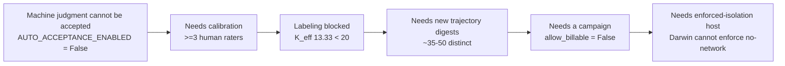

# Eval Lab — Current State Report

- **Author:** Tutor
- **Date:** 2026-08-29
- **Evidence pin:** `origin/main` @ `3fc3c33f` (local `main` was `0e5b130c`, **25 merges stale** — every claim below is read from `origin/main` via `git show`, not the working tree)
- **Method:** six parallel read-only plane surveys plus direct verification of headline counts. No billable model calls, no test execution, no writes outside this file.
- **Convention:** body claims are observed and cited to `path:line` or a merged PR. Anything not directly observed is tagged `[INFERENCE]`.

---

## 1. Executive summary

1. **The instrument is production-grade; the measurements barely exist.** 151 tracked files under `src/evallab`, 331 test files, 89 pinned CLI leaf commands (`tests/test_cli_registry.py`), 113 registered trajectory features (`src/evallab/interpretation/feature_registry.py`) — against **21 total indexed trials** and **$0.01188 total observed billable spend** as of `origin/main` `3fc3c33f`. The spend figure is the sum of `accounting.observed_billable_spend_usd` across the five per-campaign manifests in `research/experiments/manifests/`; only `canary-syn-funcdag-suite-analysis-manifest.json` is non-zero (`0.01188`, from three per-trial `cost_usd` values summing to `0.0118815`). The cross-campaign inventory carries **no spend or cost field at all** and must not be cited for spend.
2. **Every interpretation campaign is on HOLD, by design, and the holds interlock.** All 5 batch-interpreted campaigns report `HOLD (Auto-accept disabled, N abstained, 0 accepted, 0 rejected)`. `[INFERENCE]` The chain terminates at one unblocked action — *run trajectories*; everything else is downstream.
3. **The only success data in the repository is three task-families from one 2026-08-15 Codex canary night** (event-summary 3/3, transaction-reconciliation 3/3, html-js-filter 0/3 — `research/experiments/STATUS.md`). The only other model lane executed is `gemini-3.7-flash-low` on a 5-task TB3 screen where **all five rewards are 0.0**.
4. **Zero executed runs exist for the three certified MCP verticals as of `3fc3c33f`.** (Superseded after the snapshot — see §9.) `action-memory-v1`, `mcp-funcdag-v1`, `mcp-recovery-v1` all have verified oracle/nop/mutant CI coverage and **no model trials**. This is the largest gap between built capability and produced evidence.
5. **One measurement can start today with ground truth already in hand:** the judge-calibration corpora at `research/calibration/` hold 44 fully keyed items (2 incident families × 22 graded variants, 22/22 answer keys each). Their keys are *constructed*, not rated, so they need no human raters and no $K_{\text{eff}}$ clearance. `[INFERENCE]` This is the only substantive measurement reachable without new agent runs.

---

## 2. Capability state by plane

### 2.1 Benchmark & task authoring — **production-capable**

A valid task package requires six files: `task.toml`, `instruction.md`, `environment/Dockerfile`, `solution/solve.sh`, `tests/Dockerfile`, `tests/test.sh` (`src/evallab/task_workbench.py:1127-1135`), with `solve.sh`/`test.sh` executable (`:1151`). Refused: symlinks (`:1138`), path escapes (`:1146`), custom `.gitignore` (`:1158`).

Static checks (`inspect_candidate`, `src/evallab/task_workbench.py:1400-1500`) enforce immutable `source_ref` pins (`_is_pinned_ref:1071`), digest-pinned base images (`_is_pinned_image_ref:1099-1113`), a fail-closed config whitelist rejecting `[[steps]]`, `allow_internet`, non-empty `env`, `os != linux`, `gpus > 0` (`:165-285`), no-network build contexts (`:1335-1349`), and golden-solution leak scanning (`:1418`).

Authoring battery: `("oracle", "nop", "fair_oracle", "adversarial")` (`src/evallab/authoring.py:127-132`). Registration is **human-only** — `REGISTER_REFUSAL` forbids automatic promotion (`src/evallab/authoring.py:135-138`).

### 2.2 Harbor execution — **production-capable, billable-off-by-default**

`RunRequest.allow_billable: bool = False` (`src/evallab/execution_contracts.py:209`); `validate_request` raises for any non-control agent or any model without explicit approval (`:612-622`). Standing approvals never cover billable work (`src/evallab/queue.py:172-178`); billable requires `PaidRunAuthorization` (`src/evallab/execution_contracts.py:255`), with a `daily_cost_ceiling_usd` (`src/evallab/queue.py:618-625`) and subscription-exhaustion refusal (`src/evallab/queue.py:596,653`).

| Provider | Adapter | Status |
|---|---|---|
| Codex | `harbor_codex:PinnedCodex`, CLI pinned `0.148.0` | verified-configured, committed run bundles exist |
| Antigravity | `harbor_antigravity:AntigravityCliCapture` | verified-configured, ran the TB3 screen (`v1.1.21`) |
| DeepSeek | `harbor_deepseek:SecretSafeDeepSeekMiniSweAgent` | verified-configured (#286 proxy isolation); **screen blocked** |
| ModelAdapter | `modeladapter:ModelAdapter` | adapter-shaped only; analyst pipelines, not a benchmark runner |
| oracle / nop | `src/evallab/execution_contracts.py:20` | verified, offline controls |

Queue state machine: `proposed → pending → approved → waiting → running → done|failed`, with `rejected` reachable from three states (`src/evallab/queue.py:96-105`); transitions append immutable ULID-stamped events to `queue/events.jsonl` (`:827-848`).

**Material validity constraint:** `host_harbor_network_policy` enforces `no-network` on Linux but falls back to `public` with `network_isolation_enforced=False` on Darwin, reason `darwin-docker-cannot-enforce-no-network` (`src/evallab/harbor_network.py:53-70`). The primary workstation cannot enforce the isolation the benchmarks assume.

### 2.3 MCP verticals — **certified; zero runs as of `3fc3c33f`**

| Vertical | Measures | Verifier | Dose structure | Certified |
|---|---|---|---|---|
| `action-memory-v1` | entity memory / value binding under state inversion | exact post-inversion state; rejects stale & wrong-target mutants | 4k/16k/64k/128k bytes × seeds 42/1337/2026 | yes (#262, #275) |
| `mcp-funcdag-v1` | tool selection, composition, value propagation over DAGs | topological execution + value propagation + zero distractor calls | depth 3–5, width 2–4, distractors 2–6 × seeds 42/101/2024 | yes (#263, #289) |
| `mcp-recovery-v1` | autonomous fault detection & recovery | AES-256-GCM sealed envelope; causal recovery required, blind retries fail | 5 fault classes × persistence 1–2, matched clean twins | yes (#261) |
| `loca-lean-v1` | source-only context curve | `verifier.py` | 8k seed 42 | yes |

Substrate: streamable-HTTP FastMCP 3.4.7 generator with `EventJournalMiddleware` and deterministic `FaultInterceptor` (`src/evallab/mcp_substrate.py:735`), a checked-in **68-wheel trusted manifest** (`src/evallab/data/fastmcp-3.4.7-...manifest.json`, `src/evallab/mcp_substrate.py:103-220`), and a fail-closed independent proof verifier re-rendering `server.py`/`Dockerfile`/requirements against on-disk bytes (`:1734`).

Contracts pin reportability mechanically: `CampaignCalibrationLedger.reportable_rates: Literal[False]` vs `CampaignMeasurementLedger.reportable_rates: Literal[True]` (`src/evallab/benchmark_program_contracts.py:216,229`).

AgentAbstain admission gate is production-capable (`src/evallab/agentabstain_gate.py:225`) but the corpus is **0 admitted / 131 HOLD / 0 pending audit / 132 informational-excluded, from 263 upstream pairs** (`research/experiments/manifests/agentabstain-audit/operational_audit_130.json`, `summary`). Operational Restraint S7 is on `experimental_hold` (`src/evallab/operational_restraint.py:30`).

### 2.4 ATIF / trajectory storage — **production-capable**

Four-level normalized schema — `TrajectoryFact`, `StepFact`, `ToolCallFact`, `ObservationFact` (`src/evallab/evidence/atif.py:46-126`) — spanning ATIF v1.0–v1.7, projected to PyArrow Parquet (`:307-362`) with a catalog-vs-Parquet completeness invariant (`check_projection_invariant:481-542`).

Zone model: **Z1** content-addressed store (`src/evallab/evidence_store.py:40-100`, `cas://sha256/...`, no-follow descriptor chains); **Z2** PostgreSQL catalog (authoritative metadata); **Z3** rebuildable Parquet analytics with closed-day compaction (`src/evallab/storage/parquet_compaction.py:31-150`); **Z4** docs. Unified DuckDB attach with cold-day rank dedup (`src/evallab/storage/attach.py:339-445`).

Hydration is fail-closed: `CitationHandle` binds source digest + CAS URI + indices + content digest (`src/evallab/interpretation/trajectory_hydration.py:47`); `hydrate_citation` path-jails (`:533-670`); `RedactionPolicy` masks secrets and changes the pack digest when settings change (`:126-210`). `src/evallab/trajectory_loss_manifest.py:101-640` audits 40+ fields across preservation tiers. `ingest_after_settlement` is a pure report-or-exception boundary post-#276 (`src/evallab/interpretation/trajectory_compliance_ops.py:236`).

Weak spot: `src/evallab/lance.py:43` uses a deterministic 256-dim lexical `HashingEmbedder` — no semantic embeddings bound.

### 2.5 Quality / compliance / acceptance — **production-capable, acceptance disabled by design**

`QualityStatus` = `pass|warn|fail|quarantine|quality_not_evaluated` (`src/evallab/interpretation/trajectory_quality.py:39`); `ComplianceDisposition` = `QUALITY_PASS|QUALITY_WARN|HOLD|QUARANTINED` (`src/evallab/interpretation/trajectory_compliance.py:29`). Hold reasons are enumerated: `missing_atif_evidence`, `degraded_tool_linkage`, `quarantine_quality_status_*`, `empty_event_sequence`, `unsupported_terminal_claim` (`src/evallab/interpretation/evidence_pack.py:268`).

**`AUTO_ACCEPTANCE_ENABLED = False`** (`src/evallab/interpretation/trajectory_acceptance.py:18`) — `evaluate_acceptance` can only emit `rejected` or `abstained`, never `accepted` (`:213`). `calibration_report_can_enable_acceptance()` returns literal `False` (`src/evallab/interpretation/trajectory_calibration.py:292`). `HumanBaselineReport` requires ≥3 independent raters with Cohen's κ, Fleiss' κ, Gwet's AC₁, Krippendorff's α (`:185`).

Frozen 12-class judgment ontology under `machine-judgment/v1` (`src/evallab/interpretation/trajectory_judgment.py:21`). Deterministic zero-LLM taxonomies: 10 `ActionDomain` × 20 `ActionSubtype` (`src/evallab/trajectory_action_taxonomy.py:15-53`), plus `ErrorCategory`/`InterventionCategory` (`src/evallab/trajectory_error_taxonomy.py:17`). Analyst recipes R1–R7 (`src/evallab/interpretation/trajectory_recipes.py:30`).

### 2.6 Feature extraction — **production-capable**

113 features registered via `register_trajectory_feature` (`interpretation/feature_registry.py`), 13 flagged `is_screening=True`, 37 carrying `causal_grade="C"`. Benchmark views gate on 11 settled dimensions plus `quality_status == QUALITY_PASS`, `join_ready`, non-null `source_digest`, zero refusals (`src/evallab/interpretation/benchmark_projection.py:32-61`); refused rows route to `v_benchmark_refusal_diagnostics` (`sql/traj_benchmark_views.sql:110-379`).

### 2.7 T1 analyses — **production-capable, zero input data**

| Analysis | Estimand | Unit | Estimator | Output |
|---|---|---|---|---|
| **T1.1** `evaluate_process_outcome_gate:382` | structural lineage violation + process↔outcome discriminative separation | trial | AUC, disagreement rate | `T11Report` w/ `report_digest`, `ci_disposition` |
| **T1.2** `analyze_conditional_recovery:521` | conditional recovery rate per fault opportunity | `fault_opportunity_id`, clustered on `coalesce(repeat_group_id, trial_id)` | deterministic percentile cluster bootstrap | `RecoveryAnalysisResult` + `RefusalCode` |
| **T1.3** `analyze_cascade_distance:701` | step distance $T_{err} \to T_{lock}$ under right-censoring | trial | censored distance | `T13Report` + `CascadeStatus` |

`RefusalCode` is a closed 17-value enum including `STALE_SNAPSHOT`, `UNDERPOWERED`, `ZERO_OPPORTUNITY`, `SINGLE_OUTCOME_CLASS` (`src/evallab/analysis_capability.py:72`). Sizing lives in `src/evallab/power.py:28` and `src/evallab/cohort.py:546-705` (pass@k unbiased, bisection MDE, k-sweep). Capability curves require identical controlled fingerprints and exact `task_block_id` pairing, with explicit `refuse_to_rank_reasons` (`src/evallab/schemas/__init__.py:737,858`).

**Observed gap:** `power.py` sizing uses a paired normal approximation — no ICC or design-effect term, which is precisely what the gold-set campaign needs.

### 2.8 Campaigns & continuous operator — **capable / disabled by default**

`CampaignOrchestrator` (`src/evallab/campaigns.py:1416`) runs immutable policy-gated batches with hash-chained journals, leases, CAS archival and circuit breakers. The continuous operator is `DEFAULT_MODE = "DISABLED"` with `REASON_DEFAULT_DISABLED = "default_disabled"` (`ops_continuous.py`), requiring 3-party identity separation, HMAC `approval_digest`, and external `trusted-approval-keys.json` (#283).

Recovery: `RecoveryStateBundle` (`src/evallab/recovery/bundle.py:70`), 5-criterion `certify_state_restoration` (`src/evallab/recovery/certify.py:172`), paired resume evaluation across `none|summary|full` context (`src/evallab/recovery/wrapper.py:25,95`). `src/evallab/recovery/pilot.py:44` still uses synthetic generators — **stubbed pilot on a real framework**.

### 2.9 Gold labeling — **frozen, NOT_READY, zero ratings**

PR #280 landed as `2e40b670`. `research/goldset/` holds `labeling_package.json`, `build_labeling_package.py`, `check_doc_consistency.py`, `test_labeling_package.py`, `machine_truth_WITHHELD.json`.

183 items / 183 distinct contexts; five blockers: `EFFECTIVE_CLUSTERS_BELOW_FLOOR` ($K_{\text{eff}}=13.33 < 20$), `CLUSTER_CONCENTRATION_TOO_HIGH` (16.9% > 5%), `QUALIFIED_RATER_POOL_TOO_SMALL` (0, need ≥3), `ITEMS_WITH_ZERO_VALID_RATINGS: 183`, `REGISTRY_ABSENT`. Design fixed: Gwet AC₁ nominal, $q=12$, percentile cluster bootstrap 4000 resamples, half-width ≤0.05, prevalence-valid core with weights, `acceptance_threshold` explicitly null by decision, pooled AC₁ only.

---

## 3. Feature catalog — what is tracked now

| Axis | Tracked (representative, cited) |
|---|---|
| **Trial** | `trial_id`, `job_id`, `task_name`, `agent_name/version`, `model_name`, `primary_reward`, `exception_class`, `duration_seconds`, `step_count`, `agent/system/user_step_count`, `tool_call_count`, `unique_tools_count`, `repeated_command_count`, `error_count`, `recovery_count`, `prompt/completion/cached/total_tokens`, `cost_usd`, `loop_suspicion_score` (`src/evallab/interpretation/feature_registry.py:253-939`) |
| **Step** | `step_id`, `source(agent|system|user)`, `timestamp`, `is_copied_context`, `llm_call_count`, per-step tokens/cost, `tool_call_count`, `observation_count` (`src/evallab/evidence/atif.py:72-87`); `event_id`, `parent_event_id`, `sequence`, `event_type`, `outcome`, `exit_code` (`src/evallab/evidence/event_mart.py:79-96`) |
| **Tool call** | `tool_call_id`, `function_name`, `arguments_sha256` (`src/evallab/evidence/atif.py:90-99`); `observation_index`, `source_call_id`, `content_size_bytes`, `content_sha256`, `command_exit_code` (`:102-114`); `tool_name`, `role`, `reason_code`, `intervention_provenance`, `observation_correlation` (`src/evallab/interpretation/trajectory_semantics.py:126-155`) |
| **Model** | `model_name`, `model_settings_digest` (`src/evallab/evidence/facts.py:136-137`); `ProviderLimit(max_specs, max_trials, max_cost_usd)` (`src/evallab/schemas/__init__.py:128-133`) |
| **Agent / harness / scaffold** | `agent_name/version`, `harness_version`, `scaffold_version`, `harness_policy_digest`, `preamble_hash`, `preamble_content_sha256`, `toolset_digest` (`src/evallab/interpretation/feature_registry.py:298-307,1640-1643`; `src/evallab/evidence/facts.py:134-139`) |
| **Task / benchmark** | `task_digest`, `verifier_digest`, `environment_digest`, `task_family`, `task_instance_id`, `task_block_id` (`src/evallab/evidence/facts.py:113-133`) + per-vertical L1/L2 blocks (`src/evallab/interpretation/feature_registry.py:989-1557`) |
| **Repeat** | `repeat_group_id` (`:1644`), `generator_seed_json` (`src/evallab/evidence/facts.py:131`), `pass_at_k_unbiased`, `pass_power_k_unbiased` (`src/evallab/cohort.py:559,578`) |
| **Dose** | `dose_axis`, `dose_value`, `dose_unit` (`:1645-1647`); `dose_bytes` (A); `depth/width/distractor_count/name_similarity/schema_drift` (B); `fault_class/persistence_level/mode` (C) |
| **Action alphabet** | `alphabet_id`, `alphabet_version` (`:1648-1649`); 10 domains × 20 subtypes (`src/evallab/trajectory_action_taxonomy.py:15-53`) |
| **Recovery / censoring** | `step_to_first_error`, `time_to_first_error_seconds`, `recovery_latency_steps/_seconds`, `unrecovered_at_terminal`, `is_expected_negative` (`:457-529`); C3 5-gate certified recovery (`src/evallab/interpretation/producers/mcp_recovery.py:133-149`) |
| **Provenance / lineage** | `cas_uri`, `quality_status`, `report_digest`, `source_digest`, `producer_version`, `projection_identity`, `dimension_digest`, `projection_refusals`, `analysis_ready` (`:1650-1657`); 5 explorer provenance states (`src/evallab/explorer.py:27-46`) |
| **Cohort / contrast** | 13 `CONSEQUENTIAL_FIELDS` (`src/evallab/cohort.py:23-37`); matched-contrast join keys incl. `seed`, `cell_id`/`fault_class`, dose triple, alphabet pair, `analysis_ready IS TRUE` (`sql/traj_benchmark_views.sql:140-230`) |
| **Behavior episodes** | 4 calibrated: `tool_error`, `unchanged_retry`, `recovered_progress`, `verification_gap`; 1 candidate `effect_loop_candidate` (`src/evallab/behavior_catalog.py:19-24`); `BehaviorEpisode` spans (`src/evallab/behavior_episodes.py:65-115`); 4 motifs (`src/evallab/interpretation/trajectory_sequence.py:456-461`) |
| **Semantic facts** | 8 models: `CapabilityOpportunity`, `ProcessStepFact`, `RetrievalFact`, `ConstraintFact`, `ContextOperationFact`, `PairedConditionFact`, `SessionDependencyFact`, `EvidenceCoverage` (`src/evallab/semantic_facts.py:33-210`) |

---

## 4. What can be answered now, with existing data

**Answerable:**

- Did a given trial's process evidence causally precede its outcome, or is there lineage leakage? (T1.1 over the 9 committed ATIF bundles.)
- What deterministic action/error taxonomy describes a trajectory, with zero LLM involvement? (`trajectory_action_taxonomy.py`, `trajectory_error_taxonomy.py`, R1–R7.)
- Where did a trajectory first diverge from a counterfactual twin and fail to reconverge? (`src/evallab/interpretation/trajectory_alignment.py:56`, $k^*$.)
- Is a trajectory analysis-ready, and if not, exactly which of the 11 settled dimensions or quality gates refused it? (`benchmark_projection.py`, `v_benchmark_refusal_diagnostics`.)
- Can a claimed capability be certified against byte-bound artifact evidence? (`src/evallab/capability_contract.py:307`, P/R/U/C/Y.)
- Is a candidate task package admissible — pinned, licensed, leak-free, network-isolated at build? (`inspect_candidate`.)
- Does a rater bundle leak machine truth or the attention-check identity? (`research/goldset/` suite, 24 pytest + standalone checks.)

**Not answerable with current data — and honestly so:**

- Any model comparison or ranking. Two model lanes have ever executed; the TB3 screen explicitly lists `prohibited_claims: [ranking, capability, reliability, causality, precise_zero]`.
- Any pass-rate on the MCP verticals — zero model trials.
- T1.2 / T1.3 outputs — no populated fault-opportunity or cascade tables exist.
- Any inter-rater agreement figure — zero ratings collected.

---

## 5. Weak areas and honest blockers

### 5.1 The interlocking HOLD chain — the central structural fact

Every gate above is correct in isolation and each is a deliberate fail-closed choice. `[INFERENCE]` The consequence is that **the entire interpretation stack is downstream of one action: executing trajectories on a host that can enforce isolation.**

### 5.2 Human gold data — the honest state

38 files in `research/calibration/trajectory-labels/`, and they split into two unequal classes:

| Class | n | Attribution | Digest binding | Review status |
|---|---|---|---|---|
| Promoted-bundle labels | **9** | `labelled_by` present | `parent_trajectory_sha256` present | `draft_pending_research_review` |
| Legacy harbor-practice labels | **29** | **absent** | **absent** | **field absent entirely** |

**Reviewed ground-truth labels: zero.** The 29 legacy files carry `agent`, `evidence`, `primary_category`, `reward`, `source`, `summary`, `trial_name` and nothing else — no rater identity, no review state, no binding to a parent trajectory digest. `[INFERENCE]` They are not usable as calibration ground truth under the standard PR #280 established, and that disqualification is retroactive rather than a defect in the original work.

### 5.3 Real multi-model campaign evidence — effectively absent

| Campaign | n | Model lane | Result |
|---|---|---|---|
| `terminal-bench-v3-k1-gemini-low-screen` | 5 | `gemini-3.7-flash-low` (Antigravity `v1.1.21`) | **all reward 0.0**; 4/5 `quality=warn`; Wilson 95% CI `[0.0, 0.4345]`; bootstrap CI **suppressed** as degenerate |
| `canary-event-summary-codex-20260815` | 3 | Codex | 3/3 reward 1.0 |
| `canary-transaction-reconciliation-codex-20260815` | 3 | Codex | 3/3 reward 1.0 |
| `canary-terminal-bench-html-js-filter-codex-20260815` | 3 | Codex | 0/3 |
| `canary-syn-funcdag-suite` | 3 | — | HOLD |
| `deepseek-v4-flash-agentic-capability-screen` | 0 | DeepSeek | `blocked_pending_linux_certification_and_fresh_credential` |

Totals as of `3fc3c33f`: 21 indexed trials, 17 analysis-ready, 4 quarantined, **$0.01188 observed billable spend** (all of it from `canary-syn-funcdag-suite`; every other campaign manifest records `0.0`). Two model families have ever produced a trial. Capability coverage gaps are stated in the manifest itself: `tau-knowledge`, LOCA, AgentAbstain and DeepPlanning are all on HOLD.

### 5.4 Library composition — the headline count is misleading `[INFERENCE]`

504 directories contain a `task.toml`; 4 contain a `spec.json`, of which 3 also have `task.toml`, so the union is **505** and a naive 504+4=508 double-counts those 3. Of the 505, **433 (86%) are materialized public QA/code items**: `gpqa-diamond` 198, `humanevalfix` 164, `aime` 60, `terminal-bench-sample` 10, `hello-world` 1. Those are largely single-turn QA/code, not agentic.

`[INFERENCE]` Classifying by task shape, the genuinely agentic inventory is far smaller: 41 QuixBugs adapters, 14 synthetic restraint/seqgen packages, 8 `library/tasks` items, 5 TB3 external tasks, 4 MCP generator families, plus 20 curated evaluation cards with no packaged tasks.

### 5.5 Other observed weaknesses

- `research/experiments/STATUS.md` is dated 2026-08-15 and `PROGRAM.json` 2026-08-16, while the cross-campaign inventory is 2026-08-26 — **the program ledger has drifted ~10 days behind actual campaign state.** PROGRAM.json holds 9 experiments: 1 analyzed, 3 waiting, 4 designed, 1 stopped.
- `research/analysis/` contains only stub/control JSON (`stub-oracle-analysis.json`, `control-oracle-vs-nop.json`) — no executed T1 outputs.
- `recovery/pilot.py` uses synthetic generators on an otherwise production framework.
- `lance.py` semantic search is lexical-hash only.
- AgentAbstain: 0 pairs admitted, 131 on hold, 0 pending audit, 132 informational-excluded of 263 upstream pairs.
- `power.py` has no ICC/design-effect term, which the gold-set campaign specifically requires.

---

## 6. Near-term opportunities that create evidence

Ordered by evidence produced per unit of unblocking required.

**O1 — Judge calibration on the existing keyed corpora.** `research/calibration/` holds two complete families — `checkout-pool-exhaustion` and `retry-storm-backlog` — each with 22 graded variants and 22/22 answer keys: `correct-*` 5, `subtly-wrong-cause-*` 5, `right-cause-useless-actions-*` 4, `fabricated-evidence-*` 3, `style-only-fluent-*` 3, `copied-evidence` 1, `empty` 1 — summing to 22 per family. Ground truth is **constructed, not rated**, so this needs no human raters and no $K_{\text{eff}}$ clearance. It measures whether a model grader distinguishes correct diagnosis from fluent-but-wrong, fabricated, and right-cause/useless-action failures — the exact discriminations the trajectory ontology depends on. `[INFERENCE]` This is the only substantive measurement currently reachable without new agent runs.

**O2 — Campaign 0 on the three MCP verticals.** A/B/C are certified with oracle/nop/mutant verification and have zero model trials. They are also the only benchmarks that emit matched 1-delta contrasts with dose ladders, which is exactly the input shape T1.2/T1.3 and `curve.py` were built to consume. `CampaignCalibrationLedger` already pins `reportable_rates=False`, so a pilot cannot be mistaken for a measurement.

**O3 — A Linux execution host with enforced no-network.** Removes the `network_isolation_enforced=False` validity threat on Darwin and unblocks the DeepSeek screen, which is explicitly blocked on Linux certification. `[INFERENCE]` This is a prerequisite for any run whose tool-use claims must survive review.

**O4 — Second model family on an already-executed task set.** The TB3 5-task screen has a complete spec set for both `gemini-low` and `luna` (`research/experiments/specs/terminal-bench-v3-screen/`) but only `gemini-low` executed. Running the `luna` arm produces the first genuine paired contrast in the repository. Note the all-zero `gemini-low` result: `[INFERENCE]` if `luna` also scores zero, the screen discriminates nothing and the task set needs difficulty re-selection rather than more arms.

**O5 — ICC pilot for gold-set sizing.** $K = \max(30, 96\rho)$ cannot be sized without $\hat\rho$, and $\hat\rho$ requires ≥2 raters per item on the current 183-item cut. This is measurement, not gold collection, so it sits outside the labeling HOLD — but it must carry the resolution accounting identity, because substitution biases $\hat\rho$ downward and undersizes the whole campaign.

**What not to build:** more planes. At 151 modules against 21 trials, `[INFERENCE]` the marginal value of another contract, schema, or gate is close to zero until data exists to flow through the ones already built. Five of nine planes are already production-capable and idle.

---

## 7. Roadmap

Horizons are dependency-ordered. No effort or duration estimates are attached, per brief.

### Horizon 1 — make evidence generation possible

1. Stand up the Linux execution host; confirm `network_isolation_enforced=True` (O3).
2. Run O1 judge calibration on the 44 keyed items. Report per-class discrimination, not a single accuracy number.
3. Execute Campaign 0 on `mcp-funcdag-v1` (lowest fault-injection complexity of the three) under `CampaignCalibrationLedger`.
4. Refresh `STATUS.md` / `PROGRAM.json` to the 2026-08-26 campaign state; the ledger is the entry point and it is currently stale.

### Horizon 2 — first real analyses

5. Extend Campaign 0 to `action-memory-v1` and `mcp-recovery-v1`, giving all three dose ladders.
6. Run T1.1/T1.2/T1.3 against Campaign 0 output — the first execution of these engines on real data. Expect `RefusalCode` returns; those are informative, not failures.
7. Run the O4 `luna` arm for the first paired model contrast.
8. Add an ICC/design-effect term to `power.py`, since Horizon 3 sizing depends on it.
9. Run the O5 ICC pilot on the 183-item cut; derive $\hat\rho$ and hence $K$.

### Horizon 3 — close the calibration loop

10. Execute the trajectory campaign to clear the $K_{\text{eff}}$ floor: ~35–50 new distinct logical trajectory digests, ≤5% per-cluster concentration, self-contained untruncated context, $K$ from Horizon 2.
11. Stand up the rater registry with **per-item expected submission counts** (a floor of three cannot distinguish "three submitted" from "four submitted, one suppressed").
12. Publish the ledger anchor head to an external append-only channel — a VCS commit suffices; the residual is otherwise a process control held by the actor it constrains.
13. Recruit ≥3 qualified independent raters; collect gold labels; produce the first `HumanBaselineReport`.
14. Only then evaluate whether calibration justifies changing `AUTO_ACCEPTANCE_ENABLED`.

---

## 8. Verification appendix

| Claim | Verification |
|---|---|
| `origin/main` = `3fc3c33f`, local 25 merges stale | `git rev-parse origin/main`; `git log origin/main --oneline -25` |
| PR #280 merged | `2e40b670 research(goldset): frozen ready-for-human-labeling package (NOT_READY)` |
| Merged goldset == approved goldset | `labeling_package.json` SHA-256 `af040dd0471da40f…` is byte-identical at `origin/main`, `2e40b670`, `876e8056` (approved frozen head) and `87e17176`. Branch heads `876e8056`/`87e17176`/`0e3dbdd8` are not ancestors of `origin/main` — squash-merged as `2e40b670` — but the content is unchanged. |
| Goldset figures | read from the merged artifact, not transcribed: `NOT_READY`, five blockers, `K_eff=13.33 < 20.0`, `16.9% > 5%`, 183 items, 20 clusters, 183 unique agent steps |
| 151 / 331 tracked files | `git ls-tree -r --name-only origin/main -- src/evallab \| tests` |
| 89 CLI leaf commands | `tests/test_cli_registry.py` asserts `len(leaves) == 89` |
| 113 features | 113 `register_trajectory_feature(` call sites; `is_screening` 13 True / 102 False |
| 0 committed parquet/duckdb/lance; `runs/` gitignored | `git ls-tree` scan; `.gitignore` contains `/runs/` |
| 9 committed ATIF trajectories | 9 `trajectory.json` under `research/evidence/runs/` |
| 38 labels → 9 draft-attributed / 29 status-absent | per-file JSON key inspection at `origin/main` |
| 44 keyed judge items, 22/22 keys each | directory count per family incl. `answer-keys/` |
| TB3 five rewards all 0.0 | `terminal-bench-v3-k1-gemini-low-machine-analysis-inventory.json` |
| 21 trials / 5 campaigns all HOLD | `research/experiments/manifests/cross-campaign-analysis-inventory.json` (`status_summary`, `batch_interpreted_campaigns`) |
| $0.01188 total observed billable spend | sum of `accounting.observed_billable_spend_usd` over the five per-campaign manifests; non-zero only in `canary-syn-funcdag-suite-analysis-manifest.json`. The cross-campaign inventory has no spend/cost key — an earlier draft miscited it |
| 504 `task.toml` dirs; 505 union with the 1 `spec.json`-only dir (4 `spec.json`, 3 overlapping); 508 would double-count | `git ls-tree -r origin/main -- library`, suffix counts |
| 433 public benchmark tasks: 198/164/60/10/1 | `library/benchmarks/{gpqa-diamond,humanevalfix,aime,terminal-bench-sample,hello-world}` |

### Corrections applied after first review (at `d3db833`)

| Finding | Correction |
|---|---|
| **P2-1** `$0.00 observed billable spend`, miscited to the cross-campaign inventory | Corrected to **`$0.01188`**, summed from `accounting.observed_billable_spend_usd` across the five per-campaign manifests. The cross-campaign inventory has no spend/cost key. The original self-check passed only because it read that field from the **TB3 inventory** while the prose attributed it to a **different manifest** — a check reading a different source than the claim. The re-check now reads the cited source. |
| **P2-2** unresolvable code citations | All **68** citations re-resolved at `3fc3c33f` and fully path-qualified. Canonical-vs-shim resolved per module: `feature_registry.py` and `trajectory_hydration.py` are canonical under `interpretation/` (top-level are 21- and 32-line shims), whereas `trajectory_error_taxonomy.py` is canonical at **top level** (the `interpretation/` one is a 19-line shim). Line fixes: `benchmark_program_contracts.py` 177,190 → **216,229**; `operational_restraint.py` 40 → **30**; `harbor_network.py` 46-67 → **53-70**; `analysis_capability.py` 64 → **72**; `traj_benchmark_views.sql` 110-380 → **110-379**; hydration and `FeatureDefinition` anchors re-pinned to verified definition lines. |
| **P2-3** AgentAbstain counts | `0 admitted / 1 HOLD / 130 pending / 132 excluded` → **0 / 131 / 0 / 132 of 263 upstream pairs**. |
| Task-directory count undefined | Now stated precisely: **504** `task.toml`, **505** union, **508** double-counts 3 overlapping dirs. |
| O1 breakdown did not sum | `subtly-wrong-cause-*` is **5**, not 4; each family now sums to 22. |
| Missing frontmatter | Added, matching sibling `research/inbox` fields (type/topic/author/date/status + provenance). |
| Volatile claims unscoped | Zero-MCP-run and spend claims now carry `as of 3fc3c33f`; post-snapshot movement is isolated in §9. |
| `[INFERENCE]` convention applied unevenly | Tagged in executive items 2 and 5 and in §5.1, §5.2, §5.4, §9. |

**Re-verification after corrections: 24 source-matched numeric checks and 68 citation resolutions, 0 failures.** Citations are checked for existence at `3fc3c33f` and in-range line numbers; the goldset block was re-read from the merged artifact rather than carried from review notes. The §9 delta is verified against PR #297 head `6c5dfe8c` and is excluded from every §1–§8 total.

No billable model was invoked. No test suite was executed. No file outside this report was written.

---

## 9. Post-snapshot delta — NOT part of the audited `3fc3c33f` snapshot

**Everything in sections 1–8 is pinned to `origin/main` `3fc3c33f` and is unchanged by this section.** The counts above were machine-checked against that commit and are deliberately *not* updated here. Nothing below has been folded into them, because doing so would require recomputing every total from a different head.

**Source:** PR #297 — *feat(evidence): promote Z.ai/OpenCode MCP pilot bundles; extend R2 to OpenCode raw state* — head `6c5dfe8ca5cb4d845a96223c5f59030f3e2b359f`, base `main`, 235 files, +18712. Report: `research/evidence/zai-opencode-mcp-pilot-2026-08-29.md` (read at that head, 168 lines).

### What changed

The single largest gap identified at `3fc3c33f` — §2.3 and executive item 3, *zero executed model runs on the three certified MCP verticals* — **no longer holds after the snapshot.** All three verticals executed end to end.

Observed at PR #297 head: **18 completed trials across six repeated seed-42 cells**, model Z.ai GLM-5.3-Flash via OpenCode on Harbor 0.21, ATIF v1.7 capture, **15 of 18 rewards at 1.0** (observed mean 0.833), zero Harbor trial exceptions after host adaptation.

| Cell | Reps | Reward 1.0 |
|---|---:|---:|
| Function DAG easy | 3 | 2 |
| Action Memory clean 4k | 3 | 3 |
| Action Memory neutral padding 16k | 3 | 3 |
| Action Memory semantic distractor 16k | 3 | 2 |
| Recovery transient HTTP 5xx, persistence 1, fault arm | 3 | 2 |
| Recovery matched clean twin | 3 | 3 |
| **Total** | **18** | **15** |

All 18 primary trajectories are valid ATIF v1.7 and project through Eval Lab's trajectory reader. Durable bundles are promoted under `research/evidence/runs/zai-flash-*`.

### Validity boundary — carried forward verbatim, not softened

The pilot ran on Apple Silicon Darwin with Docker Desktop, and its own report states the limits plainly:

1. `network_mode` adapted to **`public`** for agent and verifier phases where Darwin could not enforce the canonical fail-closed isolation.
2. Main, MCP sidecar and Recovery verifier images forced to **`linux/amd64`** under emulation, so the reviewed cp312/manylinux x86_64 wheel manifest could be used.
3. The **auth secret was readable inside the trusted task container** during the run — an experimental auth-mount arrangement.

Its stated conclusion: *"These adaptations preserve verifier behavior and artifact validation, but they do not establish enforced network isolation on Darwin,"* and it explicitly does not support *"claims requiring enforced no-network execution."*

This **confirms rather than retires** §5.5 and §2.2: the Darwin isolation limit (`src/evallab/harbor_network.py:53-70`) is now demonstrated in practice, not merely in code. Roadmap item **O3 / Horizon 1.1 (a Linux execution host with enforced no-network) is therefore reinforced**, and it is the prerequisite for converting this pilot into admissible measurement.

### What this delta does and does not change

- **Does:** retires "zero MCP vertical runs" as a forward-looking statement; supplies the first ATIF v1.7 trajectories for all three verticals; gives the T1 analyses their first plausible real input.
- **Does not:** alter any audited count in §1–§8; establish enforced-isolation evidence; license capability, reliability, ranking or cost claims. The pilot report's own framing is *"observed outcomes from repeated attempts on six specific seed-42 cells, not estimates of general model capability, reliability, or relative rank."*
- **Not recomputed here:** trial totals, spend, campaign counts and readiness figures from §1–§8 would all move if recomputed at PR #297's head. `[INFERENCE]` That recomputation is a separate exercise and should be done against a merged commit, not an open PR head.
