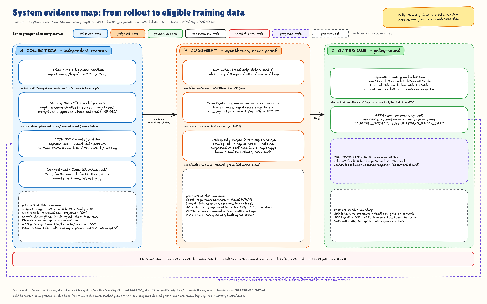
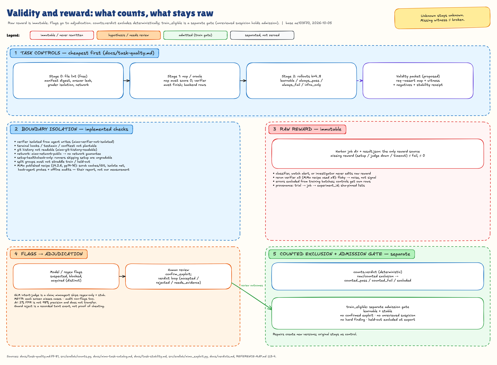
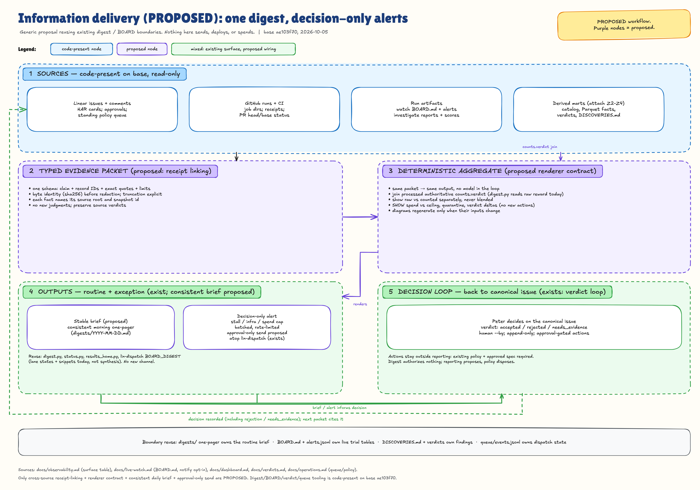

# Agent infrastructure: prior art and a better information workflow

**HAR-160 · Research snapshot: 2026-10-05 · Repository comparison: `ae103f7003d7f2d48980ba8d238e47b6bc5f572e` · $0 external experiments.** This replaces the earlier two-page, five-area map following Peter's explicit request for the full report, diagrams, and aggregate-information recommendations. It integrates the contributor research, correcting claims against primary sources rather than concatenating the handoffs.

**Evidence boundary:** software capabilities below are source-inspected, not deployment certifications. Paper/blog results are reported measurements, not reproduced experiments. **[INFERENCE]** marks our judgments; it applies to every adoption decision, ranking, and proposed design. No benchmark, training, hosted-judge experiment, trace upload, notification service, or runtime migration was performed.

## Decision brief

- **[INFERENCE] Keep Harbor and the existing evidence pipeline.** Eval Lab already has independent capture, a live proxy ledger, automatic watching, task controls, deterministic counts, investigation/calibration, GEPA, and report generators. The highest-value work is connecting and qualifying these surfaces, not introducing another authoritative trace database. [Current capabilities](#current-eval-lab-baseline)
- **[INFERENCE] Inspect Scout is the strongest immediate reuse candidate for labeling and scanner validation.** It supports online and offline scanning. Docent has useful query/Reading/analysis-plan abstractions, but its official docs now say self-hosting is **not generally supported**. Open source does not automatically mean a maintained self-host deployment. [§5](#5-trajectory-analysis-and-trace-reading-agents)
- **[INFERENCE] rLLM's model gateway deserves a compatibility evaluation before more training-specific capture code.** It records native token IDs/logprobs, assembles streamed traces, and persists partial rollouts. Its documented token path uses **vLLM**, so SGLang parity is an open prerequisite—not an adoption claim. [§1](#1-rollout-observability-proxy)
- **Validity, detection, and learning are different contracts.** A passing test can be exploited; an all-fail task can be valid; a monitor flag is not a confirmed exploit. Published low false-positive rates are not precision guarantees. [§3](#3-reward-hack-and-cheating-detection), [§4](#4-task-and-environment-validation)
- **[INFERENCE] Standardize what publishers emit and what the human receives—not prompts repeated to every agent.** Produce one evidence-linked brief from structured receipts, regenerate diagrams when their underlying structure changes, and route decision requests through the existing board/notification owner. This is a proposed contract, not running automation. [§8](#8-standardized-aggregate-information-delivery)

**Read by need:** [top ten](#ten-prioritized-changes) · [proxy](#1-rollout-observability-proxy) · [live monitoring](#2-live-run-monitoring-and-alerting) · [reward integrity](#3-reward-hack-and-cheating-detection) · [task QA](#4-task-and-environment-validation) · [trace readers](#5-trajectory-analysis-and-trace-reading-agents) · [optimizers](#6-gepa-and-dspy-for-agent-tasks-and-data) · [harnesses](#7-harnesses-for-small-open-models) · [information delivery](#8-standardized-aggregate-information-delivery) · [licenses/releases](#software-availability-and-release-snapshot).

## Ten prioritized changes

**[INFERENCE] Ranking is value relative to the incremental work and new operational burden, not an estimate of implementation time.** Existing/open work is explicitly distinguished from new recommendations. Any experiment, deployment, or notification change still needs its normal approval.

| Rank | Change and source | Why this ranks here | Observable acceptance and reuse point |
|---|---|---|---|
| 1 | **One publication contract and one human brief**, with change-sensitive diagrams. [§8](#8-standardized-aggregate-information-delivery) | Removes repeated formatting requests without another service or board. | One artifact publication produces an evidence-linked result/decision card; duplicate events do not produce duplicate updates; missing data is visible. Extend existing publishers/digests and `lin` integration. |
| 2 | **Expose validity coverage, especially missing witnesses.** [MiMo §4.2.1][mimo], [SWE-smith][smith-guide] | Makes the current oracle-less-task limitation actionable before spending more on learning. | A task receipt separately shows controls, legitimate witness, stability, specification audit, exploit audit, and effective network policy; unknown is not “broken.” |
| 3 | **Populate held-out monitor calibration.** [Scout][scout-validation], [MALT][malt], [Ari][ari] | We have a scorer; the missing evidence is local labels and operating-point performance. | Existing `investigate score` reports precision, conservative recall, FPR, coverage, abstention and intervals on frozen, family-disjoint human labels, including sampled non-flags. |
| 4 | **Qualify capture coverage and native-token provenance by route.** [Inspect bridge][inspect-bridge], [rLLM gateway][rllm-gateway] | Prevents incomplete or re-tokenized observations from masquerading as a complete training record. | Main, summary and auxiliary calls have explicit attribution/coverage; native token/logprob capture is evaluated separately from text capture. No silent body sampling. |
| 5 | **Turn exploit findings into repeatable positive and benign-negative controls.** [MiMo §4.2.6][mimo], [ImpossibleBench][impossible] | Converts incidents into durable checks while measuring overblocking. | Cover target-package copies, caches, future Git objects, hidden tests and grader tampering; distinguish attempted, blocked and acquired. Extend existing probe/variants; PR #708 was still open at intake. |
| 6 | **Make counted results and training admission explicit at every consumer.** [MiMo §4.3.2][mimo], [local counts][local-counts] | A good detector is useless if optimization or reporting consumes the wrong reward. | Preserve raw reward; use the intended counted objective; keep training eligibility separate. GEPA already supports `COUNTED_VERDICT`; retire its legacy opt-in fetch-to-zero behavior when migrating callers. |
| 7 | **Improve operational diagnosis around existing automatic watches.** [Inspect control][inspect-control], [prime-rl][prime-training] | Reuses HAR-162 instead of building a second watcher. | Show effective budgets and generating/tool/retry/queue activity where measured; distinguish trainer starvation from inference pressure; do not infer per-request queue latency from trajectory gaps. |
| 8 | **Use deterministic trajectory features to direct review, not decide truth.** [Behavioral Drivers][behavior-drivers] | Makes large trace sets navigable without judging every token. | First edit, validation activity, repeated calls and stop reasons link to source steps. Reuse existing features and coordinate with open PR #702 rather than duplicating it. |
| 9 | **Run a bounded gskill-style campaign through existing GEPA.** [gskill experiment][gskill] | A real SWE-agent precedent, but not evidence of a 9B gain. | Frozen task/version/split and authorized objective; compare held-out counted outcomes, cost and exploit incidence. Instruction/rubric repair cannot weaken requirements to improve a score. |
| 10 | **Measure the model–harness pair on the actual 9B baseline.** [Kozuchi][kozuchi], [Harness-Bench][harness-bench] | External scores confound models, tools and selection budgets. | Paired tasks/images/verifier/model settings; separate harness changes from candidate count and selection; report counted pass, infra exclusions, tokens, latency and capture coverage. |

## Current Eval Lab baseline

This is a **source-capability snapshot**, not a statement that every historical run used every component or that all services are currently deployed.

| Boundary | Already present | Limit that still matters |
|---|---|---|
| Independent evidence | [`capture serve/link`](../../docs/model-capture.md): host-side bodies/SSE, timestamps, errors, attribution and completeness status | A proxy only sees routed calls. Both-absent evidence can be idle or bypass; auxiliary calls may be absent from ATIF. |
| Operational observability | [`proxy-live/` and automatic watch](../../docs/live-watch.md): metered call transitions, budgets, live signals, per-job alerts | Body-free ledger and full-body capture are different streams. Logging is fail-open; missing publication must remain visible. Capability is not coverage proof for every provider. |
| Result interpretation | [`counts.py`][local-counts] preserves raw reward and emits `counted_pass`, `counted_fail`, `excluded` | Model blame/first-failure labels do not decide counts. A recorded guard rejection may taint a pass without proving successful cheating. |
| Training admission | [`task-quality.md`](../../docs/task-quality.md): controls, outcome groups, stability, exploit review and eligible exports | `train_eligible` is not `counts.verdict`: an unreviewed suspicion can hold admission without becoming a confirmed fact. MiMo ports lack supplied reference solutions. |
| Trace investigation | [`prepare → run → report → score`](../../docs/monitor-investigations.md) | Hosted runs are explicit opt-in; findings are hypotheses; actions are inert proposals; scientific calibration needs appropriate human labels. |
| Optimization | [`gepa_optimizer/evaluator.py`][local-gepa], [operator contract](../../docs/operations.md) | Counted scoring, immutable candidates and release gates exist. Search-visible development gains are not held-out improvement. |
| Human-facing outputs | [`digest.py`][local-digest], [`status.py`](../../src/evallab/status.py), [`results_home.py`][local-results], read-only dashboard and failure atlas | Existing surfaces are fragmented. The digest's trial rows carry **raw rewards**, not authoritative counted decisions. Board digest snippets are not an evidence/decision synthesis. |

[Full-resolution SVG](diagrams/system-evidence-map.svg) · [Editable Excalidraw scene](diagrams/system-evidence-map.excalidraw). The diagram maps capabilities and evidence boundaries; it is not a runtime coverage certificate.

## 1. Rollout observability proxy

The key distinction is **an in-path gateway**, **client instrumentation**, **a trace store/viewer**, and **a training-trajectory recorder**. They solve overlapping but different problems. Scout and Docent consume/analyze evidence; neither is a substitute for an independent model-call tap. [Inspect][inspect-bridge], [Scout integration][inspect-scanners], [Docent plans][docent-plans]

| Name | What it does | Relation to our version | Adopt / borrow idea / ignore | Link |
|---|---|---|---|---|
| Inspect bridge and eval logs | Routes agent model calls through Inspect; logs samples, usage and optionally API bodies. Sandbox bridge grants provider-hosted capabilities explicitly. | Closest evaluation-oriented analogue to capture plus ATIF. | **Borrow** sample-bound correlation and selective log reading; do not migrate the Harbor runner. | [Agent Bridge][inspect-bridge]; [Eval Logs][inspect-logs] |
| rLLM model gateway | Session-scoped OpenAI endpoint; vLLM token IDs/logprobs, streamed trace assembly, per-call persistence and partial-rollout recovery. | More directly relevant to RL token fidelity than a generic tracing UI. | **Evaluate for reuse** before implementing another native-token gateway; SGLang compatibility is unproven here. | [`rllm-model-gateway/README.md`][rllm-gateway]; [`gateway/manager.py`][rllm-manager] |
| LiteLLM proxy | Virtual keys, routing, rate/budget checks and asynchronous usage/logging integrations. | Overlaps our transport, metering and capture, but introduces a broader gateway/DB surface. | **Borrow** request identity and enforcement/logging separation; **defer** wholesale replacement. | [Architecture][litellm-architecture]; [logging][litellm-logging] |
| Helicone observability / AI Gateway | Observability service plus a distinct routing gateway with session/cost/latency and OTel facilities. | Another gateway/backend combination, not proof of tamper-resistant complete capture. | **Defer** another gateway unless it replaces a measured maintenance burden. Main repo is Apache-2.0; gateway is GPL-3.0. | [Observability repo][helicone]; [gateway][helicone-gateway] |
| OTel GenAI / OpenLLMetry | Shared span/metric vocabulary; provider/framework instrumentation and OTLP export. GenAI conventions remain Development; content capture is opt-in. | Portable projection of existing facts, not an evidence authority. | **Adopt vocabulary / borrow adapters**; version-pin mappings and preserve raw source records. | [`gen-ai-spans.md`][otel]; [OpenLLMetry][openllmetry] |
| Langfuse / W&B Weave | Trace UI, annotations/evaluations; Weave instruments application calls. | Useful optional consumers of our evidence. Neither independently proves all calls traversed capture. | **Defer new backend**; export only if its UI answers a concrete unmet question. | [Langfuse OTel][langfuse]; [Weave tracking][weave] |
| Phoenix / LangSmith | Trace/evaluation platforms. Phoenix is ELv2 source-available; LangSmith self-hosting is an Enterprise add-on. | Deployment and license constraints matter more than dashboard similarity. | **Do not select as the default open stack**; note their integration patterns. | [Phoenix license][phoenix-license]; [LangSmith self-hosting][langsmith-selfhost] |

### What the RL frameworks actually record

These are file-level observations, not an audit of every subsystem. **It is false to dismiss all RL logging as post-hoc.** Some frameworks already provide native-token gateways, distributed spans or live episode streams.

| Framework | Verified mechanism | What is useful to borrow | Exact primary source |
|---|---|---|---|
| verl | Multi-backend step metrics; opt-in rollout traces and RL-Insight integration | Separate training-step metrics from agent-loop spans | [`utils/tracking.py`][verl-tracking]; [`utils/rollout_trace.py`][verl-trace] |
| OpenRLHF | W&B/TensorBoard train/eval loggers; generated-sample tables; token-space action ranges and rollout logprobs | Preserve action/observation masks and distinguish sample logs from the full call stream | [`utils/logging_utils.py`][openrlhf-logging]; [`utils/agent.py`][openrlhf-agent] |
| SkyRL | Training stdout and separate live infrastructure log files; inference metrics | Separate readable progress from low-level worker failures | [Logging guide][skyrl-logging] |
| rLLM | Session gateway captures native token data; metric reducer uses explicit sum/last/mean rules | Call-level persistence and **metric-specific aggregation**, not averaging everything | [Gateway][rllm-gateway]; [`metrics_aggregator.py`][rllm-metrics] |
| slime | Rollout and train step axes; per-sample span/events; replayable debug rollouts | Trace a sample through generation/reward, retain replayable diagnostic data | [`wandb_utils.py`][slime-logging]; [trace guide][slime-trace] |
| ROLL | OTel context propagated through distributed work; random-seed-independent trace IDs | Correlation survives worker boundaries and shared training seeds | [`utils/telemetry.py`][roll-telemetry] |
| AReaL | Monotonic-step metrics and staleness admission control; agent-service history is explicitly not the training capture | Keep training-version admission separate from UI history and metric logging | [`stats_logger.py`][areal-stats]; [`staleness_manager.py`][areal-staleness]; [agent service][areal-service] |
| prime-rl | Live metrics/episode streams, trainer/orchestrator timing and rollout error/staleness signals | Distinguish waiting for batches from waiting for policy/inference | [Training and important metrics][prime-training] |

**Practitioners' patterns**
- Keep enforcement and telemetry separate: LiteLLM's budget/auth path and asynchronous logging are distinct responsibilities. [Architecture][litellm-architecture]
- Correlate by explicit sample/session/request identity; do not depend on reconstructing conversations when an authoritative ID is available. [Inspect][inspect-bridge], [rLLM][rllm-gateway]
- Record the representation needed by the consumer: text is useful for review; training may need native IDs, masks and behavior-policy logprobs. [rLLM][rllm-gateway], [OpenRLHF][openrlhf-agent]
- Handle content privacy separately from metadata. OTel marks input/output content opt-in; a derived redacted export need not weaken an authorized full-capture evidence contract. [GenAI spans][otel]

**Ranked changes [INFERENCE]:** (1) qualify route/auxiliary-call coverage using existing capture statuses; (2) test rLLM gateway compatibility and provenance before choosing reuse versus an adapter; (3) add a versioned OTel projection only when a named consumer needs it. These reuse existing collection rather than create a second canonical store.

**Open questions:** SGLang's compatibility with the gateway's vLLM-specific token fields; measured backpressure/storage behavior at our concurrency; how to reconcile retries and provider-hosted tools that bypass sandbox egress. A logging feature list does not settle these.

## 2. Live run monitoring and alerting

A live dashboard is not an alert policy, and a detected stall is not automatically a failed model attempt. Eval Lab already attaches a read-only watcher to agent jobs and records watcher failures without failing the job. [Local live-watch contract][local-watch]

| Name | What it does | Relation to our version | Adopt / borrow idea / ignore | Link |
|---|---|---|---|---|
| Inspect limits and control channel | Sample time/working/token/cost bounds; idle and activity states; explicit cancellation, pause/drain and requeue controls | Better vocabulary for why a run appears idle and which budget applies | **Borrow** state distinctions and effective limits; do not copy cancellation policy blindly | [Limits][inspect-limits]; [control channel][inspect-control] |
| Harbor trial lifecycle | Setup/agent/verifier boundaries, timeouts, concurrency and failure records | Already the execution owner | **Reuse** effective configuration and exception provenance rather than invent another controller | [`trial/trial.py`][harbor-trial]; [`models/trial/config.py`][harbor-config] |
| SGLang metrics | Server metrics expose serving activity and pressure | Existing telemetry can consume gauges, but a gauge is not an individual call's queue delay | **Reuse** measured server metrics; preserve attribution/coverage limits | [Observability][sglang-metrics]; [local telemetry][local-telemetry] |
| prime-rl / AReaL | Timing, workload/staleness signals; AReaL admission control explicitly uses policy versions | Training-side analogues, not direct labels of task validity | **Borrow** bottleneck diagnosis; **defer** workload shedding or staleness policy changes until separately evaluated | [prime-rl][prime-training]; [AReaL controller][areal-staleness] |

**Practitioners' patterns**
- Bound the sample and its tool calls separately; report which limit ended the attempt. [Inspect limits][inspect-limits]
- Distinguish generating, executing a tool, waiting for retry/approval, and making no observable progress. [Inspect control][inspect-control]
- Separate training-step aggregates from per-rollout signals; batch starvation and inference pressure are different bottlenecks. [prime-rl][prime-training]
- Record infra/setup/grading failures separately from an agent exhausting its allotted solving budget. Not every timeout is infrastructure. [Harbor][harbor-trial], [DeepSWE §5.6][deepswe]

**Ranked changes [INFERENCE]:** (1) enrich existing watch output with effective limits and directly measured activity/wait reasons; (2) calibrate the noisiest rules with existing scoring rather than adding more thresholds; (3) surface logging/watcher coverage failures in the aggregate brief. Keep stop/retry/notification behavior under the existing controller and approval policy.

**Open questions:** local stall/loop false-positive rates; whether a signal predicts recoverable slowness versus terminal failure; how much observable progress a long tool invocation should emit. Sources provide mechanisms, not validated universal thresholds.

## 3. Reward-hack and cheating detection

Separate **task leakage/pretraining exposure**, **forbidden retrieval**, **grader exploitation**, and **monitor suspicions**. An authorized issue containing a solution is a dataset flaw, not necessarily a forbidden action by the solver. [SWE-Bench+][swe-plus], [contamination audit][swe-contamination]

| Name | What it does | Relation to our version | Adopt / borrow idea / ignore | Link |
|---|---|---|---|---|
| MiMo-V2.6 | Removes solution-bearing residue/future Git objects, isolates networking, probes with hack agents and audits training traces | Direct task-family precedent; analogous defenses already exist locally | **Borrow** threat coverage and correction ordering, not another monitor | [§4.2.6 and §4.3.2][mimo] |
| Xiaomi `antihack.py` / GLM-5.2 | GLM describes recall-first rules followed by intent judgment; released Xiaomi code is opt-in regex interception with a stub LLM confirmation | Rule inventory, not a working calibrated two-stage judge | **Borrow** patterns and benign counterexamples; **do not adopt as a security boundary** | [Pinned code][antihack]; [GLM anti-hack section][glm] |
| METR / MALT | Complementary searches and human review; labeled natural/prompted traces for monitor evaluation | External development evidence, not our base-rate calibration | **Borrow** reviewed negatives, family coverage and missed-case analysis | [Reward-hacking report][metr]; [MALT][malt] |
| ImpossibleBench | Deliberately creates specification/test conflicts; passing such a validated mutant supplies an exploit-positive control | Useful adversarial controls, not a label for ordinary all-fail tasks | **Borrow** contradiction/QC method; keep these out of normal solving data | [§2.3 and §6][impossible] |
| Applied Compute Ari | Cheap sampled monitor followed by richer full/related-trace investigation; fixed-FPR evaluation | Close analogue of our existing investigator/scorer | **Borrow** sampling and operating-point discipline; **defer** proprietary service/automatic intervention | [Detection and benchmark][ari]; [architecture][ari-architecture] |
| SWE-bench leakage/contamination studies | Audit supplied solution hints or probe prior benchmark knowledge | Distinct from runtime cheating and patch correctness | **Borrow** input audits, dated holdouts and conservative interpretation | [SWE-Bench+ §2][swe-plus]; [OpenAI audit][swe-contamination] |

### What detection measurements do—and do not—mean

| Evidence | Reported measurement | Important limit |
|---|---|---|
| MiMo final training | Logged confirmed-hack share below 2% | Not detector recall, precision, or proof of no undetected hacks. [§4.2.6][mimo] |
| GLM/public Xiaomi guard | No held-out numeric P/R supplied in the cited write-up/code | Claimed design intent is not measured performance; `_llm_judge` remains a stub. [GLM][glm], [code][antihack] |
| MALT | Best reward-hack monitor AUROC .96; TPR .87 at 5% FPR on reviewed evaluation data | 2,690 reviewed runs in a 10,919-run corpus; prompted/natural mixture and label/population differences limit transfer. [Evaluation][malt] |
| ImpossibleBench | 42–65% sensitivity on impossible SWE; 86–89% on impossible LiveCodeBench | Original passing traces are not known-clean negatives, so their flag rate is only an upper bound on FPR. [§6][impossible] |
| Ari | TPR .849/.866 at 2% FPR; internal corpus 278 positives/2,110 negatives with development/test separation | Vendor-reported; corpus/prompts not released in the article. 2% FPR is not 98% precision. [Benchmark][ari] |

**[INFERENCE] Base-rate illustration:** with 1% true prevalence, .849 recall and .02 FPR imply precision `(.849 × .01) / (.849 × .01 + .02 × .99) ≈ 30%`. That is an illustrative calculation, not an estimate of our prevalence.

**Practitioners' patterns**
- Prevent access to answers and graders before relying on a detector. [MiMo §4.2.6][mimo]
- Use broad rules to nominate cases, contextual review to interpret them, and human adjudication where necessary. [GLM][glm], [METR][metr]
- Review unflagged examples too; flagged-only review cannot estimate misses. [METR][metr], [Ari][ari]
- Measure held-out operating points and preserve human/synthetic/prompted label provenance. [MALT][malt], [ImpossibleBench][impossible]
- Keep raw evaluation evidence distinct from training-effective correction. MiMo applies confirmed-hack correction before group statistics; our counts layer preserves raw reward and records exclusions separately. [§4.3.2][mimo], [counts][local-counts]

**Ranked changes [INFERENCE]:** (1) verify downstream counts/eligibility consumption; (2) populate local held-out calibration with hard negatives and sampled non-flags; (3) extend existing exploit controls to target-package copies, caches and grader tampering. A blocked action, a successful acquisition and an actual copied fix remain separate facts.

**Open questions:** our natural exploit prevalence and tolerated review burden; transfer to new task families; robustness to misleading text inside traces. External benchmark scores do not answer these.

## 4. Task and environment validation

**A legitimate passing witness demonstrates solvability under its conditions; it does not prove that every acceptable solution passes or that every passing solution is acceptable.** Human-authored/reference patches can be witnesses too—one need not run a model to author one. Our supplied MiMo ports lack reference solutions, so that evidence must be acquired or remain explicitly missing. [Local QA](../../docs/task-quality.md), [Verified instructions][verified-instructions]

| Name | What it does | Relation to our version | Adopt / borrow idea / ignore | Link |
|---|---|---|---|---|
| MiMo environment preparation | Specification/test audit and reference F2P/P2P checks stable across eight reruns | Upstream reference evidence is not automatically present in our ports | **Borrow** separate QA axes and provenance; do not invent missing oracles | [§4.2.1–4.2.2][mimo] |
| SWE-Gym / R2E-Gym | Build executable tasks around known fixes; R2E adds tests and back-translated descriptions | Known reference commits differ from oracle-less task validation | **Borrow** reproducible setup, witness transitions and split lineage | [SWE-Gym §3.1][swegym]; [R2E §2][r2e] |
| SWE-smith | Starts from functioning code, introduces bugs, retains F2P/P2P evidence | The clean base is a witness; this does not certify arbitrary existing tasks | **Borrow** known-good construction for new tasks, not blanket validation of old ones | [Validation guide][smith-guide] |
| SWE-rebench | Dated task mining, setup repair/pinning, base/reference tests and quality annotations | Matches freshness and backend qualification | **Borrow** manifests and annotation fields; keep classifier labels advisory | [§2.2–2.4][rebench] |
| SWE-bench Verified | Three human assessments of issue clarity/test fairness; maximum-severity filtering | Useful false-fail/underspecification rubric | **Borrow** review criteria; “Verified” does not eliminate contamination or all grader flaws | [Methodology][verified]; [instructions][verified-instructions] |
| Terminal-Bench | Oracle/no-op controls, human and model review, multiple/adversarial agents | Existing Harbor/Eval Lab QA has much of this structure | **Borrow** evidence checklist, not a new runner | [v2 paper §2.3, Appendix B][terminal-bench] |
| DeepSWE, Datacurve | Original tasks, behavioral verifiers, shallow clones, repeat checks and audits | Strong acceptance-breadth and anti-leak precedent | **Borrow** behavior-first assertions and review of alternative valid solutions | [§3.3–3.4, §4.2–4.3][deepswe] |
| Nemotron SWE | Dependency-prefetched environments and OpenHands-based training recipe; separate trajectory dataset | Setup/resource and lineage reference, not a universal task certificate | **Borrow** preparation receipts; **defer** backend replacement | [SWE recipe][nemotron-recipe]; [dataset][nemotron-data] |
| CodeMidas | Removes functionality while retaining a reference; two starting failures/four reference passes in fresh containers, then audits/filtering | MiMo cites the method, but per-task FineEnvs lineage is not established | **Borrow** witness provenance and behavioral assertions | [§3.1–3.5][codemidas] |

**Do not conflate measurements.** DeepSWE's 1.4% versus 32.4% compares **judge–verifier disagreement**, not ground-truth error. SWE-rebench v2 reports test-correctness classification accuracy 67% on its validation set, not a certification rate. MiMo's eight repeats and CodeMidas's two-fail/four-pass procedure are different protocols, not a single inherited guarantee. [DeepSWE §3.4/§8][deepswe], [SWE-rebench §2.4][rebench], [CodeMidas §3.3][codemidas]

### Network isolation is not one industry-wide setting

| Context | What the source establishes | Consequence for us |
|---|---|---|
| MiMo RL | Explicit container-level network isolation against upstream fixes/alternative packages | Retain approved phase-specific enforcement and evidence; do not weaken it because another benchmark permits internet. [§4.2.6][mimo] |
| Terminal-Bench v2 | Agents may access the internet to install packages and query relevant information | A different benchmark objective; not evidence that every SWE RL pipeline should allow internet. [§5][terminal-bench] |
| SWE-bench grading path | Pinned `create_container` has no explicit no-network override | This says nothing definitive about solver traffic, provider firewalls, or private training. [Code][swe-container] |
| Eval Lab MiMo/Daytona | Source enforces post-setup provider egress blocking, records `egress-lock.json`, and fails closed on refusal | Enforcement already exists. Show requested **and effective** policy, backend and phase; do not claim all historical runs used it. [Daytona adapter][local-daytona]; [phase policies][local-network] |

[Full-resolution SVG](diagrams/validity-and-reward.svg) · [Editable scene](diagrams/validity-and-reward.excalidraw).

**Practitioners' patterns**
- Preserve the legitimate witness supplied by task construction, including a clean pre-bug base or fixed commit. [SWE-smith][smith-guide], [SWE-Gym][swegym]
- Check controls, reference transitions, stability, specification coverage and exploit resistance separately. No single check establishes all five. [MiMo][mimo], [DeepSWE][deepswe]
- Inspect false failures as well as false passes; constrain specified behavior, not incidental implementation choices. [Verified][verified-instructions], [DeepSWE §4.3][deepswe]
- Treat mixed/all-pass/all-fail groups as model-and-budget-relative training information, not permanent task truth. All-pass has no relative *binary-reward* variation; richer rewards are a different case. [CodeMidas §3.4][codemidas], [MiMo §4.3.1][mimo]
- Qualify the backend and preserve infrastructure exclusions. A setup/grading error and an agent failing within its solving budget are different outcomes. [SWE-rebench][rebench], [DeepSWE §5.6][deepswe]

**[INFERENCE] Why `0/k` is insufficient:** even with a genuine 20% per-attempt success probability, four independent attempts all fail with probability `0.8⁴ ≈ 41%`. Independence is an illustrative assumption; actual attempts can be correlated. Neither `0/4` nor pass@k alone establishes invalidity.

**Ranked changes [INFERENCE]:** (1) publish a per-task validity-coverage packet using existing catalog/qualification/audit fields; (2) curate legitimate witnesses for consequential oracle-less tasks; (3) create immutable repaired versions only after evidence-backed specification/test review. Keep difficulty filtering downstream of validity and counted-result checks.

**Open questions:** exact upstream oracle/provenance history of each port; which all-fail tasks are hard versus broken; appropriate rerun counts and family-disjoint splits. The literature supplies methods, not local answers.

## 5. Trajectory analysis and trace-reading agents

| Name | What it does | Relation to our version | Adopt / borrow idea / ignore | Link |
|---|---|---|---|---|
| Inspect Scout | Regex/custom/LLM scanners, online-on-sample-completion and offline modes; labeled validation and review UI | Existing scoring already has intervals/coverage; Scout adds a reusable analyst/labeling surface | **Adopt selectively** for labeling/validation via existing adapters; do not replace counts | [Integration][inspect-scanners]; [validation][scout-validation] |
| Docent | DQL selection/grouping, Reading judges, citation-bearing structured outputs and cached analysis plans | Useful architecture for evidence selection before model judgment | **Borrow** plan/slice/citation patterns; **defer** self-host adoption pending support/feature parity | [Plans][docent-plans]; [Readings][docent-readings]; [self-hosting][docent-selfhost] |
| Seven Steps for Log Analysis | Defines signal design, rubric construction, blinded validation and deployment/use distinctions | A methodology for populating our existing monitor/scorer | **Borrow** the validation protocol, not another orchestration layer | [§5–6, Tables 6–8][seven-steps] |
| Beyond Resolution Rates | Difficulty-controlled analysis of 9,374 SWE trajectories; deterministic behavioral encoding | Useful first-edit, validation and repeated-patch features | **Borrow** feature taxonomy and within-task controls; not causal claims from correlations | [§3–4][behavior-drivers] |
| Who&When | Expert-labeled attribution of responsible agent and decisive step in multi-agent failures | Useful failure-attribution protocol with limited transfer to single-agent SWE | **Borrow** annotation/tolerance ideas; **ignore** headline accuracy as our operating point | [§3–4][who-when] |

**This is reuse, not a new integration project.** The [existing Scout workspace](../explorations/trace-lab/scout/README.md) documents a pinned `inspect-scout==0.5.3` demonstration over 54 Harbor trials, deterministic scanners, validation cases and UI screenshots; [`import_evallab.py`](../explorations/trace-lab/scout/import_evallab.py) is the reusable importer. Those historical results were not rerun here. The recommendation is to populate and qualify this route on the relevant current corpus, not build another viewer.

**Accuracy needs a population and a unit.** Scout reports balanced accuracy, precision, recall and F1 against labeled sets. Who&When reports a best exact-step figure of 14.2% on its failure-attribution evaluation—not a benign false-positive rate. Behavioral Drivers finds that the apparent “long traces fail” relationship changes when task difficulty is controlled. None establishes our 9B monitor's accuracy. [Scout][scout-validation], [Who&When][who-when], [Behavioral Drivers][behavior-drivers]

**Practitioners' patterns**
- Define the behavior, examples, counterexamples and scoring unit before tuning a judge. [Seven Steps §5][seven-steps]
- Use deterministic retrieval/features first; ask a model only the contextual question that remains, with source-message citations. [Docent Readings][docent-readings], [Scout scanners][scout-llm]
- Blind human labels to the scanner's conclusion; include non-detections and keep development/test families separate. [Seven Steps §6][seven-steps], [Scout validation][scout-validation]
- Report abstention, missing data and coverage beside precision/recall. Our existing scorer already distinguishes conservative and selective metrics. [Local scoring](../../docs/monitor-investigations.md)

**Ranked changes [INFERENCE]:** (1) use Scout's labeling workflow to populate local frozen human labels; (2) require self-contained rubrics and cited structured findings; (3) keep deterministic trajectory features in the feature layer, outside the counts verdict. Reuse open HAR-159 work rather than introducing another extractor.

**Open questions:** current Docent open-code versus hosted-feature parity; reliable low-FPR performance on natural MiMo traces; how to map each paper's features into our actual ATIF/harness formats. Self-hostability and accuracy both need specific evidence.

## 6. GEPA and DSPy for agent tasks and data

**Qualifying example: gskill.** It uses SWE-smith tasks and mini-SWE-agent with GPT-5-mini to optimize repository skills and evaluates held-out tasks. The authors report **55%→82% on Jinja** and **24%→93% on Bleve**, using fewer than 300 optimization rollouts. Those are same-repository synthetic SWE tasks, not an open 9B study or validation of arbitrary instruction repairs. [Experiment][gskill]

| Name | What it does | Relation to our version | Adopt / borrow idea / ignore | Link |
|---|---|---|---|---|
| gskill | SWE-smith task generation → agent attempts/test feedback → GEPA skill evolution → held-out evaluation | Direct task/trace/feedback analogue; we already have the optimizer infrastructure | **Borrow the experiment protocol**, not a second optimizer | [Experiment][gskill]; [`src/gepa/gskill/README.md`][gskill-code] |
| GEPA evaluator API | Optimizes textual artifacts using scores plus diagnostic feedback | Upstream engine for existing immutable instruction candidates and counted scoring | **Reuse** our pinned/qualified engine; separate requirement-preserving repair from score gaming | [Evaluator contract][gepa-evaluator]; [local evaluator][local-gepa] |
| DSPy GEPA integration | Optimizes program instructions against a supplied metric with training/validation examples | Potential adapter for judge/rubric experiments; API availability is not another SWE efficacy result | **Borrow selectively** if it simplifies a real calibrated judge; **ignore** a whole-agent rewrite | [GEPA optimization and splits][dspy-gepa] |

Single-prompt Shopify/Dropbox examples and toy QA are **not counted as SWE-agent task-repair evidence**. We found a directly relevant skill-optimization example; we did not establish a generally reliable pipeline that automatically repairs arbitrary MiMo tasks or certifies graders.

**Practitioners' patterns**
- Reflect on traces and test feedback, not only a scalar score. [gskill][gskill-code]
- Split training/validation/held-out tasks before optimizing; distinguish same-repository holdout from cross-repository transfer. [gskill experiment][gskill], [DSPy splits][dspy-gepa]
- Publish the optimized skill/prompt artifact with its evaluation, rather than silently modifying the harness. [gskill][gskill-code]
- Bound evaluator calls, retain candidate identity and resume evidence. Existing Eval Lab GEPA already has budgets, immutable candidates and review gates. [Local operator contract](../../docs/operations.md)

**Ranked changes [INFERENCE]:** (1) test the gskill protocol through existing GEPA with frozen splits and counted outcomes; (2) optimize one judge/rubric only against frozen human/control labels; (3) evaluate data/task repairs on unchanged requirements, alternative correct solutions and wrong-solution controls. A higher pass rate alone is not the repair objective.

**Open questions:** gains with this 9B worker; whether learned skills survive later SFT; total cost at long rollout lengths; whether improvements generalize beyond synthetic same-repository tasks. Generic GEPA-versus-RL rollout-efficiency claims do not resolve SWE costs.

## 7. Harnesses for small open models

The comparison unit is **model + harness configuration + task/environment + budget + sampling/selection**, not model name alone. Our source baseline has a MiMo-native route; Terminus-2 is another lane, not a synonym for the whole runner. [Execution contracts](../../src/evallab/execution_contracts.py), [Harness-Bench §3–4][harness-bench]

| Name | What it does | Relation to our version | Adopt / borrow idea / ignore | Link |
|---|---|---|---|---|
| mini-swe-agent | Minimal bash-centric agent, linear conversation and simple action execution | Minimal control and ancestor of mimoagent | **Keep as a comparison/control idea**, not a claim that minimal always wins | [Repo/README][mini-swe] |
| Xiaomi mimoagent | Native agent loops and black-box CLI adapters with trajectory/reward artifacts | Closest upstream family to the current native baseline | **Reuse pinned native behavior**; compare variants without changing other experimental variables | [Repo and agent source][mimoagent] |
| Terminus-2 | Terminal/tmux agent with parsers, context management and ATIF output | Existing alternative lane | **Borrow/ablate within that lane**, not a default replacement | [`terminus_2.py`][terminus] |
| OpenHands | Rich tool/runtime and context-management framework | Richer comparison arm; complexity alone says nothing about 9B benefit | **Defer adoption** unless a controlled comparison justifies it | [Core repo][openhands]; [SWE evaluation][openhands-eval] |
| SWE-agent | Agent-computer-interface research and dedicated repository tools | Useful ACI precedent; overlaps the minimal control question | **Borrow interface methodology**, avoid adding a redundant permanent runner | [ACI paper][swe-agent-paper]; [repo][swe-agent] |
| Qwen Code | Qwen-oriented terminal coding CLI | Vendor-style comparison candidate; Qwen lineage alone does not ensure fit for distilled MiMo | **Evaluate only as a pinned, budget-matched arm** | [Canonical repo][qwen-code] |

### What small-model evidence supports

- **Kozuchi:** Qwen3.5-27B, no fine-tuning, eight candidates plus a cross-agent selector, **374/500 = 74.8%** on the official SWE-bench Verified evaluator. The paper separates controlled candidate/selector comparisons from **unablated** phase, state and tool mechanisms. Its internal Docker re-grade differs from the official score. This is not 9B, not pass@1, and not proof that phase scaffolding caused the gain. [Abstract, Table 1, §8.5][kozuchi]
- **Harness-Bench:** 106 offline tasks and 5,194 trajectories; fixes external tasks/budgets while retaining native harness behavior. It measures configuration-level effects, partly through LLM process scores, across API model backends—not a controlled 9B SWE-repair study. [§3–4 and Appendix B][harness-bench]
- **Gap:** this review did not establish a directly transferable, controlled comparison on our exact MiMo 9B task/model/budget combination. Cross-system leaderboard numbers cannot choose our harness.

**Practitioners' patterns**
- Keep action formatting and context policy explicit and versioned. [mini-swe-agent][mini-swe], [Terminus][terminus]
- Hold external conditions fixed while comparing complete model–harness configurations. [Harness-Bench][harness-bench]
- Separate candidate generation from test-time selection; disclose `k` and the selector's information access. [Kozuchi §7–8][kozuchi]
- Preserve trajectories, generated tests and state needed to audit the result. Kozuchi's reusable pipeline demonstrates artifact-driven reporting, not a measured general productivity guarantee. [§9][kozuchi]

**Ranked changes [INFERENCE]:** (1) paired native/minimal/lane comparison on approved frozen tasks; (2) compare action/parser/context changes separately from test-time selection; (3) inspect training suitability and capture fidelity, not only final resolve rate. Do not adopt a heavier harness based on another model's score.

**Open questions:** 9B robustness to each interface; interaction between guard policy and harness freedom; whether long or selected trajectories remain useful SFT examples. These require experiments, not more unsupported rankings.

## 8. Standardized aggregate information delivery

### Recommendation: standardize the publication boundary

**[INFERENCE] The solution is a shared evidence-and-presentation contract, not a longer instruction pasted into every agent's prompt.** Producers publish typed facts and artifacts once; a deterministic renderer chooses the standard brief, table, chart or diagram. Peter gets one coherent surface with drill-down links. Individual agents should not repeatedly decide how to format delivery.

Already present: `evallab digest`, `evallab status`, per-job reports, the results home, a read-only dashboard, and the `lin-dispatch`/`BOARD_DIGEST.md` coordination path. Source inspection plus actual `digest --help`/`status --help` confirm the command surface; this research did not certify scheduled execution. The observed board digest lists lane states and truncated latest-comment excerpts. It does not provide the cross-source evidence synthesis proposed here. [Digest source][local-digest], [results-home source][local-results], [workflow](../../agents/WORKFLOW.md)

**A concrete gap:** `DigestTrial` currently carries raw `reward`; its job table displays recorded rewards. Adding a scientific brief requires joining authoritative processed `counts` and coverage, not renaming that raw table “counted success.” Existing display, counted eligibility, code delivery and human acceptance must remain separate axes. [Digest fields/rendering][local-digest], [counts contract][local-counts]

[Full-resolution SVG](diagrams/information-delivery.svg) · [Editable scene](diagrams/information-delivery.excalidraw). Existing generators are reuse points; the unifying contract/renderer/delivery policy is proposed and has not been deployed.

### Tool choices

| Name | What it does | Relation to our version | Adopt / borrow idea / ignore | Link |
|---|---|---|---|---|
| Existing Python publishers + JSON Schema | Typed facts can drive stable Markdown/HTML and machine validation | Lowest-disruption route; existing schema/model conventions and publishers already exist | **Recommended first choice:** extend one publication contract and existing renderers | [Schema specification][json-schema]; [local schemas](../../src/evallab/schemas/__init__.py) |
| Quarto | Code-owned documents with execution, citations, cross-references and multiple output formats | A possible presentation layer over frozen outputs, not another authority or scheduler | **Borrow template/publishing discipline**; add only if current rendering becomes the bottleneck | [Quarto guide][quarto]; [license][quarto-license] |
| Observable Framework | Static data applications with data loaders | No always-on server required, but another frontend/toolchain beside the current dashboard | **Defer framework migration**; useful if a static interactive brief becomes a concrete need | [Data loaders][observable] |
| Evidence | SQL/Markdown analytical pages | Fits Parquet/DuckDB-oriented views but duplicates some existing presentation | **Borrow query-backed components**; defer another reporting platform | [Documentation][evidence] |
| Mermaid + Excalidraw | Text-defined flow/state diagrams; editable spatial scenes and rendered assets | Existing Markdown already uses Mermaid; this report demonstrates Excalidraw assets | **Use by visual type**, with fixed templates and semantic input versions | [Mermaid][mermaid]; [Excalidraw][excalidraw] |
| Existing `lin` delivery; optional Apprise / ntfy | Board/notification policy; optional multi-channel or pub/sub transports | Sending a message is separate from computing its contents | **Keep current owner/routes**; consider another transport only if Peter wants another channel | [Apprise][apprise]; [ntfy publishing][ntfy] |

A relevant agent-system precedent is **Kozuchi's single CI-operated pipeline** with regenerable analysis artifacts. It reports reducing five operator touch-points to one CI push, but explicitly calls its time-saving estimate an operational estimate, not a controlled developer-productivity study. The transferable idea is making report generation a workflow output, not an extra conversation. [§9][kozuchi]

### A concrete proposed publication contract

**[INFERENCE] Extend existing typed records rather than create a new event bus or canonical database.** Use a small common envelope with artifact-specific details. Export a JSON Schema from the existing model convention; validate at publication. A record does not become true merely because it passes schema validation.

| Field group | Required meaning | Why it matters |
|---|---|---|
| Identity | Schema version; record ID; project/card; producer; artifact kind; subject IDs | Deduplication and attribution without scraping peer chat histories |
| Observation | Source revision/digests; observed-at timestamp; reporting window/time zone; availability | Distinguish current, stale, unavailable and conflicting evidence |
| Result | Separate reported work state, observed code/CI state, experiment outcome and acceptance | “PR open,” “merged,” “deployed” and “scientifically validated” are not synonyms |
| Metrics | Named metric; value or explicit missing value; numerator/denominator/population; coverage; units | Prevent raw/counted, per-trial/per-task and dollars/tokens from being conflated |
| Evidence | Artifact URI/path and digest; exact source step/query/test/CI link when applicable | Every important number or conclusion can be checked without asking an agent |
| Interpretation | Clearly labeled inference, uncertainty, limitations and next action | Preserve hypotheses without laundering them into facts |
| Decision | Whether Peter must decide; exact question/options; owner; scope/expiry if relevant | No vague “blocked” pings; no approval inferred from the brief |
| Visuals | Stable topic/diagram ID; semantic graph/data inputs; input digest; renderer/template version | Regenerate the same diagram when its content changes, not a fresh poster every time |

**Producer profiles:** an experiment publishes its cohort/config/counts/coverage; a code change publishes merge and exercised verification; research publishes primary sources and bounded conclusions; an investigation publishes cited findings and counterevidence. They share the envelope without forcing irrelevant experiment fields into a documentation receipt.

### What Peter should receive by default

**[INFERENCE] One stable home page, one bounded routine brief, and a separate decision queue.** Start with the existing digest/results-home surfaces and existing notification owner; do not introduce another dashboard just to hide fragmented inputs.

The brief has the same five sections every time:

1. **Bottom line:** what changed in the overall goal, in a few sentences.
2. **New evidence:** results with raw/counted denominators, code delivery state, and direct evidence links.
3. **Decisions needed:** exact choice, recommendation, consequence and owner; otherwise explicitly “none.”
4. **Risks and missing information:** stale/absent/conflicting sources and unresolved validity/coverage.
5. **Next actions and changed visuals:** the next owned step, plus only diagrams/charts whose underlying content changed.

**Delivery:** generate on artifact publication or relevant issue/PR transitions; batch ordinary information into a routine digest. Send an immediate alert only for a real decision or a policy-defined incident, using existing approved routes and deduplication/cooldowns. The cadence/channel is a configurable adoption choice, not something this report enables. A local file being refreshed is **pull availability**, not evidence that Peter received a notification.

### Automatic visual-selection rules

**[INFERENCE] Make this a renderer policy, not an agent-by-agent negotiation.**

| Information shape | Default output | Trigger |
|---|---|---|
| Components, ownership or trust boundaries | Maintain one Excalidraw architecture map per topic | A verified node/edge/boundary changes |
| States, gates or decision paths | Mermaid state/flow diagram | A state or transition changes |
| Population/result changes over time | Chart plus a denominator/coverage table | New comparable observations, with explicit missing data |
| Paired model/harness/config comparison | Comparison table; chart only when it clarifies the contrast | A qualified comparison is published |
| One fact, a wording fix, or no structural change | Short text/table; reuse the existing figure link | No new diagram |

Hash **canonical semantic inputs plus renderer/template version**; exclude incidental timestamps/nonces from the change decision. Fixed graph identities/layout rules preserve readers' mental map. Rendering alone does not verify semantics: new or changed causal/authority edges require source evidence and review. This report supplies editable scenes, not an already-running regeneration service.

### Reliability and safety requirements

- **No summary-of-summary arithmetic.** Aggregate source records by explicit metric rules; link to original artifacts. AI-authored synthesis, if later added, remains labeled interpretation and must cite those inputs.
- **No silent missingness.** Show expected versus received records, age and coverage. Missing sources do not become zero cost, zero failures or a clean bill of health. Conflicting revisions retain both references until resolved.
- **Idempotent delivery.** Stable event IDs plus subject/revision identity prevent duplicate brief entries and duplicate alerts; a changed result is a revision, not an unrelated new task.
- **Untrusted content stays data.** Escape/sanitize labels and rendered text. Do not execute instructions from trace quotes, issue text or artifacts, or let them change notification routes or approval state.
- **Independent authorities stay independent.** Linear owns work/approval records, GitHub owns code/CI observations, published run artifacts own experimental evidence. The brief is a derived view and cannot authorize spending, deployment or a new peer route.

### Adoption sequence and acceptance

**[INFERENCE] First extend the existing publication path, then consider tools or transports.**

1. Add the common envelope to the existing job/code/research publication boundary, with the appropriate producer-specific fields. Reuse source IDs and provenance instead of asking every agent to manually repeat them.
2. Extend the existing digest/status projection to join those records and expose **raw versus counted** outcomes, missingness and evidence links. Render the five-section brief from one versioned template.
3. Associate each topic with an approved diagram specification and deterministic rendering contract. A structure change updates the existing figure; a routine result does not demand another diagram.
4. Connect that derived output to the existing notification owner only after the delivery policy is approved. Optional phone/email transport is a separate choice, not a new coordinator.

Acceptance should exercise real publication boundaries: replay one event without duplication; omit/corrupt one referenced artifact and see an explicit unavailable state; publish a code merge without claiming deployment; change a structural edge and regenerate only its diagram; publish an experiment with excluded trials and preserve both denominators. No new agent rollout is needed merely to validate the reporting path.

**Open questions:** which existing landing page Peter wants as the stable entry point; routine cadence and any out-of-band channel; retention/privacy rules for optional external backends. The report recommends the architecture without quietly deciding or deploying those policies.

## Software availability and release snapshot

Metadata below was checked against official GitHub release/repository APIs and, where named, PyPI. **A release is not a last-commit date; no GitHub release does not mean no activity.** Behavior inspected on `main` is not automatically present in the listed older release. The listed licenses describe the named code artifact, not every dependency, model or dataset. Enterprise directories and source-available licenses require separate attention. These are adoption inputs, not installation or compatibility proofs.

### Proxies, telemetry and trace analysis

| Artifact | License boundary | Latest observed publication |
|---|---|---|
| Inspect AI | [MIT](https://api.github.com/repos/UKGovernmentBEIS/inspect_ai) | [PyPI 0.3.276, 2026-10-02](https://pypi.org/project/inspect-ai/0.3.276/); no GitHub release object |
| Inspect Scout | [MIT](https://api.github.com/repos/meridianlabs-ai/inspect_scout) | [0.5.3, 2026-09-23](https://github.com/meridianlabs-ai/inspect_scout/releases/tag/0.5.3) |
| Docent | [Apache-2.0 code](https://github.com/TransluceAI/docent/blob/main/LICENSE); self-host support limited | [SDK PyPI 0.1.87, 2026-09-16](https://pypi.org/project/docent/0.1.87/); [server repo has no GitHub release](https://github.com/TransluceAI/docent/releases) |
| LiteLLM | [MIT outside `enterprise/`](https://github.com/BerriAI/litellm/blob/main/LICENSE) | [v1.104.0, 2026-10-03](https://github.com/BerriAI/litellm/releases/tag/v1.104.0) |
| Langfuse | [MIT outside enterprise directories](https://github.com/langfuse/langfuse/blob/main/LICENSE) | [v4.51.0, 2026-10-05](https://github.com/langfuse/langfuse/releases/tag/v4.51.0) |
| Phoenix | [Elastic License 2.0](https://github.com/Arize-ai/phoenix/blob/main/LICENSE), source-available | [arize-phoenix-v20.19.0, 2026-10-01](https://github.com/Arize-ai/phoenix/releases/tag/arize-phoenix-v20.19.0) |
| Weave SDK | [Apache-2.0](https://api.github.com/repos/wandb/weave); hosted service is distinct | [v0.53.7, 2026-08-27](https://github.com/wandb/weave/releases/tag/v0.53.7) |
| Helicone observability | [Apache-2.0](https://api.github.com/repos/Helicone/helicone) | [v2025.08.21-1, 2025-08-21](https://github.com/Helicone/helicone/releases/tag/v2025.08.21-1) |
| Helicone AI Gateway | [GPL-3.0 license file](https://github.com/Helicone/ai-gateway/blob/main/LICENSE), not the README's Apache badge | [No GitHub release object](https://github.com/Helicone/ai-gateway/releases) |
| OpenLLMetry | [Apache-2.0](https://api.github.com/repos/traceloop/openllmetry) | [0.62.4, 2026-09-29](https://github.com/traceloop/openllmetry/releases/tag/0.62.4) |
| OTel GenAI conventions | [Apache-2.0](https://api.github.com/repos/open-telemetry/semantic-conventions-genai); Development specification | [No release object in this repository](https://github.com/open-telemetry/semantic-conventions-genai/releases); pin the schema revision |
| LangSmith / Ari | Proprietary services, not verified self-hostable OSS replacements | Product documentation/publication dates are not open-source releases. [LangSmith][langsmith-selfhost], [Ari][ari] |

### RL frameworks

All eight repositories report [Apache-2.0](https://opensource.org/license/apache-2-0); the linked release/repository records identify the exact artifact. No framework was installed or adopted here.

| Framework | Latest observed publication | Scope note |
|---|---|---|
| verl | [v0.9.1, 2026-09-20](https://github.com/verl-project/verl/releases/tag/v0.9.1) | Logging source inspected on `main` |
| OpenRLHF | [v0.11.2, 2026-09-14](https://github.com/OpenRLHF/OpenRLHF/releases/tag/v0.11.2) | Logger and token-space executor evidence, not every trainer path |
| SkyRL | [skyrl-v0.4.0, 2026-10-01](https://github.com/NovaSky-AI/SkyRL/releases/tag/skyrl-v0.4.0) | Training package release |
| rLLM | [v0.3.0-pre, 2026-04-30](https://github.com/rllm-org/rllm/releases/tag/v0.3.0-pre) | Tag is explicitly named `pre`; no separate gateway release verified; gateway inspected on `main` |
| slime | [v0.3.2, 2026-08-28](https://github.com/THUDM/slime/releases/tag/v0.3.2) | Trace/debug mechanisms inspected on `main` |
| ROLL | [v0.4.0, 2026-09-29](https://github.com/alibaba/ROLL/releases/tag/v0.4.0) | OTel implementation inspected on `main` |
| AReaL | [v2.1.0, 2026-08-25](https://github.com/areal-project/AReaL/releases/tag/v2.1.0) | Agent history and training capture are distinct |
| prime-rl | [v0.9.0, 2026-08-25](https://github.com/PrimeIntellect-ai/prime-rl/releases/tag/v0.9.0) | Current training documentation may describe later code |

### Optimizers, harnesses and task tools

| Artifact | Code license | Latest observed publication |
|---|---|---|
| GEPA / gskill | [MIT](https://api.github.com/repos/gepa-ai/gepa) | [v0.1.4, 2026-07-15](https://github.com/gepa-ai/gepa/releases/tag/v0.1.4); no independent gskill release |
| DSPy | [MIT](https://api.github.com/repos/stanfordnlp/dspy) | [3.4.0, 2026-09-25](https://github.com/stanfordnlp/dspy/releases/tag/3.4.0) |
| mini-swe-agent | [MIT](https://api.github.com/repos/SWE-agent/mini-swe-agent) | [v2.4.6, 2026-07-23](https://github.com/SWE-agent/mini-swe-agent/releases/tag/v2.4.6) |
| mimoagent | [MIT](https://api.github.com/repos/XiaomiMiMo/mimoagent) | [No GitHub release object](https://github.com/XiaomiMiMo/mimoagent/releases); guard source pinned to `467f0a19` |
| Harbor / Terminus-2 | [Apache-2.0](https://api.github.com/repos/harbor-framework/harbor) | [v0.24.0, 2026-10-05](https://github.com/harbor-framework/harbor/releases/tag/v0.24.0); not a claim of our runtime version |
| OpenHands | [MIT core](https://api.github.com/repos/OpenHands/OpenHands); enterprise terms separate | [v1.24.0, 2026-09-25](https://github.com/OpenHands/OpenHands/releases/tag/v1.24.0) |
| SWE-agent | [MIT](https://api.github.com/repos/SWE-agent/SWE-agent) | [v1.1.0, 2025-05-22](https://github.com/SWE-agent/SWE-agent/releases/tag/v1.1.0) |
| Qwen Code CLI | [Apache-2.0](https://api.github.com/repos/QwenLM/qwen-code) | [v0.25.0, 2026-10-05](https://github.com/QwenLM/qwen-code/releases/tag/v0.25.0); not its separately versioned SDK/desktop |
| Kozuchi | [MIT](https://api.github.com/repos/FujitsuResearch/kozuchi-mini-swe-agent) | [No GitHub release object](https://github.com/FujitsuResearch/kozuchi-mini-swe-agent/releases) |
| SWE-bench harness | [MIT](https://api.github.com/repos/SWE-bench/SWE-bench) | [PyPI 5.0.2, 2026-08-18](https://pypi.org/project/swebench/5.0.2/); code citation uses tag v5.0.1 |
| SWE-smith | [MIT](https://api.github.com/repos/SWE-bench/SWE-smith) | [PyPI 0.0.9, 2026-02-27](https://pypi.org/project/swesmith/0.0.9/); newer than observed v0.0.6 source tag |
| SWE-Gym / R2E-Gym | Apache-2.0: [SWE-Gym](https://api.github.com/repos/SWE-Gym/SWE-Gym), [R2E-Gym](https://api.github.com/repos/R2E-Gym/R2E-Gym) | No GitHub releases observed: [SWE-Gym](https://github.com/SWE-Gym/SWE-Gym/releases), [R2E-Gym](https://github.com/R2E-Gym/R2E-Gym/releases) |
| SWE-rebench harness fork | [MIT](https://api.github.com/repos/SWE-rebench/SWE-bench-fork) | [No GitHub release observed](https://github.com/SWE-rebench/SWE-bench-fork/releases) |
| Terminal-Bench repository | [Apache-2.0](https://api.github.com/repos/harbor-framework/terminal-bench) | [v4.0.0, 2026-08-26](https://github.com/harbor-framework/terminal-bench/releases/tag/v4.0.0); QA/network discussion cites the v2 paper |
| Datacurve DeepSWE | [Apache-2.0](https://api.github.com/repos/datacurve-ai/deep-swe) | [Source tag v1.0.0](https://github.com/datacurve-ai/deep-swe/tree/v1.0.0); tagged commit dated 2026-05-30, not a verified release-publication date |
| NVIDIA Nemotron | [Apache-2.0](https://api.github.com/repos/NVIDIA-NeMo/Nemotron) | [v0.1.0, 2026-03-24](https://github.com/NVIDIA-NeMo/Nemotron/releases/tag/v0.1.0); current SWE recipe/image version is separate |
| ImpossibleBench | [MIT](https://api.github.com/repos/safety-research/impossiblebench) | [No GitHub release observed](https://github.com/safety-research/impossiblebench/releases) |

Dataset terms are separate: [MALT](https://huggingface.co/datasets/metr-evals/malt-public) is MIT with gated access metadata; its 2026-03-24 dataset update is not a code release. Do not infer task/model/data licenses from a harness license. No released, separately adoptable software implementation was verified for the cited private GLM guard, Ari service, or CodeMidas method.

### Reporting and visual tools

| Artifact | License | Latest observed publication |
|---|---|---|
| Quarto CLI | [MIT for 1.4+; dependencies have their own terms][quarto-license] | [Stable v1.10.18, 2026-07-24](https://github.com/quarto-dev/quarto-cli/releases/tag/v1.10.18); documentation generator version is not the stable release |
| Observable Framework | [ISC](https://api.github.com/repos/observablehq/framework) | [v1.13.4, 2026-03-02](https://github.com/observablehq/framework/releases/tag/v1.13.4) |
| Evidence | [MIT](https://api.github.com/repos/evidence-dev/evidence) | [Core package 40.1.8, 2026-02-06](https://github.com/evidence-dev/evidence/releases/tag/%40evidence-dev/evidence%4040.1.8); connector tags are distinct |
| Mermaid | [MIT](https://api.github.com/repos/mermaid-js/mermaid) | [Core mermaid@12.1.0, 2026-10-02](https://github.com/mermaid-js/mermaid/releases/tag/mermaid%4012.1.0) |
| Excalidraw | [MIT](https://api.github.com/repos/excalidraw/excalidraw) | [v0.18.1, 2026-04-21](https://github.com/excalidraw/excalidraw/releases/tag/v0.18.1); these assets use the pinned 0.18.0 exporter |
| ntfy server | [Apache-2.0](https://api.github.com/repos/binwiederhier/ntfy) | [v2.28.0, 2026-08-27](https://github.com/binwiederhier/ntfy/releases/tag/v2.28.0) |
| Apprise | [BSD-2-Clause](https://api.github.com/repos/caronc/apprise) | [v2.0.1, 2026-10-03](https://github.com/caronc/apprise/releases/tag/v2.0.1) |
| JSON Schema | Specification, not an application deployment | [Draft 2020-12][json-schema]; renderer/validator choice remains explicit |

## Evidence and adoption limits

The strongest claims in this report are the boundaries: source artifacts versus judgments, raw versus counted results, counting versus admission, observed capability versus deployment, and public measurements versus local calibration. The diagrams are explanatory artifacts; the proposed aggregate-information system has **not** been activated. Future adoption should start with one real artifact-to-brief path and preserve these distinctions before adding another tool, model or notification channel.

[local-counts]: ../../src/evallab/counts.py
[local-gepa]: ../../src/evallab/gepa_optimizer/evaluator.py
[local-digest]: ../../src/evallab/digest.py
[local-results]: ../../src/evallab/results_home.py
[local-watch]: ../../docs/live-watch.md
[local-telemetry]: ../../src/evallab/run_telemetry.py
[local-daytona]: ../../src/evallab/harbor_daytona.py
[local-network]: ../../src/evallab/harbor_network.py
[inspect-bridge]: https://inspect.aisi.org.uk/agent-bridge.html#sandbox-bridge
[inspect-logs]: https://inspect.aisi.org.uk/eval-logs.html
[inspect-scanners]: https://inspect.aisi.org.uk/scanners.html
[inspect-control]: https://inspect.aisi.org.uk/control-channel.html
[inspect-limits]: https://inspect.aisi.org.uk/setting-limits.html
[litellm-architecture]: https://docs.litellm.ai/docs/proxy/architecture
[litellm-logging]: https://docs.litellm.ai/docs/proxy/logging
[helicone]: https://github.com/Helicone/helicone
[helicone-gateway]: https://github.com/Helicone/ai-gateway
[otel]: https://github.com/open-telemetry/semantic-conventions-genai/blob/main/docs/gen-ai/gen-ai-spans.md
[openllmetry]: https://github.com/traceloop/openllmetry
[langfuse]: https://langfuse.com/integrations/native/opentelemetry
[weave]: https://docs.wandb.ai/weave/guides/tracking/create-call
[phoenix-license]: https://github.com/Arize-ai/phoenix/blob/main/LICENSE
[langsmith-selfhost]: https://docs.langchain.com/langsmith/self-hosted
[rllm-gateway]: https://github.com/rllm-org/rllm/tree/main/rllm-model-gateway
[rllm-manager]: https://github.com/rllm-org/rllm/blob/main/rllm/gateway/manager.py
[rllm-metrics]: https://github.com/rllm-org/rllm/blob/main/rllm/trainer/metrics_aggregator.py
[verl-tracking]: https://github.com/verl-project/verl/blob/main/verl/utils/tracking.py
[verl-trace]: https://github.com/verl-project/verl/blob/main/verl/utils/rollout_trace.py
[openrlhf-logging]: https://github.com/OpenRLHF/OpenRLHF/blob/main/openrlhf/utils/logging_utils.py
[openrlhf-agent]: https://github.com/OpenRLHF/OpenRLHF/blob/main/openrlhf/utils/agent.py
[skyrl-logging]: https://docs.skyrl.ai/docs/checkpointing-logging/logging
[slime-logging]: https://github.com/THUDM/slime/blob/main/slime/observability/wandb_utils.py
[slime-trace]: https://github.com/THUDM/slime/blob/main/docs/en/developer_guide/trace.md
[roll-telemetry]: https://github.com/alibaba/ROLL/blob/main/roll/utils/telemetry.py
[areal-stats]: https://github.com/areal-project/AReaL/blob/main/areal/utils/stats_logger.py
[areal-staleness]: https://github.com/areal-project/AReaL/blob/main/areal/infra/staleness_manager.py
[areal-service]: https://github.com/areal-project/AReaL/blob/main/areal/v2/agent_service/README.md
[prime-training]: https://github.com/PrimeIntellect-ai/prime-rl/blob/main/docs/training.md
[harbor-trial]: https://github.com/harbor-framework/harbor/blob/main/src/harbor/trial/trial.py
[harbor-config]: https://github.com/harbor-framework/harbor/blob/main/src/harbor/models/trial/config.py
[sglang-metrics]: https://docs.sglang.io/docs/advanced_features/observability
[mimo]: https://huggingface.co/XiaomiMiMo/MiMo-V2.6-Flash-RL/blob/fa7122372a7fa5e350bf3b279a89636da6368776/MiMo_V2_6_technical_report.pdf
[antihack]: https://github.com/XiaomiMiMo/mimoagent/blob/467f0a19016f0ac4d63b8d17a1f0da9ba07f232c/src/mimoagent/agents/antihack.py#L319-L346
[glm]: https://huggingface.co/blog/zai-org/glm-52-blog#rl-for-long-horizon-task-with-anti-hacking
[metr]: https://metr.org/blog/2025-06-05-recent-reward-hacking/
[malt]: https://metr.org/blog/2025-10-14-malt-dataset-of-natural-and-prompted-behaviors/
[impossible]: https://arxiv.org/html/2510.20270v1#S6
[ari]: https://www.appliedcompute.com/platform/reward-hacking-detection-in-ari
[ari-architecture]: https://www.appliedcompute.com/platform/ari
[swe-plus]: https://arxiv.org/html/2410.06992v1#S2
[swe-contamination]: https://openai.com/index/why-we-no-longer-evaluate-swe-bench-verified/
[swegym]: https://arxiv.org/html/2412.21139v2#S3
[r2e]: https://arxiv.org/html/2504.07164v1#S2
[smith-guide]: https://swesmith.com/guides/harnesses/
[rebench]: https://arxiv.org/html/2505.20411v2#S2
[verified]: https://openai.com/index/introducing-swe-bench-verified/
[verified-instructions]: https://cdn.openai.com/introducing-swe-bench-verified/swe-b-annotation-instructions.pdf
[terminal-bench]: https://arxiv.org/html/2601.11868v1
[deepswe]: https://arxiv.org/html/2607.07946v1
[nemotron-recipe]: https://github.com/NVIDIA-NeMo/Nemotron/blob/main/docs/nemotron/super3/rl/swe.md
[nemotron-data]: https://huggingface.co/datasets/nvidia/Nemotron-SWE-v1
[codemidas]: https://arxiv.org/html/2609.22068v1
[swe-container]: https://github.com/SWE-bench/SWE-bench/blob/v5.0.1/swebench/harness/run_evaluation.py#L76-L143
[scout-validation]: https://meridianlabs-ai.github.io/inspect_scout/validation.html
[scout-llm]: https://meridianlabs-ai.github.io/inspect_scout/llm_scanner.html
[docent-plans]: https://docs.transluce.org/analysis/analysis-plans
[docent-readings]: https://docs.transluce.org/analysis/reading-steps
[docent-selfhost]: https://docs.transluce.org/self-hosting
[seven-steps]: https://arxiv.org/html/2604.09563v2
[behavior-drivers]: https://arxiv.org/html/2604.02547v1
[who-when]: https://arxiv.org/html/2505.00212v3
[gskill]: https://gepa-ai.github.io/gepa/blog/2026/02/18/automatically-learning-skills-for-coding-agents/#experiments
[gskill-code]: https://github.com/gepa-ai/gepa/blob/main/src/gepa/gskill/README.md
[gepa-evaluator]: https://github.com/gepa-ai/gepa/blob/main/.claude/skills/gepa-optimize-anything/references/writing_evaluators.md
[dspy-gepa]: https://dspy.ai/current/getting-started/gepa-optimization/
[mini-swe]: https://github.com/SWE-agent/mini-swe-agent
[mimoagent]: https://github.com/XiaomiMiMo/mimoagent
[terminus]: https://github.com/harbor-framework/harbor/blob/main/src/harbor/agents/terminus_2/terminus_2.py
[openhands]: https://github.com/OpenHands/OpenHands
[openhands-eval]: https://github.com/OpenHands/benchmarks/tree/main/benchmarks/swebench
[swe-agent-paper]: https://arxiv.org/abs/2405.15793
[swe-agent]: https://github.com/SWE-agent/SWE-agent
[qwen-code]: https://github.com/QwenLM/qwen-code
[kozuchi]: https://arxiv.org/html/2608.15579v1
[harness-bench]: https://arxiv.org/html/2605.27922v1
[json-schema]: https://json-schema.org/specification
[quarto]: https://quarto.org/docs/guide/
[quarto-license]: https://quarto.org/license.html
[observable]: https://github.com/observablehq/framework/blob/main/docs/data-loaders.md
[evidence]: https://docs.evidence.dev/
[mermaid]: https://mermaid.js.org/
[excalidraw]: https://github.com/excalidraw/excalidraw
[apprise]: https://github.com/caronc/apprise
[ntfy]: https://docs.ntfy.sh/publish/
