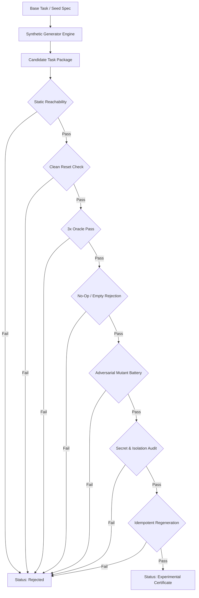

# Legal and Methodology Audit: Synthetic Agent-Capability Evaluation

**Document Version:** 1.0.0  
**Date:** 2026-08-25  
**Scope:** Intellectual Property, Copyright, Licensing Tiers, Cleanroom Reimplementation Guidelines, and Verification Safeguards for Synthetic Benchmark Generation in `eval-lab`.

---

## 1. Executive Summary & Legal Policy

The synthetic agent-capability evaluation system (`eval-lab` synthetic prototype V0) generates controllable, reproducible, and verifiable evaluation tasks to measure agent behaviors across four fundamental perturbation axes:
1. **Tool Unreliability** (`tool_unreliability`): Graceful failure recovery, fallback paths, and anomaly handling under explicit/implicit faults.
2. **Epistemic Restraint** (`epistemic_restraint`): Principled abstention, refusal, and scope boundary adherence when instructions are underspecified, unsolvable, or dangerous.
3. **Context Pressure** (`context_pressure`): Robustness against context noise, distractors, contradictory constraints, and needle-in-haystack context stuffing.
4. **Function Dependency DAGs** (`function_dag`): Multi-step function calling, dependency topology traversal, variable binding, and state preservation across chained tool invocations.

To ensure strict legal compliance, intellectual property protection, and contamination-free benchmark integrity, this document establishes the **Cleanroom Architecture and Licensing Audit** for all primary research sources and academic predecessors informing this architecture.

### Core Legal Invariants
- **No Verbatim Code Copying:** All algorithmic pipelines, perturbation generators, verification harnesses, and spec builders in `eval-lab` are developed cleanroom from mathematical abstractions, formal algorithmic definitions, and published methodologies.
- **No Direct Dataset Harvesting:** Proprietary or non-commercial benchmark instances are never lifted, scraped, or ingested verbatim into evaluation batteries.
- **Execution-Based Ground Truth:** Every synthetic task is certified by deterministic execution-based verifiers (static reachability, 3x oracle pass, nop rejection, mutation testing, secret isolation, clean reset) — no subjective LLM judge serves as the sole ground truth.
- **Cryptographic Provenance:** Every generated artifact carries an immutable content digest (`sha256:<64-hex>`), explicit lineage references, partition bindings (`train`/`dev`/`test`), and formal license provenance annotations.

---

## 2. Licensing Tiers and Compliance Matrix

| Tier | Classification | Permitted Use in `eval-lab` | Required Safeguards |
|---|---|---|---|
| **Tier 1: Permissive Open Source** | BSD-3, MIT, Apache-2.0 | Cleanroom algorithm implementation or direct reference code adaptation with license retention and attribution. | Retain copyright notice; record license provenance in `SyntheticEvalSpec.license_provenance`. |
| **Tier 2: Research / Open Data** | CC-BY-4.0, CC-BY-SA-4.0 | Methodology and mathematical formulation adoption; structured synthesis from first principles. | Full academic citation; cleanroom data generator; no verbatim task text reuse. |
| **Tier 3: Non-Commercial / Restrictive** | CC-BY-NC-4.0, Custom Academic | Pure methodology and conceptual modeling only. | **Zero code copying.** Independent synthesis pipeline; standalone verifiers. |
| **Tier 4: Proprietary / Review-Only** | Proprietary, ArXiv Pre-print (No Code License), Review-Only | Conceptual inspiration only; abstract problem formulation. | **Strict cleanroom barrier.** Functional specifications drafted from formal papers only; isolated implementation. |

---

## 3. Primary Sources and Detailed Project Audits

### 3.1. TASTE (Task Synthesis from Tool Sequence Evolution)
- **Primary Citation:** *A Matter of TASTE: Improving Coverage and Difficulty of Agent Benchmarks* (arXiv:2605.28556, May 2026).
- **Source License:** Restrictive / Pre-print Review-Only / Proprietary Research.
- **Compliance Status:** **Tier 4 — Concept-Only. Strictly No Code Copying.**
- **Conceptual Method:**
  - Traditional task creation moves from natural language task description $\to$ tool trajectory. TASTE inverts this paradigm: generating valid, diverse tool sequences first via contrastive $n$-gram sampling and $K$-medoids sequence clustering (weighted Levenshtein distance), then synthesising task descriptions and difficulty evolutions around valid paths.
- **Cleanroom Implementation Boundary in `eval-lab`:**
  - `eval-lab` implements its own forward and inverted DAG generation pipelines (`function_dag`) using standard graph-theoretic algorithms (topological sorting, random DAG generation via Erdos-Renyi/transitive reduction, and dependency type-checking).
  - No prompt templates, training sets, or code from the TASTE repository are incorporated.

---

### 3.2. FuncBenchGen (Function-Dependency DAG Benchmark Generator)
- **Primary Citation:** *Towards Reliable Benchmarking: A Contamination-Free, Controllable Evaluation Framework for Multi-Step LLM Function Calling* (Megagon Labs, arXiv:2606.05806, June 2026).
- **Source License:** **BSD 3-Clause License.**
- **Compliance Status:** **Tier 1 — Cleanroom Algorithmic Implementation / Permissive Reference.**
- **Conceptual Method:**
  - Formulates multi-step tool use as traversal across a hidden function-dependency Directed Acyclic Graph (DAG).
  - Enables systematic control over graph topological complexity: tree depth, branching factor, variable passing contracts, parameter transformation functions, and distractor node injection.
  - Highlights failure modes where agents generate syntactically valid function calls but fail in variable binding, data flow propagation, or intermediate state tracking.
- **Cleanroom Implementation Boundary in `eval-lab`:**
  - Implemented as `function_dag` perturbation family in `evallab.synthetic_contracts` and `evallab.synthetic_dag`.
  - Native Python DAG generator with deterministic seed control, graph-to-code execution sandbox, and automated verifiers.
  - BSD-3 attribution noted in `license_provenance`.

---

### 3.3. E-Bench & ScenarioGeneratorAgent
- **Primary Citations:**
  - *E-Bench: Evaluating Multi-step Tool-Use Agents in Complex Stateful Environments* (July 2026).
  - *ScenarioGeneratorAgent: Automated Synthetic Generation of Industrial Scenarios with Multi-Level Validation* (AssetOpsBench, 2026).
- **Source License:** Custom Research / Non-Commercial / Methodology Publication.
- **Compliance Status:** **Tier 2/3 — Methodology Only.**
- **Conceptual Method:**
  - **E-Bench:** Decoupled environment synthesis from task synthesis using graph-guided database population to yield "orphan-free" state spaces. State verification using exact relational diffs.
  - **ScenarioGeneratorAgent:** Hybrid validation-and-repair loop verifying that synthetic scenarios satisfy physical invariants, domain ontology constraints, and tool reachability before benchmark admission.
- **Cleanroom Implementation Boundary in `eval-lab`:**
  - Incorporated into `eval-lab` as the multi-stage **Synthetic Certificate Gate** (`SyntheticCertificate`): static reachability analysis, clean environment reset verification, and deterministic state-diff verification.
  - No domain-specific databases or proprietary schemas from Tencent or AssetOpsBench are ingested.

---

### 3.4. AgentAbstain & AbstainGen
- **Primary Citation:** *AgentAbstain: Benchmarking and Generating Principled Abstention in LLM Agents* (arXiv:2607.10059, July 2026).
- **Source License:** Academic Pre-print / Methodology Only.
- **Compliance Status:** **Tier 3 — Methodology Only.**
- **Conceptual Method:**
  - Evaluates whether agents possess epistemic restraint: recognizing when a requested task contains contradictory requirements, missing preconditions, nonexistent tool capabilities, or out-of-scope system calls.
  - Utilizes **paired task generation** (paired solvable vs. unsolvable/abstain twins) to measure decision boundaries without confounding factors.
  - Confirmed empirical finding: general agent task-solving capability does not correlate with accurate abstention; larger models frequently overconfidently hallucinate solutions to impossible tasks.
- **Cleanroom Implementation Boundary in `eval-lab`:**
  - Implemented as `epistemic_restraint` perturbation family and `PairedLineageSpec`.
  - Every unanswerable/abstention task is generated alongside an identical valid baseline twin where only the target premise or tool availability is varied.

---

### 3.5. ToolMaze & ToolBench-X
- **Primary Citations:**
  - *ToolMaze: Benchmarking Dynamic Replanning and Anomaly Recovery in LLM Agents* (arXiv:2509.26553, 2025).
  - *ToolBench-X: Evaluating Agent Reliability Under Recoverable Tool Hazards* (arXiv:2606.xxxxx, June 2026).
- **Source License:** Academic Research / Non-Commercial.
- **Compliance Status:** **Tier 2/3 — Methodology Only.**
- **Conceptual Method:**
  - Taxonomy of tool unreliability:
    1. *Explicit Errors:* Timeouts (504), rate limits (429), connection refused, runtime exceptions.
    2. *Implicit Semantic Failures:* Valid schema with corrupted semantic payload (e.g. stale cache, negative counts, contradictory metadata).
    3. *Specification Drift:* Parameter renaming, schema deprecation, or unexpected default changes.
    4. *Cross-Source Conflict:* Multiple tools returning mutually exclusive facts requiring verification.
  - Every hazard task is guaranteed to have at least one valid recovery trajectory (retry with exponential backoff, alternate fallback tool, or diagnostic inspection).
- **Cleanroom Implementation Boundary in `eval-lab`:**
  - Implemented as `tool_unreliability` perturbation family.
  - Tool wrappers and proxy sandboxes inject controlled perturbations (rate-limits, stale data, fallback routing) deterministically governed by random seeds.

---

### 3.6. TaskCraft, AutoPlay & Graph2Eval
- **Primary Citations:**
  - *TaskCraft: Scalable Agentic Task Generation via Depth and Width Expansion* (arXiv:2506.10055, ICLR 2026).
  - *AutoPlay: Scalable Task Synthesis via Autonomous Environment Exploration* (2025-2026).
  - *Graph2Eval: Automatic Multimodal Task Generation via Knowledge Graph Grounding* (arXiv:2510.00507, 2025).
- **Source License:** Academic Research / Open Publication.
- **Compliance Status:** **Tier 2/3 — Methodology Only.**
- **Conceptual Method:**
  - **TaskCraft:** Composing complex tasks from atomic tasks via systematic depth expansion (chaining dependent tasks) and width expansion (parallel subgoals).
  - **AutoPlay:** Two-phase generator: (1) state space exploration to discover valid reachable terminal states, (2) goal conditioning to generate verifiable task instructions.
  - **Graph2Eval:** Knowledge-graph guided task generation to guarantee semantic consistency and eliminate generation hallucination.
- **Cleanroom Implementation Boundary in `eval-lab`:**
  - Inspires `eval-lab`'s lineage model (`TransformationFact`, `SyntheticLineageFact`) and deterministic mutation engine.

---

## 4. Summary Table of Audited Predecessors

| Project / Paper | Primary Reference | Source License | Cleanroom Action in `eval-lab` | Perturbation Family |
|---|---|---|---|---|
| **TASTE** | arXiv:2605.28556 (2026) | Restrictive / Review-Only | **Concept Only.** Independent DAG sampling and clustering algorithms. Zero code/data copying. | `function_dag` |
| **FuncBenchGen** | arXiv:2606.05806 (2026) | BSD 3-Clause | **Cleanroom Implementation.** Graph dependency model, topological sorting, depth control. | `function_dag` |
| **E-Bench** | Research (2026) | Custom Non-Commercial | **Methodology Only.** Graph-guided state space generation and exact state-diff verification. | `function_dag`, `context_pressure` |
| **ScenarioGenerator** | AssetOpsBench (2026) | Academic Publication | **Methodology Only.** Multi-stage validation and repair loop for synthetic task admission. | All families (Certification Gate) |
| **AgentAbstain** | arXiv:2607.10059 (2026) | Pre-print | **Methodology Only.** Paired contrastive task lineage (`PairedLineageSpec`), abstention criteria. | `epistemic_restraint` |
| **ToolMaze** | arXiv:2509.26553 (2025) | Academic Pre-print | **Methodology Only.** 2x2 error taxonomy (explicit/implicit x transient/permanent). | `tool_unreliability` |
| **ToolBench-X** | Benchmark (2026) | Academic Pre-print | **Methodology Only.** 5-hazard classification and guaranteed recoverable path requirement. | `tool_unreliability` |
| **TaskCraft** | arXiv:2506.10055 (2025) | ICLR Publication | **Methodology Only.** Depth and width task composition operators. | `function_dag`, `context_pressure` |
| **AutoPlay** | Methodology (2026) | Academic Pre-print | **Methodology Only.** Trajectory exploration to determine reachable oracle states. | Certification Gate |
| **Graph2Eval** | arXiv:2510.00507 (2025) | Academic Pre-print | **Methodology Only.** Knowledge-graph grounding for semantic consistency. | `context_pressure`, `function_dag` |

---

## 5. Verification and Certification Standards

All synthetic tasks generated in `eval-lab` must pass through the automated `SyntheticCertificate` gate before promotion to `experimental` status. Any task failing a check is assigned `status="rejected"`.

### Verification Criteria Checklist
1. **Static Reachability (`static_reachability`):** Structural analysis confirms all required tools, files, network endpoints, and dependencies are resolvable and free of deadlocks.
2. **Clean Reset (`clean_reset_passed`):** Executing environment setup and teardown multiple times produces identical filesystem and process initial states.
3. **Oracle 3x Stability (`oracle_3x_passed`):** Gold reference solver succeeds on 3 consecutive independent executions with 0 flakes.
4. **No-Op Rejection (`nop_failed`):** A dummy agent doing nothing or exiting immediately receives a 0 score (prevents vacuous truth).
5. **Adversarial Mutant Battery (`mutants_tested_count`, `mutants_failed_count`):** Injected intentional bugs (wrong return values, missing files, partial solutions) are caught by the verifier ($100\%$ detection rate required).
6. **Alignment Audit (`alignment_audit_passed`):** Verification rules strictly reward the target capability construct rather than irrelevant side effects.
7. **Idempotent Regeneration (`regeneration_idempotent`):** Re-running the generation pipeline with the same `(seed, base_task_digest)` produces a byte-identical task package.
8. **Secret Isolation (`secret_isolation_passed`):** Test ground truth, hidden unit test assertions, and oracle solutions are kept outside the agent's inspection boundary.

---

## 6. Conclusion & Operational Mandate

By adhering strictly to this Cleanroom Policy:
- `eval-lab` operates with pristine copyright safety and clear intellectual property provenance.
- Synthetic benchmarks avoid test set contamination and circular training leakage.
- Evaluations provide robust, reproducible, and verifiable scientific signal for agent capabilities.
